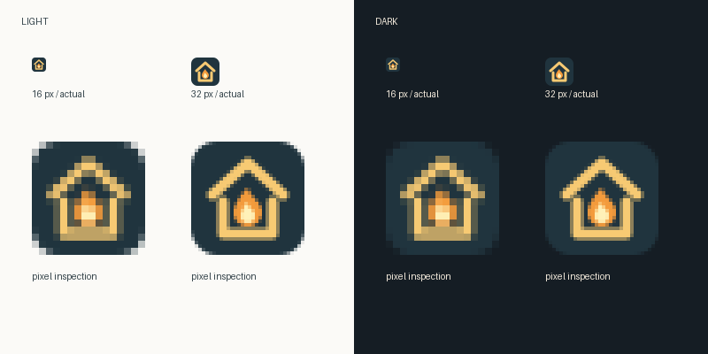

# 《把灯带回家》站点图标

暖金色屋檐护住中央的灯火，表达“带着灯火平安归家”。深蓝底让轮廓在浅色标签栏中清楚；金色屋檐和浅黄火芯在深色标签栏中保留对比。没有文字、人物面部或蛇的细节，避免小尺寸信息堆叠。本图为矢量设计，未调用 AI 图像生成平台。

可编辑母版：[SVG](../../export/assets/lantern-home-favicon.svg)。浏览器派生文件：[ICO](../../export/assets/lantern-home-favicon.ico) 含 16、32、48、64、256 像素的 PNG 图像；[PNG](../../export/assets/lantern-home-favicon.png) 为 32×32。当前配置使用 SVG，导出清单直接覆盖母版；ICO 与 PNG 也由 Git 跟踪，可在系统配置页选择采用。



上排分别显示 16 与 32 像素实际大小，下排放大像素便于检查。16 像素仍能辨认屋形与中央亮点，火焰层次相应简化；32 像素可分辨屋檐、两侧墙及火芯。预览检查不代替浏览器标签栏验收；图样还需用户审阅。

重新导出时，从故事仓库运行 `scripts/render_favicon.py`。脚本以自身位置定位仓库，读取上述 SVG 并生成本目录各尺寸 PNG、浏览器 ICO／PNG 与预览；需要本机虚拟环境中的 Pillow、CairoSVG 和 Cairo 库，依赖不入 Git。例如本机已有 Homebrew Cairo 时：

```bash
uv venv .runtime/favicon/render-env
uv pip install --python .runtime/favicon/render-env/bin/python pillow cairosvg
DYLD_FALLBACK_LIBRARY_PATH=/opt/homebrew/lib .runtime/favicon/render-env/bin/python scripts/render_favicon.py
```

修改母版后重新渲染、检查小尺寸并保存配置；公开同步同时更新图标清单。通用操作规则由系统仓库 `docs/favicon.md` 维护，随系统候选发布后可从该仓库读取；本次实际验证与限制见[交付记录](../../planning/favicon-delivery.md)。
