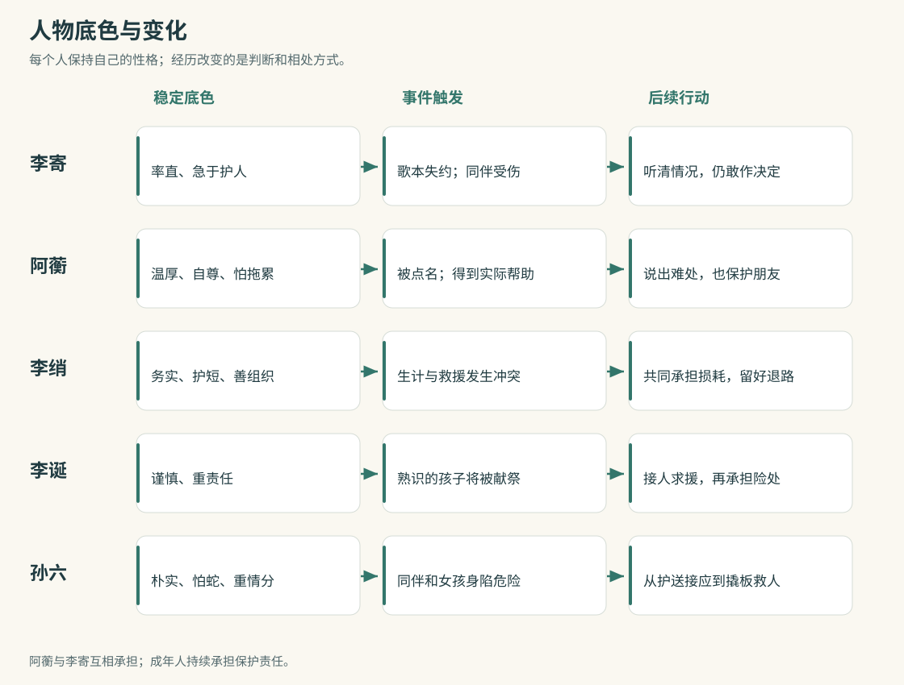
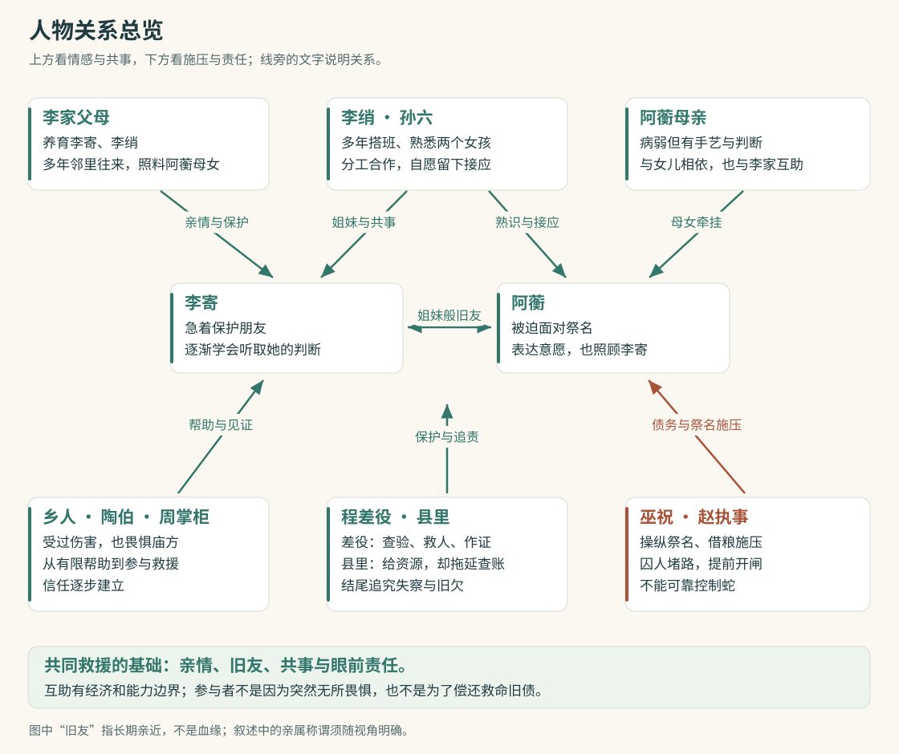
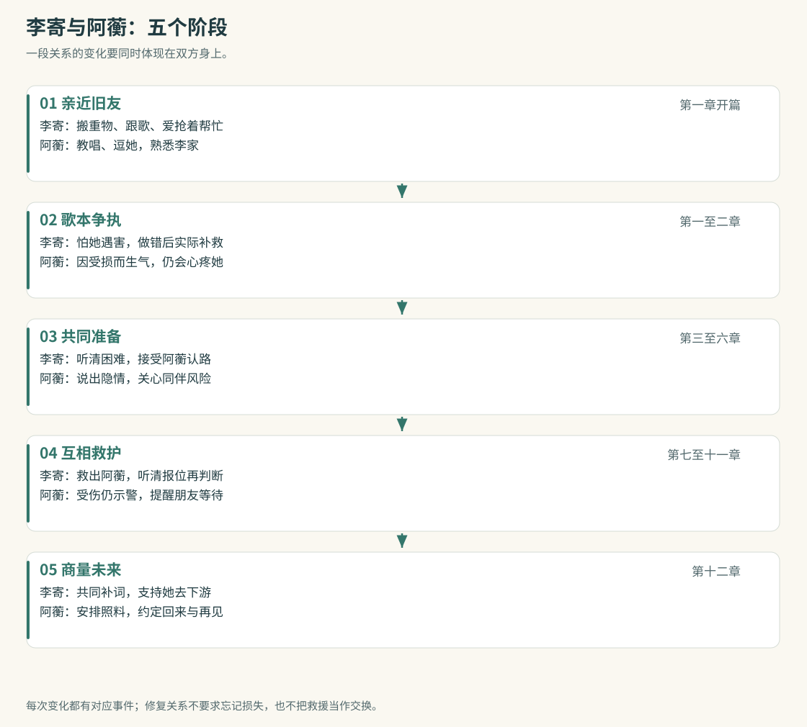
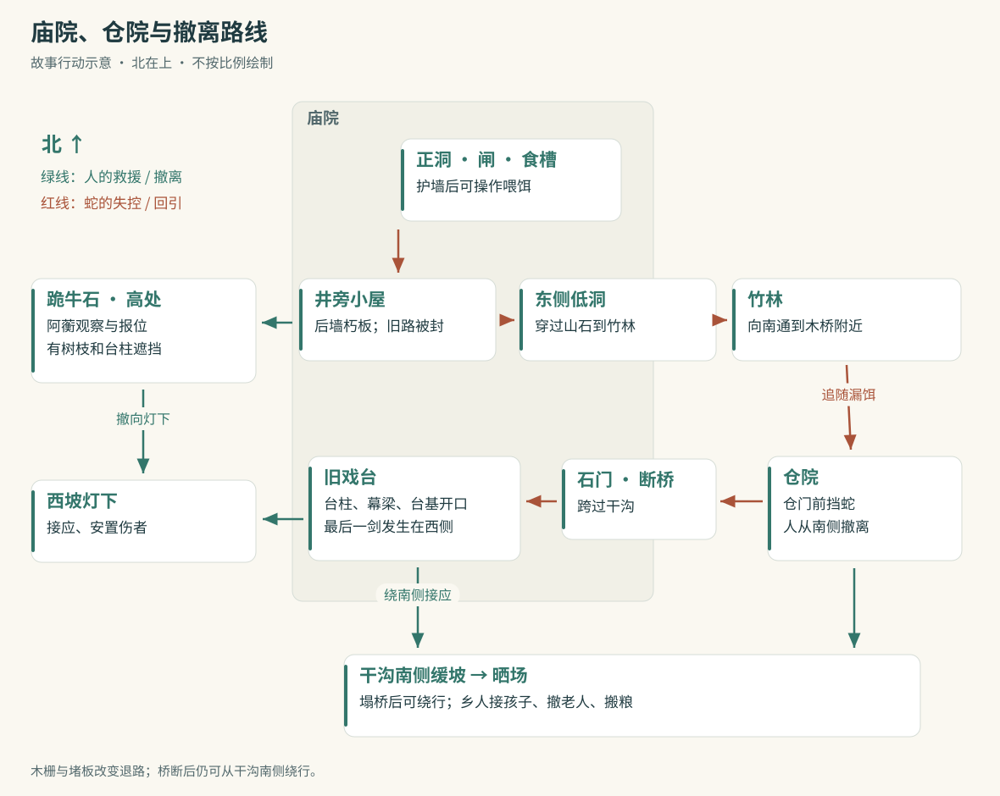
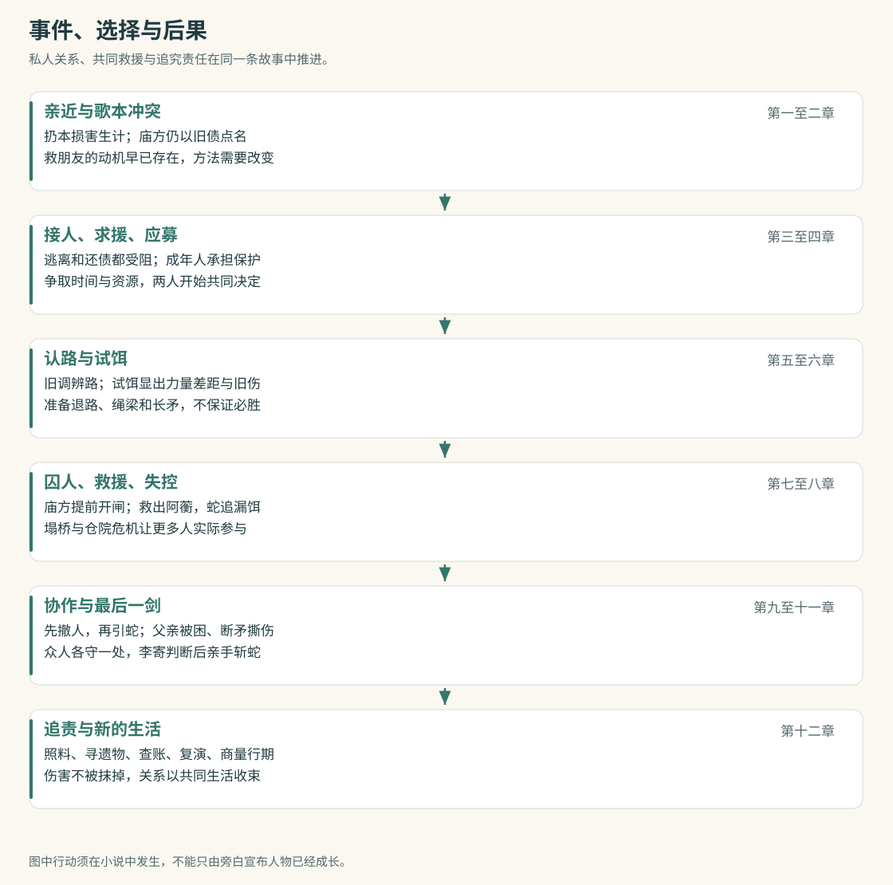
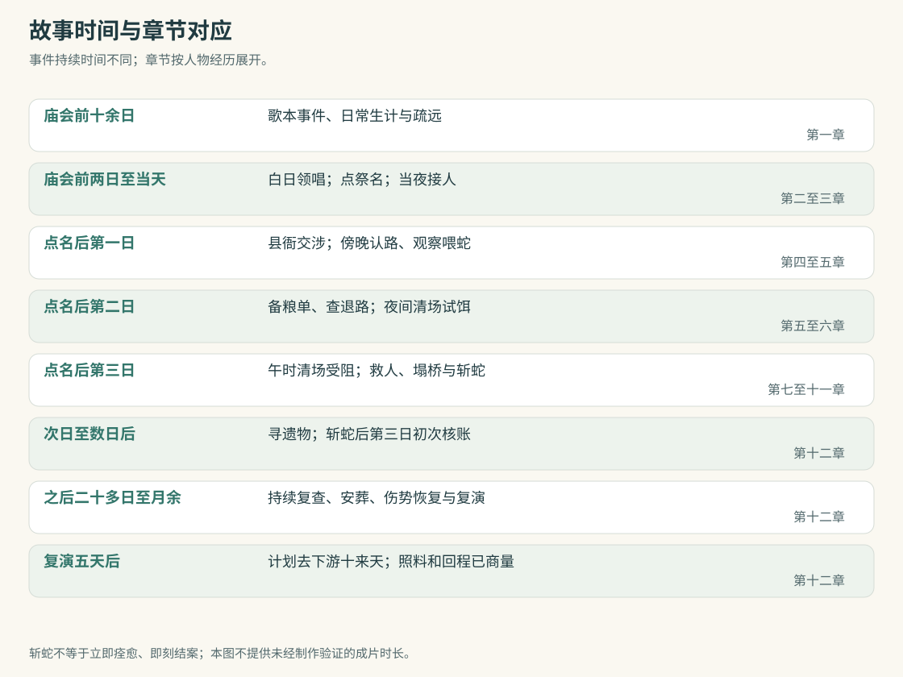

# 《把灯带回家》人物与故事结构 · 精修四创作依据

## 方向与主题

《把灯带回家》：用于精修四的故事结构第一稿。本稿以已选方向三、精修三的十二章主线及当前审阅意见为依据，集中固定人物与关系设计。它是可以独立审阅的创作方案，尚未获得作品认可；精修四将据此逐段写成，精修三保留原文与评论。

故事讲的是：李寄要救从小亲近的朋友阿蘅，却起初只知道用自己的办法把危险挡开。祭名落到阿蘅头上后，两个女孩与家人、戏班同伴一起争取救援，经历对手破坏安排和巨蛇失控，最终由李寄在众人支撑下完成斩蛇。她们争取的不只是活下来，还包括能自己工作、唱歌、出门，并知道回家时有人等着。

情感基础先于人物缺点。李寄与阿蘅的关心从开篇就真实存在；扔歌本损害的是信任与生计，不是两人感情的全部。李寄始终为了朋友免遭献祭而行动，修复歌本是应承担的日常责任，不能被写成救人的交换条件。阿蘅可以愤怒、害怕、拒绝，也会心疼李寄、主动帮助她。

保护需要双方参与。李寄学会听清朋友的处境，让别人运用自己的能力；阿蘅学会把难处和恐惧说出来，接受帮助，也承担自己能做的事。成年人保持保护孩子的责任。共同救援从有把握的接人、守路和求援开始，在危机升级后才付出更大代价。

危险来自真实的蛇，也来自借祭祀控制弱者的人。斩蛇解决眼前威胁，账签、祭册、证词和旧应募文书解决人为责任。结尾保留伤势、生计困难和无法挽回的死者，同时给生还者具体而有限的新生活。小说沿用十二章，不将旧方向稿的二十五分钟估算当作本次小说的成片时长。

## 人物塑造

李寄｜直率、手快，先伸手再想后果。她是李家的小女儿，能挑水、劈细柴、爬戏架，熟悉墨耳和戏班的简易牵线；识字有限，兵刃经验不足，不能三天练成剑术高手。日常形象由磨破的掌心、沾浆糊的袖口和抢先接活的动作建立。她说话短、急，常先说“我来”；害怕时会硬撑，也会在可信的人面前承认怕。

李寄｜她最想保住阿蘅，也想让大人相信自己能帮忙。缺点是把“来不及”当作先替朋友决定的理由。歌本事件让她认识到好意也能伤人；准备救援让她学会询问、验证和交接；高潮中她仍敢行动，但会听阿蘅的报位、自己看清伤口，并按同伴的呼喊撤出。主动应募与最后一剑仍由她完成，成长不等于变得温顺或被动。

阿蘅｜比李寄大一岁，是与她一起长大的朋友。父亲早亡，与母亲相依为命；母亲失声、病情加重后，她靠唱歌与戏班杂活换粮。她记调子和细节，善于从熟悉的歌词、地形和人情中发现问题；体力和兵刃能力有限。她护着歌本，不是爱惜东西胜过朋友，而是它连着母亲的手艺与两人的生计。

阿蘅｜温厚、敏感、有自尊，也有幽默。熟人面前会逗李寄，生气时把话说直；受逼迫时先把条件问清，真害怕时声音和动作会失控。她怕拖累别人，隐瞒母亲病情加重及债务的细节，导致李寄不完全理解她为何仍去唱歌。她要改变的是独自扛住一切的习惯，不是放弃独立。被点名后明确不愿死；得到帮助后关心救她的人；结尾主动商量工作、照料母亲和行期。

李绡｜李寄的五姐、小戏班的带头人。熟悉竹木、牵线、场面组织，能算工钱，也知道同伴要吃饭。她务实、护短、嘴上不哄人，关心常表现为洗伤口、留饭、先查退路。她会指出妹妹的错误，但不拿完整道理训诫每个人；危险中用短而明确的话分工。她自愿投入道具和劳动，也尊重不愿冒险的同伴；救援损耗不能事后全算成妹妹欠她的账。

李诞｜李寄与李绡的父亲，靠码头搬木料和零工养家，身体健壮但不懂猎蛇。他谨慎、寡言、重责任，遇事先看工具和退路，再讲能不能做。阿蘅从小常来李家，他熟悉她，也曾与她母亲互相搭手；眼前被带走的不是一个陌生祭户。李家能接济饭食、接人住几日，却无力长期包办医食，也不能靠还债取消祭名。

李诞｜他不能让女儿独自站在蛇前，也不能把阿蘅交回去便当事情解决。阿禾被带走时他曾随众沉默，这次首先做的是找成年人、接出母女、到县里争停祭和要人手；只有看过地形、准备过工具，才同差役尝试除蛇。蛇失控后，他在仓门挡蛇是为了让来不及走的人撤出。最后被困是战局事故；他始终不主动把致命任务交给女儿。

孙六｜与李绡搭班多年的鼓手，兼做搭台、搬箱和修补。两个女孩常在戏班帮忙，阿蘅跟他学过打拍子；他也熟悉李诞，彼此在搬木料、借工具时搭过手。他说话朴实，紧张时会摸鼓带、检查结绳，先把眼前一件事办好。害怕山里的蛇，不许诺能杀它；因不愿丢下相熟的人，先留下护送和接应，后来用熟悉的台架和杠杆帮助撤人。

李寄的母亲｜不赞成丈夫或女儿拿命赌一次许诺，但会让床、照顾病人、准备灯和药布。她的关心具体而有主见，既问退路，也要求伤者停下来。阿蘅的母亲｜曾靠唱曲挣钱，身体衰弱不等于没有判断；她能提供旧调与旧路的记忆，也能和女儿商量工作。两位母亲的照料使救援有可返回之处。

程差役｜有对付野兽的有限经验，承认没见过这么大的蛇。最初因职务来查验，随后亲眼见到囚人、伤人和提前开闸，责任由守约发展为救人和作证。陶伯｜失去阿禾后对旁人的善意有怨，不因一句劝告就释怀；他帮助眼前的人，不等于原谅当年的沉默。周掌柜｜认识阿蘅母女，也依赖庙仓做生意；从私下交出备粮单到公开作证，需要经历实际的动摇与选择。

赵执事与巫祝｜执事经手借粮、账签、庙工与喂蛇，巫祝掌握祭名的解释和当众号令。两人共同维护祭祀带来的控制与收益，不能随时可靠地控制蛇。提前放蛇出于阻止查账、恢复祭礼的急迫需要，又错误相信固定食槽能让蛇照旧进食归洞；失控后先自保、再嫁祸。县丞与书吏｜重粮运、怕担责，先给有限支持却拖延查祭账；结尾必须回应他们自己的文书与失察责任。

墨耳｜熟悉李寄和阿蘅、会叼纸偶的戏班狗。它怕重鼓、怕蛇，会犹豫和受伤。李寄逐渐学会观察它的反应，不强拖它执行危险动作；扑蛇护人来自临场反应，不是短期训练出的必胜武器。

按李寄、阿蘅、李绡、李诞、孙六排列，分别展示稳定底色、事件触发和后续行动；变化有具体前因，性格不会每章重置。

## 人物关系

李寄与阿蘅｜两家住得近，两人从小跑河滩、帮戏班做活。阿蘅教李寄跟歌，李寄替她搬重物，两人能互相取笑，也知道对方难堪时该停。阿蘅常出入李家，沿熟人习惯叫李绡“五姐”，但她与李家没有血缘关系。叙述进入阿蘅视角时，要明确写李绡或李寄的父亲，不能让“姐姐”“父亲”指代失准。

歌本事件｜李寄想阻断庙方对阿蘅的注意，错把停唱当作安全；她扔掉歌本，毁了另一场正常唱曲的机会。阿蘅生气的是好意越过自己、实际生活被破坏。她可以暂时收起歌本、不愿谈心，但不能由此变成冷漠的债主。李寄应认错并补救，也不因此失去救朋友这一原有动机。

点名与共同准备｜危机让两人先护住彼此，不等于歌本的损失忽然消失。阿蘅看见李寄额上的伤，会阻止她继续与庙工冲撞；李寄愿意听清阿蘅照料母亲的困难。县衙后，两人谈的是怎样一起活着回来。探路与试饵时，阿蘅交出旧调线索，李寄尊重她的判断；两人逐渐重新分享本子和未说出口的害怕。

救援与最后一剑｜李寄参与救出阿蘅；阿蘅受伤后仍以能看见的方位帮助别人撤离。她报位时知道李寄有危险，会提醒等待，不会为证明自己独立而催朋友冒险。李寄听清后还要亲眼判断。互相信任体现为提供真实信息、接住对方的脆弱，并愿意在必要时停手。

归家与离别｜补齐歌词由两人一起做，恢复把歌本放在中间的习惯。阿蘅去下游学唱，李寄既舍不得，也帮她安排母亲的照料；阿蘅同样关心李寄的手、家里的伤者与再见的日子。关系从一方急着替另一方挡住所有事，发展为能商量、能分开、也能互相回来寻找。

李家与阿蘅母女｜多年邻里来往是接人的感情基础，持续的照料又增加了具体责任。贫困使帮助有边界，不应写成李家明明可以解决一切却坐视不管；也不应为解释救援临时增加救命旧债。阿蘅母女会参与能做的劳动、提供记忆和表达感谢，这些不是换取救命的价码。

戏班与李家｜李绡负责组织，孙六有自己的判断和选择。离开的同伴仍领应得工钱，留下的人共同承担自愿决定的损耗。孙六与李诞彼此照应，两个女孩对他有信任与牵挂。关系通过递工具、接人、照看墨耳和收台等小动作建立，再支撑危急时的合作。

乡人与庙方｜欠粮、畏惧、做生意和失去亲人的经历，使每个人面对祭祀的位置不同。群体变化从接一个孩子、搬一篓粮、交出一张纸开始。陶伯的怨、掌柜的怕与李诞的愧疚可以同时存在，不需要人人先说同样的道理，才开始帮助。

上半部是熟人之间的亲情、友情与共事，下半部是庙方、官府和乡人的权力与责任。双向线表示互相影响，单向箭头标出具体施压或保护方向。

从亲近旧友、歌本争执、共同准备、互相救护到商量未来；每一阶段都列出双方的行动，避免只写李寄变化或只让阿蘅讲道理。

## 空间关系

日常空间由米铺、河边戏班、李家与阿蘅家构成。两家相近，唱曲、洗幕布、送水和借工具能自然产生往来；河边是歌本冲突发生处，也是终章共同回家的路。去下游须经过渡口，船家会顾忌明年的生意，不能把逃离写成随时可以完成的简单选择。

庙院北端靠山，正洞前有闸板、食槽和护墙；井及小屋在西侧。小屋原有后墙和绕木栅的窄道，可到西墙外跪牛石，再下到挂旧灯的坡口。阿蘅母亲记得的旧台阶被木栅拦住，探路必须实地找到可绕行的路线。祭日庙方堵路后，拆板救人才成为必要。

前院有拆剩的戏台、台柱、旧幕梁和台基开口。台基口可让人贴近救援，蛇头仍能探到附近，不能作为绝对安全的藏身处。东侧低洞通竹林，竹林通向仓院木桥；桥横跨干沟，桥西是庙院，桥东是仓院。干沟向南有缓坡可绕行并通往晒场，塌桥并不抹掉这条远些的退路。

跪牛石比庙院高，阿蘅能看见部分戏台和断桥，但台柱、树枝会遮挡，她不能始终掌握全场。李绡控制墙外绳索；李诞与程差役从石台两侧用矛；孙六负责放梁与接应。最后一剑发生于台基西侧开口，位置、断矛造成的裂口和其他人腾不出手的处境均须先建立。

空间图是服务动作理解的相邻关系示意，不按实际比例绘制。人物每次转移须交代起点、路径与目的；战斗中反复使用戏台、石门、干沟、仓门和西坡这些稳定地标。

北侧正洞，西侧小屋与退路，东侧低洞通竹林和仓院，南侧干沟缓坡通晒场；红色为蛇的失控路径，绿色为人的撤离路线。

## 故事线

第一至二章｜先写李寄与阿蘅共同生活，再写扔歌本造成的具体失约与疏远。庙方利用阿蘅旧债和母亲病重施压；她问清白日领唱的条件，仍被当众点名。李寄救朋友的动机在扔歌本以前就成立，不能到应募时变成偿债。

第三至四章｜逃离和还债都不能直接解除祭名。李寄提出应募以争取时间，李诞接出母女并组织成年人，李绡与孙六参与。县里因粮路受阻提供有限资源，免祭文书约束眼前行动但不能保证往后安全。李寄明确以协助除蛇的身份报名，成年人不准她进洞或迎蛇出剑。

第五至六章｜阿蘅用母亲记得的旧调辨路，众人实地确认退路、蛇路与地形。试饵揭示蛇的力量、饵的作用及旧伤；旧伤来历不确定，不能宣称某个死者所留。与庙仓备粮单有关的证据让父亲去县里要求查验，县里拖延。团队据此准备落梁、长矛与撤离，而不是假定一定能赢。

第七至八章｜庙方拒绝按时清仓，继而囚禁阿蘅、堵后路、伤差役、提前开闸，企图恢复祭礼并阻止查账。李绡、程差役和李寄协助阿蘅拆墙脱困；墨耳护人受伤。漏饵引蛇转向东口，桥塌后仓门受威胁。父亲与陶伯挡蛇，其他人从干沟递孩子、撤老人、搬粮。

第九至十一章｜先疏散再把蛇引回空戏台。阿蘅从高处报位，李绡操篮，孙六放梁，父亲和差役用矛；梁拦不稳、长矛折断，父亲退路被毁而受困。其他人分别撑蛇、撑梁、撬板，李寄才能贴台沿，以短剑刺入已经被断矛撕开的伤口。她自己确认机会，并在呼喊中撤出；胜利来自准备、有限能力与共同承担。

第十二章｜先照料伤者、寻遗物，再初核证据，经过持续复查处理庙方及县里的责任。认不出的遗骸不强分，名字未核清的地方留空。歌本、母女生计、戏班复演、阿蘅下游学唱与回家路共同收束关系；救援不被结算成女孩们必须用未来偿还的人情债。

阅读重点｜歌本在开篇是共同生活与被损害的信任，中段重新成为交流的媒介，结尾两人一起补词。旧灯从家庭接人扩展为撤离的路标，最终回到门前。三下撤离信号始终是撤退要求；有人被困时，别人须先看清位置再实施救援，不能把救人悄悄改成继续抢攻。

按十二章主线把私人关系、共同救援和追究责任三条线放在同一因果链中。每次危机升级都有行动原因，结尾回应开篇的情感问题。

## 时间线

庙会前十余日｜歌本事件发生，阿蘅失去一场婚礼唱曲的收入。她随后仍能唱熟悉的旧歌，也在戏班做杂活；两人保持往来，但不再像以前那样分享心事。

庙会前三日至庙会当天｜执事以欠粮逼阿蘅住庙，她只答应白日唱曲抵债。两日领唱后，庙会当日被点祭名。祭日定在三天后。当夜李诞等人把母女接到李家，开始守夜。

点名后第一日｜县衙应募与免祭交涉，午后会合，傍晚查外墙、找旧路并观察喂蛇。第二日｜拿到提前备粮单、要求查账，白日实地走退路、准备戏台，夜间在清场和告知后试饵，众人调整次日方案。

点名后第三日：祭日｜午时应停发粮并清场，原定未时、即午后正式尝试除蛇。庙方在清场未成时提前行动，救人、蛇出东口、塌桥、仓院撤离与戏台再战连续发生。各条行动线同步推进，不能在战斗间隙突然完成耗时很久的布置。

斩蛇后｜第一日查洞并寻找遗物；再过两日第一次核账；之后二十多天持续核账、认亲、安葬与复查；月余后戏班复演。伤势逐渐好转但没有全部痊愈，墨耳仍不能走远，李诞仍不能挑重物。复演五天后阿蘅计划随班去下游十来天，照料母亲与回程先商量清楚。

结构与正文的对应｜第一至二章写亲密、受损与祭名；第三至四章写共同承担的起点；第五至六章写信任恢复与准备；第七至十一章写互相救护和最后一剑；第十二章写新的相处方式。本稿不指定镜头数量或成片时长；后续改编另行规划。

歌本前事、点名、三日准备及祭日危机、次日寻遗物、数日初核、二十多日复查和月余复演分开标示；小说章节不等于相等的故事时间。
