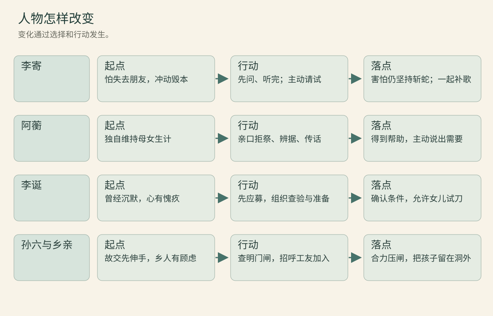
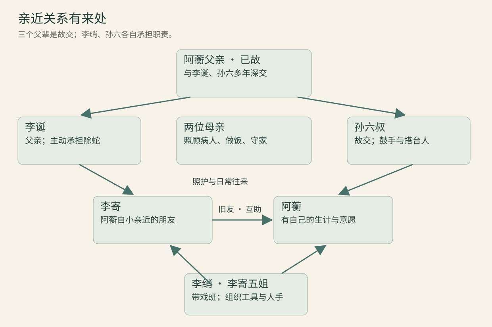
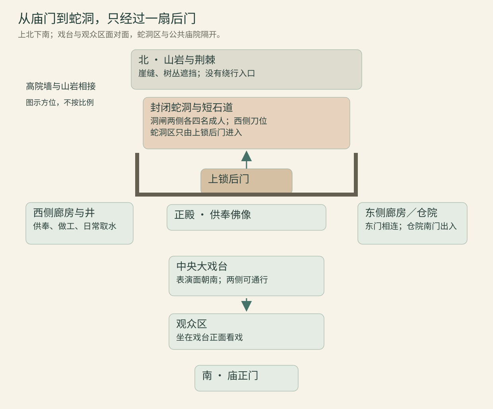
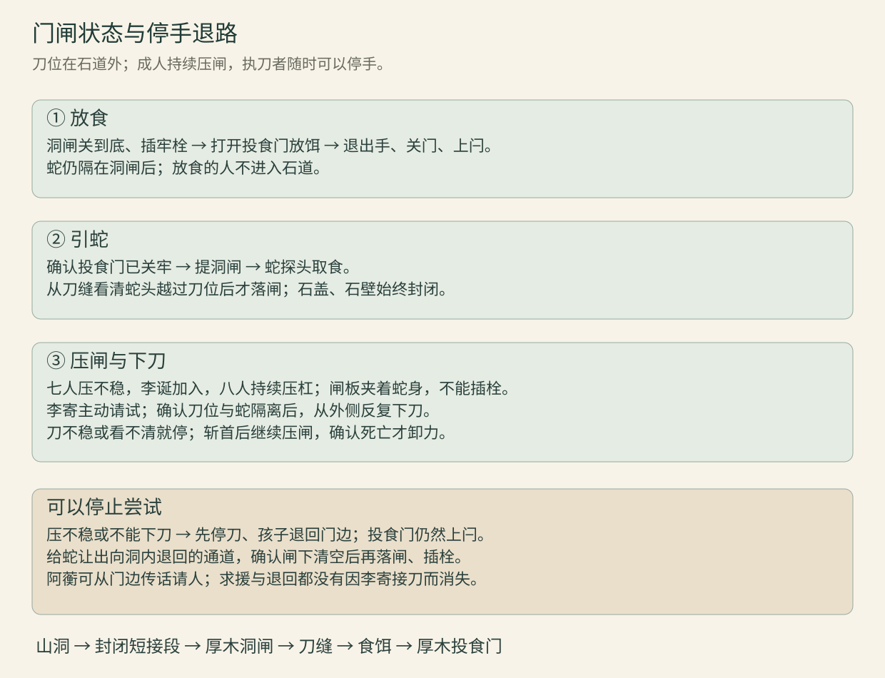
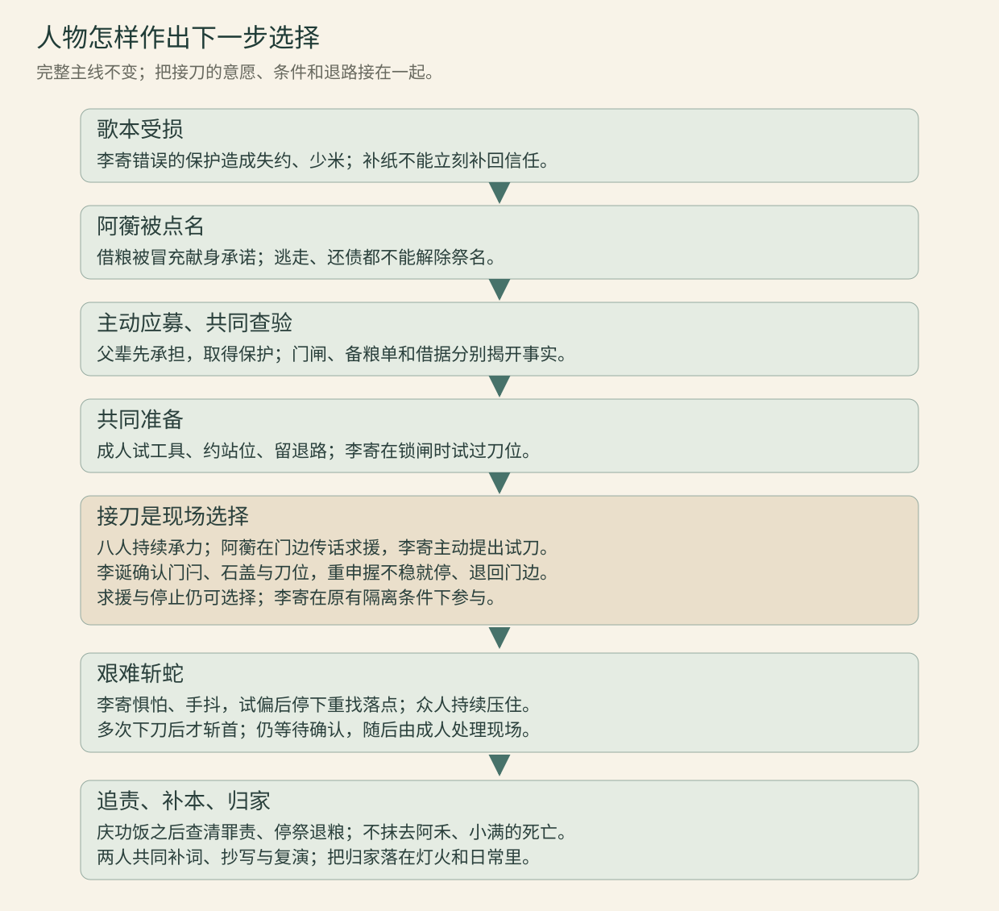
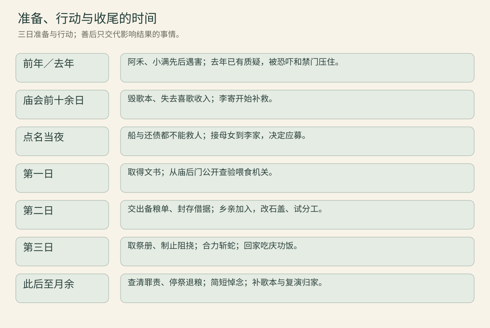

# 《把灯带回家》人物与故事结构 · 精修九定稿候选

## 方向与主题

故事主线｜阿蘅被点为第三个祭童。李寄主动应募，父辈与乡亲共同查清祭蛇骗局，合力制住巨蟒；李寄克服恐惧，亲手斩蛇。罪责得到追究，两个女孩补好歌本，提灯回家。

情感核心｜关心朋友，要听见她的处境和需要。李寄从冲动毁本，到先问、一起做、承担后果；阿蘅也从独自扛着，走向主动开口、接受帮助。

表达重点｜现代白话，以人物的行动、停顿与对白推进。保留友情、故交和普通人的勇气；救人不取消听取意愿，也不要求孩子证明自己不怕。篇幅服从故事，结尾集中收束。

## 人物塑造

李寄与阿蘅｜李寄动作快、容易着急，害怕失去朋友；从毁本时替朋友决定，走到听清需要、主动承担自己能做的事。斩蛇时她仍会怕、会累，先提出试刀，再在成人持续压闸下完成。阿蘅靠唱曲和零活养家，亲口拒祭、辨据；行动中留在后门内侧传话。

李诞、孙六、李绡｜李诞先应募、先试刀，压闸时仍负责判断女儿能否安全靠近刀位；允许她尝试，也保留停手退出的余地。孙六主动接人、招呼工友、备工具和压闸，晚辈叫他孙六叔；五姐李绡组织戏班和现场配合。

两位母亲与乡亲｜李寄母亲照顾病人、张罗庆功饭；阿蘅母亲辨认借粮约定，帮助补词。四名壮实乡亲在查明机关后加入，从准备阶段便参与压闸。

反对者与见证人｜赵执事改据、喂蛇，巫祝借神罚选人；县丞提供此次协助，也须承担前两次准祭的责任。程差役主持查验，周掌柜交出备粮单；陶伯和小满家人承受失去亲人的痛。

### 人物怎样改变

李寄主动请试，父亲确认条件后允许；阿蘅亲口拒祭并在门边传话，成人始终承担压闸。

## 人物关系

两家与戏班｜李寄、阿蘅自小相伴；两家隔着几户，戏班空屋紧邻河岸。父辈故交通过修屋、照料、同桌吃饭延续，帮助并不要求阿蘅献身回报。

歌本的裂痕与修复｜毁本造成失约和少米，补纸不能立刻修复。李寄逐渐学会询问，阿蘅重新愿意把本子摊在两人中间；共同补词完成最后的照应。

庙方的控制｜祭粮是接济，借粮另有本息约定，唱曲按约抵债。改借据是强迫献身的证据；提前备粮单揭穿临时神梦。庙会、供粮和祈福戏早于前年新增的人祭。

### 亲近关系有来处

李绡与孙六分别列出；两位女孩是旧友，没有血缘关系。

## 空间关系

庙院｜中央大戏台面朝南，前方留足观众区，两侧通行；北为正殿，东西有供奉佛像的廊房，西侧有井，东门通仓院。戏班演原有的祈福戏，庙方借庙会聚众点祭名。

蛇洞区｜高墙与后山相接，岩檐、荆棘和树丛遮挡洞口。只有经过庙内上锁后门才能进入；差役持文书开门查验。高墙外没有可绕入的通路。

短石道｜蛇粗如成人大腿，洞口只容孩子伏身通过。洞闸借封闭短接段离开岩壁，给两侧人手留位；闸外石道不足成人一步，只容头颈探入。投食门为厚木板、牢固石框与粗横闩。

动作｜孙六、李绡、程差役与四名乡亲先压长横杠，李诞原在西侧刀位。挣扎迫使他放刀、绕到东侧预留位，形成两侧各四人。阿蘅从后门内侧向门外传话，请人来帮忙，不占刀位与通路。压稳以后，李寄主动提出试刀；李诞核看门闩、石盖及缝下位置，允许她沿外侧去已练过的刀位。

下刀条件｜蛇始终在洞与石道内，投食门始终闩住，刀缝只容刀身。闸板压身时不能插栓，成人须持续承力；“压稳”仅指暂不再抬闸，并非可以卸力。李寄只从缝外下刀，握不稳或看不准便停；她仍需反复调整、克服惊惧和疲劳。斩首后众人继续压闸，确认死亡才卸力；未确认前不打开投食门。

退路与门外人手｜乡老在后门外守住通路，另一差役在前院，门内可以传话请援。若压不稳或不能下刀，先停刀，让孩子退回门边；保持外门上闩，由成人统一动作，给蛇让出向洞内退回的通道，确认闸下清空后再落闸插栓。求援与停止尝试都仍可选择，李寄接刀是条件确认后的协作。

### 庙院鸟瞰

高墙围住庙院，戏台前有完整观众区。正殿之后的锁门通向被山岩与草木遮蔽的蛇洞区。

### 场所与唯一入口

上北下南。公共庙院与蛇洞区由后门分隔，地图表示连接关系，不按比例。

### 短石道剖视

为展示内部，图中移除了部分岩壁、侧壁和后接段顶盖；实景全部封闭。短道只容头颈，厚木投食门始终锁住。

### 门闸状态与停手退路

放食、引蛇、压闸下刀；刀位仍与蛇隔离，压不稳或不能下刀便停止尝试，外门始终关闭。

### 多人压闸与刀位

八名成人两侧各四人；李寄在西侧刀位，阿蘅留在后门内侧。图示最终分工，不按比例；门闸构造见剖视与机关图，下刀须等压稳。

## 故事线

前半程｜亲密日常与毁本产生裂痕；祭名落到阿蘅头上，逃走、还债均无效。李寄主动应募，父辈接走母女、争取保护，查验把乡人的疑问变成可共同看清的事实。

高潮｜乡亲从准备阶段便参加，李诞原定持刀。落闸后八名成人合力才压住；阿蘅向门外传话，求援这条路仍在。李寄看清刀位与练习相同，主动请试，父亲确认隔离和停手条件后让她接刀。她害怕、试偏、重找落点，反复砍下，最终斩首。

收尾｜庆功饭表现几家人的亲近；公开揭穿神梦与改据，追责、停祭、退粮。遇害者家人的悲伤只作短场。最后补齐《送青篷》，简短复演，两位女孩提灯沿河回家。

### 一条主线怎样推进

毁本与被点名推动应募查验；成人压稳、门边求援、李寄主动请试共同形成接刀选择，随后追责并补本归家。

## 时间线

献人始于前年，阿禾、小满先后遇害，今年阿蘅被点名。查验与准备占两日，第三日斩蛇；追责和退粮随后办结，月余后复演。

尸身清理在斩蛇后由成人处理，只交代结果；陶伯与小满家人辨认遗物后默然伤神，后文不再重复铺写。

### 前因、三日行动与收尾

三日行动之后，追责与退粮陆续办结。
