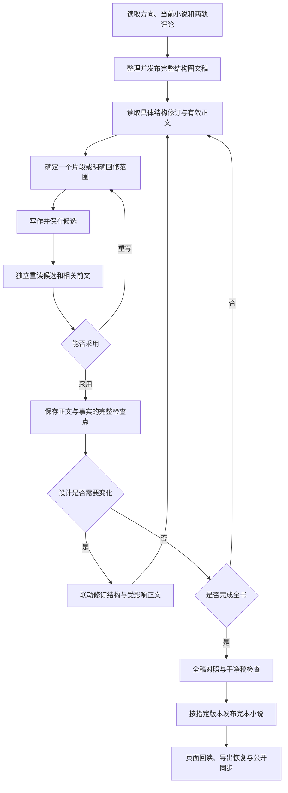

# 小说逐步创作执行设计

更新日期：2026-09-26。适用作品：《把灯带回家》。当前采用结构与正文双轨推进、单写作者串行执行；程序负责范围、持久化和恢复，不建设常驻模型调用服务。创作目标见 [小说方案](novel-creation-plan.md)，当前交付见 [STATE.md](../STATE.md)。

## 1. 两轨怎样交接

先读取已选方向、当前正文与评论，形成完整的结构图文稿，固定人物性格、关系、动机和主要因果。自检后的结构稿可作为正式阶段成果发布到“故事结构”，供用户从全局审阅。小说则明确引用一个结构修订，在后台逐片段、逐章修改，完成全稿检查后才发布。

本轮结构第一稿先上线，精修四随即依据它持续修订，不等待额外逐章审批。若正文暴露新的设计矛盾，联动修结构与受影响正文；不能分别维护两套人物关系。结构和小说的发布都不自动代表用户接受作品，也不替代供剧本创作的具体版本确认。

未完成小说、试写、候选、临时构想与工作检查点只留本机 `.runtime/`，不进入审阅台或公开导出。审阅台承载正式结构、完整小说和意见，后台工具负责本故事的创作过程，二者无代码依赖。

## 2. 输入的不同性质

| 输入 | 示例 | 如何约束后续工作 |
| --- | --- | --- |
| 用户明确要求 | 李寄主动应募和亲手斩蛇；现代白话；两位女孩是姐妹般的旧友；双轨推进 | 持续遵守。确有冲突时说明具体影响，不自行改写要求 |
| 当前结构修订 | 人物处境与性格、关系阶段、救援因果、空间时间 | 是本轮正文的共同依据；变化必须显式修订并核对两轨影响 |
| 当前正文事实 | 谁看见了什么、工具交给谁、伤在哪、说过什么 | 约束下一片段；可回修，但同步处理相关前后文和事实记录 |
| 候选判断与近期打算 | 某句应由谁说、此处是否需要动作、下一场怎样衔接 | 可调整，注明原文依据；不能记成已经发生或已获认可 |
| 审阅评论 | 对具体段落、人物或图中关系的意见 | 读取精确修订和引用上下文；判断影响范围，不机械逐句替换 |

区分客观事实、人物相信的事和读者所知。人物可以矛盾或误判，但不能把笔误、临时改性格或时间错误伪装成有意设计。

## 3. 后台状态

正文、作者笔记与进度组成一致检查点：

1. 当前采用的章节和片段：稳定 ID、顺序与小说正文。
2. 当前结构依据与创作判断：精确修订、对人物和关系的理解、仍需观察的问题。
3. 事实与线索：事件、知情范围、时间空间、工具、伤势及未回应线索，关联具体片段。
4. 近期打算：当前场景的目的与最多一至两个后续可能场景，不预生成远处章节正文。
5. 待处理问题：区分阻碍继续的因果问题、可稍后润色的问题和涉及用户选择的方向问题。
6. 进度：阶段、有效修订、当前步骤、候选、下一动作与意见处理情况。

每步保留必要说明：发现、原文依据、决定和受影响片段。可以沿用已有判断，不设最低修改次数或强制“顿悟”。

## 4. 一次创作循环



一次正文任务通常约 600—1200 字，也可以是一场自然完成的短场景。先保存候选，再另一步重读后采用；不一次生成后面数章再伪造逐步记录。多个章节有前后依赖，不并行写尚未形成前文的后章。

每章结束或重要转折处通读相关全文，并刷新结构与正文评论。若同一因果问题经过两轮修改仍不成立，重新审视人物、关系或事件安排，避免继续同义改写。普通润色问题可以留到全稿阶段，不无限停在局部。

## 5. 结构与正文怎样同步修订

回修从当前有效修订出发，声明目标片段、问题、希望达到的效果及后续影响。例如改变阿蘅何时知道祭名，就必须核对她之后的话、行动、李寄的知情范围和结构中的时间线。

只影响表达的修改可以保留结构版本；影响稳定性格、关系性质、关键动机、空间或时间时，核对结构相关部分并形成完整新版本。新结构沿用系统版本校验与意见处理协议；旧评论仍绑定原修订，不自动关闭或迁移。

整组回修的正文与事实记录核对完后再采用；尚未检查的影响明确记录。不能用摘要中的“已修复”代替实际修改原文。与用户明确要求冲突时，提出具体可审阅的选择；一般创作判断不反复请求许可。

## 6. 工具边界与发布通道

本故事工具为 `scripts/novel_writing.py`，只依赖 Python 标准库；测试位于 `tests/test_novel_writing.py`。它不导入审阅台模块、不调用模型、不读 API 密钥，也不在会话停止后自动续写。

- 后台工作库为 `.runtime/novel-writing/<run>/work.sqlite3`，独立于正式审阅库与公开 export。候选先保存和重读；采用时正文、事实、构想、待办在同一事务形成不可变检查点。
- 阶段为 DRAFTING → FULL_DRAFT → REVISING → READY_TO_PUBLISH → PUBLISHED。进入 READY 需要全稿已读、全部片段已核查、完整性／因果／连续性／语言／干净稿五项审校声明通过，且无阻塞问题。
- `bundle` 从冻结检查点生成 `publication.json` 和 `clean.md`，不改正式资料。工具只在 `init` 和 `published` 时以 SQLite `mode=ro` 读取正式库，分别固定基线和核对发布哈希；创作写入均限于后台工作库。
- 正式结构走 `structure-import complete.json --expected-version N`；小说按用户指定版本走 `import-sources` 新增独立资料。精修四保留精修三及原评论，不能原地覆盖。
- 第一版曾获用户明确授权原地替换精修一。系统 `replace-source-content` 仅在预期哈希一致、零评论、零依赖、单一 SOURCE 修订时允许替换；这是特定条件下的通道，不是后续版本的默认规则。详见[系统说明](https://github.com/goosmanlei/story-review-desk/blob/main/docs/source-replacement.md)。
- 发布完成后运行 `published` 只读核对正式源哈希，再记录后台状态。若正式发布成功但确认中断，只恢复确认；不要重新生成或覆盖小说。

审阅台无需安装本故事的写作工具。它只提供独立的读取、完整稿件管理和评论能力；系统迭代与故事创作数据分别在各自仓库维护。

## 7. 步骤契约与恢复

从本故事目录执行：

```bash
python3 scripts/novel_writing.py --run lantern-home-v4 status
python3 scripts/novel_writing.py --run lantern-home-v4 context
```

本轮 run 为 `lantern-home-v4`；前三版为 `lantern-home`、`lantern-home-v2`、`lantern-home-v3`。CLI 缺省名称仍为 `default`，不能省略明确批次。实例默认是脚本所在仓库，隔离测试可用 `--instance /path/to/test-instance`。不存在的 run 在读状态时会报错，不会创建空工作库。

步骤示例：

```json
{
  "step_id": "r001",
  "base_revision": "刚读取的有效检查点",
  "action": "REVISE",
  "targets": ["f001"],
  "purpose": "依据当前结构修订开篇关系及对白归属"
}
```

依次执行 `context` → `begin step.json` → `save-candidate STEP candidate.json` → `read-candidate STEP` → `accept STEP review.json`；不能成立则 `reject STEP 原因`，另建下一候选。候选只含声明范围内的 `fragments:[{id,text}]`。WRITE 恰好新增一个片段，每片段上限 2200 字符；REVISE 修改指定已有片段；REFLECT 不改正文。WRITE 还需给出 `chapter_id` 和 `chapter_title`。

采用文件包含 `observations` 与 `updates`。事实、线索、问题用稳定键及 `fragment_ids` 引用正文；顶层笔记按键合并，其他类型整体替换。回修还需 `rechecked_fragment_ids` 和 `dependency_review`。问题以 OPEN／CLOSED 和 blocking 区分状态及是否阻碍继续。

- 一个未结束步骤会阻止下一步；过时基础修订、未读上下文、未重读候选、范围越界和无效引用均拒绝。
- 相同输入、候选和采用结果重试幂等。中断先看状态：已有候选先重读，已采用不重写，READY 后恢复打包或发布。
- `context` 带当前笔记、片段目录、最近两段和指定前文；`--full` 返回全稿。摘要不替代原文核查。
- 当前工具保留已采用片段顺序与章节元数据，不宣称支持任意拆并重排。工程格式检查不能自动判断人物是否可信或作品是否动人。

## 8. 交付验收

工具或系统发生代码变更时运行相应测试；仅改作品不重复无关代码回归。故事工具测试为 `PYTHONPATH=. python3 -m unittest discover -s tests -v`，系统测试在系统仓库独立运行。

每次正式作品发布核对：

1. 最新结构及小说评论均已读取，关键意见有实际文本处理；未采用的建议有准确判断，不擅自关闭用户评论。
2. 全稿已读，人物设计与正文一致，无占位、修改痕迹或过程说明；每章都能独立辨明说话人与行动关系。
3. 冻结包、导入数据、正式 API 和干净稿相同；浏览器实际显示全部章节与完整结尾。结构图逐张检查，图文和区域定位可用。
4. 基线资料、对象修订和原评论仍可定位；测试评论仅写隔离实例。配置若随创作状态更新，明确列出范围，不声称所有表完全不变。
5. 执行 export；仅凭实例配置及公开快照在空实例 restore 后复导出，校验全部受管文件。公开前检查评论与变更范围，再同步故事仓库。
6. 更新 README、STATE、KNOWLEDGE 与验收记录，区分用户已确认的要求、已交付的作品和仍待审阅的判断。后台候选与检查点不公开。

本轮结果见 [VERIFICATION.md](../VERIFICATION.md) 的“故事结构第一稿与精修四”。结构与小说继续通过已有评论能力审阅；双轨是相互约束的创作方式，不增加常驻写作服务或过程展示页面。
