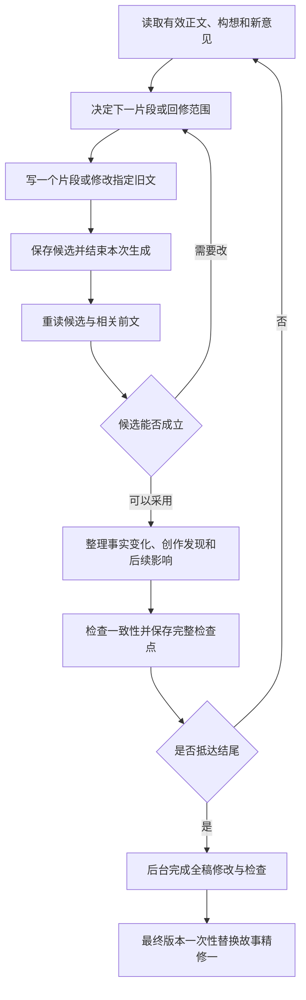

# 小说逐步创作执行设计

日期：2026-09-23。状态：本轮已实施，小说已原地发布待审阅；采用当前会话串行驱动，程序负责约束、持久化和恢复，不建设常驻模型调用服务。适用作品：《把灯带回家》；与 `novel-creation-plan.md` 配套。

## 1. 要实现的创作行为

从粗略构想出发，一次写一个片段；通过重读实际写出的内容，修正对人物、主题和故事方向的理解；当新的理解与旧文冲突时，回修受影响的前文，再继续。最终完成一部可以从头到尾阅读的小说。

用户已明确发布边界：整个持续创作过程属于后台，不反映到审阅台；只有小说完本且完成全稿修订与检查后，才将最终版本一次性替换到当前“故事精修一”。执行过程不增设前台页面，不逐片段或逐章更新正式正文。

工程约束作用于任务范围、数据版本和执行顺序。作品质量、人物是否可信以及哪些修改值得做，仍由创作判断负责。每次判断保存简短的发现、依据和决定，供核对与恢复，不制作事后虚构的“作家创作过程”。

## 2. 创作材料的四种性质

| 类型 | 示例 | 后续怎样处理 |
| --- | --- | --- |
| 用户明确要求 | 基于精修一写成完本小说、现代白话、李寄主动应募与斩蛇止祸、采用逐步创作 | 作为持续约束。若确有必要改变，要向用户提出具体影响 |
| 当前正文已建立的事实 | 某人已经看见祭册，某把剑放在哪里，某次争执中实际说过什么 | 约束当前续写；可以通过有记录的回修改变，但必须同步处理受影响正文与记录 |
| 对作品的当前理解 | 李寄的急切也许来自怕失去朋友；主题可能涉及保护、负债和信任 | 属于可调整的判断，注明正文依据与尚不确定处，不把人物性格写成不可违反的行为公式 |
| 未写部分的设想 | 下一场或许在米铺争吵，后面可能通过戏班组织乡人 | 允许替换、合并或删除；不能在摘要中记成已经发生的事实 |

另外区分“客观发生了什么”“某人物相信什么”“读者目前知道什么”。错误判断和不可靠叙述可以留在故事里，但不能误变成全书事实。

用户原有梗概与十二章表属于起始依据及远景设想。它们可指导创作，不要求正文依次证明预定的性格与主题结论。

## 3. 保留哪些状态

最小后台状态由以下六部分组成，逻辑上分开，保存时组成一个一致的检查点；它们不进入审阅台的当前展示数据：

1. **当前正文**：已接受的章节和片段，有稳定片段ID及顺序；写新片段时决定归属章节，正文只含小说内容。已有章节元数据的通用重排不在本轮最小接口内。
2. **当前构想**：目前想探索的主题问题、人物理解、主要关系与全书远景。允许存在尚未解决的分歧，修订时注明依据。
3. **事实与线索记录**：已写事件、人物知情范围、时间空间、重要道具、伤势及仍待回应的线索。每条关联具体片段与修订，摘要不能替代原文。
4. **近期打算**：当前片段的场面起点、人物想做的事和最多一至两个后续可能场景。没有远处章节的预生成正文。
5. **待处理问题**：区分影响下一步的因果问题、可稍后处理的文字问题，以及需要用户决定的方向问题。回修有范围，未解决问题有状态。
6. **进度记录**：当前阶段、最后有效修订、正在进行的步骤、候选结果、下一步动作和审阅意见处理情况，支持中断恢复。

每一步另外保留简短作者说明：发现了什么、原文依据在哪里、做了什么选择、影响哪些片段、哪些问题仍开放。没有变化时可明确记录“沿用当前判断”，不设最少修改次数。

## 4. 一次循环怎样执行



一次正文任务通常是600—1200字的片段，也可以是一场自然完成的短场景。长度用于控制工作范围，允许按需要调整；不能为了凑字数切断正在进行的动作或往场景中填充说明。

不同执行步骤有各自输入和结果：

- **决定下一步**读取最新检查点，产出当前写作目的、范围与需要读的前文；它可以决定先回修，也可以保持原方向向前写。
- **写作或回修**只产生指定范围的候选正文。生成任务中不同时要求写完后续数章、总结全书主题并宣布全书完成。
- **重读**是后续独立步骤，以已经保存的候选为材料，判断人物行为是否成立、信息和空间是否连贯，以及实际文本是否改变了原先构想。
- **采用**把候选正文、事实更新、当前构想、待处理问题及下一步提示共同保存。下一次写作必须读取这个新检查点，而非复用开篇时的静态提纲。

采用单写作者、串行推进的方式即可。正文顺序具有依赖关系，不能让不同任务在尚未形成前文时并行写后续章节。重读可以由同一模型的后续调用承担，不要求多位创作者或额外协作系统。

## 5. 构想何时调整

每个片段完成后允许局部发现；每章自然收束时重读整章并审视全书远景；人物作出重要决定、进入原计划难以成立的情节，或反复无法写出可信的转折时，主动提前进行全局重看。

全局重看关注：目前正文真正关心什么、人物已经表现出什么、尚未兑现的期待是什么、原定下一步是否仍然可信、远景该如何变化。主题可以深化或改变重心，但须能被已有文字支持，或通过实际回修获得支持。

后续计划与已写人物不合时，依次考虑：

1. 人物没有问题，改后续事件或达成方式。
2. 对人物的理解过于简单，更新理解并在必要的场景中呈现其复杂性。
3. 旧场面的处理妨碍更可信的整体，需要修改旧文。
4. 冲突涉及用户明确要求，整理具体选择与影响，请用户决定。

这一顺序是默认思考方向，不是机械优先级；不同选择以对全书的实际影响判断。不得只为保住原定桥段而突然新增秘密身世、超常能力或人物失忆。

## 6. 回修怎样发生

回修首先引用当前修订，写明目标片段、问题、希望达到的效果与可能受影响的后文。例如改变了阿蘅何时知道祭名，所有依赖该信息的对话、行动、读者认知和相关摘要都须重新核对。

回修可以修改一个片段，也可以处理一组相互依赖的旧片段。执行时分步形成候选，受影响范围内的正文与事实记录全部核对后，才把这一组修改切为有效版本。尚未检查过的依赖保留为明确待核项；阻碍续写的关键矛盾未解决时，先修到足以继续。

必须记录选择原因和实际改动，但不为了显得像人类作家而刻意制造错误、绕路、重写次数或固定的“顿悟”。有把握的部分可以一次写顺。

普通语句润色可以进入待办，让创作继续。如果针对同一处做了两轮修改仍没有解决同一因果问题，下一步应重新考虑人物、情境或全书安排，避免继续同义改写。每次回修应有具体目标，完成后回到创作循环；保留章节后或全稿阶段继续打磨的空间。

## 7. 已落地的最小实现

本故事的后台工具位于本仓库 `scripts/novel_writing.py`，仅依赖 Python 标准库；测试位于 `tests/test_novel_writing.py`。不导入审阅台模块，也不需要相邻系统 checkout。创作流程是本故事的工作方式，不是审阅台的通用功能；审阅台不提供写作命令或过程页面，仅保留独立的内容管理与发布接口。此职责边界由用户于 2026-09-23 确认调整。

- 当前会话是唯一写作者，串行决定和执行 WRITE、REVISE 或 REFLECT；程序不调用模型、不读取 API 密钥，也不在会话停止后自动续写。
- 工作状态位于本实例 `.runtime/novel-writing/lantern-home/work.sqlite3`，独立于正式审阅库和公开 export。正文、事实、构想、待办在同一事务内采用为不可变检查点；候选先保存，再通过独立命令重读，才允许采用。
- 阶段为 DRAFTING → FULL_DRAFT → REVISING → READY_TO_PUBLISH → PUBLISHED。只有全稿已读、全部片段核查完成、完整性/因果/连续性/语言/干净稿五项作者审校声明通过且无阻塞问题，才能达到 READY。
- `bundle` 从冻结检查点生成完整 `publication.json` 和 `clean.md`，不修改正式资料。书名来自实例种子，具体人物、正文与构想仍属于故事数据。
- 本地工具只在 `init` 和 `published` 中通过 SQLite `mode=ro` 读取正式库：前者固定 `sources`、`comments`、`comment_events` 的一致快照，后者核对最终源哈希。这是当前实例的只读适配，不引入系统代码依赖；若未来正式数据格式变化，仅调整故事侧适配。所有创作写入均限于独立工作库。
- 迁移保留原工作库路径、表结构、检查点序列化和哈希算法；无需转换、复制或重建既有创作记录。`status` 可直接读取原有 PUBLISHED 检查点；误写 run 名称会报错，不会创建空工作库。

### 受控原地发布

用户明确要求保留同一精修一，发布前现场核验为零评论、零依赖、单一 SOURCE 修订。本轮没有新建 STORY 对象或另一小说入口，也没有先删除再导入。

审阅台独立命令 `replace-source-content publication.json --expected-revision 原SOURCE哈希` 在同一 SQLite 写事务内检查：目标已存在且是故事精修；原哈希匹配；评论数和依赖数为零；只有一个 SOURCE 修订。满足条件才更新该条资料及其无引用的修订记录。保留原 ID、分类、排序和链接；相同内容重试不再写入。异常回滚，新评论、依赖或用户改动使覆盖拒绝。普通 `import-sources` 继续保持旧 ID 内容不可变。接口并不要求调用本地写作工具，详见[系统原地替换说明](https://github.com/goosmanlei/story-review-desk/blob/main/docs/source-replacement.md)。

目标原稿本就没有评论，不存在需要迁移的精修一锚点；其他资料、既有评论、状态及精确修订全部保持。此原地通道不适用于已经产生评论的后续稿件，不能在用户审阅后直接沿用本次零评论假设。

正式发布后，本地工具的 `published` 只读核对正式哈希，再记录后台 PUBLISHED。发布成功但确认写回中断时，重试确认即可，不重新创作或覆盖。随后更新现有干净稿与导入文件，执行常规 export、双仓同步和干净恢复。本机候选、创作笔记与检查点不纳入公开同步；正式正文是完整干净稿，不另存旧稿文件，Git 历史不重写。

## 8. 实际步骤契约与恢复

从本故事项目目录执行（无需审阅台源码或 Python 包）：

```bash
python3 scripts/novel_writing.py --run lantern-home status
python3 scripts/novel_writing.py --run lantern-home context
```

本轮 run 为 `lantern-home`，不能省略；CLI 缺省名称仍为 `default`。实例目录默认为脚本所在仓库，隔离测试可显式传 `--instance /path/to/test-instance`。旧审阅台 `writing` 入口已移除，不保留转发入口，避免再次混淆职责。一次 WRITE 的输入示例：

```json
{
  "step_id": "w001",
  "base_revision": "刚读取的有效检查点",
  "action": "WRITE",
  "targets": ["f001"],
  "purpose": "只完成眼前一个片段",
  "chapter_id": "c01",
  "chapter_title": "第一章 河里的歌本"
}
```

依次执行 `context` → `begin step.json` → `save-candidate STEP candidate.json` → `read-candidate STEP` → `accept STEP review.json`，也可在判断不成立时 `reject STEP 原因`。候选只含声明范围内的 `fragments:[{id,text}]`；WRITE 恰好新增一个片段，每片段硬上限 2200 字符，不得用标题隐藏后续多章。REVISE 仅改指定已有片段文本，REFLECT 不改正文。

采用文件有 `observations` 和 `updates`；事实、线索、问题用稳定键和 `fragment_ids` 关联正文。顶层笔记对象按记录键合并，其他类型整体替换。回修还须提供 `rechecked_fragment_ids` 和 `dependency_review`，交代受影响后文的核查。问题用 OPEN/CLOSED 与 blocking 区分是否阻止继续写作。

- 一个未结束步骤会阻止下一步骤；过时基础修订、未读最新上下文、未重读候选、越界正文或无效事实引用均拒绝。
- 同一步骤输入、候选和采用结果重试幂等；不能偷偷改写已保存候选。中断后先看状态：已有候选先重读，已采用不重写。
- 每次 `context` 带当前笔记、完整片段目录、最近两段及指定前文；`--full` 返回全稿。摘要只用来定位，关键判断须实际重读原文。
- 最小实现保留已采用片段的顺序与章节元数据，REVISE 改正文；本轮分章随新片段进入时确定，未实现或宣称任意拆并重排已有章节的通用编辑器。
- READY 后只生成最终包、发布和核验。发布或导出中断时恢复相应步骤，不回退到重新生成全书。
- 作者笔记必须与采用的正文一致。程序能检查范围、顺序、版本和引用，不能自动判断作者是否认真阅读、人物是否可信或作品是否动人。

## 9. 过程验证与完本判定

故事工具独立测试：`PYTHONPATH=. python3 -m unittest discover -s tests -v`。审阅台在自己的仓库运行同一测试命令，两边测试不互相导入；原地替换的保护和导出恢复由审阅台 `tests/test_source_replacement.py` 验证。

本轮验证项（具体证据见 `VERIFICATION.md`）：

1. 先生成并保存第一片段，再看到下一步任务；下一步上下文确实含第一片段及其后的构想修订。
2. 在隔离测试中让新片段与旧事实冲突，执行器能转入回修或调整后续的分支，而不是照着固定章节表继续。测试材料不写进正式小说。
3. 修改旧事实后，受影响的正文、事实索引、人物理解和后续打算一起处理；其他资料的既有评论仍指向原修订。
4. 在候选保存后、采用后、最终发布前分别模拟中断，恢复后无重复片段、无丢失回修、无旧构想覆盖新正文；正式审阅数据不被未完成的后台工作污染。
5. 在多轮写作、构想调整和回修后，正式精修一正文与发布前基准仍相同；只有最终发布时发生一次完整版本切换。最终正文可读且无修改痕迹，其他资料的既有评论仍能定位原修订；精修一原本无评论，后台作者说明不进入页面。

创作阶段区分：逐步写作、已形成全稿、全稿修改、可发布、已发布待审阅。章数和字数是参考；核心情节与人物关系收束、无关键断裂、全书重读完成后，才能标记为可发布。发布这一完整版本属于用户已明确要求的交付；它不等于用户已经确认作品满意，也不等于旧项目任务获得完成确认。

## 10. 本故事中的循环示例

以下是方法示例，不是已经发生的创作记录：

起始构想认为父亲只是害怕女儿送死。在写家中争执时，若场景显示他更在意官府会不会守信，而且女儿合理的请求也遭他否决，那么原先“写清条款后父亲立即支持”的安排可能写不自然。

下一步可以重新理解他的恐惧，改成他仍不相信文书，但愿意亲自守在退路上。若这与前文一段对官府十分信任的言行冲突，就比较保留矛盾并解释缘由，或回修那段言行的效果。选定方案后修改实际旧文、核对其影响，再调整报名场面的推进方式。

这一发现也可能使全书对“信任”的理解更具体：共同承担风险不要求每个人先消除所有怀疑。只有正文确实支持时才把它加入当前构想，随后观察后段是否能自然发展。最终采用什么主题表述，由写作与全稿修改逐渐确定。
