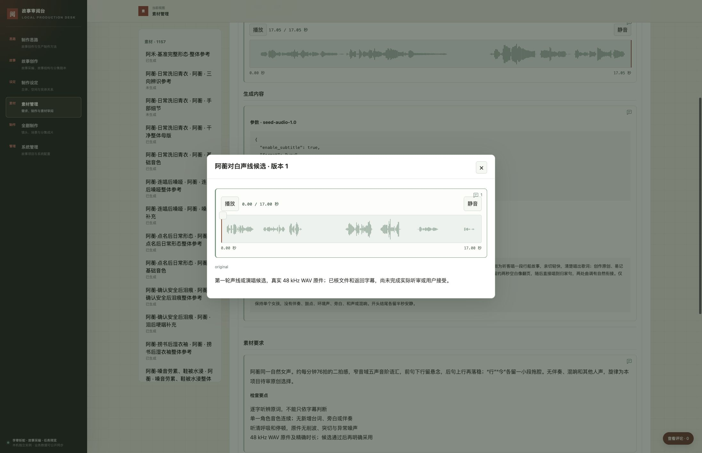

# 素材审阅体验交付说明

本任务已实现生成内容合并、需求列表与筛选、块评论数量、共用音频播放器及实体读取优化，并完成隔离验收。正式服务应用、双仓集成和任务完成仍须最终候选确认；实际确认、完成与推送结果只读取任务账本。本轮交付为本地集成，不含推送。

通用系统候选为 `236433072b1629c197e3685cb5b7e305b53e3285`，实例引用见 `config/instance.json`。故事候选由最终 `_prepare_integration` 返回，避免在候选文件中循环记录自身提交号。所有命令默认从本任务 worktree 根目录执行；系统工作区是 `.runtime/material-streamlining/system`，来自独立通用系统仓库。正式业务库、受管声音内容和素材接受没有被测试修改。

## 阅读与操作

- 制作设定选择实体／完整状态，素材管理选择具体需求。未生成的卡显示待执行方案；有原件时选择素材版本和候选，生成内容随所选结果切换，模型、参数、提示词和参考来自该结果的准确真实调用。同轮不同调用不共用执行内容。旧结果缺少调用时显示缺口，不把需求方案冒充真实执行。
- 需求正文、输出描述和检查要点继续可读；“查看原方案”打开历史方案，不与实际内容重复并列。修订方案沿既有轮次，新方案不改写旧调用、素材或原件；评论、采纳和镜头采用沿既有操作与含义处理。
- 参考按钮打开调用所引用的准确修订及文件组成，图像使用登记的裁切，音频使用登记的时间范围。尚未产出的需求说明没有原件；旧记录缺少指定组成时说明缺失，不代用另一文件或最新结果。
- 素材列表每个需求计一项，在条目内访问占位、结果和历史。历史独立素材另列，旧素材、调用、审阅结论和关系链接继续定位准确记录。存在非占位真实原件才计为已生成；失败调用或方案不计入。采纳内容不会变成镜头采用。
- 筛选保留生成状态、真实内容分类、搜索、清除和数量，去掉重复说明与混合记录类型。数量使用同一条目口径；类别按完整可浏览数据确定，搜索为零不移除选中类别。当前一致性副本为 1,159 项：1,157 个需求及 2 个历史独立素材，829 项未生成、330 项已生成，1,079 项图像、80 项声音。分类可以重叠，后续真实数据变化会重新计算。
- 块右上角图标旁显示该块全部现存评论数，含已关闭评论，按唯一编号去重；零条只显示图标。点击图标或用键盘 Enter 打开同一范围列表。文字跨段、图像区域和音频时间锚点保留；新增、编辑、关闭／重开、删除后刷新及版本切换重新计算。
- 音频使用同一播放／暂停、静音、时间轴、波形、选段与试听控件。点击定位、拖动选段；方向键移动，Home／End 到边界，I／O 设置起止，数字输入可精确调整。可评论的制作音频可在选段后添加评论并由标记定位；来源资料继续使用原来的正文／图像评论，不提供虚构时间评论。波形解码失败时仍可播放和选段。音频下载入口继续移除，后台原件和导出保留。

## 截图样例的准确输入

阿蘅舟行曲候选 `asset-aheng-song-01` 的所选修订为 `4be31a852debec3b150c9d7dafa673f700f03574c233a83bdc247beaaa6bba71`，真实调用 `call-aheng-song-01` 的修订为 `1600edfe10f4b1eb9c805c9a0e374a65469d28264cbce5f69802b6d91a5d4994`。

该调用使用 `seed-audio-1.0`，平铺的 WAV／48,000 Hz 参数及每分钟 88 拍的提示词；参考是“阿蘅对白声线候选”版本 1 的 `original`，准确修订 `d4ca874bc9cd326fea61d92d5cbd4e05d80903de4827f6e5c7312e9b9120c4ef`，文件 `a041a61f5f37de8086eba7de160804c785587d1ae1ce024ef67246f846c69e84.wav`。参考弹窗展示这份 17 秒原件和其准确评论目标。

原方案使用每分钟 76 拍、嵌套 `audio_config` 和 `watermark`，并指向另一项声线需求。这是真实历史差异，原方案独立保留；若该准确需求尚未产出原件，弹窗如实说明。本轮没有强行改成同一记录，也没有修正声音或业务数据。需求中保留 76 拍是需求事实，不是实际调用参数。



## 浏览器验收

使用已连接 Chrome，正式数据一致性副本预览在 `http://127.0.0.1:62604/`；可丢弃样例在 `62606`，强制波形解码失败样例在 `62607`。浏览器操作不连接正式库。以下结果来自实际页面操作；自动检查另列，不替代页面结论。

| 范围 | 实际页面与观察结果 |
| --- | --- |
| 两页生成内容 | 阿禾、李寄、阿蘅实体切换；阿蘅未生成卡显示方案，已生成整体／声线／舟行曲卡只显示一次实际内容，需求和检查要点保留。素材管理同样读取准确结果。隔离 `multi` 两候选分别显示 `fixture-multi`／`fixture-second`、各自参数和提示词；`wide` 切换历史轮次后恢复旧调用，新方案没有改写旧结果。 |
| 准确参考 | 舟行曲按钮打开上述对白原件，不再打开纯方案；原方案指向未来需求时说明尚无原件。隔离多参考保持图片1、图片2及各自准确版本，第二图裁切为 x/y 0.1、宽 0.7、高 0.6；混合引用保持图片1、音频1、图片2顺序，音频范围为 0.1–0.8 秒。缺指定组成和缺真实调用的历史样例均显示缺口，无最新文件替代。 |
| 块评论 | 图片历史版显示 3 条（含 1 条关闭）、当前版 1 条；音频原件的 2 条评论（1 开／1 关）与图标一致。舟行曲准确参考原件新增、编辑、关闭和重开同一评论，数字始终为 1，定位仍为原件 0.10–1.10 秒。无评论的文字块保留图标而无数字；原方案文字评论可定位并编辑，未提交草稿保留。可丢弃样例删除测试评论后刷新，音频数字从 3 回到 2、列表一致。产品没有新增删除入口，该删除验证通过隔离数据操作后刷新完成。 |
| 筛选和旧链接 | 全部 1,159；声音 80；声音与已生成组合 77。无匹配搜索为 0，但选中分类保留，清除回到全部。2 项独立历史素材仍可访问；准确旧 CALL 链接显示其执行输入，未重新加入列表记录类型。当前没有工程／说明文件选项；隔离真实 JSON 工程、TXT 说明文件存在时分类可选并打开。 |
| 音频 | 实体、素材管理、准确参考弹窗和来源样例使用同一控件，覆盖暂停、静音、定位、选段试听、制作音频评论新增与定位。1 秒实体样例及 17.05 秒素材播放到末尾后 paused/ended 均为 true；参考播放和评论在准确范围内。来源原件选段 0.1–1.1 秒，试听后停在 1.1 秒，无虚构时间评论按钮。波形失败样例仍播放／选段／新增准确时间评论。 |
| 弹窗返回 | 关闭、Esc 和嵌套返回恢复外层对象、轮次、阅读位置、焦点与草稿；原方案编辑草稿关闭后再次编辑仍在。外层音频草稿打开混合参考后 Esc 返回仍在。弹窗和移除的播放器暂停，工作区切换不留后台播放。 |
| 桌面与窄屏 | 桌面筛选／弹窗操作正常；两页在真实 390 × 844 视口验证，文档宽度 390，筛选按钮在视口内、可触达。窄屏图见证据目录，临时视口覆盖已重置。 |
| 共用回归 | 故事采编白话译文、结构稿 10、剧本 E01/s001、全剧制作 E01-001 页面正常阅读和评论入口；第一镜头仍如实显示 33 项缺项，不被素材认可替代。实体切换至素材最多的李寄可完成加载，再切阿蘅显示其 6 状态。没有用接口结果替代这些页面操作。 |

当前 45 项正式来源资料没有音频。来源音频验证使用可丢弃实例，复制既有受管 MP3 的原字节，不生成新声音或转换成制作对象。将“存在音频的来源入口”通过该样例验收，不能写成正式来源已有音频。视频时间评论范围有自动检查和混合参考页面覆盖，本轮没有生成新视频。

音频入口清单如下，实际页面入口与保留的通用渲染能力分别说明：

| 入口 | 共用路径及评论目标 | 核对方式 |
| --- | --- | --- |
| 制作设定实体状态／整体／局部声音 | `entity-review.js` → `reviewMediaPlayer`；原 ASSET 修订、组成、文件和用途范围 | 实际阿蘅及实体样例 |
| 素材管理需求结果／历史独立声音 | `material-review.js` → 同一播放器；所选候选／轮次的 ASSET | 实际舟行曲及历史样例 |
| 生成内容及原方案的参考弹窗 | `renderProductionReferenceMedia` → 同一播放器；引用的准确 ASSET 和范围，未产出需求无播放器 | 实际对白原件、混合参考与缺口样例 |
| 状态整体参考、关系／采用详情的媒体引用 | 共用参考渲染；保持原引用对象 | 参考渲染代码审计、准确范围自动检查与上述弹窗覆盖 |
| 来源资料音频 | `app.js` → 同一播放器、review=false；保留 SOURCE 正文／图像评论 | 来源音频隔离样例，当前正式来源无音频 |
| 通用 ASSET 详情及历史比较渲染辅助入口 | `productionMedia` → 同一播放器；原 ASSET，比较只读时不增评论能力 | 全部音频创建点审计与自动检查；需求卡已取代旧并列结果视图，未声称每个辅助函数有独立页面验收 |

全部静态源码中的实际 `audio` 元素仅由共用播放器创建。音频下载按钮未恢复；JSON／图像／文档的既有原件访问不受影响。

## 完整 HTTP 性能对照

用户报告的约 700 毫秒没有被当作实测基线。本次在同一台 macOS 26.6.2 arm64、18 逻辑 CPU 机器上，从正式活库备份取得一致性副本，使用同一个环回 HTTP 服务端口 `62605`、原生 Python 3.9.6、单进程单请求 `ReviewServer`、SQLite 3.51.0、DELETE 日志模式做前后对照。规模为 3,182 对象、6,998 修订、41,170 依赖、1,181 轮次、5,515 成员、271 评论、300 评论事件。

每类先独立记录首次请求，再预热 5 次，随后完整读取响应体 50 次；首次与预热不混入统计。p95 取排序后向上取整的第 48 个样本，表示这组 50 次请求中 95% 的耗时上界。中位数与首次同时报告，单位均为毫秒。

| 请求类型／参数 | 首次：前 → 后 | 中位数：前 → 后 | p95：前 → 后 | p95 降幅 |
| --- | --- | --- | --- | --- |
| 典型：`entity_id=entity-a-he` | 829.05 → 117.19 | 841.40 → 108.16 | 871.11 → 116.35 | 86.64% |
| 素材最多：`entity_id=entity-li-ji`，23 素材／36 展示用途 | 1286.48 → 229.10 | 1225.29 → 233.83 | 1276.06 → 248.70 | 80.51% |
| 历史：阿禾、`revision_id=c97540bb0d60dbda61489338230a975eaf205a9b28f1986f2fa441ea6f7143cb` | 255.89 → 117.11 | 246.94 → 117.05 | 259.65 → 125.75 | 51.57% |

三类均满足 p95 ≤300 毫秒且 ≤同类前测 50%。每类完整 JSON 响应的规范化 SHA-256 前后相同。前测代码 `c1da4cdce8c98bd52beafed1dc0a7b70887d8653`，后测 `7bd951f113fa02e03c43b017a776da3542f72045`；最终系统候选只补旧链接前端导航，后端、性能测量与导出代码未变，因此复用后测，不重复收尾跑分。原始样本见 [前测](../production/evidence/material-streamlining-performance-before.json)、[后测](../production/evidence/material-streamlining-performance-after.json)；完整数据与服务配置见 [一致性证据](../production/evidence/material-streamlining-data-integrity.json)。

瓶颈是同一请求多次全表扫描、反复读取并解析相同修订，以及按修订反查轮次成员缺索引。修复将原始行和当前记录复用限制在一次 SQLite 读取事务内，去掉重复扫描／上下文计算，并增加 `material_members(revision_id)` 索引。请求结束或异常即清空；下一次请求重新读取，不依赖长期结果缓存。准确依赖、组成及轮次一致性校验保留。

失效检查覆盖实体、状态、方案、素材、关系、评论／判断更新、导入和历史切换；嵌套事务不回滚调用方事务，异常清理，WAL 并发写入样例仍获得一致读取视图。这里 WAL 是独立测试配置；正式对照仍为 DELETE。没有只测缓存命中、少返回字段或使用陈旧数据达标。

## 自动检查与数据保留

| 检查 | 结果与范围 |
| --- | --- |
| 通用系统 Python | 151 项通过，覆盖准确输入、锁定／轮次、API、失效机制、导出恢复及既有业务规则；最终导航补丁未改后端，复用已通过结果。 |
| 通用系统前端 | 388 项通过，含块范围去重、关闭／重开／删除／历史切换、跨段锚点、准确文件／时间、旧链接、候选切换、过滤口径与播放器生命周期。 |
| 故事发布保护 | `tests/test_material_review_release.py` 5 项通过：拒绝历史／身份丢失及等数量的轮次成员替换；保留并发用户编辑；未显式应用或包摘要变化即停；拒绝其他任务发布目录。 |
| 原库／性能副本 | 13 张业务表逐行规范化摘要相同，索引是唯一数据库变化；评论正文／事件／锚点、不可变修订、调用、关系与采用均保留。 |
| 公开导出 → 空实例 | Schema 4、1,312 受管文件，清单 SHA-256 为 `3ff030bee1ad54730d371bf875b84de16903c445887ba688f80711cd7acffb88`。公开导出承载的 12 表全部相同，阿禾／李寄／阿蘅实体响应相同，见 [恢复证据](../production/evidence/material-streamlining-restore.json)。原库另有 1 条 `generation_publications` 本机发布回执，不属于既有公开导出契约，未删除或改变该契约。 |

系统测试日志留在 `.runtime/material-streamlining/{python-tests-final,node-tests-final}.log`；结构化验收索引为 `production/evidence/material-streamlining-validation.json`。测试不向正式库写评论或判断；原件校验随公开导出清单完成。实现没有数据迁移、公开导出字段变化或声音内容改动；列表额外的 `material_assets` 是读接口关联索引，不写新需求或关联。

复现隔离预览与检查：

```bash
python3 scripts/generation_review.py --instance .runtime/material-streamlining/review --system .runtime/material-streamlining/system serve --port 62604
```

在系统工作区执行：

```bash
NO_PROXY=127.0.0.1,localhost no_proxy=127.0.0.1,localhost PYTHONPATH=. python3 -m unittest discover -s tests -v
node --test tests/*.test.cjs
PYTHONPATH=.:tests python3 tests/material_ui_server.py --port 62606 --source-audio <既有受管MP3绝对路径>
PYTHONPATH=.:tests python3 tests/material_ui_server.py --port 62607 --waveform-failure --source-audio <同一既有原件>
```

样例自行创建临时数据库；必须只用隔离端口。性能复现使用已留存的 `performance` 副本，从同一请求集合分别启动前／后系统版本，再执行 `scripts/benchmark_entity_review.py --url http://127.0.0.1:62605 --database .runtime/material-streamlining/performance/.runtime/review.sqlite3 --system-commit <实际服务代码提交> --output <新证据文件> [--compare <前测文件>]`。每类至少 50 次；比较不同请求／样本数／数据规模或不达标会失败。不要用已有测试评论的 `review` 副本替换性能输入。

## 最终候选与正式应用

确认前完成全部受管提交并运行 `_prepare_integration`。候选及目标由命令回读；通用系统目标为 `../story-review-desk-python` 的 `main`，本轮预期原头为 `c1da4cdce8c98bd52beafed1dc0a7b70887d8653`。故事目标为主项目 `main`，预期原头以准备回执为准。候选／目标或验证输入变化时，核对差异、按影响补验，重新取得必要确认。

`scripts/material_review_release.py` 复用已有正式服务守卫，提供代码发布包、离线镜像构建、只读预检、串行应用和保留活库的恢复。不可变包放 `.runtime/material-streamlining/release`；若重备候选，改用新的包目录，不能覆盖旧包。准备时核对双仓干净状态、候选／目标、正式镜像、四个准确挂载、环回端口、Compose／CA 摘要和实例引用，不复制密钥。构建使用已缓存的正式基础镜像、`--network=none --pull=false`，逐个核对镜像中系统源文件与 Git 候选相同。

准备命令（占位值由准备回执填写）：

```bash
~/bin/codex.project task _prepare_integration -g creative -p SnakeSlayingRecord --task task-20261004-0004
python3 scripts/material_review_release.py prepare --system-worktree .runtime/material-streamlining/system --bundle .runtime/material-streamlining/release --story-candidate <故事候选40位> --story-target <故事目标40位> --system-candidate 236433072b1629c197e3685cb5b7e305b53e3285 --system-target c1da4cdce8c98bd52beafed1dc0a7b70887d8653
python3 scripts/material_review_release.py build --bundle .runtime/material-streamlining/release
python3 scripts/material_review_release.py preflight --bundle .runtime/material-streamlining/release
```

用户明确确认后按以下顺序一次执行，不重新设计流程或补写候选文档：

1. 使用已展示的 manifest／image 回执摘要调用 `apply`。守卫重新核对实际变化，并在共享写入锁内备份**此时最新活库**、受控快进系统仓库、应用精确镜像与永久实例文件挂载。应用包不包含业务导入，本轮准确业务增量为零；启动仅新增幂等索引。不用任务快照覆盖活库，保留用户新评论／修订，核对历史与身份未丢失。
2. 正式端口 `3000` 和 `64401` 回读，核对运行源码与实例文件摘要。实际浏览器只做一次重点验收：阿蘅舟行曲与对白参考、李寄实体、素材筛选、已有评论列表及音频播放／定位。正式库不新增测试评论，开发期完整回归不再重跑。正式页面受阻时记录原始错误与未验项，不记为通过。
3. 正式重点验收通过后调用 `_complete`，由工具受控集成故事仓库并写完成回执。本轮不推送；复用工具的候选／目标和推送范围结果，不另行 push。完成后只回读，不修改主目录或 worktree、不补交提交，保留分支和工作区；退出会话释放运行锁。

```bash
python3 scripts/material_review_release.py apply --bundle .runtime/material-streamlining/release --apply --manifest-sha256 <已确认摘要> --image-receipt-sha256 <已确认摘要>
~/bin/codex.project task _complete -g creative -p SnakeSlayingRecord --task task-20261004-0004 --note '<实际完成标准与正式验证证据>'
```

正式实例文件永久留在主项目 `.runtime/service-releases/materials-20261004-0004-<故事候选前12位>-236433072b16/`，运行服务不依赖任务会话。数据库、媒体仍来自正常主项目 `/instance` 挂载；两个只读文件为 `config/instance.json` 与 `content/production-approach.json`，后者与现行正式内容相同。将来修改这些文件需要新的发布目录及挂载切换，不能只改主目录而宣称运行已更新。

切换失败时用同一准确包的 `recover --apply --manifest-sha256 ... --image-receipt-sha256 ...` 恢复原镜像与原挂载；它不重置 Git、不恢复旧数据库。运行前后备份与回执保存在包的 `run/`，用于核查而非覆盖活库。若出现其他发布或输入变化，守卫停止，先检查实际差异。服务已经切换但 `_complete` 未成功时沿原包／账本恢复；脚本识别本包已经生效的精确镜像和挂载，不能盲目执行另一候选。

后续维护可以在永久发布目录运行 `python3 material_review_release.py restart --release . --apply`，仅重启仍是本发布的既有容器；不重建、不接管其他发布，也不在本任务 `_complete` 后执行额外维护动作。任何完成后的新增修改另起交付。

本轮验收证明代码行为、准确数据保留及指定隔离性能；播放成功、页面验收和任务集成均不代表用户接受声音、图像、歌曲或具体镜头采用。
