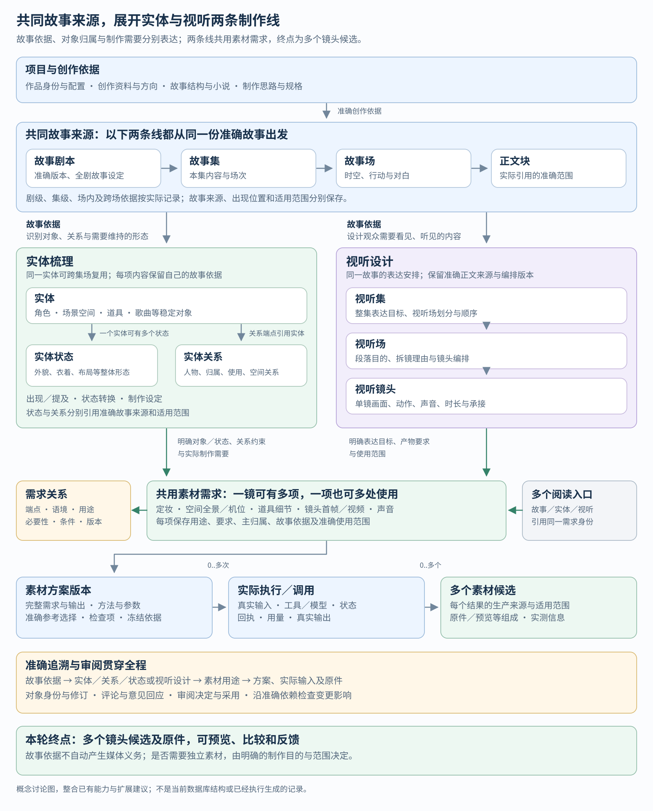
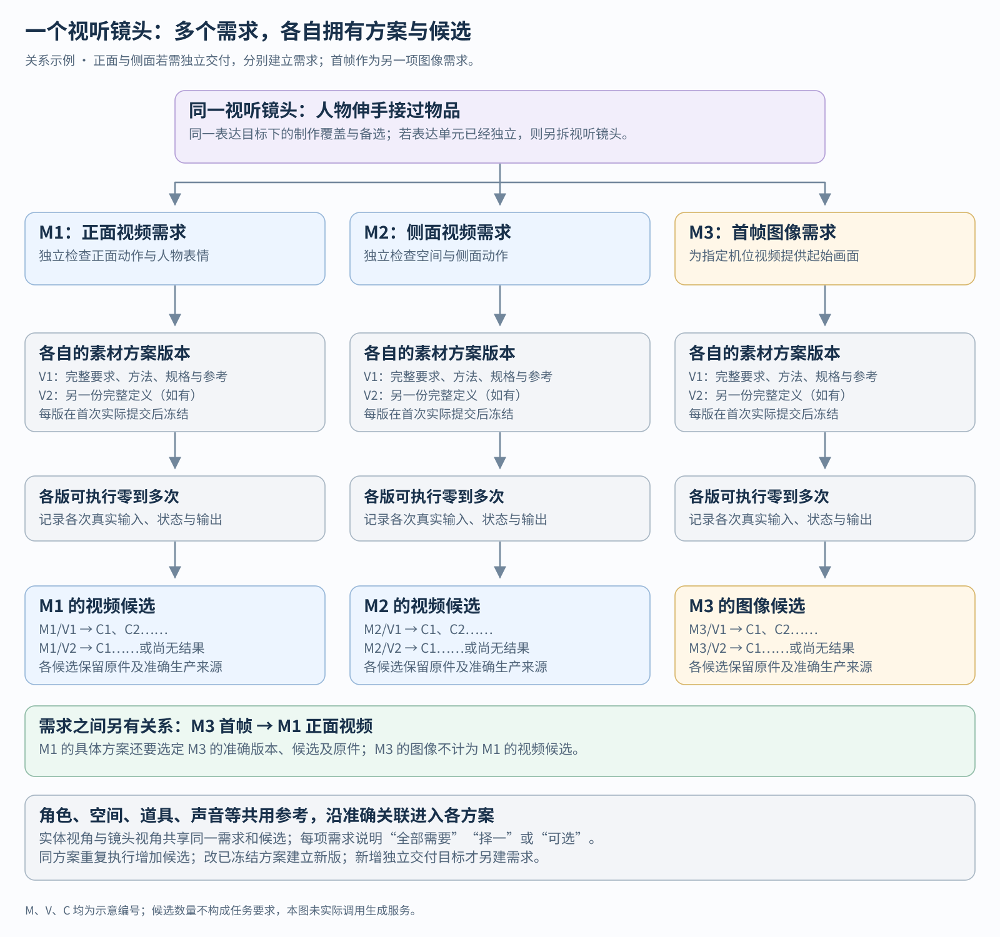
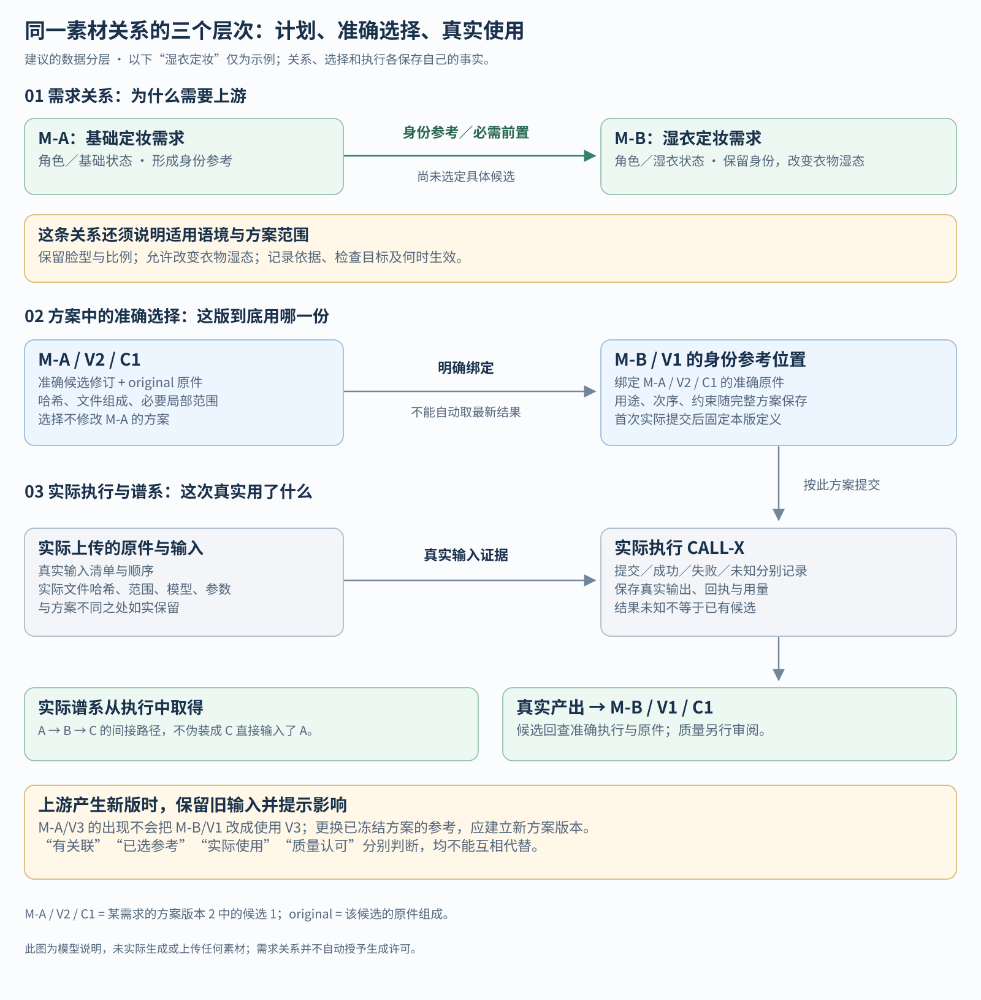
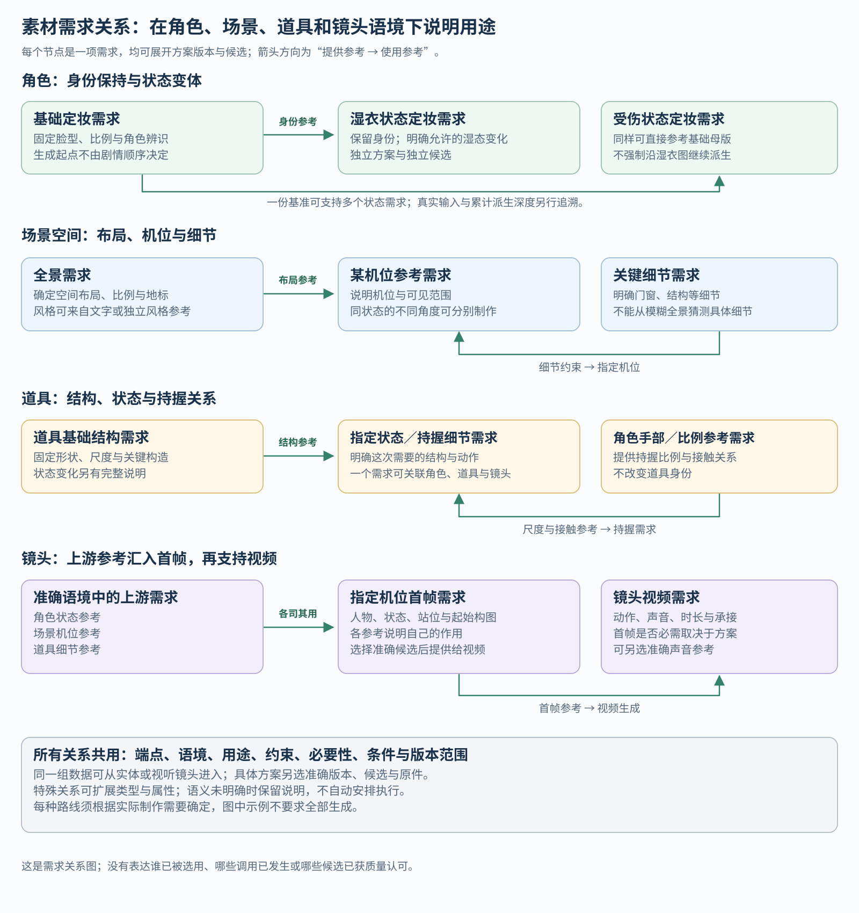
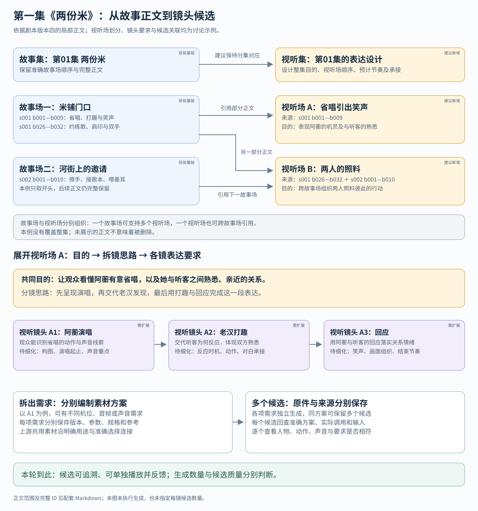

# 系统数据实体与素材生产关系：整体讨论稿

本文说明从故事创作、实体设定、视听设计到素材生产的完整数据关系，功能终点为**镜头多个候选，以及准确方案、执行记录、参考原件与反馈**。剪辑、时间线、镜头拼接及成片交付暂不纳入。基于本模型的任务要求全面重构系统并重编全剧视听内容，清理过时旧体系历史，保留仍复用的当前内容和必要真实生成来源；完整边界见[重构任务计划](production-structural-refactor-task.md)。模型尚未实施，本次任务不包含真实媒体生成调用。

核心建议是：**故事剧本、故事集、故事场及正文是共同的故事来源，由此梳理实体、实体关系与实体状态，同时设计视听集、视听场与视听镜头；两条线共同连接一套素材需求。素材需求之间形成有明确语境的生产关系，每项需求再展开方案版本、真实执行和多个候选。**

“数据实体”泛指系统需要保存的业务概念；下文单独使用的“实体”，专指角色、场景空间、道具、歌曲等稳定对象。两者含义不同。目录、筛选结果、就绪检查等可以由已有数据计算，不必都新增业务对象或数据库表。

页面与操作见[生产制作重构产品方案](production-product-proposal.md)，包含现有页面改动、功能增删、三张布局示意、全剧重编、旧资料清理和可验证场景。本文作为数据概念与关系依据；新体系正常运行的版本、候选及审阅机制，与本次一次性清理过时旧体系分别说明。

## 阅读入口

- [1. 全系统总图](#1-全系统总图)：先看各部分怎样连接。
- [2. 数据概念全表](#2-数据概念全表)：把已有内容和建议扩展放在同一张清单中。
- [3. 故事、实体与视听设计](#3-故事实体与视听设计)：分清三种组织逻辑。
- [4. 一镜多需求、多版本、多候选](#4-一镜多需求多版本多候选)：确定拆分粒度。
- [5. 素材关系的三个层次](#5-素材关系的三个层次)：区分计划依赖、准确参考选择与真实使用。
- [6. 在具体语境下描述关系](#6-在具体语境下描述关系)：角色、场景、道具、镜头、声音和自定义关系。
- [7. 完整例子](#7-完整例子)：把上面的关系连成生产过程。
- [8. 版本、审阅与变更](#8-版本审阅与变更)：让多视角阅读共用同一份事实。
- [9. 现有系统如何承接](#9-现有系统如何承接)：已有基础、结构缺口与修改边界。
- [10. 用例与待决范围](#10-用例与待决范围)：用于检验模型是否清楚、完整。

图示均为独立 SVG，可单独用浏览器打开和缩放，不依赖 Mermaid。正文表格和例子保留图中的关键含义。

## 1. 全系统总图



[单独打开全系统总图](production-data-model/overview.svg)

可以把系统理解为以下几个相互连接的部分：

| 部分 | 回答的问题 | 核心内容 |
| --- | --- | --- |
| 创作依据与项目约定 | 这是什么作品，依据什么创作？ | 项目、资料、方向、结构、小说、制作思路、规格与确认 |
| 故事文本 | 故事写了什么，怎样组织？ | 故事剧本、故事集、故事场及准确正文 |
| 实体梳理 | 故事剧集场中有哪些对象、关系和形态，需要怎样呈现？ | 实体、实体关系、实体状态、准确故事依据、制作设定、出场与状态转换 |
| 视听设计 | 准备让观众看见、听见什么？ | 视听集、视听场、视听镜头、编排与故事来源 |
| 素材生产 | 需要哪些产物，如何依赖和制作？ | 素材需求、需求关系、素材方案版本、参考选择、执行、候选与原件 |
| 审阅与追溯 | 依据哪版，谁判断过，变化影响哪里？ | 准确修订、评论、决定、采用、变更复核、历史与文件证据 |

```text
项目、创作资料、方向、故事结构、小说
    │ 准确创作依据
    ▼
共同故事来源：故事剧本 → 故事集 → 故事场 → 正文块
    │        （保存准确版本与实际引用范围）
    │
    ├─ 实体线：实体、实体关系、实体状态
    │    （分别保存故事依据；状态属于实体，关系连接实体）
    │         ↓ 明确制作目的、关系约束与使用范围
    │       素材需求
    │
    └─ 依据故事设计视听表达
         视听集 → 视听场 → 视听镜头
              ↓ 明确表达目标、产物要求与使用范围
            素材需求

两条线连接同一套素材需求；同一对象、状态或需求可以跨集场复用。
每项需求 ↔ 带具体语境的需求关系
    └─ 素材方案版本
         ├─ 准确参考选择
         └─ 多次真实执行 → 多个素材候选 → 原件及组成文件

准确修订、来源、评论、审阅决定、采用与变更复核贯穿以上内容。
```

**实体、实体关系与实体状态都有各自的故事依据，可定位到准确故事剧本、故事集、故事场及正文。** 剧级设定、集级范围、场内事实和跨多场的证据按实际情况引用；不是只有视听设计这一条线才回到剧集场。制作补充设定另记选择依据，不伪装成剧本文字已经写明的事实。

**从实体进入或从视听镜头进入，看到的是同一项素材需求在不同语境中的用途。** 比如角色基础定妆图可以在角色页查看，也可以沿某镜头的参考路径找到；两条路径都能回查相应故事来源，这两个入口不复制需求、方案和候选。

这些组织关系不是一棵总树。故事和视听内容有各自的层级，实体有状态归属；素材生产是有方向、有分支、可复用的关系网络。列表可以按集场镜或实体展开，底层仍保留这些不同关系。

## 2. 数据概念全表

下表按业务含义盘点，不把每个概念都等同于独立表。“已有”指固定系统版本中有可核对的保存或读取机制；“扩展”指建议在现有基础上调整；“新增建议”尚未成为系统功能。系统基线与源码入口见第 9 节。

### 2.1 创作依据、故事与项目

| 概念 | 保存什么、有什么关系 | 当前基础与讨论归位 |
| --- | --- | --- |
| 作品项目／故事实例 | 作品身份、创作背景、受众、风格、当前创作阶段 | 已有实例配置及项目配置；阶段字段不替代任务账本或实际产物 |
| 创作资料 | 原始故事、研究资料、扩写方向、精修小说等文档及分类 | 已有 SOURCE（来源文档）；小说的章节可从正文组织，不必另建同义对象 |
| 方向选择 | 选用了哪份准确扩写方向 | 已有 GUIDANCE（指导选择记录），与方向文档自身分开 |
| 故事结构稿 | 主题、人物、关系、空间、故事线等整体设计及图文 | 已有 STORY 下的结构稿格式；小说与剧本引用准确版本 |
| 故事剧本 | 完整剧本版本及其有序分集 | 已有 STORY 下的剧本格式；不另复制一份“故事剧本”正文 |
| 故事集 | 一集剧本文本及其中的场次 | 已有 EPISODE；准确剧本版本引用准确分集修订 |
| 故事场 | 某集中的一个剧本场次、地点、时间和正文范围 | 已有分集内嵌场次；目前不是独立 SCENE 对象 |
| 正文块、章节与图文附件 | 可准确定位的文字、图示、图片及说明 | 已有文档组成；支持来源与评论定位，不全是独立业务身份 |
| 制作输入锁 | 本次制作依据的准确剧本／分集、确认范围及规格 | 已有 INPUT_LOCK；保存依据，不因剧本换版自动改变 |
| 制作思路与阅读辅助 | 制作方法说明、准确分集摘要等 | 已有 content 文件；说明文档不代替生产记录 |
| 系统配置及变更记录 | 审阅服务设置与配置历史 | 已有配置机制；不作为故事事实、素材需求或生成候选 |

### 2.2 实体、状态与视听设计

| 概念 | 保存什么、有什么关系 | 当前基础与讨论归位 |
| --- | --- | --- |
| 实体 | 角色、场景空间、道具、歌曲等稳定身份，别名、故事依据、事实、制作选择、未知项 | 已有 ENTITY；可扩展类型，但要定义类型含义与属性 |
| 实体状态 | 该实体某种同时成立的完整形态、准确故事依据与适用范围 | 已有 STATE；每个状态归属一个实体，并有自己的内容修订 |
| 状态转换 | 同一实体从一种实体状态转为另一种的动作、范围与依据 | 已有场／镜中的转换记录及状态前序引用；它描述内容变化 |
| 实体关系 | 人物关系、空间关系、归属、使用、表演等事实或制作选择，以及准确故事依据与适用范围 | 已有 RELATION 的 entity 关系；端点、方向、来源和说明分别可查 |
| 制作设定 | 外观、声线、布局、风格等文字约定 | 当前主要在实体／状态完整描述中，保留 REPRESENTATION 历史设定审阅对象；不再平行维护冲突正文 |
| 出现／提及记录 | 实体或状态在哪段内容中可见、发声或仅被提到 | 已有 occurrences 及 occurrence 关系；与素材使用分别保存 |
| 场准备与检查记录 | 检查某故事场的出场对象、状态、来源与准备情况 | 已有 PREPARATION；重构需拆清检查证据与视听组织职责 |
| 视听集 | 整集表达目标、视听场划分与顺序、预计节奏 | 新增建议；与故事集分别管理设计版本 |
| 视听场 | 围绕一个表达目的组织的段落、分镜思路与镜头编排 | 新增建议；允许引用一个或多个故事场的部分正文 |
| 视听镜头 | 单镜表达目的、构图、空间、动作、声音、预计时长与承接 | 扩展现有 SHOT_DESIGN；摆脱只能跟随一个故事场准备记录的组织限制 |
| 视听编排与故事来源映射 | 某版设计使用哪些准确子项、顺序如何、引用哪些故事正文 | 扩展；顺序、层级归属与来源依据分别保存 |

### 2.3 素材生产

| 概念 | 保存什么、有什么关系 | 当前基础与讨论归位 |
| --- | --- | --- |
| 素材需求（简称素材） | 持续存在的制作需要：用途、输出类型、约束、使用位置、检查目标 | 已有 REQUIREMENT；不同入口共用稳定身份 |
| 需求归属／使用范围 | 需求主要由谁维护，在哪些准确状态或制作位置使用 | 已有 scope、槽位与 applicability；扩展到新的视听对象 |
| 素材需求关系 | 哪项需求为哪项需求提供什么帮助，在哪个语境下成立 | 已有方案输入中的前置需求、复用等基础；建议显式保存语义、条件与版本范围 |
| 素材方案版本 | 该需求的一版完整定义：需求快照、输出规格、检查项、方法、模型、提示词、参数、有序输入和随机策略 | 已有素材方案版本与完整定义；全文统一使用此名称 |
| 参考选择／输入绑定 | 某版方案在某个参考位置具体选择了哪个版本、候选、文件及局部范围 | 已有准确选择；建议与需求关系建立可追溯连接 |
| 实际执行／调用 | 一次真实制作操作的输入、工具、模型、参数、状态、产物、回执和用量 | 已有 CALL；计划、已提交、成功、失败、结果未知须区分 |
| 素材候选 | 实际产出的一份可独立审阅结果 | 已有 ASSET 与候选身份机制；允许一版方案多个候选 |
| 候选的需求适用关系 | 已有候选可以满足另一项需求的哪部分要求 | 已有 candidate_requirements、适用与复用证据；不改写候选的实际生产来源 |
| 原件及文件组成 | 候选的原图／原音频／原视频、预览或其他实际文件及实测属性 | 已有 components；文件哈希、尺寸、时长等可核对 |
| 实际派生谱系 | 新候选实际依据哪些已有候选生成或加工 | 已有实际输入、lineage；从真实操作追溯，不能由需求上的“相关”自动推导 |
| 生成前检查与输入包 | 依据准确方案汇总缺项、选定原件和执行条件 | 已有派生检查与输入包；不是新的创作身份，也不代表已执行 |

### 2.4 审阅、关联与共同机制

| 概念 | 保存什么、有什么关系 | 当前基础与讨论归位 |
| --- | --- | --- |
| 审阅决定 | 对准确内容／方案／结果的判断、作出者、理由和范围 | 已有 JUDGMENT；内容认可、生成条件与候选质量分别判断 |
| 明确采用 | 在某个准确使用位置选用具体候选、组成和范围 | 已有 adoption 关系；不要求每项需求只有一个全局“最佳候选” |
| 变更影响与复核 | 上游旧版变为新版，哪些下游需检查，以及保留／返工／替换的判断 | 已有依赖反查与变更决定；新版本不会自动覆盖旧输入 |
| 评论、锚点、事件与意见回应 | 针对准确文字、图像区域、声音／视频时间范围的反馈及处理历史 | 已有共用评论、事件和部分稿件意见回应；原意见不自动转绑新版 |
| 稳定身份、内容修订与准确依赖 | 对象是谁、某时内容是什么、引用了哪份内容 | 已有不可变修订与依赖；素材方案版号不等同于所有对象的修订号 |
| 业务编号、旧别名与共享身份映射 | 可读编号、旧链接解析、已有需求共享的证据 | 已有；不会因为换列表、排序或同名就建立新身份或合并 |
| 导出、恢复与历史删除凭据 | 可恢复数据、文件清单和明确缺失的历史身份 | 已有；保留缺口，不以最新内容假冒缺失历史 |

现有“素材轮次”、内容去重存储、读取缓存、发布回执等有兼容或运行职责，放在实现层承接；不为它们再增加一套面向创作者的“素材”概念。制作批次若以后确有独立调度需求再设计，与素材需求和项目任务分开。

## 3. 故事、实体与视听设计

### 3.1 两组集场结构各自负责什么

| 结构 | 划分依据 | 该层应保存的设计内容 |
| --- | --- | --- |
| 故事剧本 → 故事集 → 故事场 | 剧本文本、故事时空和正文组织 | 行动、对白、歌词及准确来源 |
| 视听集 → 视听场 → 视听镜头 | 观众需要接收的信息、情绪与表达安排 | 整集目的、段落划分、拆镜理由、各镜要求及承接 |

“分集视听方案”是视听集的内容；“分镜思路”是视听场的内容；“镜头设计”是视听镜头的内容。无需再建三个同义对象。

本讨论暂按故事集与视听集保持同一分集边界，对应对象分别管理版本。故事场与视听场允许多对多：一个故事场可拆成几个视听场，一个视听场也可引用多个故事场的准确正文。来源映射记录实际使用的范围，不把引用几个段落扩为引用整场。

一版视听场编排多个准确视听镜头，保存顺序和承接。镜头的稳定身份与它在某版设计中的位置分别保存，重排不会抹去旧设计和意见。跨视听场重复编排同一镜头是否需要开放，留待实际用例决定。

### 3.2 实体状态、故事场与场景空间

统一业务名称为**实体状态**：某个实体在特定剧情阶段或条件下需要保持一致的整体形态。每个实体状态属于一个实体；“基础状态”“湿衣状态”“受伤状态”等是具体状态的名称，不另设对象类型。

“河街”是空间实体；“河街白昼的完整环境”可以是它的状态；“两人在河街发生的一次行动”属于故事场；“通过几个镜头表现相互照料”属于视听场。

| 容易混淆的变化 | 如何表达 |
| --- | --- |
| 角色换衣、受伤等需要维持连续性的形态变化 | 同一实体的不同状态，说明来源与适用范围 |
| 同一状态描述写得更准确 | 该状态的新内容修订 |
| 正面、侧面、俯视等参考角度 | 素材需求或方案中的视角要求；不自动新增实体状态 |
| 同方案又生成一张定妆图 | 新候选；不新增角色或状态 |
| 普通动作、瞬时表情 | 先写在镜头或需求中；有独立连续性管理价值时再考虑状态 |
| 角色只被台词提到 | 提及记录；不自动产生出镜或独立素材义务 |

角色状态可包含外貌、服装、伤势、体力、声音等同时成立的信息；空间状态关注布局、陈设、时段光照；道具状态关注结构、完好程度、内容物、放置；歌曲状态关注词段、演法、演唱者。**完整性是实体状态的内容要求**：描述应覆盖该状态的适用维度。例如湿衣状态仍需交代当时的伤势和体力，不能只保存“衣服湿了”，再让下游自行拼接其他状态。命名调整保留这一要求。

状态可以只用完整文字描述随镜头生成，无须一律制作独立原件。是否需要定妆图、音色、全景等，由明确素材需求决定。

### 3.3 三种“基础”分别保存

1. **基础状态**：某实体选作起点的一种完整形态。它是内容概念。
2. **基础素材需求**：为固定身份、布局或风格而提出的制作需要。它有自己的方案与候选。
3. **基准原件**：某版下游方案明确选中的一个准确候选及文件。它是实际参考选择。

当前页面默认展示的“基础状态”只是浏览规则，不能据此推断已有基准图。基准原件也不必来自剧情最早的状态。剧情顺序与制作顺序分别记录。

### 3.4 实体这条线怎样从故事展开

故事剧本、故事集、故事场及正文共同提供制作依据。实体梳理和视听设计从同一份准确故事出发：前者说明“有哪些对象、彼此是什么关系、处于什么形态”，后者说明“怎样让观众看见和听见”。二者可以互相补充制作需要，各自保留来源。

| 从故事识别的内容 | 保存到哪里 | 怎样继续连接素材需求 |
| --- | --- | --- |
| 某角色、空间、道具或歌曲的身份与事实 | 实体；引用支持这些事实的准确剧本／集／场／正文 | 按制作目的提出或关联定妆、全景、细节、声音等需求 |
| 人物之间、人物与道具、道具与空间等关系 | 实体关系；保存端点、语义、故事依据与适用范围 | 作为构图、持有、位置、互动等约束；是否需要单独素材由制作需要决定 |
| 服装、伤势、陈设、完好程度等需维持一致的形态 | 实体状态；属于一个实体，有自己的故事依据与适用范围 | 关联该状态所需的素材；可明确复用已有需求或提出不同需要 |
| 某次出现、发声、仅被提及或状态变化 | 对应故事集场的出现记录或状态转换 | 帮助判断具体使用位置；被提及不自动要求制作原件 |

这里有三种不同范围：**故事依据**回答“这条事实或设计来自哪里”，**出现与适用范围**回答“它在哪些位置出现或成立”，**素材用途**回答“为这些位置需要生产或复用什么”。一段正文可以支持多个实体、关系或状态；同一个对象也可以由多集多场共同支持。引用一场作为依据，不代表只归属这一场，也不代表在全剧都适用。

因此，不能按每集每场复制一套同名实体、关系、状态和素材。故事页可从某个剧／集／场查看相关对象，实体页可反查所有准确故事依据；两种入口共用同一身份。剧本没有明确写出的颜色、机位风格等补充说明，记录为制作选择及其依据；不能补造原文证据。

沿实体这条线回溯某项素材时，应能从“素材需求及用途 → 关联实体／实体状态及相关关系约束 → 准确故事剧本／集／场／正文”说明它为什么需要。需求之间继续保留自己的参考与生产关系，不能用实体关系替代素材需求关系。

## 4. 一镜多需求、多版本、多候选

### 4.1 一个视听镜头可以有多项素材需求



[单独打开一镜多需求图](production-data-model/shot-candidates.svg)

假设视听镜头表达“人物伸手接过物品”。在仍服务这一个表达目标的前提下，可以提出：

| 需求示例 | 独立保存的理由 |
| --- | --- |
| 正面机位视频 | 要独立检查人物表情、动作与正面构图 |
| 侧面机位视频 | 要独立检查空间关系与侧面动作，正面结果不能替代 |
| 特定表演情境的视频备选 | 需要与另一情境并存比较，适用条件明确 |
| 用作正面视频输入的首帧图 | 媒体类型和用途不同，有独立生产与检查步骤 |
| 手部／物品关键细节图 | 为具体结构或动作提供可核对的参考 |
| 角色、场景、音色等共用参考 | 引用已有需求及准确产物；不因进入本镜再复制一份 |

多项需求可以是都要具备的产物，也可以是备选路线，需要在镜头使用关系中说明“全部需要”“选择一种”或“仅供参考”。有三个需求不等于必须执行三条路线。

**一个视听镜头的单镜表达仍需保持清楚。** 若不同机位已承担不同信息、动作区间或前后衔接，并准备作为独立表达单元，应拆为不同视听镜头。多素材需求用来管理制作覆盖与备选，不把一整段分镜隐藏在一个巨大镜头对象中。

### 4.2 什么时候新建需求、版本、候选

| 发生了什么 | 建议记录方式 |
| --- | --- |
| 要同时保留正面与侧面两份独立产物，各自有要求 | 同一镜头下两个素材需求 |
| 要保留干燥与湿衣两种故事形态，各有定妆需要 | 两个实体状态及各自素材需求；准确引用原实体 |
| 同一需求尝试不同模型、提示词、参考、输出规格 | 同一需求的不同素材方案版本 |
| 同一完整方案重复生成，得到不同结果 | 同一方案版本下多个候选 |
| 更换随机生成得到的实际种子 | 沿原随机策略记录执行证据；显式固定种子变更属于方案定义变化 |
| 修改候选的说明或补充用途 | 沿现有候选记录修订，不把同一产物计为新候选 |
| 原件加上缩略图或预览文件 | 同一候选的不同组成，不是两个候选 |
| 已有图用于另一个镜头 | 增加准确使用／参考关系，保留原生产身份 |
| 独立产物要求已发生实质变化，旧需要仍要并存 | 建新需求并说明与旧需求的关系；不能只因标题相似就合并 |

需求保持稳定身份，方案版本冻结某次完整定义。因此，“需求”并不意味着要求永远不变；它使不同尝试可以围绕同一制作目的比较。

### 4.3 数量关系

| 关系 | 数量与约束 |
| --- | --- |
| 准确故事来源 ↔ 实体／实体关系／实体状态 | 多处故事来源可支持同一对象，一段正文也可支持多个对象；来源引用与对象归属分别保存 |
| 实体 → 实体状态 | 一个实体可有多个状态，每个状态属于一个实体 |
| 实体状态／视听对象 ↔ 素材需求 | 可有多项明确关联；一项共享需求可在多个使用位置出现 |
| 素材需求 ↔ 素材需求 | 多对多、有方向或明确对称语义，并绑定具体语境 |
| 素材需求 → 素材方案版本 | 一项需求可有多版方案；尚未编制时可为空 |
| 素材方案版本 → 实际执行 | 零到多次；未执行方案不制造调用结果 |
| 实际执行 → 素材候选 | 零到多个；失败或未知可以没有真实结果 |
| 素材候选 → 原件及组成 | 一个或多个实际组成，须能定位真实原件 |
| 方案输入位置 → 准确参考 | 单值／多值由该输入位置定义；集合保持次序和各自角色 |

通常一份候选有一份真实生产来源。它可以明确适用于其他需求，也可能是一次多输出执行中的一个结果；不能把“适用多个需求”写成“分别按这些方案各生成了一遍”。相同文件由另一真实调用产出时，也保留另一调用的来源事实。

复用同一候选，不一定需要合并两项需求。只有完整要求与输出规格相同，并有明确共享证据时，才考虑共用一个素材需求身份；名称相同、同属一个实体或文件相同都不足以证明。要求不同但可使用同一产物时，保留各自需求及准确复用／适用关系。

## 5. 素材关系的三个层次

### 5.1 先区分计划、选择与实际使用



[单独打开三个层次关系图](production-data-model/relation-resolution.svg)

以“湿衣定妆图依据基础定妆图生成”为例：

| 层次 | 记录内容 | 尚不能推导什么 |
| --- | --- | --- |
| 需求关系 | 湿衣定妆需求需要基础定妆需求提供身份参考；保留面部与比例，允许衣物湿态变化 | 未指定究竟用哪一版、哪一个候选 |
| 方案中的准确选择 | 湿衣方案 V1 选择基础需求 V2／C1 的 original 原件，限定用途和允许变化 | 还不能说已经执行过 |
| 真实执行与谱系 | 调用实际上传该原件，记录哈希、顺序、参数，产出湿衣候选 C1 | 不能仅凭调用成功就判断身份与湿态均正确 |

“original”在这里指候选的原件组成。执行记录要保存完整实际输入；方案与真实调用不一致时保存差异，不用计划覆盖事实。

需求图展示“准备怎样制作”；准确选择展示“这版方案准备使用什么”；实际谱系展示“这个结果究竟怎样产生”。三者可以相互导航，但不能共用一个含糊的“相关”字段。

### 5.2 一项需求关系应描述什么

以下是概念字段，不是本轮要落库的接口：

| 信息 | 需要说明的内容 |
| --- | --- |
| 两个端点 | 哪项需求提供参考，哪项需求使用参考；稳定身份及适用内容版本 |
| 关系含义 | 身份参考、状态派生、空间布局、视角参考、首帧、声音参考、复用、备选或说明性关联 |
| 具体语境 | 哪个实体、状态、视听集／场／镜头或项目共用设定下成立 |
| 用途与保留约束 | 参考什么、必须保持什么、允许改变什么、怎样检查 |
| 必要性与条件 | 必需、可选、条件满足时需要；多个前置是全部需要还是择一 |
| 适用方案范围 | 对该需求各方案共同成立，还是只适用于某版或某条制作路线 |
| 准确输入位置 | 在消费方方案中的哪个参考位置使用，角色与次序是什么 |
| 依据与修订 | 来自故事事实、制作选择还是待确认意见；谁修改过、旧内容是什么 |

关系描述与具体选中的候选分开。草稿可以先声明尚无产物的前置需求；执行前，必要输入必须解析到准确版本、候选、原件及有效范围。不得由“已有结果”“默认展示”或“最新版本”代替选择。

### 5.3 主归属、适用、需要与实际使用

| 关系 | 例子 | 语义 |
| --- | --- | --- |
| 主归属 | 基础定妆需求归属于某角色的基础状态 | 说明管理位置 |
| 适用范围 | 该定妆图适用于 E01 的若干镜头 | 说明可能使用的范围 |
| 需求依赖 | 某首帧需求需要该角色身份参考 | 说明制作条件 |
| 准确参考选择 | 首帧方案 V1 选中该需求 V2／C1 | 说明本版具体输入 |
| 实际使用 | 调用记录实际上传该原件 | 说明已经发生的事实 |
| 采用／认可 | 对准确内容或某使用位置作出明确决定 | 说明人的选择及其范围 |

向上汇总可显示某集涉及哪些素材，不能向下推定每镜都用到了它们。A 给 B 提供参考、B 给 C 提供参考，也不能写成 C 直接输入了 A；可以展示间接路径。

共享上游换版时报告受影响下游。某镜头更改自己的参考，只修改该镜头准确方案；需要修改共享首帧方案时，必须明确是在改共享上游并提示影响范围。

## 6. 在具体语境下描述关系



[单独打开语境关系图](production-data-model/contextual-material-relations.svg)

图中箭头统一为“提供参考的一方 → 使用参考的一方”。以下为制作关系示例，不是本项目已确认的制作方案或实际调用。

### 6.1 角色：身份基准、状态变化与表演

```text
基础状态定妆需求
   ├─ 身份参考 → 湿衣状态定妆需求
   ├─ 身份参考 → 受伤状态定妆需求
   └─ 身份参考 → 特定机位首帧需求
湿衣状态定妆需求 ── 状态外观参考 → 湿衣情境首帧需求
```

“湿衣”关系中，应明确保留脸型、身材和角色辨识，改变衣物湿度、贴附感等指定部分。受伤状态同样单独说明伤势和允许变化，不能只写“参考上一张”。

实体状态在故事中可能先后发生，素材生成却可以从同一干净母版分别派生。湿衣在剧情上先于受伤，并不强制受伤图必须从湿衣图继续生成。已有图像规则要求用干净母版锚定身份，并控制累计派生深度；关系设计应能保存多个参考及真实最深谱系，不能用换名或重新选为基准重置代数。

“基础图”也可以只作视觉比对，或通过文字描述固定身份。只有实际选作图像输入的原件才进入该次图像派生谱系；参考类型与实际调用方式要对应。

### 6.2 场景空间：风格、布局、视角与细节

```text
共用风格依据／风格参考需求 ── 风格参考 → 场景全景需求
场景全景需求 ── 布局参考 → 东侧机位需求
场景全景需求 ── 布局参考 → 西侧机位需求
关键细节需求 ── 结构约束 → 某机位需求
机位需求 ── 背景与空间参考 → 镜头首帧需求
```

全景、机位图、细节图可以同属一个空间状态。若布局、陈设、时段光照等内容发生需持续管理的变化，才进一步考虑空间状态。

关系要说明哪些位置、比例、门窗或地标必须一致，机位允许怎样变化。全景看不清的关键细节不能凭“引用了全景”就视为已明确；细节需要独立说明或素材。

风格可以先保存为制作文字约定；确需风格板等独立产物时再建立素材需求。风格与全景、全景与细节不固定组成一条生产链：谁先有依据、谁约束谁，由这次方案明确，避免双方互为必需前置。

### 6.3 道具：结构、状态、持握与比例

道具基础结构需求可为损坏、装填、展开等状态的素材提供结构参考。角色手部或比例图可为持握需求提供尺度参考。关系中要分清道具自身变化、角色的使用动作、机位下的可见部分。

同一个持握细节需求可能同时与角色、道具、视听镜头有关。建议保存一个需求和多个准确语境关联，不为迁就单一分类复制成三份。若不同角色拿法或道具状态要求不同、需独立交付，则建立各自需求。

### 6.4 镜头：首帧、关键画面与视频

```text
角色状态参考 ─┐
场景机位参考 ─┼─ 各自明确作用 → 首帧图需求 → 镜头视频需求
道具细节参考 ─┘                               ↑
角色音色／表演参考 ─────────────── 声音参考 ────┘
```

首帧图表达该机位开始时的人物、状态、站位、构图和光照；视频需求另规定动作、声音、时长等。首帧是独立图像产物，拥有自己的方案版本和候选，不放进视频候选的列表冒充另一段视频。

首帧是否必需由制作路线和模型能力决定。纯文字生成或其他参考方式可以采用另一版方案；采用首帧路线时，必须记录选中的首帧候选与原件。不同机位的首帧也需分别明确，不默认一张图适配所有机位。

若已有候选中的准确一帧已能作为输入，可先记录文件与时间位置的准确选择。实际提取、裁切或加工形成独立文件时保存加工来源；仅改变浏览区域不制造新的生成候选。

### 6.5 声音与跨媒体参考

角色音色、歌曲旋律／完整作品、实际演唱或说话片段承担不同用途。角色身份不等同于某次表演；完整歌曲也不自动成为镜头所需的准确短参考。

关系需要区分“保留音色”“保留旋律”“保留节奏”“参考表演情绪”，并记录准确音频组成和时间范围。声音片段进入视频生成，是跨媒体参考；不得因为共享演唱者，就把歌曲状态并入角色状态。

本轮保留镜头生成所需的声音参考关系，不向后扩展流程。具体台词、歌曲和声音的生产要求继续依本项目当前约定确定。

### 6.6 用通用含义承接可扩展关系

建议把关系拆为两部分：**通用含义决定系统怎样处理，语境用途说明制作上怎样理解。**

| 通用含义 | 系统处理原则 | 可用的语境用途 |
| --- | --- | --- |
| 生成参考／依赖 | 被选定为必要输入后，前置缺失会阻断本方案 | 角色身份、场景布局、首帧、音色等 |
| 直接复用 | 使用已有准确产物，保留来源；不伪造新调用 | 多状态共用参考、跨镜头复用素材 |
| 制作变体／派生意图 | 说明保留与改变的维度；具体输入由方案绑定 | 湿衣变体、不同机位、局部结构变化 |
| 备选／替代 | 表示可比较或择一的路线，保留独立身份 | 正侧机位、不同表演情境 |
| 连续性约束 | 检查共享特征或前后状态是否一致 | 服装、道具握持、空间方位 |
| 说明性关联 | 保留有关联的理由，不自动安排生成或选用 | 暂不能归入已有类型的创作关系 |

“制作变体”只表达计划；是否真的产生图像派生，要看真实执行。连续性关系可以对称，也可能有前后方向；方向须由关系类型明示。只有实际生效的生产前置构成执行顺序，不能把所有关联边一律当成必须等待的依赖。

未知用途可以使用稳定的自定义类型标识、名称、文字解释和扩展属性，但仍需保存端点、语境、依据及适用范围。通用含义已明确时，按其通用规则处理；含义也不清楚时，先作为说明性关联，待明确后再启用执行约束，不靠自由文字猜测。

扩展类型应声明允许的端点、方向、属性含义和校验规则，并保存准确类型定义版本。新体系以后细分类型时，需保持仍有效关系可解释，继续可靠地做引用检查和变更追溯；本次淘汰旧体系的内容依第 9.3 节清理。

### 6.7 条件、分支与循环

- **全部需要**：角色参考与场景参考都要具备，才满足该方案输入条件。
- **择一**：两项可替代参考明确选择其中一项，未选分支不阻断。
- **可选**：缺少时允许按该方案执行，但需明确对结果判断的影响。
- **条件需要**：仅在某条制作路线或特定情境下生效；条件未明确时保持待决定。

执行前针对选定方案及其生效的必需前置检查循环。若 A 必须等 B、B 又必须等 A，应调整方案、确定基准或提供已有准确参考。比较、连续性和说明性关联可互相关联，不因此全部判为无法执行。

必需输入齐备只说明相关依赖条件满足；已有方案认可、文件有效性、模型输入能力及真实调用授权仍分别检查。需求关系本身不会自动发起生成。

## 7. 完整例子

### 7.1 从角色与场景准备走到一个镜头的多项需求

以下 M-A、M-B 等仅为示意编号，不对应现有素材身份：

| 编号 | 素材需求 | 主要语境 | 向下游提供什么 |
| --- | --- | --- | --- |
| M-A | 角色基础定妆 | 角色／基础状态 | 身份与比例 |
| M-B | 角色湿衣定妆 | 同角色／湿衣状态 | 指定湿态外观，引用 M-A 的身份基准 |
| M-C | 场景全景 | 空间／指定环境状态 | 布局与风格 |
| M-D | 东侧机位图 | 同空间状态／机位 | 该角度的空间关系，引用 M-C |
| M-E | 道具关键细节 | 道具／指定状态 | 结构与比例 |
| M-F | 镜头正面首帧 | 视听镜头／正面路线 | 综合 M-B、M-D、M-E 的起始画面 |
| M-G | 镜头正面视频 | 同一视听镜头／正面路线 | 输入 M-F 的准确候选，生成动作视频 |
| M-H | 镜头侧面视频 | 同一视听镜头／侧面路线 | 独立说明所需机位、参考与产物要求 |

每一行都可以展开自己的 V1、V2 和每版 C1、C2。M-F 的候选用于 M-G，不会使两项需求合并，也不会把 M-F 的图像计入 M-G 的视频候选数量。

在 M-G/V1 中明确选择 M-F/V2/C1 后，实际调用保存该首帧原件和其他真实输入。后来 M-F/V3 产生新图，M-G/V1 的旧输入仍保持原状；要尝试新图，建立新的 M-G 方案版本。用户可以保留多个视频候选，当前终点不要求选出唯一结果。

从角色状态进入，可找到 M-B 及其下游 M-F、M-G；从视听镜头进入，可找到 M-F、M-G、M-H 及所需角色、空间和道具。两条阅读路径指向同一组记录。

### 7.2 第一集的准确故事来源与视听组织



[单独打开第一集示例图](production-data-model/episode01-example.svg)

本例依据[故事剧本版本四](../imports/screenplay-04.json)的“第01集 两份米”，集 ID 为 `screenplay-04-lantern-home-e01`。仅取部分正文演示关系：

| 故事场与正文范围 | 正文已有内容 | 可讨论的视听组织 |
| --- | --- | --- |
| “米铺门口”，s001 b001—b009 | 阿蘅省唱，老汉发现后打趣，听客笑起来 | 视听场 A：省唱引出笑声 |
| “米铺门口”，s001 b026—b032 | 约定练歌；阿蘅留意李寄的肩印和沾浆糊的手 | 视听场 B：两人的照料，前半部分 |
| “河街上的邀请”，s002 b001—b010 | 擦手、接歌本、喂墨耳，二人继续说笑 | 共同支持视听场 B |

正文块 ID 省略共同前缀 `screenplay-04-lantern-home-`。未展示的正文仍完整保留。视听场 A 可以讨论“阿蘅演唱 → 老汉发现并打趣 → 阿蘅与听客回应”的分镜；视听场 B 用来说明跨故事场引用。

以“阿蘅演唱”的视听镜头为例，需要准确区分角色与状态、米铺空间、歌曲及演唱片段。基础定妆、机位参考、首帧或视频是否各设独立需求，应由实际生产需要决定；不能仅因这些类型存在就全部生成。

同一组正文也支撑实体这条线。例如 s001 b026—b032 可以定位李寄、阿蘅及其中的照料行为，肩印与手上浆糊可作为李寄相关外观状态的故事依据。是否因此独立管理一个状态、提出手部细节参考需求，要结合连续性与制作需要判断。这里的实体、状态与素材仍引用同一份第 01 集故事来源；“照料”这一片段也不能单独证明更广的亲属关系。

这里的视听划分与镜头设计是提案。第 7.1 节的湿衣等通用关系例子不意味着第一集这一场真实需要湿衣状态；例子中的候选均未实际生成。

## 8. 版本、审阅与变更

### 8.1 各种版本分别是什么

| 变化层次 | 保存方式 |
| --- | --- |
| 故事、实体、状态、视听设计或关系内容变化 | 对应对象的准确内容修订；旧引用保持原身份 |
| 某素材的完整要求与制作办法变化 | 该素材的方案版本；每版冻结准确要求与输入定义 |
| 同方案多次尝试 | 实际执行和候选分别增加 |
| 审阅意见变化 | 评论与事件，或准确审阅决定的新修订 |
| 浏览器换选版本／候选 | 仅改变阅读上下文，不写认可、采用或生成记录 |

现有素材方案在首次真实提交及已发生的成功、失败、未知执行后固定完整定义。提交前草稿可继续完善；冻结后修改需求定义、提示词、模型、参考或参数，需要新的方案版本。新增候选或评论本身不产生新方案。

生产关系影响完整方案时，也需要冻结准确关系依据与选择。否则即使模型参数不变，同一个 V1 也可能因为关系被改写而具有两套输入含义。

### 8.2 不同判断分别有自己的范围

内容认可、方案认可、候选质量判断、准确参考选择和实际采用分别记录。一个候选可被多个下游用于不同目的；对角色身份参考有效，不意味着对衣着状态、背景或声音也全部有效。

本轮多候选终点不要求每项需求选定唯一结果。不过，若某候选要作为下一项生成的输入，那个具体方案必须选明准确参考。需要“本次使用什么”和允许“仍保留多个备选”并不冲突。

生成结果自检可记录技术与内容检查，但不冒充用户认可。新体系正常保存准确认可、取消和变更复核；本次切换仅保留仍作用于有效内容且含义未变的旧意见，淘汰内容专属记录随清理退出。

### 8.3 变更怎样传播

建议以关系用途提示影响：基础图变更可能影响身份参考；空间布局变化可能影响机位与首帧；首帧替换可能影响视频方案。影响提示说明路径及具体变化，由人或明确规则作出保留、复核、返工或换版决定。

故事正文变化同时可能影响实体事实、实体关系、实体状态与视听设计，再沿明确的素材用途和需求关系传递复核范围。应显示哪一处准确故事依据发生变化；不能只检查视听镜头，也不能把一场改动扩为所有相关实体的全部素材都要重做。

计划变更不重写已经发生的调用。保留候选能回查生成时的准确方案事实、实际输入与原件；必要来源可转换到新模型，不要求永久保留旧业务结构。仍有用途的原件缺少需求、方案或回执证据时，明确缺口，不用新文档补造历史。

评论绑定准确修订、正文、文件组成或时间／区域锚点。新体系正常修订时不把旧意见直接转给看似相近的新内容。本次切换对被淘汰旧结构的专属评论进行清理，不为其增加历史入口；仍对应有效内容的评论准确保留。

### 8.4 阅读方式如何统一

| 阅读入口 | 主要展开内容 |
| --- | --- |
| 故事视角 | 准确剧本、集场正文，相关实体、实体关系、实体状态及视听映射 |
| 视听视角 | 集级目的、场级分镜、镜头要求、每镜多项需求及其备选条件 |
| 实体视角 | 实体、实体状态、关系、准确故事依据、素材需求和准确出场／使用位置 |
| 素材视角 | 需求、上游与下游关系、各版方案、准确参考、执行和候选 |
| 候选视角 | 原件、实际来源、适用位置、反馈与明确使用记录 |

这些是同一模型的阅读方式，不预先等同于五个新菜单。共享素材的计数按稳定需求身份去重；展示位置数量、方案版本数量、候选数量和文件数量分别表达。

## 9. 现有系统如何承接

### 9.1 事实基线

任务收敛时已核对主项目当前 `config/instance.json` 固定系统提交与通用源仓 HEAD 为 `e39434ff6675c160ed65c883d83a23c6a16adebb`，并保留其已交付的视频生成手册。当前讨论 worktree 自身配置仍是更早版本；执行须同步并重新核验正式基线，不能把草稿旧配置当作主项目当前状态。本文不报告正式服务的实时数据数量。

通用审阅台源目录为主项目同级 `../story-review-desk`，此路径**相对主项目根目录**解析，不从草稿 worktree 解析。后面的源码路径均相对该系统仓库。

| 核对内容 | 准确入口与现状 |
| --- | --- |
| 有效生产类型 | `review_desk/production.py:KINDS`，包含输入锁、实体、状态、设定、场准备、镜头设计、需求、资产、调用、判断、关系 |
| 故事与版本结构 | `review_desk/screenplay.py`、`structure.py`、`docs/screenplays.md`；STORY 按格式区分结构稿与剧本，故事场内嵌分集 |
| 实体状态 | `review_desk/production_states.py`，含完整维度、状态转换、准确覆盖与描述型准备 |
| 现有关系 | `entity_relations.py`、`production_breakdown.py`；实体关系、出现、适用和采用有各自语义 |
| 前置素材与复用 | `generation.py:validate_plan`；已有未来需求输入、准确原件输入、复用及循环校验 |
| 方案、候选与完整定义 | `material_plans.py`、`material_model.py`、`docs/material-versions.md`；定义冻结、多候选、共享身份与真实来源 |
| 镜头参考选择 | `shot_references.py`、`reference_paths.py`、`docs/production-breakdown.md`；逐方案选择准确输入，保留间接路径 |
| 评论、修订与共同机制 | `store.py`、`business_codes.py`、`production_changes.py`；版本、依赖、评论、编号与变更复核 |

部分较早文档仍包含旧轮次或已退役流程说明；现状按当前代码、现行专门契约及故事[生产制作入口说明](../production/production-unification/README.md)核对，不把框架目录里预留的类型名全部当成已实现业务实体。

### 9.2 主要结构变化

| 当前基础 | 本次讨论建议 |
| --- | --- |
| 状态对象在系统内已有不同称呼 | 业务名称统一为“实体状态”，保留原有完整描述要求；系统统一替换范围见下文 |
| 实体、关系、状态已有来源与集场关联 | 统一呈现其从故事剧本／集／场展开到素材需求的路径，区分故事依据、出现位置与素材用途 |
| 剧本集场与制作场准备、镜头直接绑定 | 保留故事正文；独立管理视听集／场，镜头引用准确故事来源 |
| 场准备兼有来源、出场检查和组织作用 | 有用事实转换到新模型，把表达划分与编排归视听设计，旧结构在清理中退役 |
| 一镜已有多种关联素材及视频方案 | 显式支持一镜多项独立视频／图像／声音需求，并说明全部需要或备选 |
| 前置需求在生成输入中已有记录 | 补足可审阅的关系语义、语境、约束、条件及适用版本 |
| 角色、状态与镜头各有素材入口 | 连接同一套有效需求身份与多视角，不复制素材或维护双模型 |
| 有准确参考与实际输入 | 将需求关系、方案选择、真实谱系连通，保留三者职责 |
| 已有固定类别和扩展实体类型 | 素材关系也提供受约束的扩展机制，未知语义不自动参与执行 |

无需因为重构就把所有概念变成新表。实施时可复用已有关系、准确修订与素材版本机制；是否需要新的持久化结构，取决于最终契约与迁移验证。

实体状态的统一命名纳入本次拟议重构，覆盖整个系统中指代该业务对象的名称：导航与页面标题、表单与筛选、提示与校验信息、审阅与评论入口、导出中的可读类型标签，以及现行说明文档和图示。具体状态的名称可以保留“基础状态”等简写；执行状态、任务状态、生成状态等其他含义按各自语境表达。

此次命名约定将“完整状态”“实体完整状态”统一称为“实体状态”。名称变化本身不改变仍有效状态的身份、归属及准确引用；保留的原始评论和真实回执不伪改原文。内部 `STATE` 等标识是否调整依据新契约确定，不机械替换；被淘汰对象及无用途旧接口按清理范围退出。本文和图示已使用统一名称，运行系统尚未实施。

### 9.3 全剧重编、旧体系清理与仓库边界

本次任务覆盖全剧各集，重新编制视听集方案、视听场划分、视听镜头与素材需求和方案。旧镜头是可参考的制作输入，不限定新结构、镜数或拆镜方式；视听场按表达目的划分，不能把 PREPARATION 逐条改名。实体关系也不能直接承担任意素材生产关系。

用户明确选择清理被替代的旧结构、方案历史及专属评论和采纳，保留仍复用的当前实体、素材原件与必要真实生成来源。当前正式库、受管导出和文件最终采用新体系，不永久双写、不建立旧模型浏览或完整历史档案。仍有效的身份和意见按准确含义保留；新设计不能继承旧内容的认可，原有媒体不能冒充新方案生成的结果。

保留来源可以转换为新模型的准确记录，保存真实字节、输入、参数等必要事实，无需因此原样保留整套旧表和接口。无用途且无有效共享引用的旧材料按清单物理清理；仅隐藏或标记废弃不算完成。故事创作依据不在本次删除范围，其他任务有效资源不能擅自清理。

迁移对照与旧库回退副本只临时用于切换和恢复验证，通过正式验收后清理。任务账本、Git 提交历史以及当前运行必需的最小回执沿工具维护，不改写 Git 历史或把旧内容全文复制进回执。本次清理不取消新体系以后正常的方案版本、多候选和准确审阅能力。

故事仓库保存本作品的全剧新制作内容、后台编制流程、实例转换与清理、有效导出及方法；通用审阅台负责通用模型、数据管理、页面和审阅。完整两仓计划、数据操作验证和清理验收见[任务计划](production-structural-refactor-task.md)。本次澄清只写当前故事 worktree，尚未创建附属 worktree。

用户决定本任务优先，并自行取消旧结构下的全剧镜头优化任务 `task-20261008-0003`；本任务不依赖它，也不继承其一次性原地更新授权。发布、取消和执行状态以主项目 `.codex-task/tasks.json` 为准。

## 10. 用例与待决范围

### 10.1 用这些例子检验模型是否完整

| 检验用例 | 模型应能清楚表达什么 |
| --- | --- |
| 从故事集场沿实体线查看素材，再反查故事依据 | 可定位实体、实体关系、实体状态及准确正文；与视听入口共用需求身份，出现范围不冒充来源或用途 |
| 同一实体、状态或关系由多集多场共同支持 | 多处准确依据与适用范围可读，实体及素材不因每处引用而重复创建 |
| 从实体页、视听页、素材页或审阅入口查看同一状态 | 统一使用“实体状态”，具体状态名称清楚；身份、修订与引用一致，完整描述要求保留 |
| 同角色多个状态由同一基础图分别派生 | 状态不同、需求不同、基准选择准确，剧情顺序不强制生成链 |
| 同空间状态有全景、细节和多个机位 | 空间身份共用，各产物需求独立，关系说明布局与细节约束 |
| 同一镜头需要正面、侧面及首帧 | 多需求各有版本和候选，说明同时需要还是备选 |
| 首帧方案有三个上游，视频只实际输入首帧 | 保留直接输入与间接参考路径，不伪造视频直接输入 |
| 某需求 V1 两个候选，V2 尚未执行 | 版本与候选分开，V2 明确无结果 |
| 某候选同时服务两个镜头 | 保留同一真实产物身份、两个明确使用位置 |
| 上游有新版但下游仍使用旧候选 | 显示差异与影响，实际输入不被自动替换 |
| 无法分类的关系 | 可保存和阅读准确语境；语义未明确时不自动驱动执行 |
| 必需关系形成循环或参考未选定 | 明确定位缺项／循环，不把关联存在当作执行就绪 |
| 仍复用的候选缺少准确方案证据 | 保留原件及必要已知来源，缺口明确，不编造方案或调用；无用途旧项按清理范围退出 |

这些是概念检查及未来可转化的验收场景，尚未声称系统已实现或通过测试。

### 10.2 实施范围与需落实的设计判断

已明确的范围是系统全面重构、全剧内容重编及旧体系清理，不发起实际媒体生成。视听集沿用已确认故事集边界，视听场按表达目的拆分或组合故事范围；每镜可有多个独立需求，正常运行继续支持多个方案与候选。

实施时需要用完整本剧内容落实三类判断：

1. 多机位和不同情境何时应拆为独立镜头，何时是同镜并存需求或方案尝试。
2. 首批语境化关系的端点、方向、约束、条件与执行前校验；未知语义保持描述性。
3. 哪些现有对象和素材仍有实际用途，怎样保存必要真实来源并清理被替代结构和专属历史。

这些判断的完整交付、验证和删除边界见[任务计划](production-structural-refactor-task.md)。全部任务字段展示并取得明确确认后再发布；本文及本轮澄清不执行重构。

## 附：行业参照与本系统命名

本文的“故事／视听”名称、素材方案版本与关系分层是本系统的设计建议，不声称是全行业统一术语。

| 参照 | 可借鉴的内容 | 本文的用法 |
| --- | --- | --- |
| [Kitsu：Breakdown & Casting](https://kitsu.cg-wire.com/guides/production/breakdown-casting/) | 可按集、序列、镜头关联资产，也可描述资产组成，资产可复用 | 支持多个阅读与使用位置连接共用资产的思路；不照搬其任务或资产身份规则 |
| [ftrack：Introduction to Versions](https://help.ftrack-studio.backlight.co/hc/en-us/articles/13129800589591-Introduction-to-Versions) | 区分可审阅产物版本与文件组成，支持反馈和关联 | 帮助区分候选结果与原件／预览；其 Version 不直接等于本文的“素材方案版本” |
| [哥伦比亚大学：Shot, Scene, and Sequence](https://filmglossary.ccnmtl.columbia.edu/term/shot-scene-and-sequence/) | 区分镜头、场景与更大组织单位 | 帮助讨论表达粒度；视听场的具体边界按本项目定义 |
| [Final Draft：剧本格式元素](https://www.finaldraft.com/learn/screenplay-formatting-elements/) | 场头通常说明内外景、地点与时间 | 故事场承接剧本文本组织，空间实体另行保存 |
| [ScreenSkills：场记职责](https://www.screenskills.com/job-profiles/browse/film-and-tv-drama/technical/script-supervisor-film-and-tv-drama/) | 拍摄不必按故事顺序，需要维护连续性 | 支持分开保存故事顺序、制作顺序与连续性依据 |
| [Toon Boom：Storyboard Structure](https://docs.toonboom.com/help/storyboard-pro-22/storyboard/structure/about-storyboard-structure.html) | 动画工具对 Scene 等名称有特定用法 | 中文业务定义先清楚，英文别名按具体工具解释 |

所有例子最终仍需由准确故事依据、实际方案、真实输入和原件验证。行业参照不能代替本项目的制作决定。
