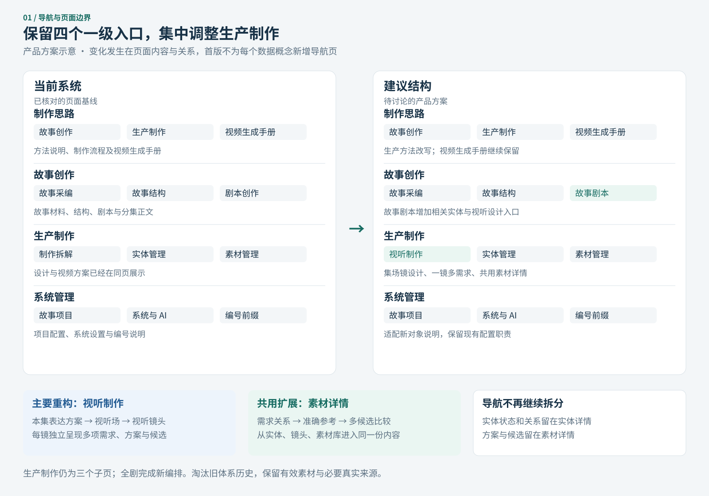
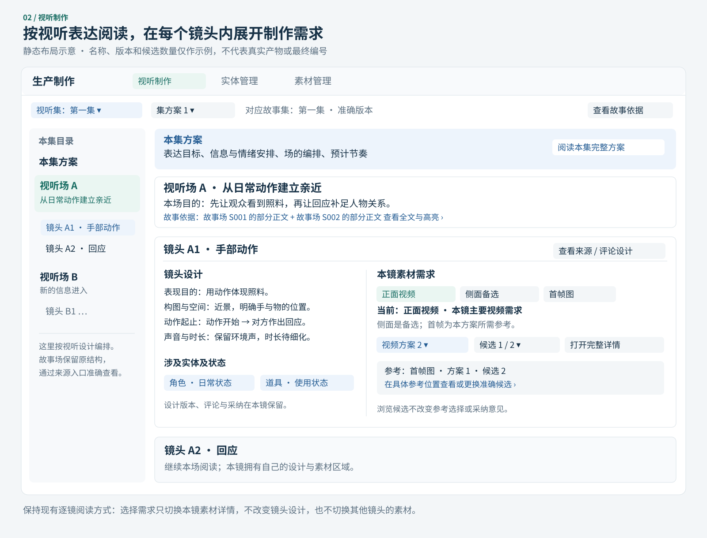
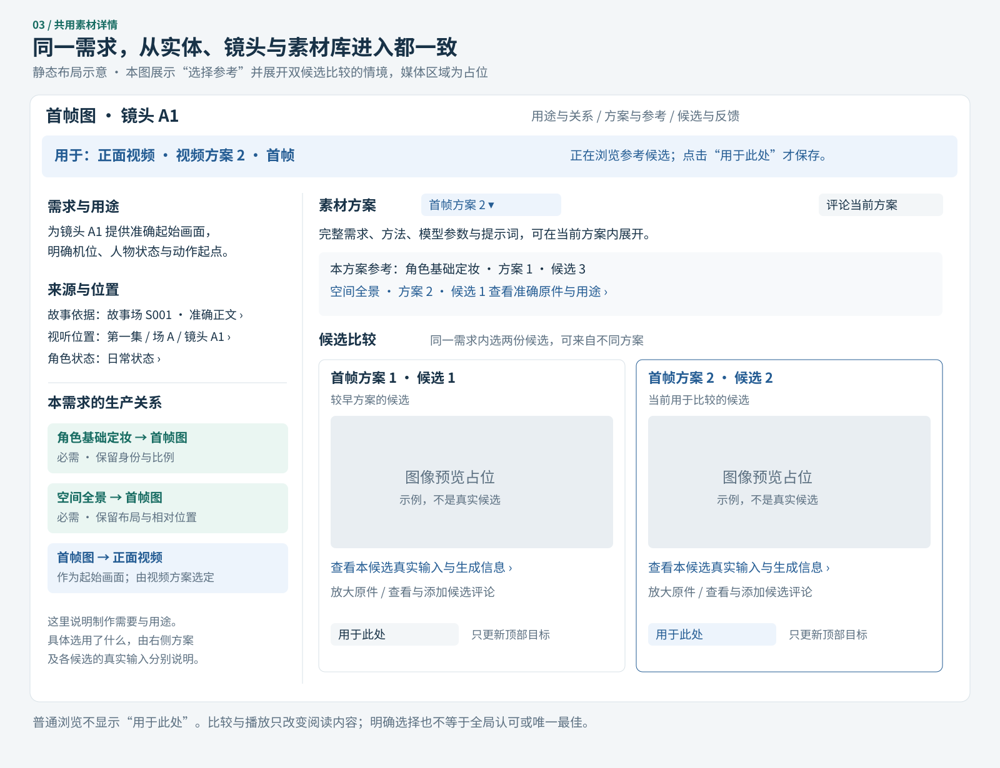

# 生产制作重构产品方案

本文把已讨论清楚的[整体数据关系](production-data-model-discussion.md)转为页面、功能和操作方案。保留现有四个一级入口，生产制作仍保留三个子页：**视听制作、实体管理、素材管理**。重构让用户从故事依据出发，分别审阅视听表达和实体设定，再沿共同的素材需求查看方案、参考和多个候选。具体工作、清理边界及验收汇总在[重构任务计划](production-structural-refactor-task.md)。

本次范围是系统完整重构及全剧视听内容重新编制，功能终点为镜头多个候选；实施任务不发起真实媒体生成。旧体系被替代的结构、方案历史及专属意见应清理，仍复用的当前实体、素材原件和必要生成来源保留。新体系继续支持正常版本与多候选。当前仍为发布前的设计与计划，尚未修改运行系统或数据；图中内容与候选数量均为布局示例。

## 阅读顺序

1. [改动总览与导航](#1-改动总览与导航)：先看哪些页面和功能要动。
2. [用户怎样完成工作](#2-用户怎样完成工作)：理解故事、实体、视听、素材之间的往返。
3. [视听制作](#3-视听制作核心重构)：本次变化最大的页面。
4. [实体管理](#4-实体管理补全来源与制作关系)：维持实体身份，展开状态及相关素材。
5. [素材管理与共用详情](#5-素材管理与共用详情)：统一需求、关系、方案、参考与候选。
6. [其他页面与共同交互](#6-其他页面与共同交互)：故事来源、评论、采纳与异常情况。
7. [功能增删与数据承接](#7-功能增删与数据承接)：明确保留什么、替换什么。
8. [实施次序与验收](#8-实施次序与验收)：先验证一条完整使用路径，再扩展覆盖。
9. [产品取舍与任务边界](#9-产品取舍与任务边界)：本次采用的范围及实施取舍。

## 1. 改动总览与导航

### 1.1 当前系统的基础与缺口

当前生产制作已经把镜头设计与视频方案放在同一页，实体和素材也已有共用卡片、准确版本、候选、参考选择和评论。因此，这次重构可以复用已有审阅能力；主要需要改变的是内容组织、关系表达和跨页面定位。

现有制作拆解仍以故事集、故事场组织镜头，集级表达方案、视听场及其拆镜逻辑缺少独立的阅读位置。素材输入已经包含上游参考，但“为什么需要这个参考”“属于哪个状态或镜头”“哪版方案实际选中了它”还需要分层表达。一镜多项独立需求也需要成为页面明确支持的日常操作。

生产页面基线经 2026-10-08 正式页面只读查看核对，并在任务收敛时对照主项目当前配置及源码更新：三个生产子页为制作拆解、实体管理、素材管理，两管理页采用四列基准行分页；制作思路已增加视频生成手册。较早文档中的独立镜头制作、组合页、三列管理布局和仅两个方法子页不作为本次基线。执行时再同步最新正式版本，来源入口见文末。

### 1.2 页面改动一览

| 当前入口／区域 | 建议调整 | 用户能多完成什么 | 改动程度 |
| --- | --- | --- | --- |
| 制作思路 → 故事创作 | 保留方法阅读，补充交给生产制作的准确故事依据 | 知道哪版故事进入制作 | 小 |
| 制作思路 → 生产制作 | 全文按新流程改写，到镜头多个候选截止 | 理解两条制作线及其共同素材关系 | 中 |
| 制作思路 → 视频生成手册 | 保留完整正文、路由和媒体；新制作方法引用其准确入口 | 在编制视频方案与 Prompt 前查用既有手册 | 小，关联回归 |
| 故事创作 → 故事采编、故事结构 | 保留当前阅读、版本和评论 | 继续提供创作上游，不重复承载生产操作 | 小，关联回归 |
| 故事创作 → 剧本创作 | 建议命名为“故事剧本”；增加当前剧／集／场的相关制作展开区 | 从故事正文找到实体、关系、状态和视听表达 | 中 |
| 生产制作 → 制作拆解 | 重构为“视听制作” | 阅读视听集方案、视听场编排、镜头设计，以及每镜多需求和候选 | 大 |
| 生产制作 → 实体管理 | 保留列表与实体大卡；统一“实体状态”，补齐来源、适用位置与素材关系 | 从对象出发组织一致的身份、状态与参考素材 | 中到大 |
| 生产制作 → 素材管理 | 保留统一素材库；扩展分组、筛选和关系阅读 | 跨实体、跨镜头寻找同一需求，识别上游及下游用途 | 大 |
| 共用素材详情 | 扩展需求关系、具体方案参考选择及候选比较 | 分清制作需要、某版选择和真实产物来源 | 大，影响多个入口 |
| 共用故事来源弹窗 | 支持一项内容引用多个准确故事场和正文范围 | 检查跨场设计与实体依据，不混淆来源 | 中 |
| 共用评论、采纳、变更复核 | 支持新视听层级和关系；显示准确对象及范围 | 在正确层级提出意见、认可方案、处理变化 | 中到大 |
| 系统管理 → 故事项目、系统与 AI | 保留配置职责，适配新术语及必要类型读取 | 继续管理实例与系统设置 | 小 |
| 系统管理 → 编号前缀 | 补充视听对象及故事／视听编号解释 | 在来源跳转和历史链接中认清对象 | 小 |

“大”表示涉及业务组织、多个页面和数据承接，“中”表示扩展已有区域及共同交互，“小”表示命名、说明或有限适配；不代表排期估算。



[单独打开导航对照图](production-product/navigation.svg)

### 1.3 建议的导航结构

```text
制作思路
  ├─ 故事创作
  ├─ 生产制作
  └─ 视频生成手册
故事创作
  ├─ 故事采编
  ├─ 故事结构
  └─ 故事剧本（原“剧本创作”）
生产制作
  ├─ 视听制作（原“制作拆解”）
  ├─ 实体管理
  └─ 素材管理
系统管理
  ├─ 故事项目
  ├─ 系统与 AI
  └─ 编号前缀
```

实体状态、实体关系、需求关系、方案版本和候选分别在相关页面中展开。首版不为每个概念增加独立导航页。生产制作的默认入口仍承接当前逐镜工作，只将组织层级和页面内容扩展为视听制作。

## 2. 用户怎样完成工作

### 2.1 从同一故事出发的两条路径

| 用户此时要判断什么 | 从哪里开始 | 阅读与操作路径 |
| --- | --- | --- |
| 这一段故事怎样表现更清楚 | 故事剧本或视听制作 | 准确故事来源 → 视听集方案 → 视听场划分与拆镜理由 → 镜头设计 → 本镜需求与候选 |
| 某个角色或空间在不同位置是否一致 | 故事剧本或实体管理 | 故事依据 → 实体及关系 → 具体实体状态 → 定妆／空间／细节等需求 → 上下游参考用途 |
| 某个素材为什么要做、目前有什么结果 | 任一素材卡或素材管理 | 制作用途与故事来源 → 需求关系 → 素材方案版本 → 准确参考与候选 |
| 上游改动后哪些内容需要复核 | 发生变更的对象或受影响方案 | 具体变化 → 有明确关联的下游 → 保留、换版或返工的审阅意见 |

两条制作路径共用实体、需求、方案和候选。从镜头打开角色定妆需求，再回到实体页，应能看到同一编号、同一方案与同一组候选。切换入口只是换一种阅读位置，不新建另一份素材。

### 2.2 保持现有分工

| 参与方 | 本方案中的职责 |
| --- | --- |
| 用户 | 阅读、评论、认可准确设计或方案；在具体参考位置选择候选；预览和比较真实产物 |
| Codex／后台制作流程 | 编制及修改视听结构、实体状态、需求与关系；维护来源；根据授权生成并登记候选 |
| 系统 | 保存身份、准确版本和意见，提供检索与跨页定位，检查引用、准备缺项及变更影响 |

前台继续以审阅和明确选择为主。视听场重排、需求增删、提示词编写和关系维护由后台进行；本次建议不顺带增加完整可视化编辑器或前台“一键生成”。是否生成、生成多少及调用额度仍按具体任务确定。

## 3. 视听制作：核心重构

### 3.1 页面组织

页面按“视听集 → 视听场 → 视听镜头”导航，故事剧集场作为来源单独展示。视听集初期沿用故事集的分集边界，但保存自己的表达方案和版本；视听场可以覆盖多个故事场，也可以只使用一场中的一部分正文。

顶部选择视听集及其准确设计版本。目录先列“本集方案”，再列本版视听场与镜头。选择本集方案时阅读整体表达与场的编排；选择视听场时连续阅读该场目的及各镜设计，选择镜头则定位到该镜。



[单独打开视听制作页面示意](production-product/audiovisual.svg)

| 层级 | 用户应读到的内容 | 可用动作 |
| --- | --- | --- |
| 视听集 | 本集表达目标、主要信息与情绪安排、视听场顺序、预计节奏、准确故事依据 | 切版本、查看依据、定位某场、评论或采纳当前设计 |
| 视听场 | 本段表达目的、为何这样拆镜、镜头顺序与承接、涉及的故事范围 | 查看完整故事场及高亮范围、定位镜头、评论或采纳当前设计 |
| 视听镜头 | 单镜目的、构图、空间、动作起止、声音、预计时长、相关实体与状态 | 查看依据与实体、评论或采纳设计、打开本镜素材需求 |

集与场的设计内容成为可以独立阅读、修订和评论的内容。新体系正常运行时，上层版本引用准确下层设计，查看一个保留版本时不能拼入最新场或镜头。名称与顺序变化保留准确定位；本次淘汰旧体系历史按第 7 节清理，不额外维护旧结构浏览。

### 3.2 每镜多需求怎样呈现

每镜继续使用自己的素材区域，不用一个会随焦点改变的全局素材侧栏。区域中列出本镜明确使用的需求，显示用途、媒体类型、方案版本数和候选数；从中选择一项，在本镜下方或共用详情中阅读该项完整内容。

例如同一镜头可以同时有“正面视频”“侧面备选”“首帧图”“手部细节”“声音参考”等需求。列表说明这些需求是全部需要、备选路线中的一项，还是仅作参考。所选需求变化时，方案与候选区域同步变化，镜头设计与阅读位置保持稳定。

默认仍突出当前镜头设计及已指定的主要视频需求；没有主要视频需求或存在多个并列需求时，以列表呈现，不自行替用户选定制作路线。其余需求始终可见可达。完整参数、提示词与参考在所选需求内展开，保持现有审阅能力。

多需求不改变镜头划分原则：不同机位若承担不同表达步骤，应建立不同视听镜头；同一表达的覆盖或备选可以是同镜不同需求。该粒度由后台内容设计和用户审阅决定。

### 3.3 本镜素材与方案参考分别阅读

“本镜素材”回答本镜明确需要或使用什么；“本方案参考”回答当前需求的当前方案具体用什么生成。角色母版可能只经首帧间接进入视频，不能因为它出现在本镜素材中，就显示成视频实际直接输入。

从方案参考进入候选时，页面明确显示目标，例如“用于：正面视频 · 方案 2 · 首帧”。用户可以浏览多份候选，点击“用于此处”才保存准确选择。间接参考显示归属的上游方案，跳转到该方案处理；当前视频页不静默改写共享首帧方案。

### 3.4 典型空态

| 情况 | 页面应表达什么 |
| --- | --- |
| 某集尚无视听方案 | 显示对应故事集和“尚未编制视听方案”，保留故事阅读；不把故事场自动当作视听场 |
| 重构准备中尚有旧镜头未完成新编排 | 只在隔离准备和核对清单中标明待处理；全剧新编排完成后才交付正式系统 |
| 镜头已有设计、尚无素材需求 | 可以评论设计，明确尚未提出需求；不铺满假定必需的媒体占位 |
| 需求已有方案、所选版本尚无候选 | 展示该版完整方案和“尚无候选”，不展示其他版本结果冒充当前产物 |
| 参考未选或原件失效 | 在具体参考位置说明缺什么、可去哪里处理；旧准确记录继续可查 |

## 4. 实体管理：补全来源与制作关系

### 4.1 列表保留，范围说清楚

保留按角色、场景空间、道具、歌曲及扩展类型分组的实体小卡、搜索、采纳筛选和四列基准行分页。状态仍在实体内部选择，不增加与实体平级的一套状态列表。

现有“所属集／场”容易混淆归属和出现，建议明确为“故事出现范围”。需要从制作位置反查时，可切换到“视听使用范围”；这两种范围根据准确出现或使用关系筛选，不用一次故事提及推断所有下游都使用该实体。实体来源本身在详情中查看。

### 4.2 共用实体大卡的变化

继续采用左侧实体内容、右侧所选素材的布局，窄屏上下排列。基础信息保持可见，切状态只切换当前状态的内容与相关需求。

| 区域 | 建议内容与交互 |
| --- | --- |
| 基础信息 | 稳定身份、完整描述、准确版本、故事依据；素材候选换版不改变实体身份 |
| 实体关系 | 继续使用已有关系图及说明；关系自己的来源、方向和适用范围可展开 |
| 实体状态 | 统一名称，保留具体状态名称、整体描述和独立版本；基础状态只是其中一种状态 |
| 故事依据／使用位置 | 分别查看依据正文、故事出现和视听使用位置；每项可以准确跳转 |
| 状态相关素材 | 展示定妆、细节、声音等明确需求；区分本状态专用与明确共用的需求 |
| 素材生产关系 | 从当前需求查看身份基准、状态外观、空间布局等上游及下游用途，进入共用素材详情 |

实体关系继续表达人物、空间、持有与使用等内容关系；素材关系表达“哪个需求为哪个需求提供什么参考”。两类关系在同一大卡中可以互相定位，但分别呈现，避免把“人物持有道具”误读为一个生成依赖。

例如角色的基础定妆与湿衣定妆可以属于不同状态需求，后者使用前者固定身份。用户能看到所保留的脸型、比例和需要改变的衣着表现；这种生产关系不要求剧情必须先展示基础定妆所代表的状态。

## 5. 素材管理与共用详情

### 5.1 一套素材库，多个阅读范围

素材管理按稳定需求组织列表；仍需复用但缺少原始方案的原件保留准确入口和已知来源，不补造历史。建议增加“按实体／按故事位置／按视听位置”的分组选择，同一时刻只展开所选维度的筛选。列表分组依赖实际关联，不把素材强制挂成单一树。

“故事位置”和“视听位置”筛选的是明确的使用或适用范围；事实来源另从详情回查。全剧共用、跨位置共用及仍有效但来源待补全的材料均有可达入口。没有新用途且无有效共享引用的旧材料按准确清单清理，不能仅凭一次筛选未命中就删除。

| 筛选或计数 | 建议口径 |
| --- | --- |
| 类型与搜索 | 保留图像、声音、视频及关键词；具体用途可在当前范围内筛选 |
| 生成结果 | 明确区分“最新方案有无候选”和“包含历史方案的有无结果”；用户切换后口径文字随之变化 |
| 准备缺项 | 可筛到尚缺定义、参考未选、原件缺失或需重新认可的需求，打开即定位具体原因 |
| 素材数 | 按稳定需求身份去重；候选与版本不会增加需求数量 |
| 展示项数 | 同一需求在多个真实分组中出现可多次展示，与唯一需求数分别表达 |
| 分页 | 沿用四列基准行，窄屏只重排当前页；不因窗口变化换一组数据 |

首版以关系清单和准确跳转支持生产判断。局部关系图可在后续增强，只展开当前需求及用户主动选择的上游／下游；不要求用户先阅读全剧素材大图才能工作。

### 5.2 共用素材详情的阅读顺序



[单独打开共用素材详情示意](production-product/material-detail.svg)

1. **这项需求是什么**：用途、输出要求、检查目标、关联实体／状态或视听位置，以及故事依据。
2. **有哪些生产关系**：需要哪些上游、为哪些下游服务，各自目的和条件是什么。
3. **正在看哪版方案**：完整需求定义、方法、模型、参数、提示词、准确参考位置及采纳情况。
4. **该版有哪些候选**：原件预览、真实输入、生成信息、反馈及实际使用记录。

上述内容复用现有素材大卡，不为实体入口、视听入口和素材库分别维护一套详情。当前版本与候选由对应选择器表达，不再额外堆叠相同状态标签。

### 5.3 需求关系怎样用普通语言显示

| 具体语境 | 关系表达示例 | 用户要能核对的内容 |
| --- | --- | --- |
| 角色 | “湿衣定妆使用基础定妆作为身份参考” | 保留脸型和比例；改变湿衣外观；适用哪个状态及哪版方案 |
| 场景空间 | “侧面机位参考全景的布局” | 空间方向、关键物件位置、允许变化的视角 |
| 道具 | “关键细节参考整体道具结构” | 哪个部位、材质与比例关系；是否需要局部原件范围 |
| 镜头 | “正面视频使用首帧图作为起始画面” | 具体机位、动作起点及选定的首帧候选 |
| 声音 | “本镜声音选段参考角色音色或歌曲演法” | 发声身份、准确片段和用途；是否实际进入视频输入 |
| 自定义关系 | “某需求为另一需求提供某项未预设的约束” | 两端、用途、保留与变化内容、适用范围；语义未明确时仅供描述 |

每条关系至少能读到对象、用途、适用范围，以及“必需／可选／条件成立时需要”。多条关系可以是全部需要，也可以是选择一条路线。页面不把所有相关项都显示为必须先生成。

关系清单表达制作计划；具体方案中的参考位置负责选择准确版本、候选、文件及局部范围；候选的真实输入负责证明当时实际用了什么。三者可沿路径跳转，展示名称和用途保持一致。

### 5.4 版本、候选与参考选择

| 用户行为 | 产品行为 |
| --- | --- |
| 切换方案版本 | 保持当前需求，切换整份方案及其候选；所选版无结果就明确显示无结果 |
| 在同版切候选 | 显示该候选原件和真实调用信息；浏览不写采用或认可 |
| 普通打开素材 | 继续优先显示有真实候选的最近方案；全部无候选时打开最新方案 |
| 从镜头设计进入当前制作方案 | 延续当前制作语境，优先当前明确版本；准确链接与手动选择始终优先 |
| 从一个具体参考位置打开 | 固定显示目标需求、目标方案和参考用途，准确已选候选优先 |
| 明确“用于此处” | 保存此目标方案中的选择，不改变该原件在别处的使用或全局评价 |
| 修改已执行方案的参考 | 建立新的方案版本；保留原方案、真实输入、旧候选和意见 |
| 选择尚无候选的上游版本 | 可以保存待选版本，但仍明确“候选未选定”，不能据此执行生成 |

建议首版提供**同一需求内的双候选比较**，可跨方案版本选两份结果。每侧标明所属方案与候选，并打开各自真实生成信息；图像可分别放大，音视频分别播放和定位评论。比较不创建剪辑时间线，不要求选出唯一“最佳候选”。精确同步播放、批量多窗评选可后续再做。

## 6. 其他页面与共同交互

### 6.1 故事剧本页：让两条来源链都可见

故事版本、集、场和正文阅读保持现有方式。建议在所选剧／集／场提供“相关制作”折叠区，包含：

- 相关实体、实体关系、实体状态，注明是故事依据、出现还是适用。
- 对应视听集、视听场和镜头，可存在一场对应多段或一段引用多场。
- 该范围内明确使用的素材需求，点击共用详情。

默认优先阅读正文，展开后按需加载关联内容。相关项没有登记时明确尚无关联；不能将“没有关联”显示成“本场不需要制作”。点击实体、状态或视听镜头时保留目标版本，返回恢复原故事场和阅读位置。

来源弹窗继续打开准确故事场的完整正文并高亮实际依据；多场来源先列准确清单，可逐场切换。换场重置高亮，避免继承上一个对象的选区。来自不同故事版本的记录明确区分，不静默统一成当前剧本。

### 6.2 评论、采纳、参考选择各自作用于什么

| 操作 | 作用范围与含义 |
| --- | --- |
| 评论集／场／镜头设计 | 绑定当时准确设计和文字；设计重排后仍可读原意见 |
| 采纳当前设计 | 明确对象层级与本次包含的准确内容；若包含子项，范围中列出准确子项版本 |
| 采纳实体内容 | 区分内容认可和完整方案认可；仍有效且含义未变的决定保留，旧内容专属决定随清理退出，实质重编不能继承旧认可 |
| 采纳素材方案 | 认可该版制作方法与要求；准备是否完整、是否获得本次调用授权分别判断 |
| 选择参考候选 | 仅确定某个方案的某个输入；不等于接受候选全部用途 |
| 评价或采用候选 | 保存对实际结果的意见，采用必须指明准确使用位置与原件范围 |

新增视听对象和需求关系使用共用评论能力。本次切换保留仍作用于有效内容且含义未变的意见，清理淘汰内容专属评论与决定；不将旧认可转给实质不同的新设计。切换后的正常修订继续记录准确意见及复核范围。

### 6.3 变更、冲突和阅读连续性

上游变化在受影响对象附近给出可展开提示：“依据有变化”“参考方案有新版”或“所选原件不可用”，并指向具体差异。是否采用新版由明确决定产生，不能自动替换下游参考。

同一需求被多处使用时，修改其共享方案可能影响多个镜头；页面应能查看这些使用位置。仅调整某镜头对原件的使用，不反向改写共享素材。保存时发现内容已经变化，保留用户选择并要求基于新内容复核，不覆盖别人刚保存的选择。

保留现有返回位置、筛选、分页、焦点和评论草稿规则。设计、方案、候选分别定位；切换后迟到响应不能覆盖当前内容。窄屏优先按“导航 → 设计 → 本镜需求 → 所选详情”顺序阅读；候选比较可上下排列，媒体保持原比例，不引入整页横向滚动。

### 6.4 制作思路和系统管理

生产制作方法改为“准确故事依据 → 实体梳理与视听设计 → 共用需求及关系 → 方案和参考 → 多候选审阅”，用同一例子贯穿。当前制作说明中的组合与成片步骤退出本轮操作指引；保留视频生成手册及已交付的其他方法入口，不复制手册正文或改写模型能力。若影视专业知识页届时已交付，同样保留并引用相关章节。

系统管理只增加新对象的必要类型、编号说明和兼容读取。故事集场编号与视听集场名称明确区分；已有实体、状态、素材和镜头的稳定编号尽量沿用。图中的“视听场 A”等仅为例名，新编号规则在技术契约阶段统一确定，不直接改写旧正文编号。

## 7. 功能增删与数据承接

### 7.1 新增、扩展和退出什么

| 类别 | 本方案中的具体变化 |
| --- | --- |
| 新增业务能力 | 视听集与视听场的独立设计和版本；故事与视听多对多映射；带语境的需求关系；同需求双候选比较 |
| 扩展已有能力 | 一镜多需求的完整操作；实体与素材的跨视角定位；多故事来源阅读；参考选择、采纳、评论和变更复核覆盖新对象 |
| 保留并复用 | 故事创作依据，仍有效的实体／状态与素材原件，必要真实生成来源及有效意见，共用卡片与播放器 |
| 替换页面组织 | “制作拆解”的故事场导航改为视听场导航；故事场通过准确来源查看；独立显示集级方案与场级拆镜逻辑 |
| 统一术语 | “完整状态／实体完整状态”统一为“实体状态”；需求、素材方案版本和素材候选各自清楚；具体状态名称照常使用 |
| 清理旧体系 | 被替代的结构、方案历史、无效关系、专属评论和采纳、无用途且无共享引用的旧原件，以及旧体系专属代码和恢复入口 |
| 退出的界面假设 | 一个故事场必然等于一个视听场；镜头制作只围绕一项视频需求展开；仅凭树中位置判断素材来源或使用 |
| 本轮继续不提供 | 剪辑、时间线、组合成片、成片导出；拍摄排期／现场管理；前台完整内容编辑器与自动批量生成 |

当前独立镜头制作和组合页面已经退役，不再重复统计。本次清理范围按第 7.2 节执行，不增加旧体系历史中心或永久双模型。保留对象的准确链接继续有效；指向淘汰对象的链接明确提示不可用，不能跳到看似相近的新对象，也不为旧链接保留整套旧数据。

### 7.2 全剧重编与旧资料清理

本次交付覆盖已确认故事剧本的全部 17 集、42 场。每集重新形成视听方案和视听场编排，所有镜头重新核对表达、动作、声音、节奏与连续性，并明确各项素材需求、关系和完整方案。旧镜头仅作为待审制作输入；最终镜数按表达需要确定，不强制保持原数。第一集可以先检验设计，但其余集不能以待编排状态结项。

| 现有内容 | 本次处理方式 |
| --- | --- |
| 创作资料、故事结构、小说、故事剧本、集场和正文 | 保留准确故事依据及故事域评论，不在本任务改写剧情 |
| 有效实体、实体关系、实体状态 | 重核故事依据、适用位置和当前内容，准确复用；不因每个视听场出现而复制对象 |
| 旧场准备、镜头编排与制作方案 | 全剧重新设计并转换需要的内容；被替代的旧结构、方案历史和无用途关系物理退出 |
| 原素材需求与参考 | 按新用途和准确证据组织；有效需求可以复用，无用途且无共享引用的旧项清理，不靠名称推断用途 |
| 仍复用的候选、原件与真实生成来源 | 保留准确字节和必要调用事实，转换为新模型可读的来源；不把新方案当作旧候选生成时的方案 |
| 旧评论、采纳、采用与复核 | 仍作用于有效内容且含义未变的保留；淘汰内容专属记录清理，不移给实质不同的新对象 |
| 无用途且无有效共享引用的旧原件 | 纳入准确删除清单，核对文件身份、引用及其他任务用途后清理 |
| 旧库、迁移对照、旧格式校验副本 | 只在本次切换和恢复验证期间临时保留；正式验收完成后清理，不建立长期旧体系档案 |
| 任务账本、Git 提交、当前发布与清理回执 | 保留工具要求的最小必要记录，不重写 Git 历史，不复制淘汰内容全文 |

清理需要覆盖正式库、当前导出、受管文件、无用途代码与说明；仅隐藏页面或标记过期不算完成。删除集合在执行时按准确基线和真实引用生成，发生并发变化时重新核对。其他任务仍有有效用途的资源先协调，不能因本任务希望清理而直接删除。

新体系继续支持后续正常方案版本、多候选和准确审阅。此次清理针对旧体系过时资料，不开放日常任意改写已执行方案的通道。缺少原始方案但仍有用途的候选保留真实缺口，不为了完整展示而补造历史。

### 7.3 实际会动到的系统范围

| 范围 | 主要工作 |
| --- | --- |
| 导航与页面组织 | 两处页面命名、视听集场镜目录、实体和素材范围选择、故事关联入口 |
| 共用审阅组件 | 需求列表、完整详情、生产关系清单、准确参考选择、候选比较、来源弹窗和评论定位 |
| 业务能力与读取 | 新视听设计、准确编排与来源、上下游需求关系、跨视角检索和准备检查 |
| 清理与恢复 | 当前有效版本和必要真实来源、淘汰对象及专属记录物理清理、新导出恢复、旧格式入口退役及缺项处理 |
| 故事侧内容流程 | 编制新视听方案、整理需求语义与故事映射、迁移本作品既有内容、更新制作方法 |

预计交付仍涉及两个独立仓库：故事主仓库保存本作品内容、流程、实例配置与迁移；主项目同级 `../story-review-desk` 保存通用页面、关系读取与审阅能力。此路径相对主项目根目录解析，两仓目标分支均为 `main`；详细仓库交付计划将在任务发布前核定。本轮文件只写当前故事草稿工作区。

## 8. 实施次序与验收

### 8.1 从契约到全剧交付

| 阶段 | 必须形成的可审阅结果 | 完成后能作出的判断 |
| --- | --- | --- |
| 一：输入与新模型 | 准确故事和有效制作基线、新对象及关系契约、全剧覆盖与清理边界 | 两条来源链、一镜多需求和真实生成来源如何统一 |
| 二：功能与全剧重编 | 通用数据能力、关键页面、全部视听设计与需求方案，先用代表集验证后覆盖全剧 | 新页面可操作，全部故事内容已进入新表达结构 |
| 三：清理与正式切换 | 精确转换／删除包、净化导出、恢复验证、真实页面验收、双仓正式交付及临时资源清理 | 新体系独立可用，旧结构及无用途历史退出 |

细化工作顺序见[任务计划](production-structural-refactor-task.md#实施计划)。本次不调用图像、音频、视频生成；系统能力使用可追溯的已有媒体和明确标注的隔离测试数据验证，不能把测试候选计为作品真实交付。

### 8.2 代表性验收场景

| 场景 | 可验证的完成标准 |
| --- | --- |
| 全剧从故事进入新制作 | 全部 17 集、42 故事场完成视听编排；各项内容有表达或有依据的处理，无未解释遗漏；最终镜数、需求数与清单一致 |
| 从故事场查看两条来源链 | 同时找到有证据的实体／关系／状态与视听设计；返回仍在原正文位置 |
| 一个视听场引用两个故事场 | 两处来源都能打开准确版本及全文高亮；不会合并或覆盖原故事场 |
| 同一实体在多场使用 | 从各入口进入同一有效实体，需求与候选身份一致，不重复建状态或素材 |
| 同镜正面视频、侧面备选与首帧 | 三项需求分别切方案和候选，明确全部需要或备选；首帧有图不表示视频已生成 |
| 基础定妆 → 状态定妆 → 首帧 → 视频 | 用途和具体参考归属正确；直接输入与间接依赖分别可查 |
| 同需求两版、多候选 | 无结果版不显示旧结果；两份候选可比较，各自原件和真实来源正确 |
| 缺项、变化与自定义关系 | 上游换版不自动替换下游；原件失效和所选路线循环准确阻断；未知自定义语义不自动执行 |
| 旧体系清理 | 淘汰结构、方案历史及专属记录在库、导出和当前交付中物理退出；无永久双模型或旧历史入口，保留项有实际用途 |
| 保留媒体与意见 | 原件字节及必要生成事实一致；保留意见仍准确绑定当前有效内容，不转给实质不同的新设计 |
| 桌面、窄屏及返回 | 来源弹窗、卡片、版本、候选、媒体与评论实际可操作；阅读位置与草稿不丢失 |
| 导出及空实例恢复 | 新对象、有效关系、必要真实来源和原件可恢复，淘汰旧内容不复活；最终旧回退副本按已结束用途清理 |

上述是系统实施的验收要求，本轮尚未执行。详细的全量、故障恢复、浏览器与交付标准以[任务计划](production-structural-refactor-task.md#完成标准)为准。

## 9. 产品取舍与任务边界

| 取舍 | 本次方案 | 对范围的影响 |
| --- | --- | --- |
| 生产入口 | 保留三个子页，以“视听制作”替换制作拆解 | 全剧视听集场镜成为组织主体，实体与素材独立可达 |
| 前台操作 | 审阅、评论、采纳、准确参考选择和双候选比较 | 内容与关系编制由后台完成，不增加完整编辑器 |
| 需求关系 | 首版清单和准确跳转完整实现，局部关系图作为后续增强 | 优先覆盖角色、空间、道具、镜头等具体制作判断 |
| 内容范围 | 全剧各集重新编制视听集、场、镜头与素材需求 | 第一集只作为过程检验，结项不能留下其余集待编排 |
| 历史处理 | 清理被替代的旧结构、方案历史及专属意见，保留仍复用的当前内容和必要真实来源 | 正式交付使用新体系，不建立长期旧数据兼容和档案 |
| 实际生成 | 本次不发起媒体生成调用 | 完成制作方案和候选管理能力，不以测试候选冒充真实交付 |
| 旧优化任务 | 本任务优先，用户自行取消 `task-20261008-0003` | 本任务不依赖该任务，不按旧模型先做一轮全剧优化 |

全部发布字段、两仓范围、优先级、复杂度和任务间并行属性在[任务计划](production-structural-refactor-task.md)中统一确认；任务账本继续是发布、执行和完成状态的唯一权威。

## 依据与阅读边界

- [整体数据关系讨论稿](production-data-model-discussion.md)：本方案的概念依据，包含实体状态、共同故事来源及语境化需求关系。
- [当前生产制作入口交付](../production/README.md)：设计与视频方案的合并、旧入口兼容及组合页退役。
- [当前实体与素材管理交付](../production/README.md)：四列基准行分页和共用卡片。
- 主项目当前 `config/instance.json` 固定通用系统提交 `e39434ff6675c160ed65c883d83a23c6a16adebb`，任务收敛时已核对系统源仓 HEAD 一致，视频生成手册已交付；草稿自身配置仍为讨论初期版本，执行时重新同步正式基线。先前只读页面观察用于确认生产入口和现有操作，不代表新方案验收。
- 系统源码及契约入口相对 `../story-review-desk` 仓库根目录：`review_desk/static/navigation.js`、`review_desk/static/production-breakdown.js`、`docs/production-breakdown.md`、`docs/materials-and-relationships.md`、`docs/material-versions.md`、`docs/generation-preparation.md`。较早文档的旧分页、旧导航和导出版本按当前实现及实例交付核对。

图示是静态产品布局，使用 SVG 便于外部工具查看；控件不具备真实操作能力。视觉样式、精确尺寸和新编号不是本次已经确定的实施契约。
