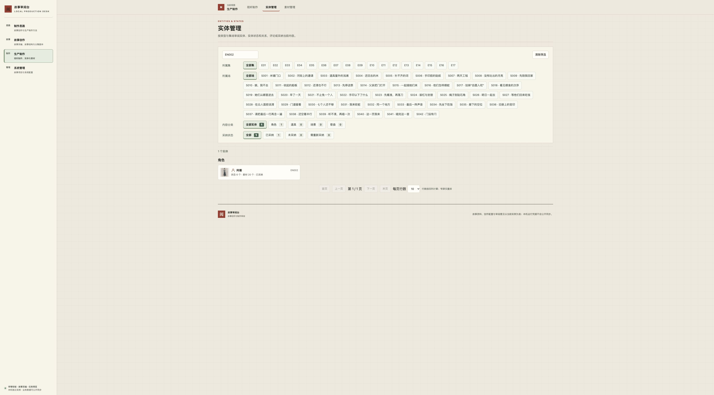

# 整体采纳后关闭卡片的列表同步

本任务修复实体整体采纳或取消成功后，立即关闭详情仍留下旧小卡、采纳计数和筛选结果的问题。它承接 task-20261009-0009 的结项残留，不改写原任务历史，也不改变采纳范围、判断优先规则或单版方案与整体许可的独立性。准确系统身份见 `../../config/instance.json`；双仓交付、正式切换与结项以 task-20261009-0018 的唯一任务账本及冻结发布回执为准。

## 从原问题到可继续审阅的列表

执行先合入最新双仓主干，以正式 SQLite 的一致性备份建立本任务隔离实例。在真实 Chrome 中搜索 EN002、打开阿蘅、点击采纳并紧接关闭，出现“采纳已保存”，但列表仍是“已采纳 0／未采纳 1”。服务端准确回读为决定版本 1、可取消采纳，证实保存与列表不同步。随后主动重开撤回，再采纳并等待按钮变为“取消采纳”后关闭，列表自动成为“已采纳 1／未采纳 0”，完成正常对照。历史输入 JPEG 仅用来对照布局，未用作本轮实操证据。

原详情守卫原本同时阻止了外层列表刷新。最小候选把两者分开：成功决定刷新提交时所属的有效列表；详情只有仍属于原卡时才更新。列表按响应到达时的当前筛选显示，并拒绝晚到旧读取，沿合法分页规则保留页码或收敛。详情读取跨过已确认的实体决定时最多重读一次，持续变化则要求主动核对，不重发写入。

第一次候选只刷新页面仍看到旧行为；请求记录证明浏览器使用了服务启动时缓存的旧合成脚本。重启本任务隔离服务、确认新脚本后重走路径，采纳和取消立即关卡均自动同步。随后补足仍有效的小卡及筛选焦点保护，并区分明确未保存、版本冲突和结果待确认。保存成功但列表读取失败时，提示保存事实与显示尚未更新，并提供“重新读取列表”，不把读取失败解释为回滚。

阶段保存后再次吸收主干的相邻镜头阅读改动，复验共用导航与全部前端检查。合入后的准确候选再次完成采纳立即关闭及等待取消完成再关闭。前者列表成为已采纳 1／未采纳 0，刷新前已一致；后者正常回到未采纳。下图是合入后候选的真实页面，截图本身不证明毫秒时序。

## 真实浏览器观察

- 采纳、取消后立即关卡：列表在服务端重读完成后自动同步，关闭的卡片没有被响应重新打开；主动重开可查当前准确决定、理由与历史。
- 取消后立即关卡并搜索 EN012、打开李寄：保持 EN012 和李寄内容，旧成功没有替换新卡或恢复 EN002 搜索。
- 在 EN002 的“未采纳”筛选中采纳并立即关闭：筛选保持选中，已采纳 1／未采纳 0，结果自动变为 0 个实体。切换到已采纳再打开阿蘅，显示当前认可及整体决定历史。
- 保存取消后立即关闭并进入故事采编：保持新页面正文与 URL。主动返回实体管理，依据有效数据显示已采纳筛选下 0 个实体、未采纳 1，详情也重新读取当前状态。
- 所有功能决定仅在任务隔离库形成；每次真实点击保存的决定版本递增一次，准确历史与回读随过程保存，没有导入正式库。自然可达路径使用 Chrome；未对真实网络故障或每种素材版本组合逐一人工操作。

## 回归范围、缺陷分析、用例与验证

范围限于整体决定共同保存回调、实体管理索引与实体详情返回。主要缺陷是详情关闭检查误挡列表刷新，以及多个列表响应缺少顺序保护。新增检查先在旧实现稳定失败，再用相同正确期望验证修复；未放宽断言来通过。

有限受控响应覆盖采纳／取消早关卡、详情读取失败仍刷新列表、旧回调不调用替换页面、索引逆序、当前筛选与分页、离页再返回、列表读取失败、详情读跨过决定、连续变化的有界重读、400／409、响应未知与单次写入。它们属于模拟时序，不代替真实浏览器。已有回归继续检查准确范围与版本、旧详情防迟到、素材版本／候选保留、草稿、历史修订和阅读位置。

合入最新主干后的前端 `node --test tests/*.test.cjs` 为 724 项通过；实体相关服务端检查 `python3 -m unittest discover -s tests -p 'test_entity*.py' -v` 为 21 项通过。Node 命令有 300 秒外层超时。测试生成使用现有 Node 框架，不增测试依赖；技能要求的 `utree flush` 已执行尝试，本机缺少该命令，未声称其报告落盘成功。

## 准确交付与回查

发布只切换系统代码和实例准确引用，不导入任务测试决定、不用快照覆盖活库。最终镜像隔离写验收与正式服务镜像、源码摘要及实例提交引用逐项对应；正式原入口 `http://127.0.0.1:3000/` 只读复验。最终运行与业务保护结果保存在本机冻结包及完成回执，Git 推送本身不代表正式验收完成。

过程记录归本任务 `.runtime/acceptance-return/`；发布与恢复材料归本任务冻结包和正式 `.runtime/service-releases/`。结项清理以实际 ID、路径和回读记录为准：移除无用途的预览服务、容器、测试库、缓存、重复导出和技能临时目录，保留必要实操截图、准确回读、测试日志及冻结发布／恢复资料。会话占用的双仓工作区在退出、释放锁后由受管清理入口退役，分支和会话历史保留。
