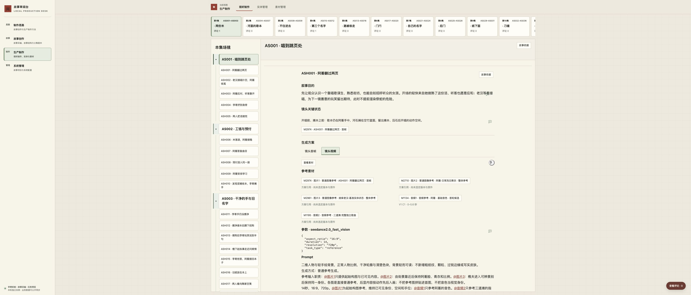

# task-20261010-0016 · 视听三部分候选验收

本任务解决镜卡叠加动作对白、共同条件、历史采纳和生成细节，使读者难以判断“这一镜为什么存在、先准备什么、怎样制作”的问题。候选覆盖17集、65个视听场、344镜；没有重排镜头、修改锁定剧本或发起媒体生成。

本记录是执行者的隔离验收。双仓候选吸收 task-0015 的共用卡／帮助和 task-0017 的评论浮窗；准确提交以实例配置与任务账本为准。正式数据库、3000服务和VPS均未应用本候选，独立Review未执行。

## 从具体镜头判断变化

- ASH001 原“先摊本压石再唱……”是动作安排。现在说明阿蘅做熟唱活的轻快、街坊愿意应和及老汉接唱的期待，不提前渲染祭蛇。状态只有“开唱前、摊本之前”，复用 M2974，翻页镜尾不制造第二项；M2973只作上游参考。视频保留执行时5项准确输入，未照抄旧截图4项。
- ASH002 让观众接住熟客错拍的玩笑；ASH003 把玩笑落回招徕客人的工作；ASH004 同时显露李寄的急劲与阿蘅护纸；ASH005 用互相打趣建立亲密，给随后生计压力作对照。ASH015 同时呈现保护心与被占据的回答权，不预先裁判谁全对。
- ASH080 先把抽象威胁落到观众认识的人，再让名字后的一拍闷鼓传递震动。转牌前M3211与转正后M4082平铺，后者仍为ZIP字层工程。ASH052同一时间起点关联首帧及“十来天后”字层，不重复建两个状态。

[改造前页面](evidence/before-ash001.jpg)、[用户三张原始截图](../../planning/audiovisual-three-part-review/README.md)用于比较原问题；它们不承担当前准确引用证明。

## 逐集完成范围

准确故事为 `production/source-lock.json` 锁定的版本四；输入 `imports/screenplay-04.json` SHA256 为 `c428946554029be05f119eae0ecefeb5bbc6501115db5d096c007ebe0af12f3d`。每集先读完整场次和既有镜序，再编写目的、核状态及上下镜；JSON的 `reading.stage` 记录具体判断，Markdown为干净阅读投影。先在ASH001／080隔离样本验证页面、准备和空恢复，随后完成1—4集，再逐集完成5—17集；没有脚本生成叙事句式。

| 集 | 镜数 | 阅读与修订关注点 |
| --- | ---: | --- |
| [01](../audiovisual/e01.md) | 20 | 本集20镜逐场完成；连读ASH001—005、ASH014—019，区分熟客玩笑、劳动所得、预付承诺与回答权。起点均有既存首帧需求，未为镜尾另造状态。 |
| [02](../audiovisual/e02.md) | 22 | 完整读本集s003、s004及22镜；连读抛本的主动选择、两次试唱、退预付与岔口争执，区分补救、体谅和原谅。旧纸揭字有独立工程，其余镜尾不另造需求。 |
| [03](../audiovisual/e03.md) | 19 | 完整读s005、s006及19镜；以不猜缺词、先问再帮、拒住庙和亲记两升形成变化线。5字留白、时间字幕、两升记工分别回查既有工程，未将借据尚未揭露的供奉条款提前写入。 |
| [04](../audiovisual/e04.md) | 20 | 完整读s007、s008及20镜；连读日工记账与照护约束，再读庙会劳动—借结露牌边—锣停戏—举牌—转正揭名—受注视。ASH080沿已实操的两状态保留准确材料，声音闷鼓没有改成配乐。 |
| [05](../audiovisual/e05.md) | 24 | 完整读s009—s013及24镜；按护退、母女拒绝、逃船失败、还粮失败、应募条件连读。确立抢牌额伤起点，区分观察证据与写名猜测、暂停送人与永久禁祭。 |
| [06](../audiovisual/e06.md) | 19 | 完整读s014、s015及19镜，区分唯一明确回忆与当前行动；连读门闩、缺口碗、母亲异议、父亲有限步骤，再逐项核对背病人接触顺序与托药罐不夺取。 |
| [07](../audiovisual/e07.md) | 21 | 完整读s016—017及21镜；连读夜间设想、换纸、免祭、读回与查账，逐项区分应募纸和免祭纸、暂缓索人与永久禁祭、支持发言与替人发言。 |
| [08](../audiovisual/e08.md) | 20 | 完整读s018—019及20镜；按先识空间、完整喂食、证词转义、外侧设想四场连读；核明成人与女孩视野不同、两门互锁、一次撞击和完全落底声，未扩写遇害回忆或未来成功。 |
| [09](../audiovisual/e09.md) | 20 | 完整读s020—022及20镜；顺读掌柜迟疑、原抄分管、县丞自认未查、先禁索人后批改造、逐步揭纸与证据留存；没有将疑点写成已判定责任。 |
| [10](../audiovisual/e10.md) | 20 | 完整读s023—025及20镜；逐场核施工隔离、第一次失手立即停、再找缝才命中、重刀仍难握、封院封册；陶伯三镜连读保留给予帮助但未原谅的距离。 |
| [11](../audiovisual/e11.md) | 18 | 完整读s026—027及18镜；证词真假边界与收单链分清，桌上排演逐条件连读退路；核狗留家、母亲数碗停顿、夜灯与清晨未点旧灯，不借灯光提前赋予胜利。 |
| [12](../audiovisual/e12.md) | 18 | 完整读s028—029及18镜；连读公开拒绝、三册交接、底账反证、后院逐项准备与声音等待；核原据不回阿蘅手中、七杠手和刀位分开、灯未点、掌心举起只是暂停。 |
| [13](../audiovisual/e13.md) | 19 | 完整读s030—031及19镜；按落闸异常、父亲完整绕行补位、卸肩失败、前院呼援受阻、两次退缩、重用练习和浅伤连读；人数由七变八后保持四西四东，前门始终闭牢。 |
| [14](../audiovisual/e14.md) | 21 | 完整读s032—033及21镜；逐动作回读抽刀与退脚、碰石停手、反复共同承压、斩断后等待、多人确认再卸；四组情绪分别给疲惫成人、阿蘅、消息传递和父女，门始终未开。 |
| [15](../audiovisual/e15.md) | 22 | 完整读s034—036及22镜；连读归家饭桌与遗物认领，分别保留幸存者温暖和家属不可补偿之失；核送单、认笔迹是两人，县丞新功不抵旧批文责任，结尾只是移交调查。 |
| [16](../audiovisual/e16.md) | 18 | 完整读s037—039及18镜；依原剧本区分二十多天后复查、押赴待决与行刑、历次还粮加唱工超六斗；连读选择陪问、听断处、核认字、独立唱完，正确词到本集才补齐。 |
| [17](../audiovisual/e17.md) | 23 | 完整读s040—042及23镜；换手、逐句等待、装订试翻、交还主人连读；一个多月后独立演唱两段与夜路分别核对，歌本和旧灯逐次交接，不压缩完整歌、不把生活写成功勋颂歌。 |

[完整覆盖审计](evidence/coverage.json)核对42个故事场、1,114块锁定正文均被准确覆盖，344镜身份和顺序保持。699项产物为344首帧、344视频和11项既有工程；不是新增699项需求。6,344秒是原方案预留时长，不是实片时长。叙事审阅是执行者判断，自动覆盖不能证明叙事或声画质量。

## 页面实操

Chrome实操使用本任务独立实例；没有连接正式库。所有截图均来自真实页面。

| 路径 | 实际结果与证据 |
| --- | --- |
| ASH001首帧→视频 | 初入首帧，视频5项输入、14秒／720p和完整原Prompt可直接读；[首帧](evidence/final-ash001-first-frame.jpg)、[视频](evidence/final-ash001-video.jpg)。 |
| ASH080状态→工程→返回 | 两状态同时可读，打开准确M4082 ZIP，关闭回到原镜的工程Tab；[状态](evidence/final-ash080-states.jpg)、[工程](evidence/final-ash080-project.jpg)。 |
| 一个状态多个需求 | ASH052首帧与时间字层在同一状态下，保持各自准确需求；[页面](evidence/final-one-state-many-needs.jpg)。 |
| 没有独立状态／仅视频／无产物 | 明确非作品夹具验证不造首帧和空状态，仅视频只有一个Tab，无产物给空态；[页面](evidence/fixture-only-video-empty.jpg)。 |
| 方案切版／旧版缺失 | 隔离夹具V3输入A、模型3、参数3与Prompt3；V2同步为输入B／2；删除夹具V1的两处准确定义后显示“此版本未保留准确生成方案”，未借最新版；[缺失页](evidence/fixture-missing-history.jpg)、[逐项读回](evidence/browser-checks.json)。 |
| 图像与音频 | M1133历史原件2016×2688实际加载。修复“当前作品默认状态覆盖准确历史素材状态”后保持M1133，而非未生成M2710；[图像](evidence/final-image-original.jpg)。M1134准确WAV的0—5.6秒实际播放并在5.6秒停住，媒体无错误；[选段](evidence/final-audio-range.jpg)。 |
| 准确反馈 | 目的圈选保存、刷新、关闭、重开成功；M3211两段说明跨段拖选后保存、关闭、刷新、重开及定位保留两个端点；[目的](evidence/final-comment-reopened.jpg)、[跨段](evidence/final-cross-paragraph-reopened.jpg)、[准确锚点及事件](evidence/comment-roundtrip.json)。两条测试意见未进入交付库。 |
| 集场当前说明 | 300ms不显示、约1100ms显示、移入可读、离开关闭、键盘聚焦可读；切至第4集显示“借结—揭名”的当前说明，未串第1集。计时读回见[记录](evidence/sample-hover.json)。 |
| 共用帮助 | “？”在查看素材旁打开准确方案标准，无第四部分；镜卡未恢复用途意见、旧格式框或设计采纳。 |

音频播放只证明播放器与准确片段可用；本任务未对音色、歌唱、镜头视频或工程合成的实际效果作认可。没有当前作品镜头视频可据以声画验收。

## 物理删除与保全

[准确迁移包](migration.json) SHA256：`5444d3d0b93c70947136901f513945c6e824ae6251b63fe30dfa0e3461308da4`。它从初始隔离副本检查准确头、说明etag、历史及最新评论，并在同一事务中追加430份新式组成修订、清除旧专属正文、删除独占设计决定、写入82份当前说明。430包含样本阶段已实际保存的4份中间修订；有效当前对象仍为426个。

| 删除对象 | 实际数量／范围 |
| --- | --- |
| 旧视听集专属正文 | 77份修订，删除旧目的、结构、节奏和共同条件类字段／块，保留准确组成。 |
| 旧视听场专属正文 | 273份修订，同样清除专属说明，不删除场镜组成身份。 |
| 旧视听镜专属正文 | 1,418份修订，删除旧目的、动作起止、摄影／剪辑／声音条件、作者映射等独占副本。新目的和状态以新修订出现。 |
| 视听语境的关系解释 | 18,900份修订，删除purpose／preserve／change／check、旧标题及正文副本；身份、端点、路线和依赖保留。 |
| 独占设计采纳 | 执行时核对仍为ASH001一个决定对象的4份认可／撤回修订，实际删除。 |
| 编制及配置 | 删除 `shot-contexts.json`，17集旧格式Markdown改为当前三部分稿；撤去148个失效阅读映射；编制、模板、写入和恢复不再要求旧字段。 |

合计20,668份历史载荷移除专属文字，4份决定修订删除。为定位真实CALL而保留的历史修订只存准确身份和可执行事实；清理凭据只有摘要、字段名和事实校验，不藏被删正文。尚在真实Prompt中服务摄影／声音的文字继续留在原Prompt。不能用全文关键词删除把这些真实输入一并抹掉。

[第二独立副本保全核对](evidence/preservation.json)用SQLite双向集合比较验证全部无关表：272条原评论、301条事件，6,397份需求、656份CALL、336份ASSET及真实文件内容保持；原素材定义、版本／候选、依赖、采用与判断不变。再次应用同一清单返回[已执行](evidence/migration-retry.json)，不重复清除；并发新评论、目标推进或凭据篡改拒绝。

[准备结果](evidence/sample-preparation.json)仍阻断未获素材方案认可、未选版本／候选或缺方案的需求，已取消的场／镜设计采纳不再成为前提。没有自动认可旧原件或发起付费调用。

## 方法与后续使用

`method.skill.audiovisual-scene`追加V5，并以新绑定显式获取；[绑定证据](evidence/method-binding.json)保存准确新旧引用，冻结V4执行未改。新执行用于对本次已编稿的复核，五阶段的[实际输出](evidence/method-review.json)依次保存理解、原则、设计、交接及审阅；不声称这些记录早于初稿，也不把执行记录等同于模型内部理解。

当前作者入口、模板和准确包见[视听README](../audiovisual/README.md)、[方法协议](../managed-methods.md)及 `content/managed-method-registry.json`。正式应用须在新的授权和独占写入窗口重查当前基线，分别核方法配置包与视听迁移包；若其后已有内容／评论变化，应重新准备相容候选，不用完整导出覆盖活库。

## 完整恢复与验证

完整 Schema 10 导出实际恢复到新空实例：[恢复回执](evidence/final-restore.json)包含9,466个对象、31,520份修订、272条原评论和1,020个已核验文件。恢复时使用本次最终审阅台代码，准确提交为 `23defa1b4f8b2b07344d754c90effa0b83a1b38d`；故事配置已绑定该提交。完整清单 SHA256 为 `d63d4ff55f9fa9520f44daa4a7f9b30c27cbe5c4162eae89fbc71144c0d3b094`。

[恢复后的逐表核对](evidence/restored-contracts.json)确认426个当前视听对象、82份工作稿和20,668条清理凭据完整；旧专属正文、独占设计决定残留均为0，外键检查无错误。原评论、事件、需求、CALL、ASSET、判断、素材版本／候选、归档和发布凭据与交付前逐项相同。新空实例重新准备方法执行取得V5与准确新绑定；从恢复后的SKILL入口直接阅读模板以及本次选用的叙事、表演章节到末尾，冻结V4内容保持。

自动检查结果见[测试摘要](evidence/tests.json)：审阅台Python 514项、浏览器逻辑Node 876项通过；故事Python共251项，其中250项通过、1项原有跳过。准确参考专项13项也通过，与全套存在重叠，不重复累加。最终清单再次校验返回已执行，未重复删除。上述检查验证数据与交互契约，叙事判断以逐集连读、页面体验以实际浏览器操作为依据。

## 过程资源

预览服务和两个浏览器测试标签已关闭。核对任务账本、容器挂载、发布／恢复引用与打开文件后，删除本任务5个隔离实例及方法导出、临时脚本、重复包，共3,195个文件（其中8个SQLite数据库，逻辑大小约4.70GB）、52个目录，并删除4份外部测试日志；目录与日志路径回读均不存在。没有创建任务容器或镜像；共享服务未停止。准确范围见[清理回执](evidence/cleanup.json)。

仍保留2个受管worktree，因为当前TUI和清理锁仍使用它们。责任人为本任务执行者；退出会话释放锁后，沿 `codex.project task cleanup` 整组退役，保留Git分支、提交与会话历史。正式运行和恢复不依赖这些临时实例。完整导出、准确迁移与方法包、逐集稿、必要截图和精简核对结果随候选保留，用于后续独立审阅及获授权后的正式应用。
