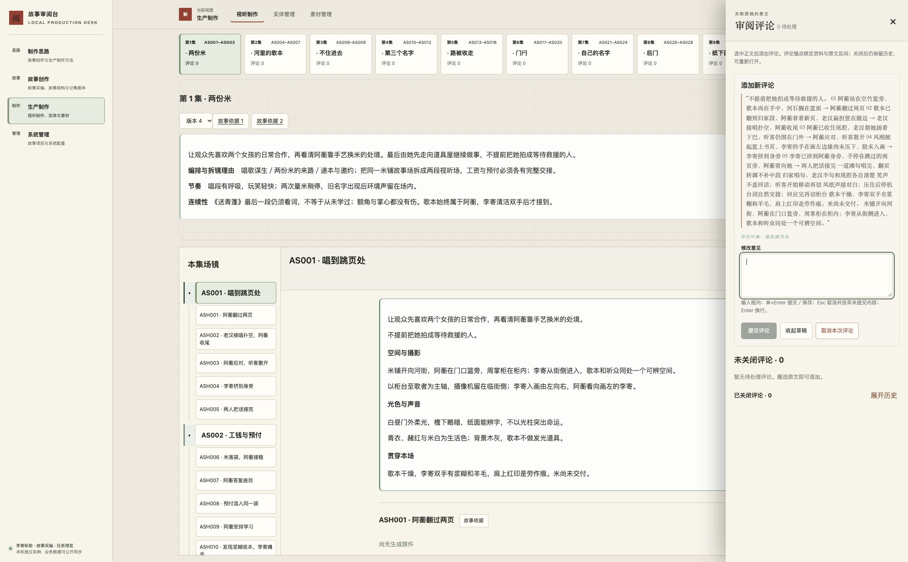
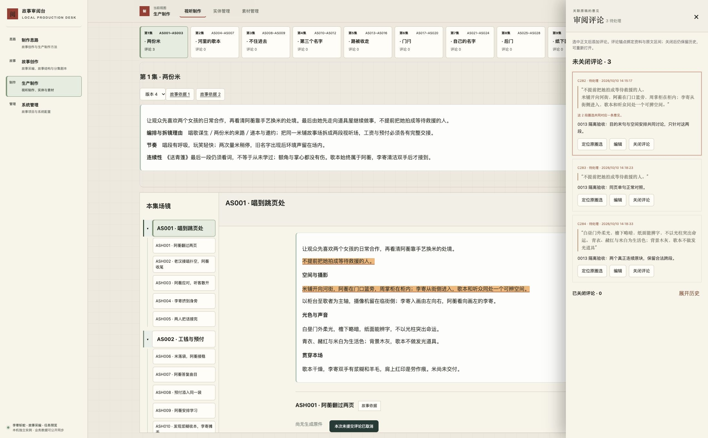

# task-20261010-0013：组合阅读跨段准确反馈验收

本任务修复 AS001 中“实际只选两段，评论却带入中间隐藏原文”的问题。同一次可见圈选现在对应一条意见、两段准确原文，预览、保存、刷新、重开和定位一致；组合阅读与真正连续跨段仍保留。以下为执行者在自有隔离实例的验收，Git 交付由主项目任务账本记录；本任务没有部署或正式业务写入授权，根 Review 对修后候选的独立复验仍待执行。

## 相同圈选的前后结果

执行者使用已连接 Chrome，在自有 `127.0.0.1:51094` 的 AS001 页面真实鼠标拖选目的末句至空间段，点击“添加评论”。修改前后均经过页面标题“空间与摄影”，选中正文相同：

> 不提前把她拍成等待救援的人。
>
> 米铺开向河街，阿蘅在门口篮旁，周掌柜在柜内；李寄从街侧进入，歌本和听众同处一个可辨空间。

修改前草稿把源顺序中未显示的五镜拆镜、五条节奏和连续性夹入两句之间，引文共 363 个 Unicode 字符。错误草稿取消，未保存。修改后引文只有上述两句及一个分隔换行，共 59 个字符；页面标题属于阅读结构，不冒充原文。逐段为 `purpose [45,59)` 与 `@review/spatial [0,44)`，共 58 个源字符，均绑定下列同一对象及准确修订：

`av-e01-a01@91b490a1a6f6b6a8448acbd939cc7b8e64ebf77e350ca85ef660392b2cd1f9ce`

源文没有删改。连续锚点无法表示本例的空缺，因而在既有文字锚点中增加可选 `segments`，记录各段原块与字符范围；两段共同讨论仍保存为一条意见，不拆成用户未提出的多条意见。真正连续的原块沿用原格式。服务端逐段核对准确原文、拒绝重叠，并核对整体引文；覆盖和高亮只使用实际分段，不使用首尾包络纳入隐藏内容。共用契约见 desk 仓库 `docs/comment-checklist.md`。

原生圈选及引文记录见 [修改前](before-cross.json)、[同页单句正常对照](before-single.json)、[最终圈选与两段高亮](final-cross.json)。本例直接证明错误扩大引用被消除，未测量或推算时间、点击次数或全站收益。

## 真实页面操作与兼容结果

| 操作 | 实测结果与证据 |
| --- | --- |
| AS001 两段共同意见 | 页面保存 C282，刷新后定位两段原文；关闭意见再重开，状态为 OPEN、版本 3。关闭验收标签并重新打开后同一意见仍可读。见 [重开与定位](after-reopened.json)、[持久化准确锚点](saved-comments.json)。 |
| 未提交双段草稿 | AS001 → AS002 → AS001 后保留同一准确草稿、意见文本及组合阅读；最终前端资源重新圈选仍恢复原草稿键。验收结束主动取消。见 [返回记录](draft-return.json)、[最终记录](final-cross.json)。 |
| 单句和真正连续的两个原块 | 同页目的单句保存 C283；光色两原块保存 C284，引用与实际选择一致，未补选未圈入的末标点。C284 未保存编辑往返后仍保留引文与组合正文，随后 Escape 取消修改，已保存内容不变。见 [单句](single-after.json)、[连续跨块](continuous-production.json)、[连续草稿往返](continuous-draft-return.json)。 |
| 共同函数的其他阅读路径 | 故事采编白话直译两个相邻原段保存 C285，故事结构第 10 稿两个原块保存 C286，均由真实鼠标圈选、页面提交并定位。见 [采编](continuous-source.json)、[结构](continuous-structure.json)。 |
| 跨对象、跨修订边界 | 真实拖选 ASH001 环境声至 ASH002 演唱，跨两个准确对象与不同修订；添加评论按钮未出现，没有提交。见 [越界拒绝](cross-object-rejected.json)。 |
| 既有历史文字意见 | C052 回到结构第 1 稿 `characters-02 [24,44)`，原句 `缺点是把“来不及”当作先替朋友决定的理由` 按原字节高亮；未编辑历史意见。准确引文及修订见 [历史定位](historical-structure.json)。 |
| 0011 准确调用记录文字定位 | CALL 指真实生成调用记录。在隔离库通过 API 准备 C287 对照，页面打开准确旧调用修订、读取原件参数和输入、点击定位，`@review/call/prompt [1375,1409)` 的 34 字符原句准确高亮。此项是“API 准备、页面定位”，不是鼠标创建。见 [准备](call-control.json)、[定位](call-located.json)。 |

评论仍在已有侧栏提交和定位，正文保持组合连续阅读，原件及人工判断直接可读，没有新增管理页或 Review 折叠。需要回原文的分段意见只呈现准确片段；不默认塞回整篇旧原稿。历史连续锚点与省略 `type` 的旧文字锚点保持兼容，已有意见不自动重绑或改写。

## 自动回归及实际边界

最终 JavaScript 资源摘要为 `42c6b6b63f82feb7780aba4bb0d22f869109c54e963756170742cdfbaa9bcc6e`；真实页面和最终浏览器边界夹具均已重启服务后读取此资源。

- `node --test tests/*.test.cjs`：881 通过、0 失败，见 [Node 日志](node.log)。包含同块省略、跨隐藏块、组合重排、只高亮实际分段、场范围计数及图像区域／音频时间范围的既有契约。
- `PYTHONPATH=.:tests python3 -m unittest test_composed_selection test_review test_structure test_polish_context test_review_composition test_production -v`：45 通过，见 [Python 日志](python.log)。包括分段逐段校验、保存、关闭重开、导出恢复、历史引用与错误对象／修订拒绝。
- `PYTHONPATH=.:tests python3 -m unittest test_production_api test_comment_review test_polish_revision_http -v`：8 通过，见 [HTTP 日志](python-http.log)。
- Chrome 最终 `/selection-tests#boundaries-only`：24 通过、0 失败，见 [边界记录](browser-boundaries-final.txt)。覆盖同块空缺、不同块空缺、重排、隐藏节点、Unicode 补充平面字符的半字符边界。夹具构造选区只证明确定性边界，不替代上述真实鼠标操作。

综合浏览器夹具为 38 通过、3 失败；未修改的 `0ad376bd…` 在同条件下为 34 通过、同样 3 失败。分别是结构长段落定位可视范围、制作思路往返阅读位置、制作思路 Tab 与浏览器历史同步。见 [当前完整结果](browser-regression.txt)、[原基线结果](browser-baseline.txt)。本任务未修这三个既有夹具／导航问题，不能将综合夹具写成全部通过；本例 AS001 实际定位和往返结果单独保留。

图像区域和音频时间范围通过现有自动回归，未在本任务重新完成媒体交互全路径或作品效果看听验收。跨对象、跨修订、重叠片段及非正文选择仍拒绝。没有按相似文本重绑的回退路径。

## 数据、候选与复验入口

执行开始、阶段保存及最终候选前均查询两仓 main/upstream。最后一次 fetch 后 primary 仍为 `d922a0b1de9079741860b4dddf82d08201fbab62`，desk 仍为 `0ad376bd1cefeb2d71b8cbd418bb22a943b22b3d`，均已包含在任务分支中，没有新的主干交叉需合并。0014 在独立工作区并行；其 `screenplay.js` 改动与本任务场评论范围计算位于不同函数，未写入其工作区或运行资源。后续精确候选及远端回读以唯一任务账本的逐仓集成回执为准。

desk 已验证提交为 `499424c7dcdb270b90e7ec02c32b4d224278fbe9`。primary 在 `config/instance.json.review_desk_commit` 固定同一准确提交，只交付必要验收记录和当前状态。已登记并验证该提交引用约束，以及 `scripts/task_workspace_guard.py` 摘要 `5fe54f621163ceb4e8821980d8bea16075addc3283c8e5738fba52287617bd7a`。准确 primary 候选由任务账本记录，本文不自引用尚未形成的提交。

自有实例从执行时有效正式库的一致 SQLite 备份初始化；实例身份和准确基线见 [执行记录](execution.json)。正式库只读。隔离库 40 张表中 35 张逐行有序摘要一致，原有 272 条评论全部保持；变化仅为 6 条测试意见、关闭重开事件、调用意见范围关联及读缓存失效代号。见 [表与评论保全](data-protection.json)。隔离副本的 1,016 个原件共 778,343,828 字节，逐文件 SHA-256 与只读正式来源一致，见 [原件保全](assets-protection.json)。测试意见不导入正式。

正式部署及正式页面生效不在本次授权内。根独立复验应在本候选交付后，从当时有效正式数据另建隔离实例，绑定配置中的准确 desk 提交，打开 AS001 第 4 版并重复目的末句至空间句的圈选、保存和定位；复验意见留在新隔离库。使用 `scripts/generation_review.py` 的现有初始化／启动入口，路径和发布边界见 [工作区与交付规则](../generation-workspaces.md)。本次历史端口已停，不作为后续入口。

## 实际清理与保留

3 个本任务服务正常退出；端口 51094、51113、51114 均已关闭，PID 17812、17830、15069 均退出。5 处临时目录（隔离实例、原代码对照副本、测试日志临时目录、两个夹具临时库）和 4 个重复文件共删除 **1,161 个文件、1,680,912,925 字节**，准确路径均回读不存在。包括测试库、原件复制品、导出、缓存、基线代码副本、重复截图与已登记输入的临时副本。必要日志、最终截图、锚点与保全记录纳入本目录；输入原件仍保留在任务输入存储。见 [清理回执](cleanup.json)。

本任务未创建容器、镜像、数据卷或付费调用。清理检查器从主项目入口回读，无本任务容器挂载或恢复路径阻断；正式 3000 与根 Review 63108 仍监听。仅清除三个准确测试来源的 localStorage／sessionStorage 草稿，回读为空，关闭五个自建验收标签，未操作其他任务／用户标签或全局浏览器缓存，见 [浏览器清理](browser-cleanup.json)。

两个受管 worktree 仍由当前 TUI 和清理锁占用，保留分支、提交及会话历史；没有保留整套旧预览环境作为后续基线。退出当前会话并释放锁后，由主项目受管 `codex.project task cleanup` 对本任务全部工作区统一退役。责任为任务管理入口；解除条件是当前 TUI 退出及占用释放。正式应用与根独立复验另按授权推进，不由 Git 交付或本任务结项推定完成。
