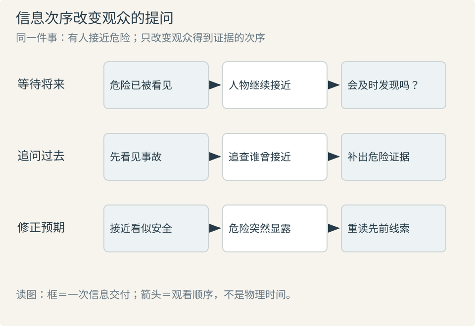

# 导演与视觉叙事：先决定观众何时明白什么

镜头设计的起点是一次可辨认的变化：某人想得到什么，遇到什么阻力，做了什么，谁因此改变了判断。先把因果写清，再决定观众与人物分别何时获得证据。景别、运镜和剪辑由这个选择产生；“紧张、震撼、电影感”尚不足以指导制作。

## 故事顺序与观看顺序

**故事事件**是我们推断在世界中发生的事；**叙述安排**是作品实际交给观众的先后、时长和视听线索。先看见空盒，再补出东西被拿走的过程，会把“能否拿到”改为“是谁拿走”，不需要新增事件。Bordwell 的研究把事件安排与视听风格分开，正因为同一段倒叙可以用切换、声音或画内变化实现。[SP23](sources.md#sp23)

制作时先写四句：**原状态 → 干预行为 → 可见结果 → 新选择**。例如“守门人不让访客进屋 → 访客递出旧信 → 守门人认出署名 → 他移开门闩”。若只拍“递信”和“开门”，礼物、威胁、认亲都可能成为观众推测的原因。需要保留哪一条解释，决定署名和反应是否必须可见。这是方法练习，不是对既有项目情节的补写。

## 信息差改变观看任务

| 观看任务 | 信息怎样给 | 适用目的 | 失败信号与修正 |
| --- | --- | --- | --- |
| 等待将来：他会不会发现？ | 观众先得到危险证据，人物尚不知道 | 使靠近、犹豫或延误有代价 | 证据一闪而过，观众没认出；补充对象关系或稍后的确认 |
| 追问过去：发生了什么？ | 先给后果，暂缓关键原因 | 驱动查证与重新理解 | 连问题都无法形成；保留稳定的人、物与结果 |
| 修正预期：原来不是这样 | 建立合理解释，再交付冲突证据 | 转折或认知变化 | 新证据与前文无关；让前文存在可回看的另一解释 |

三种任务对应常说的悬念、好奇与惊讶，但不会各自只占一场戏。悬念也能建立在人物和观众共同不知结果之上，不要求“观众总比人物知道得多”。Bordwell 对希区柯克“桌下炸弹”例子的讨论提醒：一种著名方法不能覆盖创作者自己使用的所有方法。[SP05](sources.md#sp05) [SP23](sources.md#sp23)

横向是交付信息的次序，不是影片时码。图只改变危险证据的位置，实际片段还须靠人物目标和空间关系使危险成立。把图中的证据替换为该场真正需要观众认出的对象，检查结果出现前，问题是否已经形成。

## 看见谁，不等于站在谁一边

**光学主观镜头**模拟人物眼睛所处的位置；**叙事限制**决定观众允许知道多少；**情感认同**还受行为、后果、声音和前史影响。三者不能互相代替。正面特写可以让人仔细判断一个角色，也可以增加怀疑；跟随他走路不自动要求观众赞同他。Yale 的视点条目同样区分光学位置与心理关系。[SP04](sources.md#sp04)

选择视点时写一张小表：这一拍“人物知道什么／观众知道什么／下一拍新增什么”。如果下一拍没有新增事实、改变关系、建立期待或容纳必要感受，检查它是否重复说明。停留可以有价值，但需说清它让什么行为或关系变得可察觉。

## 注意力需要交接，情绪需要证据

一幅画面可以有许多细节，当前主要阅读任务宜清楚。视线、动作开始、声音出现和明暗变化都能提示下一个对象；多个同样显眼的变化同时发生，可能使关键动作失去优先级。Smith 的注意力连续性理论解释切换前的提示与切换后的预期如何衔接；这是解释框架，不能保证每位观众看同一点，也不是“所有切口都应隐藏”的规定。[SP17](sources.md#sp17)

可用“**提示—对象—后果**”检查：人物转头是提示，门口来人是对象，人物收回原先要说的话是后果。只给前两项，观众知道“他看见了谁”，尚不知道这次看见为何改变行动。故意不展示对象可以制造不确定，但应在需要判断时补足证据，或让不确定成为作品明确的目的。

希区柯克在自述中认为，听者的反应有时比说话者更值得拍。这支持“按信息作用决定拍谁”，不支持“台词都应拍反应镜头”。若重点是说话者临场改变策略，一直离开他的脸反而丢失过程。[SP01](sources.md#sp01)

## 导演判断怎样成为可执行要求

把“更压迫”改写成可讨论的选择：“仍要看见出口，但人物挡住通道；等他移开才给出逃离可能。”摄影检查出口占比，表演检查让路动机，美术保持通道轮廓，剪辑保留让路前后的差别。目标清楚，仍允许不同实现。

ScreenSkills 将导演工作描述为贯穿筹备、拍摄和剪辑的协作；Screen Ireland 与导演协会的能力框架强调核对双方是否理解、允许合作者改善方案。导演需要守住叙事目标，也要修正不能执行或不产生预期效果的办法。[SP22](sources.md#sp22) [SP24](sources.md#sp24)

最后做三项检查：遮住说明文字能否读懂关键行为；只看前后状态能否说清改变；未参与设计的人能否复述人物为何做下一件事。复述不同先定位缺失证据，不急于加解释台词。下一步读 [分镜与镜头覆盖](02-coverage.md) 与 [场面调度](05-staging.md)。
