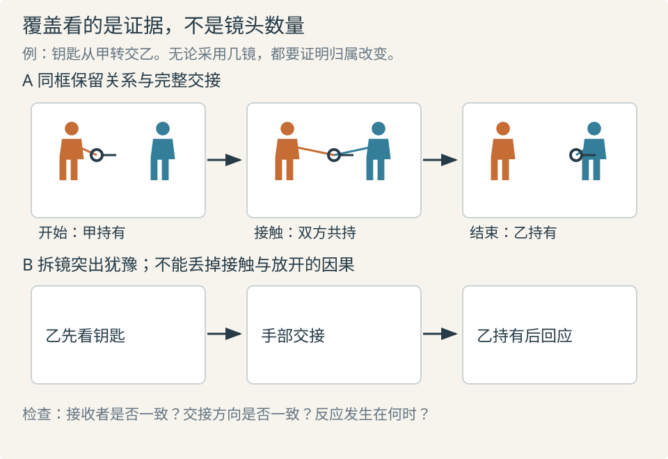

# 分镜与镜头覆盖：为因果和剪辑准备证据

分镜把叙事选择变成可检查的图像与时间安排；镜头覆盖为一场戏提供足够的视角、动作和反应，使剪辑能形成所需关系。镜头多不代表覆盖完整：十个漂亮近景仍可能没有一个画面证明谁拿走了物件。

## 先列事件，再决定镜头数量

将场景拆成**行为节拍**，每一拍是策略、信息或关系的一次变化，不必等同一句台词。逐拍写“必须看见的证据”，再决定合拍还是拆拍。需要分开阅读、不同视点，或同一画面无法交代时才拆镜；若同框关系正是意义所在，切碎反而削弱它。

| 镜头作用 | 回答的问题 | 使用条件与代价 |
| --- | --- | --- |
| 主镜头／关系镜头 | 谁与谁同处何处，能怎样互动？ | 空间及同时发生的行为重要时有用；不必每场先放全景 |
| 单人／过肩镜头 | 谁在施加影响，谁在接收？ | 利于分配注意、调整对白节奏；需维持对手、视线与距离关系 |
| 插入镜头 | 哪个小物或动作改变局面？ | 主画面难辨的关键细节；须有归属或视线线索 |
| 反应镜头 | 信息造成什么可见变化？ | 能补足因果；无变化的表情可能只是重复情绪标签 |
| 切出镜头 | 同时的另一处如何补充事件？ | 可建立威胁或旁观；要防止引入不存在的时空关系 |

Yale 给出基本镜头与剪接术语。Bordwell 区分从整体拆到细部的分析式组织，与从局部拼出关系的建构式组织：没有全景不等于没有空间，只是更依赖共同背景、方向、视线和结果线索。[SP04](sources.md#sp04) [SP07](sources.md#sp07)

A 方案保留双方及手的接触，B 方案突出接收前的犹豫；两者都需要钥匙归属从左人变为右人的证据。B 不天然更细腻，若手部镜头接反或反应放错时点，也可能被读成偷取。

## 分镜记录到什么程度

ScreenSkills 强调分镜将剧本、导演意图和镜头衔接转为可交流图像；Bianca Ansems 的访谈说明，动画分镜常需返回剧本，处理篇幅、场景和制作条件。因此分镜仍包含写作判断，不应画完后才检查动作因果。[SP08](sources.md#sp08) [SP09](sources.md#sp09)

实用记录包含镜号及节拍、起止构图、人物动作及终态、相机变化、关键声音、预计时长、进入和离开镜头的条件。无需每项都做成固定表格，图已说明的内容不再重复长句。

同镜内构图明显变化，画两张或更多关键画面，并注明“同镜持续”。ACMI 的教学允许简单人形，重点是景别、动作和顺序；其记号用画内箭头表人物、画外箭头表相机。也可使用其他约定，但须给图例，不能让一根箭头同时代表位移、目光和推镜。[SP12](sources.md#sp12)

## 保留剪辑选择，维持同一场行为

动作前的准备和动作后的停留能给剪辑调整空间。余量取决于动作、对白重叠和可能切口，不是统一多留若干秒。关键交接的不同覆盖至少应含有可对应的阶段，如接触、放开、离手，才有选择切口的机会。

连续性既包括身体、道具和服装，也包括角色此时知道什么、正在采用什么策略。ScreenSkills 的场记能力说明将物理与情绪连续性、动作对白时间变化、已拍覆盖和给剪辑的记录放在一起；画面状态对上而行为阶段错位，仍会使一场戏断裂。[SP10](sources.md#sp10)

| 问题 | 机制 | 优先修正 |
| --- | --- | --- |
| 人物忽然已拿到物品 | 所有覆盖都缺少归属转换 | 补足接触与放开，或安排可读的同框交接 |
| 手反复伸回 | 两镜采用不兼容的动作阶段 | 调整切口或选择连续阶段 |
| 特写有力，剪起像不同场戏 | 视线、身体方向或行为策略不一致 | 对照关系镜头核查状态，保住关键因果 |
| 每句话有镜头，转折仍不清 | 按台词均分覆盖，没有覆盖策略变化 | 让犹豫、发现或让步成为镜头选择依据 |

## 动态分镜帮助判断什么

将分镜按预计时长排列，加临时对白和必要动作声音，形成**动态分镜（animatic）**。它检查信息能否在给定时间被阅读，不能验证最终表演、复杂运动或物理连续性。关键动作应以实际表演、预演或有明确时间的粗动画核验；“图上写三秒”不等于已经验证三秒足够。

可比较两个版本：一个保留关系与完整动作，一个强调细节与反应。比较“在哪一拍明白”“什么变模糊”“哪个选择对后续更有用”，不要仅以镜头数和快慢评判。镜头的时间组织继续阅读 [剪辑与节奏](10-editing.md)。
