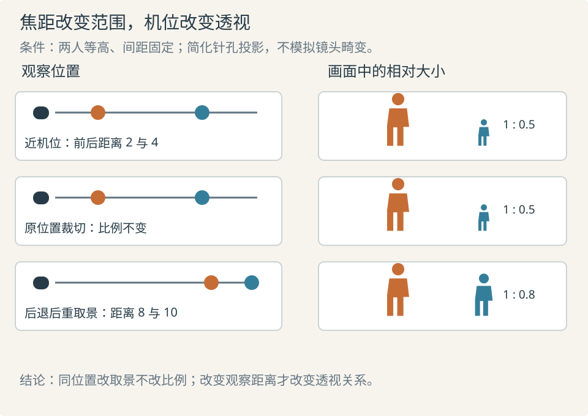

# 摄影与构图：把位置、范围和清晰度分开选择

先确定从哪里看，再确定看多大范围，最后决定哪些层次清晰。分开这三个问题，才能避免“换长焦就更压缩”“浅景深更电影化”之类含混指令。对二维动画与生成画面，摄影原理是可见关系的参照，不能把一个毫米数当成必然生效的开关。

## 景别、视角与机位各自改变什么

**景别**描述主体在画面中的大小与可见范围，如全身、中景、近景；**视场角**描述镜头和画幅组合能容纳多宽的场景；**机位**是观察位置与方向。相同景别可以由不同机位与焦距组合得到，前后物体的相对大小却未必相同。Sony 的光学说明指出，所谓长焦“压缩透视”来自为维持主体大小而后退的观察位置；焦距本身没有在同一位置把前后距离压平。[SP13](sources.md#sp13)

图中采用理想针孔投影，两个等高人物相隔固定距离。固定机位只裁窄范围，相对大小不变；后退再取相似景别，前后距离比例趋近，后人显得更接近前人的大小。图只解释透视，不模拟镜头畸变、呼吸效应或焦外形状。

选择时先画前后层次：要让近手显得逼近，需要相应的近观察位置；要让远人保持较大的相对尺度，可考虑更远观察点与较窄取景。这些选择同时影响背景、遮挡和表演空间，不能只改焦距标签。

## 景深不是背景越糊越好

**景深**是对焦平面前后可接受清晰的范围，不是前景到背景的实际空间深度。Canon 手册用光圈、焦距和对焦距离说明其变化：在其他条件相同的比较下，收小光圈通常扩大景深，靠近主体通常缩小景深。画幅、最终放大与观看标准也影响“可接受清晰”，比较前要说明保持哪些条件不变。[SP14](sources.md#sp14)

光少不会直接制造浅景深；若因此开大光圈，才通过光圈改变景深。补光或调整其他曝光变量可能保住原来的清晰范围。Yale 对**纵深调度**与**深焦**的区分有用：人物可以分处远近而不同时清晰，也可以在较平的布局中都清晰。该旧教学站部分光学简写，应以上述条件化解释阅读。[SP04](sources.md#sp04)

| 叙事需求 | 可选办法 | 代价与检查 |
| --- | --- | --- |
| 先辨认一人 | 焦点、明暗、遮挡及色彩差异共同分配注意 | 虚化可能让背景威胁消失；保住后续需要的线索 |
| 同时比较前后反应 | 保持所需清晰范围，安排可读轮廓 | 都清晰仍会抢眼，需靠位置与动作次序组织 |
| 让观众发现后景变化 | 保留背景信息，延后前景干扰 | 太隐蔽会漏看；以小尺寸预览检验 |
| 注意从甲交给乙 | 对焦转移、人物移动或切镜 | 对焦变化需有触发；展示效果可能打断行为 |

## 构图组织关系，不是情绪词典

画面边缘决定包含与排除，人物间空隙决定分离或接近，遮挡决定谁看见谁。三分线、居中和对称都是工具：居中可能端正、受审或孤立；低角度可能显出体量，也可能只是儿童视点。ACMI 将构图、景别、角度与具体练习相连，比为角度贴唯一情绪标签更可执行。[SP11](sources.md#sp11)

检查构图先缩小看主形，再看眼睛、手和关键物件的轮廓。信息若依赖极细纹理，小屏和压缩会使它失效。留白应有关系上的用途：给目光目标、移动方向、缺席的人或即将进入的事物留空间。需要挤迫感时可以减少余量，但仍须保住重要动作。

构图还要承受时间：抬手后是否挡住证据，另一人进入是否造成无意重叠，末态能否把注意交给下一镜。只检查首帧，会把合格插画误当成合格镜头。

## 风格参数服从可见目标

Jess Hall 在 ARRI 对《攻壳机动队》的访谈里讨论原作图像、柔和描绘与镜头选择。他追求特定呈现，并非细节越锐越好。访谈把大画幅与“平坦透视”相联系的表述，应作为整套镜头与机位选择的经验描述，不能替代位置决定透视的几何机制。[SP18](sources.md#sp18) [SP13](sources.md#sp13)

给制作的要求优先写成“近手比后景头部明显大”“背景门框仍可辨认”“视线间保留空隙”，再附摄影类比。生成画面即使标了某焦距，只要不满足这些关系，仍未达标。群像如何用构图承载关系，继续看 [《十二怒汉》案例](05-staging.md)。
