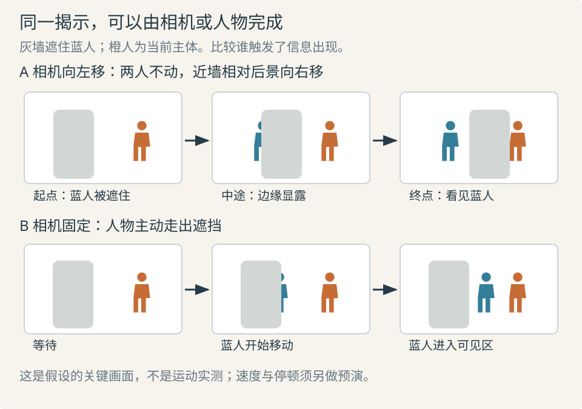

# 运镜：让观察位置的变化有明确任务

相机运动同时改变信息、空间关系和观看节奏。先回答为何开始、途中让什么进入或退出、到哪里结束，再选移动方式。固定镜头也能通过人物动作、焦点和声音持续改变信息。

## 运动方式与观看任务

| 方式 | 直接变化 | 常见用途与边界 |
| --- | --- | --- |
| 摇摄／俯仰 | 位置基本不变，朝向改变 | 跟随、揭示相邻区域；不同于位移产生的视差 |
| 横移／升降／前后移动 | 观察位置改变，遮挡和透视随之改变 | 绕开遮挡、比较关系、进入距离；须有可行通路 |
| 变焦 | 同位置改变取景范围与放大程度 | 强调或搜寻；不会自动产生推进的视差 |
| 跟随 | 相机与主体持续维持某种关系 | 保留行动过程；须说明领先、并行还是落后 |
| 固定观察 | 画框稳定，画内行为组织变化 | 比较先后位置、容纳表演；需有注意线索 |

术语背景见 Yale 与 ACMI；真实设备的实现方式不改变这些可见区别。[SP04](sources.md#sp04) [SP11](sources.md#sp11)

灰墙遮住蓝人，橙人是当前主体。上行用位移显露蓝人，下行以固定机位让蓝人自行走出。两者都能交付“另有人在场”，但前者由观察者发现，后者由人物主动暴露。先选叙事关系，再选路径。

## 可执行的运动说明

写清**起点构图、开始条件、相对速度、路线与朝向、终点构图、停止条件**。例如“听到门内碰撞后，从人物侧后方横移半个身位，保持人物在右侧，直到门缝里的手进入左侧；停住，让人物先察觉再回头”。距离是预演初值，最终按遮挡、节奏与可读性调整。

一路跟上人物未必选择了观看对象；持续横移也可能暗示即将揭示新物，最后却没有回报。Bordwell 对移动摄影的评论提出这种期待问题，同时承认运动本身可以是风格选择。应将其作为审美检查，不能写成“无新增叙事信息的运动都错误”。[SP06](sources.md#sp06)

Garrett Brown 回顾《闪灵》的 Steadicam 工作，讨论路径中的起停、转弯和高度变化，以及镜头在空间与时间中的精确控制。可迁移的是动作可重复、起止可检查，不是所有场景都要漂浮，也不是换稳定器就有相同效果。[SP16](sources.md#sp16)

## 行业案例：《1917》怎样把时间变成空间设计

**问题与主创表述。** Roger Deakins 在 ASC 访谈中解释，连续跟随服务于与士兵共同经历路程的意图；团队先在空地排演对白和行走、标出路线并制作预演，再据此确定布景。ARRI 采访补充不同场地与机位高度对支撑、交接和路线的限制。[SP02](sources.md#sp02) [SP19](sources.md#sp19)

**实际观察。** 本次直接查看 ARRI 文中题为“ALEXA Mini LF and TRINITY in action on ‘1917’”的幕后原图：摄影人员和稳定支撑位于左侧，两名主要演员站在中央空地，卡车和登车者占右侧；装置、演员与车身之间的通路可辨。这能支持“摄影机与演员、布景共享有限空间”，不能证明成片的速度、衔接方式或沉浸效果。幕后照片也不是摄影机所拍出的构图。

**机制判断。** 连续镜头减少靠切换省略路程、调整反应时长的自由，于是对白长度、演员速度、转向点与布景尺度相互约束。联合预演能提早暴露“话说完还没到位置”“摄影机被车辆封住”“转向提前暴露信息”等问题。这是根据主创流程及现场证据作出的因果推导，不是本次对成片连续视频的实测。

**替代解释与限制。** 图中空地也可能由安全距离、灯光或表演共同决定，不能全归因于稳定器。采访出自设备厂商，适合核对使用过程，不是独立观众实验；“沉浸”保留为创作意图。本次未直接核验原片连续时段，不断言哪次加速、遮挡或隐藏切口产生了什么观众反应。

**迁移。** 实拍、动画和生成镜头都可先用粗人物与简单空间排一次完整动作，记录起点、转折、揭示和终点。路径无法保证信息与动作同时完成时，可改布景、调度或切镜。借鉴联合规划，不要求模仿全片长镜头，也不从静帧复刻器材参数。

## 时间采样：清楚与流畅的取舍

快门角度表示每帧周期中用于曝光的比例；固定帧率下，角度越大通常积累越多运动模糊。理想换算为“曝光时间 = 快门角度 ÷ 360 ÷ 帧率”：24 帧每秒、180° 约为 1/48 秒。RED 将 180° 介绍为常用习惯，同时强调速度与创作目的；它不是审美合格线。[SP15](sources.md#sp15)

RED 的摇摄建议讨论画内位移、取景、对比度与顿挫感。常见“横穿画幅约七秒”是在特定帧率、快门和观看条件下的起点，不是所有屏幕、动画和动作的限速。[SP21](sources.md#sp21)

生成视频中的毫米数、快门角和运动术语未必对应可重复的物理控制。验收需连续播放，看轨迹、视差、速度、清晰度与观看负担。单帧只能检查构图和模糊外观，不能证明运动自然。与生成能力衔接的方法见 [视频生成手册](../seedance-video-handbook.md)。
