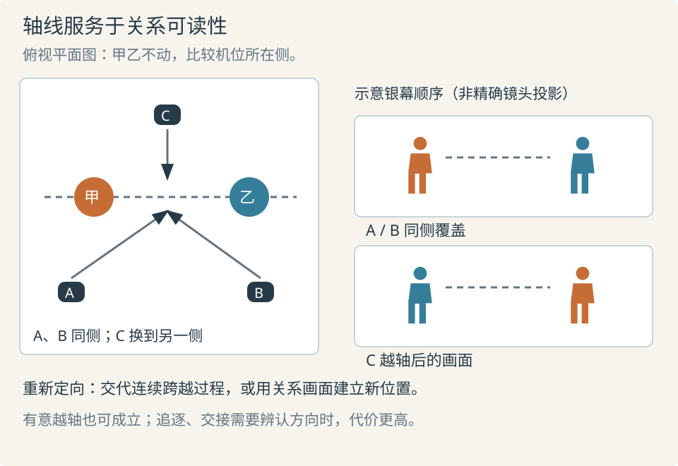

# 场面调度：让位置与行动表达关系

场面调度是人物、物件和环境在时间中的安排，以及它们与摄影机的关系。谁主动靠近、谁让路、谁被隔开，往往比单独表情更能说明关系改变。先让人物有行动理由，再让机位与动作共同保证观众看清。

## 地理位置与银幕方向

**世界位置**是人物在房间或道路中的实际位置；**银幕方向**是画面中朝左、朝右或朝深处的表现。换侧拍摄，世界位置不变，左右却可能翻转。连续性关心观众是否仍能理解关系，不要求机位永久不动。

**关系轴线**通常连接正在互动的两人，**运动轴线**沿主要行动方向。第三人介入、人物转身或运动改变时，相关轴线可能重组。常用 180° 约定让相邻机位处于当前轴线同一侧，维持左右与视线关系；它不是固定铺在整个布景地面的禁区。[SP04](sources.md#sp04)

甲乙的世界位置始终不变。A、B 在同侧，C 换侧后银幕位置互换。可通过看清位置变化的连续移动、重新建立双方关系的画面，或明确的新行动轴重新定向。也能有意制造冲突，代价是观众可能需要额外时间理解，须与段落目的相称。

Smith 的理论指出，连续性有时依靠动作、目标和注意的延续，不要求完整空间地图。这解释了轴线的灵活处理，但不意味着“有情绪就能忽略空间”：追逐、交接和距离判断中，空间本身就是证据。[SP17](sources.md#sp17)

## 先建立通路，再安排轮廓

先画入口、出口、障碍、关键物件和人物起止位置，再检查谁看见谁、谁能先到、谁挡住通道。人物因目标而移动，例如取得物品、避开视线或迫使回应，而不是只为活跃画面而走动。

坐下会改变高度、视线、离开的速度，却不直接等于认输。旁人是否仍围绕他、桌面是否形成边界、下一步做什么，都会改变解读。ScreenSkills 把走位、移动与台词表达放在同一调度过程，提醒我们身体位置与表演不能分开安排。[SP22](sources.md#sp22)

遮挡能延迟信息，也会让关系难以辨认。前景人挡住危险，可以让观众随他发现；若观众应早知道危险，遮挡就会破坏悬念。依据是 [信息安排](01-narrative.md)，不是“多层次”这一孤立优点。

## 行业案例：《十二怒汉》的群体关系怎样占据画面

**材料范围。** 本次逐张打开并视觉检查 BFI《How 12 Angry Men works – in 25 frames》第 7、18、19、20 张电影画面。分析限定于构图和空间关系，没有把文字描述当作已经观看连续表演。另读 Criterion 评论，对照其社会关系解释。[SP03](sources.md#sp03) [SP20](sources.md#sp20)

**画面观察。** 第 7 张由较高位置容纳长桌及多人，举手群体与未同样举手的人能同时辨认，便于比较人数及姿态。第 18 张位置较低，前景背部、肩部和头部占较大面积，人物重叠，桌面完整轮廓较难看全。它们提供观看范围与遮挡的对照，不能单凭静帧确认焦距或中间怎样移动。

第 19 张集中于一人的上半身和脸；单帧不能判断完整语气与表演转折。第 20 张同时纳入站在桌边的人及远处其他人，空椅、距离、身体朝向和不再围坐的状态突出。“一人说话、其他人不再围绕他”的空间事实可以在同一画面被比较。

**效果推断。** 前两张提供从可综观群体到身体挤占观看范围的对照；后两张将读脸的任务转为读人际分布。第 20 张的关系分布在多个位置，只留说话者特写便无法同时证明他人与其拉开距离。此判断基于可见布局，“所有观众都更压抑”并非本次能证明的结论。

**主创说明与意图边界。** 吕美特在 Museum of the Moving Image 的原始对谈中解释，自己的戏剧与直播电视经历使他习惯提前作戏剧选择，并认为充分准备可让演员更自由；他也承认其他风格成立。这支持把预先设计与群体表演放在一起理解，但该段不是对上述四帧的逐镜解释。[SP25](sources.md#sp25) BFI 关于镜头策略、Criterion 关于公民判断的论述仍属评论者解释，不写成导演自述。静帧也不能确认转身先后、剪辑时长和情绪出现的时点。

**替代解释。** 低机位和重叠也可能服务覆盖、表演可见性或布景条件；紧凑群像可能部分来自人数。证明某解释优于另一解释，需要连续片段、制作记录或主创说明。当前证据足以提炼“用空间分布表达关系”，不足以建立“低角度加长焦必然压迫”的公式。

**迁移。** 表现孤立或结盟时，先画关系镜头：谁与谁同框、谁转向别处、谁占共同通路，再决定何时用单人镜头。二维画面尤其需保持轮廓与间距可辨；若生成中身份、站位或前后关系漂移，关系表达会一起失效。可迁移的是关系可见性，不能照搬镜头数和表演节奏。

## 连续性围绕观众必须判断的事

| 状态 | 需保持或交代的变化 | 修正方向 |
| --- | --- | --- |
| 位置与朝向 | 入口、退出方向、距离、面对谁 | 重新定位，或重做连接动作 |
| 目光与目标 | 目标高度、距离、屏幕方向 | 对照目标位置；相反视线未必互相看 |
| 关键物件 | 哪只手、归属、接触、放开、终点 | 补足归属改变，不能只修静帧摆放 |
| 行为与认知 | 已知信息、当前策略、是否已转折 | 选择同阶段素材，必要时重构切口 |

场记记录将这些状态与剪辑相连，不要求所有细节绝对相同，而是避免关键因果被无意差异改写。[SP10](sources.md#sp10) 先问“观众是否误判谁做了什么”，再处理不影响理解的细节。有意跳跃或诗性歧义可用不同标准，但须说明它承担什么观看任务。[SP07](sources.md#sp07)
