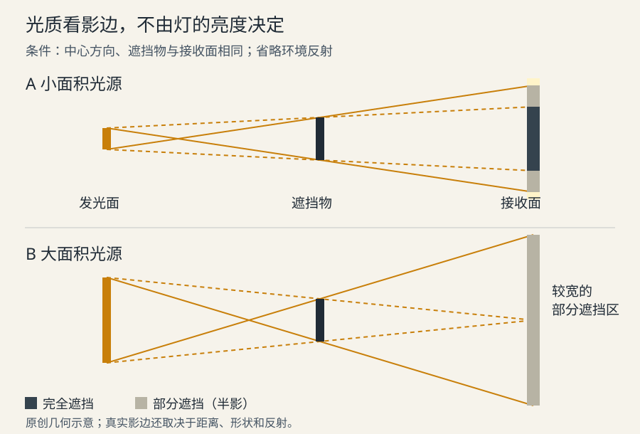
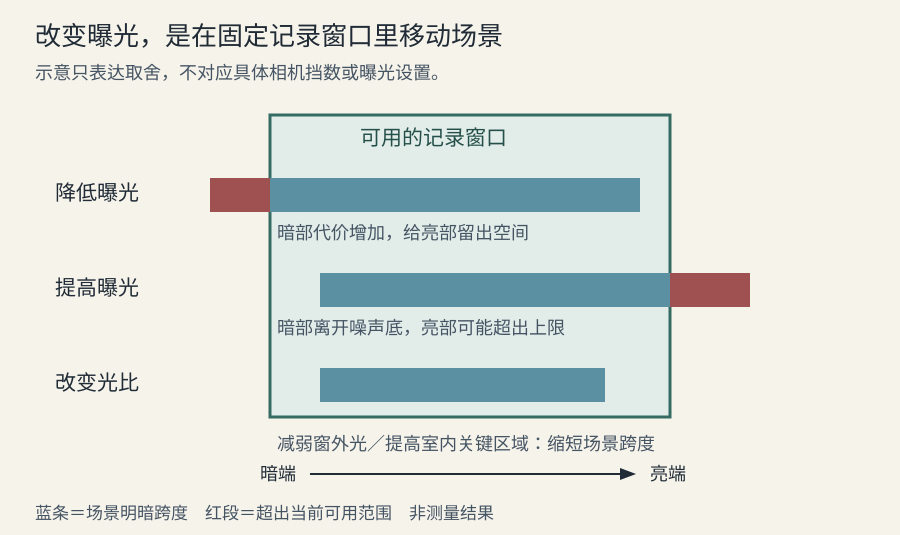

# 光线与曝光

光线设计先回答三个问题：观众此刻必须看清什么，人物处于什么环境，明暗怎样随行动改变。灯的数量和画面亮度是实现手段。一个暗场面可以把关键动作交代得很清楚；一个曝光充足的场面也可能因为处处同样醒目而失去重点。

## 从光的来向理解形体

光位是光源相对人物、环境和摄影机的位置。顺着摄影机方向照来的光，通常减少摄影机可见的面部阴影；侧光让朝向光与背向光的面产生差异；逆光更容易强调轮廓，却可能把朝向摄影机的一面留暗。这些效果取决于人物是否转头、墙面反光和环境亮度，不能只写“侧光”就认为人物已经立体。主光指承担主要造型作用的光，补光指向暗部补入的光；轮廓光帮助人物与背景分开，背景光则组织环境层次。这些是作用名称，同一光源可以兼任，已有明暗分离时不必另加轮廓光。[LD01](sources.md#ld01)

对二维画面，可先把头、躯干和道具当成简化体块：标出光从哪个世界方向来，再检查各受光面与投影是否一致。人物转头后，光不应仅为了保持同一张“好看脸”而无缘无故跟着转。需要偏离自然光位以保留眼睛时，可以变通，但应在相邻镜头中检查这种变通是否造成可见跳变。

## 光质与明暗反差是两件事

**光质**描述阴影边缘的软硬。有效发光面积相对被摄体越大，物体越可能同时收到来自多个方向的光，阴影边缘形成较宽过渡；小面积光源更容易形成清楚的影边。柔光布只有被照亮的部分才构成有效面积。决定软硬的不是灯有多亮；一小簇火焰即使很暗，也不因此成为柔光。[LD01](sources.md#ld01)

几何上应同时考虑距离：同一面发光板移远，从人物位置看占据的角度变小；在其他条件相近时，阴影会更硬。把大灯调暗主要改变光量，不等于缩小它。下图是平面几何示意，省略环境反射，不是照度模拟。

图中黄色线表示从发光面边缘到遮挡物的代表光线；大光源使接收面的一部分只能看见部分光源，形成半影。实际影边还受遮挡物到接收面的距离影响，所以同一盏灯下，贴墙的手影与远离墙的手影可以不同。

**明暗反差**描述亮部和暗部相差多少。柔光完全可以只照亮一侧、同时保留深暗部；硬光也可以被大量补光填成低反差。负补光是用黑色遮挡或吸光面减少回填光，适合环境反射过多、面部缺少明暗区分的情况。[LD02](sources.md#ld02)

因此，“柔光显得平”应先检查补光和背景溢光，而不是立即换硬光；“硬光显得凶”也要检查入射方向、影子落点与表演语境。写实、柔和和低反差并不互为同义词。

## 曝光记录什么，显示又呈现什么

曝光是感光介质在一定时间内接收光的过程。光量、镜头透光与曝光时间一起影响记录；一挡曝光差表示光量加倍或减半。光圈数值还会影响景深，快门时间还会影响运动模糊，因此不能把它们当成没有副作用的亮度旋钮。胶片和数字摄影的具体响应不同，旧胶片指南中的偏过曝经验不能直接套给数字图像或已经生成的图片。[LD02](sources.md#ld02)

数字摄影的动态范围，是从可用暗部到高光饱和之间能够记录的范围。暗部是否“可用”还取决于可接受的噪声；高光削波指信号达到上限后，不同亮度无法继续被区别。把整幅画面压暗不会扩大记录范围：保住亮部的同时，暗部可能更接近噪声。ARRI 对其 ALEXA 系统的说明也区分实际曝光与曝光指数（EI）：前者改变进入感光器的光，后者参与编码和监看的中灰定位；其具体行为不能推广为所有设备的 ISO 规则。[LD03](sources.md#ld03)

图中横向跨度表示场景明暗范围，框外表示当前无法同时保留的部分；只是取舍示意，没有宣称任何相机具备图中的挡数。若窗外细节和室内表情都必须保留，可降低窗外光、提高室内关键区域的光，或改变构图；这属于改变场景反差。只调全局曝光通常不能同时修复两端。

监看图像是记录数据经过转换后的呈现。对数编码（Log）把较宽的亮度范围压入记录值，直接显示往往显得灰；它不是一种应保留的“电影滤镜”。检查时应知道看的到底是原始编码、带观看转换的图，还是已完成调色的交付图。波形图显示画面不同位置的信号水平，伪色用颜色标记不同曝光区间；工具的阈值依赖设备与模式，不存在所有人物肤色都必须对齐的统一数值。[LD19](sources.md#ld19) [LD03](sources.md#ld03)

对二维漫剧，重点转为保留关键轮廓、面部关系与亮暗层级，并在实际交付尺寸、显示转换下查看。把生成图整体提亮，无法保证重建原图没有的暗部结构；“曝光正确”也不能替代动作清楚和视觉重点明确。

## 光源颜色、材质与制作连续性

色温描述沿黑体辐射颜色变化方向的冷暖，不能独自描述所有光源的绿色或品红色偏。橙色校色片（CTO）与蓝色校色片（CTB）用于冷暖方向调整；加绿、减绿片处理另一类偏色，而且过滤会损失光量。校正混合光之前，先决定哪一种光应当看起来中性、哪一种差异是剧情需要；不必把所有光都变成同一种白。[LD06](sources.md#ld06)

白平衡与校色参考也需要说明意图。Kodak 的灰卡流程区分“恢复中性”和“保留有意的有色光”：若后期把本来受彩色光的参考卡强行调成中性，可能抵消原有设计。可迁移的原则是给后期一个清楚的参考及用途，而不是照搬胶片时代的卡片曝光操作。[LD04](sources.md#ld04)

材质会改变同一盏灯的呈现。布料、皮肤、金属、湿地面具有不同的漫反射和镜面反射特性；镜面高光的位置与摄影机观察方向有关。因此，亮点忽然消失可能来自角度改变，不一定是光源灭了；但二维画面中的金属高光若始终黏在屏幕同一处，也可能破坏物体转动的可信度。材质拆分见[美术与场地安排](08-design.md)。

跨镜连续性应记录世界中的光源、人物运动路径及关键面部明暗关系，而非要求每一镜亮度完全相同。反打后光源在屏幕上的方向可能改变；只固定“屏幕左侧打光”，反而可能让世界方向矛盾。局部为了表演调整光位时，优先保住观众可辨认的窗、灯、门口等来源关系。

## 行业案例：寄生虫的居住空间与可获得的光

**材料与观察范围。** 本例实际查看了 2019 年公开发布、标明 CJ ENM／Barunson E&A 版权的金家用餐剧照：父母在圆桌两侧，橱柜压在头顶附近，餐盒、餐具、线缆与厨房器物挤入同一画面；左侧墙面较亮，两人的脸仍有明暗和可辨识细节。这里只观察这张静帧，不据此宣称全片镜头运动或剪辑效果。[LD20](sources.md#ld20)

**主创说明。** 摄影指导洪坰杓在 ARRI 访谈中说，金家使用廉价的偏绿荧光灯、钨丝实景灯与有限日光；朴家则安排充足日光和更昂贵的室内灯具。这里有厂商采访的背景，本文采信署名摄影指导的设计说明，不据此推荐器材。制作手册另说明，两家的高低位置及可躲藏的转角是美术设计的重要条件；服装设计又有意让人物融入环境。[LD05](sources.md#ld05) [LD15](sources.md#ld15)

**机制与备选解释。** 从已见静帧可推导的价值，是拥挤关系由家具高度、杂物密度、人物间距和有限的空白共同承担；不是把脸压黑就能表达贫困。光线保持基本表情可读，使空间信息不必以牺牲人物为代价。另一种解释是这张宣传剧照本身选择了较易读的一瞬，不能代表其他场景的明暗设计；因此上述结论仅说明一种协作机制，不推断每个镜头的实际曝光。

**可迁移条件与检查。** 如果一场戏要表现两个人获得资源的差异，可以比较窗外可见范围、日光到达位置、灯具类型和居住物件，而不仅换一套调色。先保住人物目标和主要动作，再尝试少日光／充足日光两种空间方案；以相同画幅的小样检查观众能否找到人物和关键物件，并核对相邻镜头是否保持来源关系。“穷人家一定偏绿”“富人家一定暖”不是可迁移规则。

## 常见故障与修正顺序

| 看到的问题 | 先确认什么 | 可尝试的修正及代价 |
| --- | --- | --- |
| 夜景只剩黑块 | 关键脸、手、出口是否都落在同一暗值 | 给必需信息建立局部差异；全局提亮可能损失夜色层级 |
| 人物像贴在背景上 | 轮廓两侧的明度、色相和纹理是否都接近 | 先调整背景或局部受光，再决定是否增加轮廓光 |
| 皮肤太亮、灯却不亮 | 是原始记录削波，还是观看转换压坏高光 | 先查输入与显示；不可仅以屏幕观感倒推拍摄曝光 |
| 每张都好看，反打时跳光 | 世界中的灯位、人物朝向是否一致 | 并排看相邻镜头，画出共同光源，再允许局部造型修正 |
| 柔光失去形体 | 暗部是否被墙面、地面与背景反射填满 | 减少回填或溢光；减少环境信息时需确认空间仍可读 |
| 角色移动后忽明忽暗 | 路径与光区是否冲突，变化有无叙事动机 | 改走位、扩大有效光区或明确过渡，不以每帧自动拉平替代设计 |

完成一份光线方案时，应能说清必须保留的信息、来源方向、软硬与反差的独立选择、材质反应，以及跨镜检查方法。进一步的颜色组织见[色彩设计](07-color.md)，人物走位和遮挡关系见[场面调度与空间](05-staging.md)。
