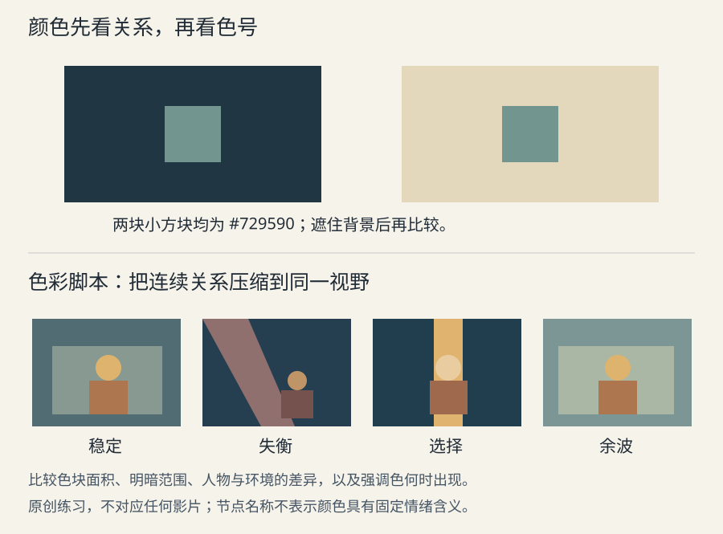

# 色彩设计

色彩设计的任务，是让观众在一个镜头中看懂关系，并在一段时间里感知世界如何变化。先确定哪些差别需要被看见，再分配颜色；只给整部作品贴上“暖色”“高级灰”之类名称，无法说明人物、场景与转折各自怎样工作。

## 先分清色相、明度与饱和度

色相是红、黄、蓝等颜色类别；明度在此指看起来有多亮或多暗；饱和度指颜色偏离同等明暗中性色的程度。三者并不等价：深蓝可能因为很暗而显得浓重，不一定比亮蓝更饱和。物体呈现的颜色还取决于照明光谱、表面反射、记录与观看条件；同一块布在两种灯下匹配失败，不一定是美术选错了色号。[LD07](sources.md#ld07)

制作时先把“更鲜亮”拆成可讨论的动作：提高明度、提高饱和度，还是与邻色拉开色相差？例如想让手中的信物突出，可以降低背景纹理、扩大它的轮廓空隙，再试颜色差；如果只增加饱和度，信物可能像发光塑料，破坏材质和情境。

色彩有上下文。相同的色块放在不同背景上，视觉感觉可能改变；单独核对色号不能保证跨镜看起来一致。Albers 的训练方法让学习者直接比较颜色在不同邻色中的作用，强调观察而不是先套配色系统。这是艺术教育方法，不是每名观众都会产生同等反应的量化保证。[LD10](sources.md#ld10)

上半图的两个小方块使用完全相同的颜色值；先观察再遮住背景比较。下半图是原创的“稳定—失衡—选择—余波”示意，不对应任何电影或本剧场景。节点用面积、明度与强调色关系区分，不是给情绪编制固定色号。

## 颜色关系怎样服务注意力

| 选择 | 可能起作用的机制 | 适用条件与反例 |
| --- | --- | --- |
| 少量强调色置于受控环境 | 降低同类竞争，使一个元素较容易被区分 | 若强调色铺满全屏，局部标记作用就减弱；重要人物也不必永远最鲜艳 |
| 接近的色相，以明度和轮廓区分 | 让群体或空间形成整体，同时保留阅读层级 | 需要故意融入环境时有用；关键动作若也融入，需另找动作或声音线索 |
| 冷暖并置 | 使两个光区、空间或阵营形成可比较差异 | 冷暖是相对关系，不能仅凭蓝／橙判断人物道德和情绪 |
| 全局降低饱和度 | 减少色相竞争，为少数例外留空间 | 可能削弱人物身份与材质差别；低饱和并不自动真实或严肃 |
| 高度统一的高饱和世界 | 建立明确的风格约定 | 若主次只靠颜色区分，容易失效；可改由大小、动作、明暗与留白承接 |

上述表格是基于感知机制的设计选项，不是效果承诺。观众的文化经验、此前看到的场景和剧情信息会参与理解。更可靠的做法是先在作品中建立颜色的关联，再在关键时刻重复、反转或撤去它。例如一个一直伴随家庭生活的暖色，在危险场面中出现，既可能提供安慰，也可能形成反讽；意义来自铺垫与当前事件。

## 从单张色稿走到色彩脚本

色彩脚本是把一段故事的代表性时刻按时间排列，用简化色稿检查总体颜色变化；色键图则集中规定某个重要时刻的明暗、色彩和气氛关系。Disney Animation 的视觉开发流程以剧本与导演意图建立角色及世界；其公开的《海洋奇缘2》色彩脚本实际画面把许多简化镜头并置，可直接比较一组画面的色块与重心，而不是先堆满细节。[LD12](sources.md#ld12)

制作一个可执行的脚本，至少要补充颜色之外的条件：时间、天气、所在区域、主光来源、必须稳定的角色识别色，以及何时允许改变。这不是要求所有镜头复制同一色板。一次从室外进入室内的变化需要可追踪的原因；一段情绪转折也可以有意偏离自然主义，但应先在作品中建立这种表达权限。

从色彩脚本到镜头完成，中间还要经过光线、材质和合成。Disney 的灯光流程说明，灯光师以视觉开发提供的色键为依据组织注意力；页面以《疯狂动物城》为例，区分自然主义、类型化和情绪驱动的视觉方案，说明同一作品可以按场景需要改变方法。这是该片的创作实践，不能要求每部作品使用相同的三分法。[LD11](sources.md#ld11)

一个有效的小样比较，是把连续镜头缩成同等大小，在同一显示条件下看：视觉重点是否连续，强调色是否在无关处被消耗，极端色彩是否有进入和退出的节奏。再回到全尺寸检查肤色、衣料和小道具。灰度检查可以发现明暗粘连，但它不能替代彩色审阅，也不能证明不同色觉的观众都能同样辨认。

## 色彩管理与创作调色分工

**色彩管理**处理不同文件编码、工作空间和输出设备之间的解释与转换；**调色**作出明暗、对比、色彩和局部关系的创作调整。两者可以在同一个软件里完成，但目的不同。把错误解释的输入直接调到“看起来顺眼”，可能让其他输出或合作者收到无法复现的结果。

ACES，即学院色彩编码系统，提供公共编码与转换流程，帮助不同来源的图像在制作、后期和输出中协作；它并不替创作者决定作品的风格。场景参照数据描述与拍摄场景有关的光值，显示参照数据已经针对某类观看呈现；两者不能因为扩展名相同就当成同一种输入。[LD08](sources.md#ld08)

当前 ACES 文档把交换／归档用的 ACES2065-1、线性计算用的 ACEScg 和调色用的 ACEScct 分开说明。这里需要理解“工作用途不同，编码也不同”，不要求二维漫剧为追求专业感一律改用 ACES。流程应与实际素材和软件匹配，并记录输入解释、工作空间、观看转换和输出规格。[LD09](sources.md#ld09)

查色表（LUT）把一组输入值映射为输出值，它可能用于技术转换，也可能包含风格处理；必须知道适用的输入。ARRI 的资料区分 Log 编码与色域，并明确旧、新编码的 Look 不能直接混用。因此，下载一个标为“电影感”的 LUT 后随处套用，没有可预测的专业意义。[LD19](sources.md#ld19)

对已经生成的图像，不能无依据地指定成某种相机 Log、假设有相机原始动态范围，或把截图当作未经转换的原件。最低限度的可复现交接是：使用准确原件，保留文件已有的颜色描述，在相同转换下比较，并在实际交付设备／播放器上检查最终输出。

## 行业案例：布达佩斯大饭店不是一张粉色色板

**实际材料。** 本例查看了 MPA《The Credits》原始访谈中的三张公开剧照：有黑色旗帜的大厅、两人举杯的餐厅、Zero 在狭窄房间的近景。大厅的粉色建筑和金棕楼梯构成较大色面，黑旗与深紫制服明显切开这些浅色；餐厅画面以橙黄与棕色包围人物；职员房间则可见裸露灯泡、灰褐墙面与少量器物。这里只比较这三张图中的设计关系，没有据此测定全片色彩变化曲线。[LD14](sources.md#ld14)

**主创解释。** 美术指导 Adam Stockhausen 说，团队从历史图像、实地场所与电影参考重新综合世界；职员住处与豪华套间的差别被有意拉大。实际取景空间提供基本结构，再按场面增加所需部分；模型制作也服务影片的手工质感。其经验反驳了“有一张固定风格配方就能做出同样作品”的想法。[LD14](sources.md#ld14)

**分析推导。** 大厅并非只有甜美色彩：黑旗的形、面积和重复与粉色背景形成强对比，可能把一个本来华丽的空间变成受占据的空间。这个读法同时依靠标志与叙事语境，不能从粉色和黑色本身直接推出政治含义。职员房间的墙面、服装与器物更接近，产生的生活尺度也与大厅不同；因此，区域差别可以比“统一滤镜”更有叙事价值。

**备选解释和迁移。** 三张剧照属于不同时间和情境，不能把所有差别归因于阶层；构图、年代、人物处境同样参与。可以迁移的方法是先定义空间之间的关系，再为场景、服装、道具与灯光共同分配颜色，而不是复制某个粉色数值。检验时把关键区域和角色放到同一张关系表中，确认变化有作品依据，同时让重要动作在这种统一中仍可辨认。

## 定位偏色与颜色跳变

| 现象 | 检查顺序 | 修正方向 |
| --- | --- | --- |
| 同一原件在软件间不同 | 输入颜色描述、观看转换、输出标签、显示环境 | 先统一解释路径，再决定是否需要创作调色 |
| 同一衣服跨镜像换了色 | 光源与环境是否改变，是否有自动白平衡／局部调整 | 保留有动机的变化；修正无依据的身份漂移 |
| 全片很统一但没有转折 | 关键时刻的明暗范围、面积和强调色是否真的变化 | 设计对比及恢复，不必继续提高饱和度 |
| 主角总被背景抢走 | 背景是否更亮、更杂、更饱和或有更强边缘 | 先减竞争，再决定给人物加什么 |
| 肤色“正常”却失去气氛 | 是否把有意的彩色照明全部中和 | 用中性参考与创作参考分开说明目标 |

颜色选择的最后判断应在连续段落里完成：为什么此处发生变化，观众需要由它区分什么，以及哪些角色与场地特征必须保留。灯光成因见[光线与曝光](06-lighting.md)，材质与服装的落实见[美术与场地安排](08-design.md)。
