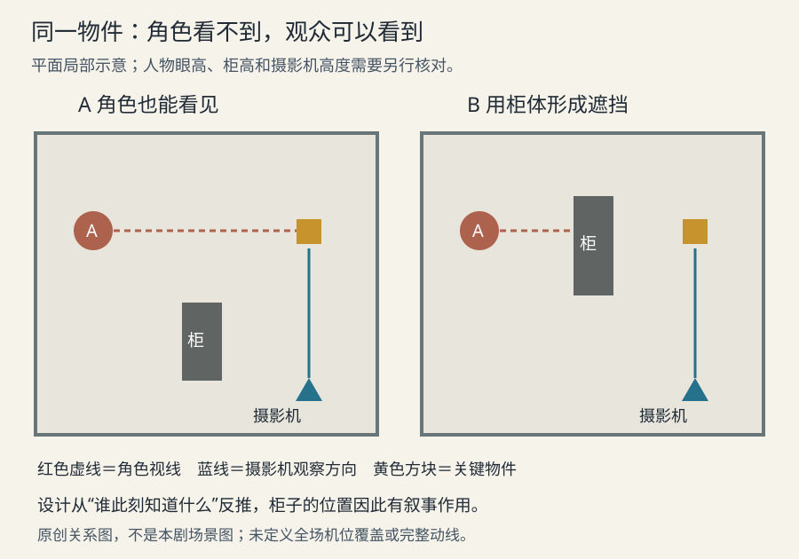

# 美术与场地安排

美术建立的是人物能够生活、行动、藏匿、冲突和留下痕迹的世界。场地、置景、服装、妆发、道具和图形设计共同参与叙事；它们不应等到镜头完成后才作为装饰补上。ScreenSkills 对美术指导的职责描述从剧本开始，强调与导演、摄影及其他视觉部门协作，再把氛围、构图、色彩和材质落实为可制作的设计。[LD16](sources.md#ld16)

## 先拆叙事功能，再决定细节

一个房间可以同时承担三种功能：告诉观众谁住在这里，为当场动作提供路径，并控制观众和角色分别能看见什么。选择每件物品时，可先问它是世界背景、人物线索，还是行动必需品。三者都可能重要，但交付重点不同：背景要可信而不抢戏，线索要在恰当时刻可辨认，行动物必须满足握持、距离、方向和状态变化。

例如一只盒子若只是背景，材质和陈旧程度可能就够；若角色必须在一句话之内打开它、露出内容、又把它合上，就需要铰链方向、手的位置、内外结构和打开后的占地。这是从动作推导设计，不是先画出漂亮盒子再让表演迁就它。

视觉开发可以探索多个方案，制作设计则需要把选择固定为共同依据。Disney 的视觉开发流程从角色穿什么、住哪里等问题建立世界；外观开发再把形状、颜色、纹理与反射等拆开实现。对二维漫剧，同样应区分角色／场地的身份结构与特定镜头的照明效果：一张夜景图不能独自承担所有状态的造型标准。[LD12](sources.md#ld12) [LD13](sources.md#ld13)

## 场地要能支撑镜头和行动

平面关系回答门、窗、转角与人物相隔多远；立面关系回答高度、遮挡和视线；镜头草图回答摄影机实际看见什么。这三种图不能互相代替。平面图上互不遮挡的人，可能在某个机位里完全叠在一起；透视图中看起来宽敞的门，也未必足够让两个人并行通过。

先锁必须发生的动作：谁从哪里来，在哪里停，触碰什么，谁应当看见、谁暂时不应看见。再反推家具、门洞和墙体。美术可为机位留出可拆部分，二维场景可为视差拆层；但拆层不能改变关键空间拓扑，即门与房间、台阶与通路的连接关系。[LD16](sources.md#ld16)

上图为原创平面示意：圆点是人物，蓝色三角形是摄影机，虚线为角色视线，蓝色线为摄影机看向关键物件的方向。左方案让角色 A 和摄影机都看到物件；右方案移动柜体，使 A 的视线被挡而摄影机仍能看到。它只解释一个局部信息差，不是完整可施工图；正式使用还应核对柜高、人物眼高和机位高度。

《寄生虫》美术指导在原始制作手册中明确谈到可藏身的转角、台阶与两家住所的高低差。这里的启发是：如果剧情依赖“此人没有看见”，遮挡必须真实成立，不能只靠对白宣布。同一手册也把角色融入环境作为服装选择，这与永远把主角从背景中强烈分离的方案形成有效反例。[LD15](sources.md#ld15) 该片的光色分析见[光线与曝光的行业案例](06-lighting.md)。

## 写实与风格化都需要内部依据

写实设计追求的并非杂物越多越好，而是空间与人的使用关系可信：常碰的边缘、经常走的路、会受潮的位置、物品为何放在那里。一个长期有人生活的地方，磨损不应随机均匀铺满。风格化则可以压缩比例、简化材质或强化色块，但需要说明哪些规律保留，哪些有意改变。

《布达佩斯大饭店》的美术访谈说明，历史研究、既有建筑、模型和电影参考可以综合成一个虚构世界；设计还必须解决具体场面的执行条件。由此不能得出“忠实复原”和“夸张风格”只选其一，而应判断该作品想让观众相信哪一层真实。[LD14](sources.md#ld14) 具体静帧对照见[色彩设计的行业案例](07-color.md)。

对二维漫剧，过密纹理可能在小画幅中变成噪声，在动态处理中还会与轮廓争夺稳定性。可先保留大形、关键材质区别与少量使用痕迹，再决定哪些细节确有叙事作用；这是一项需要小样验证的制作取舍，不是所有模型都会发生同样问题的能力结论。

## 服装、妆发和道具怎样参与表演

服装不仅传达身份，还影响身体行动。宽袖遮不遮手、裙摆是否改变步幅、携带物放在哪里，都可能改变一个动作是否能读懂。ScreenSkills 将人物服装的研究、试装、记录与跨部门沟通放在设计过程内；对二维角色，可迁移为转面、关键姿态和互动动作的联合检查，而不是只验一张站姿。[LD18](sources.md#ld18)

妆发和伤痕具有时间连续性。ScreenSkills 的妆发职责说明强调按剧本拆分变化、保留记录，并在实际光线下测试。将其转成制作问题，就是明确一处伤在何时出现、是否处理、下一场是否仍可见；头发被雨打湿后，也不应在没有时间依据的下一镜恢复干燥。[LD17](sources.md#ld17)

道具则要建立持有与状态链：出现前在哪里，谁拿起，用哪只手，何时转交，是否损坏，离场时由谁带走。道具外观完全相同，不等于动作连续；反之，有剧情依据的磨损或缺口应延续，不能为了“干净统一”自动修复。物件若承载线索，检查其实际显示尺寸与出现时长；本章负责形状和可见条件，时长与揭示节奏由[剪辑与时间](10-editing.md)和[视听叙事](01-narrative.md)共同决定。

## 材质与光照应联合审阅

外观开发把颜色、形状细节与反射分层，说明“看起来是什么”并非只由底色决定。[LD13](sources.md#ld13) 两块同样棕色的表面，一块是湿木，一块是粗布，其高光范围、边缘与纹理方向应有区别。实际衣料在不同光源下也可能显色不同；最终匹配要在场景条件下看，不能只把孤立色卡比较一遍。[LD07](sources.md#ld07)

若金属看起来像灰色塑料，应先检查大形与反射关系；若布料看起来像金属，应检查是否给了过于尖锐、统一的亮边。单纯增加纹理可能掩盖问题。二维风格允许简化真实反射，但需要在同类材质上形成稳定的表达方式。

## 交接资料如何达到可执行

| 资料 | 必须回答的问题 | 不足时会造成什么 |
| --- | --- | --- |
| 场地平面与高度说明 | 门、窗、台阶、遮挡物如何连接，重要高度是多少 | 反打重新发明房间，躲藏或行动无法成立 |
| 关键机位草图 | 画框内必须出现什么，哪些区域暂不揭示 | 场地概念图漂亮，但实际镜头没有所需关系 |
| 角色与服装参考 | 稳定轮廓、前后左右区别、穿戴与携物方法 | 转面换身份，手部互动穿帮 |
| 道具状态与持有记录 | 动作前后的位置、朝向、开合、损坏及持有人 | 镜头间物件跳位、复原或消失 |
| 场景光色参考 | 材质在指定时段与光源下如何呈现 | 同一资产进入镜头后与整体脱节 |
| 变化依据 | 哪些变化由剧情、时间、天气或动作造成 | 将有意变化误修成一致，或保留无依据漂移 |

这些资料应引用已有准确作品与素材入口，不为相同事实另建互相冲突的版本。需要新增的只是当前判断缺少的表达；已有图和记录能够支撑制作时，直接复用。

## 常见问题与修正

| 问题 | 诊断 | 修正 |
| --- | --- | --- |
| 观众误把装饰当线索 | 它是否最亮、最清晰或被反复居中 | 减少不必要强调，或承认它已承担叙事功能并调整安排 |
| 关键动作发生在画外 | 机位与通路是否从动作反推 | 先用简化体块试走，再改场地或拆镜 |
| 场景太“新”，却靠污渍变旧 | 磨损有无触碰、天气和使用方向 | 把痕迹集中在有因果的位置 |
| 服装妨碍读懂手势 | 袖口、背景和手的轮廓是否重叠 | 调整动作角度、颜色关系或设计，在准确参考边界内选择 |
| 反打出现另一间房 | 门窗方位与镜头看向没有共同依据 | 回到同一平面关系，核对机位，避免逐张独立想象 |
| 每个资产合格，合起来杂乱 | 各自是否都采用最亮、最细、最饱和的呈现 | 在同一镜头里分配主次，再修资产的场景表现 |

完成美术判断时，应能解释一个设计怎样支持人物与动作，以及怎样在不同机位和光线下保持身份。对本项目的实际应用还须服从制作输入锁、准确参考与用户采纳；本文的通用练习与行业案例都不是对现有镜头或素材的改写。
