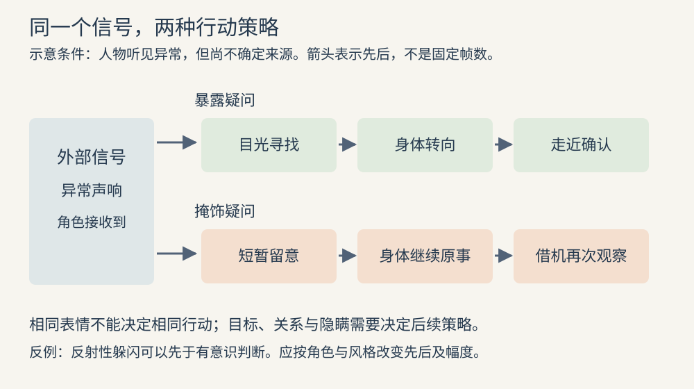

# 表演：让观众读到角色怎样改变行动

表演要解决的不是“这个角色看起来悲伤吗”，而是“他现在要从谁那里得到什么，遇到阻力后怎样调整”。情绪可以被观众感受到，却不宜成为唯一执行指令。同样的担心，可以表现为追问、把话收回、替对方整理衣领，也可以表现为故意谈别的事。选择具体行动，身体、对白与反应才有共同的原因。

## 从目标走到可见行动

角色目标是这段戏中希望改变的局面；行动是为达成目标正在对别人或环境做的事；障碍使行动不能直接成功。纽约电影学院的镜头表演课程把目标、行动、节拍和人物弧线放在场景练习中共同处理。这是一套分析工作的方法，不是要求每个角色把目标说出来。[PA05](sources.md#pa05)

“节拍”在这里指角色的判断或策略发生一次有意义的转变，不等于音乐节拍，也不等于一句台词。可先将一段对话写成“试探—催促—隐瞒—让步”，再找引起转变的外部信号：对方的沉默、门外的脚步，或一个没有被接住的物件。如果转变找不到诱因，表演容易变成演员或动画师展示几种表情。

动画表演教师 Ed Hooks 强调，从角色自己的立场理解他认为有价值的东西，再决定他的行动。这里采用的是创作模型；不能把教师关于人类心理的个人解释当作已经验证的心理科学。[PA03](sources.md#pa03)

| 含混要求 | 可执行的选择 | 需要检查什么 |
| --- | --- | --- |
| 更紧张 | 想让对方离开，却不断看向被遮住的物件 | 看物件是否暴露了秘密；是否符合角色此时知道的信息 |
| 更勇敢 | 先确认同伴退到安全处，再重新迈向危险 | 行动是否有代价；退缩与再次决定是否可读 |
| 更伤心 | 仍努力完成手上的小事，在无人回应后停下来 | 停顿由什么触发；是否只靠配乐替角色解释 |
| 更有压迫感 | 等对方先让出位置，再缓慢占据它 | 空间变化是否成立；是否需要夸张表情 |

表中的选项是方法演示，并非本剧镜头方案。不能把每个内心变化都变成一个小动作：如果所有信息都被外化，角色便没有保留，观众也失去推断空间。

## 反应的先后决定人物是否在思考

一条常用设计链是“接收信号—处理信息—作出决定—执行行动”。它帮助区分受刺激的身体反应和有意采取的策略。Dana Boadway-Masson 建议让情绪变化拥有可读的处理时间，让主要姿态变化对应思想转折，并用停住与移动的对比组织表演。这是动画师的经验，不是固定毫秒数，更不是每个角色都要先转眼、再转头、最后转身。[PA01](sources.md#pa01)

反射性躲闪可以先于有意识判断；闹剧可以故意把决定与动作压在一起；刻意掩饰的人可能先控制身体，随后眼神才泄露反应。设计重点是先后关系能否解释角色，不是四个阶段是否齐全。试剪时可改变处理时间而不换动作：过短可能读成条件反射，过长可能读成犹豫或迟钝。判断必须结合前后文与目标风格。

图中上行选择“暴露疑问”，下行选择“掩饰疑问”。两者共享外部信号，但身体是否立即跟随目光不同。这里的线条不是生理测量，不能据此规定真人或模型必须怎样表演。

## 身体、面部与画框共同承载信息

先问这个景别能看见什么。全身景别中，重心、朝向、手与物件的关系可以比眉毛更有效；近景中，一个眼神落点和呼吸变化可能足够。让动作变大并不必然使情绪更清楚：如果手势与关键眼神同时争夺注意力，反而可能削弱意图。景别的定义与构图条件见[摄影语言](03-cinematography.md)。

面部不应独立播放一套情绪符号。Boadway-Masson 的面部教学强调思想变化、视线目标以及通过实际摄影机检查眼神；对白口型则需听实际录音中的发音和重音，不能只按文字逐字张嘴。[PA02](sources.md#pa02) 因此，画面中的“看向某人”要在最终构图里成立；三维场景中的眼球指向或生成说明中的对象名称，都不足以证明观众看得到这个关系。

制作时先检查支撑脚、骨盆、胸腔和头部之间的关系：人物伸手时身体是否给出必要支撑，持物是否有明确接触，收回动作是否带走原有重量感。这是针对画面可读性的检查，不要求每种动画都遵守写实比例。夸张风格可以改变形体，但需要保持本场戏内部一致的重力、弹性与动作因果。

“保持姿势”也不是把角色冻结成静帧。注视目标、微小重心变化或未完成动作可以维持其意图；如果镜头中的反应本来需要克制，不应仅为避免静止而添加摆动、眨眼或呼吸循环。用小动作填满所有空白，常会把有意义的停顿磨平。

## 台词说法与身体动作如何配合

同一句话改变重音、语速、停顿和尾音，可以改变它对对方实施的行动。Shawn Kelly 的“关键词”教学指出，语义重点不一定更响，也可能更轻；重音可帮助识别表演的重点。[PA04](sources.md#pa04) 但这不等于每个重读词都配一个手势。将它与主要姿态跟随思想转折的建议合并使用：先找台词想改变的关系，再决定哪些声音强调值得成为身体动作。[PA01](sources.md#pa01)

“潜台词”是说出口的话与真实意图之间的关系。例如口头答应、身体仍挡住出口，可能传达有条件的顺从；也可能只是空间拥挤。不能仅凭单个姿势诊断人物心理。需要台词上下文、视线、接续行为共同支持。

对白镜头还必须给倾听者任务：他是在确认、拒绝、等机会插话，还是假装没听见？反应不必比说话者更忙。将所有镜头都围绕说话口型切换，容易丢失关系变化；什么时候保留倾听者，见[剪辑与时间](10-editing.md)。

选择表演参考时，短录几种不同策略比反复完善同一种表情更有用。Nicholas De Lotto 的教学建议观察自然出现的小反应，并可分别检查身体与面部。此处使用的是文章中的工作建议，未把其嵌入视频当作已观察证据。[PA06](sources.md#pa06) 参考应帮助理解动作，不等于复制一个真人的所有习惯，也不能据参考另改锁定的人物设定。

## 行业案例：Big Buck Bunny 的“发生了什么”与“角色怎样处理”

材料为 Blender Foundation 的开放电影《Big Buck Bunny》（2008）。本例实际检查官方文件 01:18–01:36 的连续采样画面，每 0.25 秒一帧；镜头边界只能定位在相邻采样之间，不能声称确定到原片单帧。以下只讨论画面，不对音效、音乐或对白作听辨判断。[PA23](sources.md#pa23)

**实际观察。** 约 01:18–01:20，兔子向上看蝴蝶；随后较宽画面让蝴蝶落向画面右下。约 01:22.5–01:23.5，兔子的双手收向胸前，注意力仍朝向蝴蝶。约 01:23.75–01:24，红色果实进入并落到附近；兔子没有立刻跳到新动作，而是先向下看。随后双手分开，身体弯下捡起果实。约 01:29–01:29.5 出现向上的视线与头部变化，接着画面转向兔子背后及树的方向，再返回手持果实的兔子。低清研究副本不足以支持果实与蝴蝶精确接触的判断，本例不据此断言该接触。

**主创能够证实的范围。** 项目介绍明确把幽默、毛茸茸角色和卡通动作作为整体制作方向，并以开放制作资料服务学习；未找到这段动作逐镜意图的原始说明。[PA25](sources.md#pa25) 下述分析是对可见安排的解释，不是导演口述。

**分析推导。** 片段将外部事件、注意转移、取物与寻找来源分开，使观众有机会读出“角色正在查明情况”。身体由手收胸前到放下再取物，提供了比连续更换面部表情更大的状态差异。先出现向上看的动作，再给树的方向，可把后一画面理解为人物正在寻找的对象；这个解释仍依赖前文与空间建立。

**可选方案与代价。** 如果果实一落下就立刻切树，信息会更早转到可能的来源，却缩短兔子自己处理事件的时间。若只保留兔子近景，表情更大，但手与果实的动作关系可能难以读清。若将停顿大幅拉长，可能增加迟疑感，也可能让节奏松掉；不存在从此片段直接推得的通用秒数。

**可迁移条件。** 当重点是人物如何形成判断，可把“知道了什么”与“下一步做什么”分开检查，保留必要反应。若重点是毫不犹豫的救援或瞬间反射，拖长处理过程会改变人物性质。迁移的是动作因果，不是复制兔子的手势、节奏或夸张程度。

## 怎样判断表演需要修正

先不急于增加动作。将问题分成观众没看见、没理解、理解成了别的意思三类：没看见可能需要改景别或构图；没理解可能缺少刺激与反应的先后；误解可能来自矛盾的目光、道具或后续行为。单靠更夸张通常只能解决第一类的一部分。

检查时说明观看条件。静帧可以检查姿态、接触与视线；连续播放才能检查反应时机和动作过程；带声播放才能检查语气、口型与节奏。静音观看可帮助发现身体是否有意图，但它不是要求对白场景离开对白仍传达所有信息。对关键转折记录“观众需要获得什么、所选可见行为、其他合理解释”，再决定是修正表演、画面覆盖，还是剪辑顺序。
