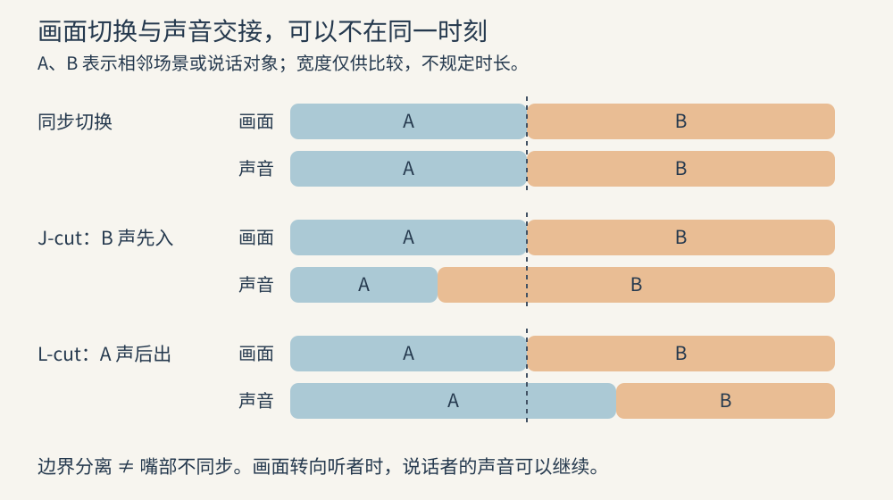

# 剪辑与时间：安排观众何时知道、何时相信

剪辑通过选择素材、安排次序与控制持续时间，改变观众获得信息的路径。同样三个画面，“看见物件—伸手—他人阻止”与“伸手—他人阻止—看见物件”，可能分别突出行动目的与突然出现的限制。画面内容没有变，因果被理解的顺序已经改变。

## 先明确这一刀改变什么

一个剪切至少应有可说明的作用：提供新信息、转移注意、压缩时间、改变观看距离，或制造有意的断裂。不是每一刀都需要隐藏，也不是让人注意不到剪辑才算成功。耶鲁的电影分析教材将图形匹配、视线匹配、交叉剪辑等分别讨论，强调相邻镜头的关系，而非把某一种衔接当成唯一规范。[PA11](sources.md#pa11)

“连续性”是使观众能够建立稳定空间与事件顺序的组织方式，不是要求两次拍摄的每一像素完全相同。人物身份、动作对象、视线与运动方向通常比衣褶的细小变化更影响理解；但显眼的道具换手、位置跳变会破坏关键动作。具体空间依据见[场面调度](05-staging.md)。

有意的跳切可以省略重复过程，强调心理断裂，或让观众注意表达本身。它需要读者知道被省略的是什么，或理解“不确定”就是当前的观看任务。如果本应清晰的交接动作突然消失、一个人物无解释换到另一侧，不能仅以“风格化”替代设计判断。

## 剪切点要回应动作与注意力

剪在动作进行中，常能让观众沿动作寻找接续位置；但“动作中切”并非保证顺畅的公式。两个镜头的动作速度、方向、尺度与注意中心差异太大，仍会产生停顿或跳跃。反过来，动作结束后留一会儿也不必然拖沓：剩下的时间可能正在让人物接收结果。

先问动作的哪个部分必须保留：起意、准备、执行、接触，还是后果。省去准备会更突然；省去后果可能让动作失去重量或人物反应；适度重复接触前后的一小段可以延展主观时间，但重叠太多会被读成事件发生两次。耶鲁教材把这种延展视为“重叠剪辑”，它和保持动作严格连续是不同选择。[PA11](sources.md#pa11)

不要把节奏只换算为平均镜头长度。一个长镜头内部可能有快速的信息变化，一个由许多短镜头组成的段落也可能重复同一信息。Walter Murch 提到，表演、摄影机与导演已经把节奏带进素材，他会先寻找场景内部的节奏，再判断音乐怎样进入；这是其工作习惯，并不排除舞蹈、歌曲或预设音乐主导的段落。[PA07](sources.md#pa07)

Michael Kahn 的访谈则强调，重要对白有时应该让它继续演下去，不必为了切换而切换。[PA08](sources.md#pa08) 两者共同提醒：剪辑并不总靠增加镜头获得强度。保留一个难以逃离的观察位置，也可能是明确的表达选择。

## 声画边界分开，人物同步仍须保持

声音先于所属画面出现，通常称为 J-cut；声音在所属画面离开后继续，通常称为 L-cut。名字来自时间线上的外形，实质是让观众先听、后看，或继续听、转去看另一个对象。Adobe 的教学用这两种结构说明跨镜的声画组织。[PA12](sources.md#pa12)

图中的“声音 A/B”指归属不同场景或说话对象的声音片段；矩形重叠不要求两段始终同响，交接处可按实际需要交叉淡化。图示只解释剪切关系，不规定每段长度。

让声音跨过画面边界，不等于把对白与同一人物嘴部错开。Apple 的分离剪辑文档区分音频、视频边界的延长，实际操作需要原始素材在边界外还有可用内容。[PA10](sources.md#pa10) 对有口型的镜头，归属于同一次说话的声音与嘴部仍应同步；当画面切到听者时，声音继续，才腾出观察听者反应的时间。

选择 J-cut 时，先问提前听到会泄露什么。如果观众先听见危险声，人物还未看见危险，可以制造预期；如果悬念依赖危险保持未知，提前暴露便可能削弱揭示。选择 L-cut 时，问上一场的声音是否仍在解释下一画面：它可以维持情绪，也可能使观众误以为两个空间相连。方法本身不保证流畅，声音的可识别性与空间归属同样重要。

## 压缩、扩张与并行不是同一件事

时间压缩省略观众可自行补足的过程，例如从拿起容器到盛好水。省略成立的前提是被跳过的动作不承载关键选择、障碍或因果。若取水过程中改变了物件归属，直接跳到结果会制造理解缺口。

时间扩张则增加事件被观看的时间：重复一段动作、插入反应或细节，都可能让瞬间变得重要。插入的画面若没有新信息，只会延迟结果；若每个反应都在重复同一种感受，扩张也可能变成情绪堆叠。

交叉剪辑在不同线索之间来回切换，常使观众建立同时发生或即将相遇的预期；但实际时间关系也可以故意错开。[PA11](sources.md#pa11) 制作时必须知道自己让观众相信什么。若救援与危险并不同时，却被剪成即时赶到的倒计时，后续揭示需要承担这个误导，而不能在事后当作时间线错误忽略。

## 行业案例：Caminandes 怎样逐步补全目标与障碍的关系

材料为 Blender Institute 的《Caminandes: Gran Dillama》（2013），官方文件 00:30–00:53。实际检查每 0.25 秒的连续采样画面；以下时间用于定位，切点并非逐原片帧测量。未对本片段声音作直接观察。[PA24](sources.md#pa24)

**实际观察。** 00:30–00:33 左右，美洲驼在近景中咀嚼干草，随后头与眼神改变。此时前景已可见横向围线和立柱，但它们与目标灌木的完整空间关系尚未展示。约 00:33.75 画面切到绿色灌木，持续数秒；约 00:36.75 回到美洲驼面部，随后再次给出灌木。第二次灌木画面逐渐呈现更广范围，横向围线、围栏与警示形状变得可见。约 00:42.5 回到美洲驼全身，之后有停留、身体下沉和向前运动。约 00:47.25 转为围栏侧面的画面，美洲驼从左进入，接近并跃起；约 00:50 可见蓝色闪光，随后美洲驼落回近侧、坐起并看向障碍。

**主创说明的边界。** 本例据官方开放电影成片进行分析，没有取得作者对这组切点逐一解释的材料。不能把“为了先建立欲望再揭示障碍”写成已经被导演确认的意图。

**分析推导。** 第一次灌木画面建立一个可能的目标，返回面部提供人物正在回应它的证据；第二次更广的画面补全围栏、警示装置与目标的空间关系。这一顺序先突出“想过去”的对象，再细化阻挡条件；它不是把此前完全不存在的障碍突然加入画面。近景、目标、宽阔障碍、全身行动分别回答不同问题，快慢变化来自信息任务，而不只是镜头数量。

动作段先保留身体准备，再换到围栏侧面展示接近与后果，使跳跃目标和失败位置相对容易联系。蓝色闪光是可见现象；是否存在某种具体电击音、其响度或节拍如何，均不能由画面代为证明。

**反事实比较。** 开场就展示完整围栏，可以更早建立危险预期，但会减少第二次扩展空间带来的信息变化。若把接近与受阻全部压成一个极短近景，冲击或许更突兀，却可能看不清身体、障碍和落点的关系。若保留更多奔跑周期，观众可能更期待跳跃，也可能在目标已明确后等待过久；需要实际播放比较，不能从采样图推断最终节奏优劣。

**迁移条件。** 当一场戏需要把目标与代价逐步交给观众，可以分别安排“目标可识别”“阻挡条件得到补全”“人物采取行动”的镜头任务。观众已经知道障碍时，不必重复完整建立；若角色理应早已看见障碍，延迟揭示还要确保没有把角色剪得不合理地迟钝。

## 从局部好看回到全场有效

先剪一个动作或一个对话，可以解决局部衔接；最终还要回到段落与全片。ASC 采访的文字介绍用多个场景组合成序列，说明局部与较大段落的层级关系。[PA09](sources.md#pa09) Murch 在另一篇采访中谈到，《冷山》中原本成立的场面，因为其情感重量不适合整体而被删除。[PA07](sources.md#pa07) 从这些工作经验可以推导：局部好看仍须回到全片判断，必要时重新选择取舍。

建议按三种尺度复看：单镜检查动作与信息是否足够；相邻镜头检查视线、方向、声画交接和结果；全场检查目标是否推进、信息是否重复、情绪是否过早见顶。先处理因果不清，再修饰转场。漂亮的匹配剪辑不能替代缺失的故事连接，音乐也不应承担补齐所有叙事空白的任务。

交给后期的素材应保留合理的动作起止余量和声音尾部，具体长度随动作与制作条件决定。任何重新剪辑都要复查字幕、口型、音乐落点与效果声同步，不能只看画面轨道显示正常。质量验收必须连续播放；帧表适合定位断裂，不能证明运动与节奏已经自然。
