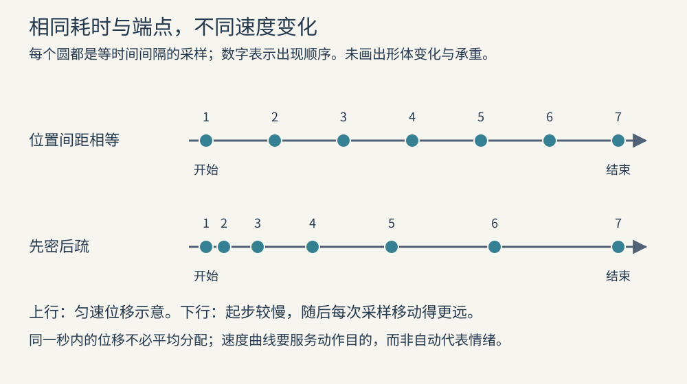

# 动画与 AI 制作转译：把表达意图变成可检查的动作

影视原理说明为什么做出一种选择，制作方案说明怎样实现，成片检查说明实际做到了什么。这三层不能互相替代。描述“角色犹豫后跨出一步”表达的是动作意图；模型能否稳定产生它取决于当时能力与输入；输出中是否真的有可读的犹豫，必须观看后判断。

本章讨论二维漫剧和辅助生成中的表达拆解、预演与验收。模型规格、参考输入、时长限制及 Prompt 方法只查[视频生成手册](../seedance-video-handbook.md)，不在这里建立第二套参数规则。

## 动画表演不是把静帧平均移动

Pixar 与波士顿科学博物馆的教学页将动画工作解释为：用关键姿势明确重要位置，再设计姿势之间的运动，使角色表达场景所需的行为与情绪。其科学家答复说明，中间帧可以由数学曲线计算；这没有取消动画师对关键姿态与过程的设计。[PA19](sources.md#pa19)

“关键姿势”不是所有好看静帧的集合，而是决定动作含义的状态。例如一次递物，可能至少需要分清“仍然握有”“允许对方接触”“自己松开”。若只有递出前后两个漂亮姿势，交接过程仍可能看不懂。关键状态也不必都停住：它们可以在连续运动中被读到。

二维漫剧可以保留有限动作与较长停留，但要明确运动重点。轻微的摄影机位移、头发摆动与光影变化不能自动代替人物的决定。反之，一张静止画面若有恰当的声音与前后镜头关系，也可能完成叙事，不需要为“像视频”让所有部分不停运动。

## 时长与间距分别决定什么

动画中的“时间安排”（timing）回答动作经历多少时间；“间距”（spacing）回答相邻画面中物体位置变化多少。两者关联，但不相同。同样一秒的位移，可以匀速，可以慢起快落，也可以大部分时间停住、最后迅速到达。

加拿大国家电影局的动画教学把时间安排、缓入缓出、预备动作与跟随动作列为可选择的表达工具，并明确提醒不是每部动画都必须采用所有原则。[PA22](sources.md#pa22) 因此，不应把传统卡通原则变成所有二维漫剧的装饰清单：克制段落、图形动画、定格或故意机械的表演，都可能有不同运动规律。

图中每个圆表示等时间采样的位置，数字表示先后。上行位置间距相等，下行开始密、随后疏；第二行只是慢起的示意，不代表某个情绪必然采用这个速度曲线。图示还不能说明身体如何承重、弧线是否自然，需要结合姿势与接触一起判断。

“预备动作”使即将发生的动作获得方向、力量或意图的线索，例如向前跃起前重心短暂下沉。“跟随动作”指主要部分停下后，相关部分继续运动再稳定；“次要动作”则是支持主要行动的补充行为，如等待时有目的地揉捏衣角。后两者不应混称，也不能因能添加就添加。[PA22](sources.md#pa22)

## 插值能填过程，不能替代判断

Blender 官方文档把关键帧解释为某个时间的属性值，曲线横轴表示时间、纵轴表示属性；不同插值决定关键帧之间怎样过渡。[PA21](sources.md#pa21) 这揭示一个常见误区：两个端点正确，不代表中间路径正确。平滑的曲线仍可能使手穿过物件、脚在地面滑动，或在交接之前松开。

“逐步顺画”是从前一状态不断向后发展；“关键姿态法”是先确定重要姿势，再补中间过程。前者便于发现有机变化，但可能难以控制终点与时长；后者便于检查因果与调度，却可能在补间处理不足时显得机械。这是工作取舍，不是手绘与数字工具的绝对分界。[PA22](sources.md#pa22)

转到生成式工具时，不应把它等同于任何一种可精确控制的补间器。先把最重要的开始状态、变化与结束状态写清，实际能力如何承接，再按手册和当次输出验证。用模型名称解释为什么一段动作“不需要符合因果”，会混淆制作限制与表达选择。

## 用动态分镜检验时间，而不是提前假定成片效果

“动态分镜”（animatic）是按时间排列的分镜画面，可配临时对白、声音与摄影机示意，用来检查段落长度与信息次序。Toon Boom 文档说明，调整镜头面板的持续时间会影响时间线；某些调整保持后续时间，另一些会让后续整体移动。[PA20](sources.md#pa20)

这个差别直接影响制作交接。把一次反应从短停顿延长，可能需要同时改变下一句台词、音乐进入和动作开始；如果只延长画面而不重查声音，预演就会制造假的节奏问题。帧数与秒数必须注明所用帧率，不能把“12 帧”当作固定半秒。

动态分镜适合发现这些问题：重要物件出现太晚、动作对象不清、反应被下一句抢走、场景缺少建立、两条线索的时间关系矛盾。它不证明最终动作自然，也不证明最终画面或声音质量合格。静帧上的推拉示意与成片真正的空间运动不是同一证据。

先用最少的必要画面回答场景问题，再决定是否需要更精细的预演。若不确定的是空间路径，需要位置与视角；若不确定的是对白节奏，需要可听的准确对白或明确标注的临时录音；若不确定的是人物动作重量，仅拉长分镜停留无法解决。

## 将镜头意图交接为状态、事件与边界

下面的交接表是本知识的制作归纳，不是某一模型的参数表。使用时以实际作品输入锁、准确参考与现有方案为边界，只补充表达判断，不改写已锁定事实。

| 交接项 | 要说明的内容 | 可检查的证据 |
| --- | --- | --- |
| 镜头任务 | 观众此刻应知道、注意或等待什么 | 与前后镜头合看，是否多余、提前泄露或缺失 |
| 开始状态 | 人物、道具、视线、位置与动作阶段 | 第一段有效画面，而非只看封面 |
| 核心事件 | 谁对什么做了什么，何时改变策略 | 连续过程中的行动主体、接触与因果 |
| 结束状态 | 需要接给下一镜的姿态、持物与方向 | 最后有效画面及下一镜开头 |
| 时间关系 | 哪些必须先后，哪些可以同时，哪里需要反应 | 实际播放及必要的逐帧定位 |
| 允许变化 | 可调整的动作细节、幅度或镜内节奏 | 与准确参考、场景风格对照 |
| 不可变化 | 身份、衣物、道具归属、空间关键关系等锁定条件 | 输入与输出逐项核对 |
| 声音职责 | 对白、画外信息、环境与音乐的必要作用 | 实际带声播放，另查同步与可懂度 |

对复杂动作，最先拆的通常是因果阶段和依赖关系，不是句子长度。递物必须先建立接触，另一只手才可能放开；跨越障碍必须明确近侧、远侧与落点。如果一个镜头承担太多互相依赖、又难以验证的变化，可以评估拆镜；但拆镜也会增加连续性成本，不能把所有困难都外包给切换。

对多角色对白，明确当前主导行动的人、需要被观察的听者和视线目标。对悬念，标明观众、角色各自知道什么。对歌曲，明确动作是否必须跟随节拍，或只跟随歌词段落。上述选择先通过[表演](09-performance.md)、[剪辑](10-editing.md)与[声音](11-sound.md)的原理判断，再进入工具执行。

## 按失败类型修正，不用“更多细节”覆盖所有问题

| 实际问题 | 优先回查 | 合理的修正方向 |
| --- | --- | --- |
| 角色一直动，却没有可读转折 | 目标、刺激与反应是否明确 | 简化动作，保留关键判断；必要时调整覆盖 |
| 端点正确，中间接触错误 | 对象归属、接触顺序与运动路径 | 补足关键阶段，评估拆镜或其他实现方法 |
| 运动平顺，却没有重量 | 支撑、准备、速度变化与停止后的反应 | 修正承重与节奏，不只添加模糊或抖动 |
| 一镜清楚，接下一镜就错 | 结束状态、方向、持物与声音延续 | 同时检查边界两侧，明确由哪一镜修正 |
| 画面漂亮，故事仍不清楚 | 镜头任务与信息揭示顺序 | 回到动态分镜和整场，而非继续加质感 |
| 字幕正确，表演仍不自然 | 发音、呼吸、重音、口型和动作时机 | 实际试听与播放，不能靠文字校对验收 |

修改之后要检查相邻镜头与全场，因为局部修复可能把问题推到边界。只看首尾帧会漏掉中段形体变化与接触错误；稀疏采样可帮助定位，却可能漏过极短异常，也不能验证完整运动节奏。最终验收需观看实际完整片段并试听相关声音，明确本次观察条件与尚未覆盖的项目。

本知识给下游任务提供的是决策依据。制作记录应说明采用哪项原理、为何适合当前镜头、有哪些代价，以及实际结果怎样验证；引用章节并不等于已经应用，更不等于用户已经认可作品。
