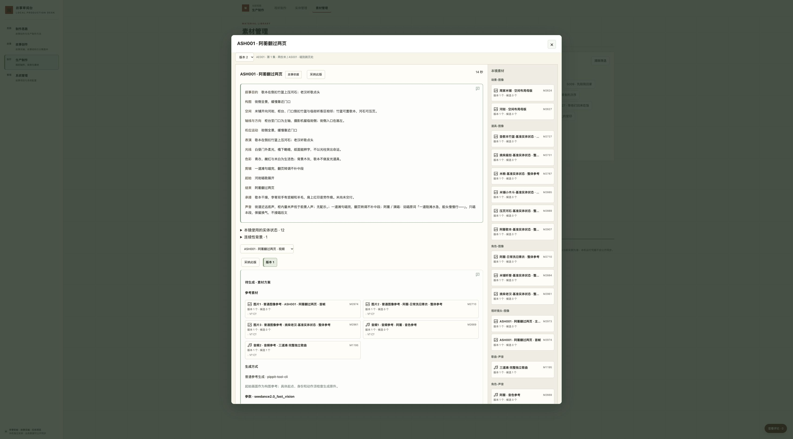

# 编号查找、用途组织与连续审阅验收

本任务补齐了按持久编号和中文内容查找、按当前目的组织素材，以及从实体状态或素材来源进入准确完整镜头的连续阅读。软件契约由配套审阅台的 `docs/small-cards.md` 维护；本文件记录本故事的隔离验证与交付边界。准确系统提交由 `config/instance.json.review_desk_commit` 维护，正式部署和完成状态以主项目任务 `task-20261009-0007` 的冻结包及实际回执为准。

## 改动前实际工作成本

2026-10-09 在正式入口 `http://127.0.0.1:3000/` 通过 Chrome 只读重走三类工作。没有提交评论、采纳、生成或外部 AI 请求。

| 工作 | 正式页面基线 | 对当前工作的影响 |
| --- | --- | --- |
| 编号或动作找素材 | M2624、ASH001 均为空；“周家米铺”5 个独立素材、9 个位置展示项；“阿蘅翻过两页”3／3 | 编号无结果后需改用名称；名称命中不等于来源编号已贯通 |
| 找阿蘅基础音色 | M1134 为 1 个独立素材、30 个真实位置展示项，默认 3 页；实际点击两次下一页到第 3 页 | 同一份音色要跨页重复辨认 |
| 按场景内容浏览 | 实际选择 E17 后，场按钮只有 S040／S041／S042 | 需要记编号或另查剧本才能辨认场次 |
| 实体状态反查 | EN070 为空；“渡口”有船家与渡口两项。实际打开 EN070→ST167→ASH097，落到仅一行叙事目的的依据弹窗 | 为看完整方案，需要关闭叠层、换入口并重新定位集场镜 |

5／9、3／3、1／30 的分子是唯一素材身份数，分母是素材在真实位置分组中的展示次数；不是版本、候选、文件或生成次数。本轮重核接口仍为这些数值，关系没有删减。查找模式下界面按身份展示，因此“周家米铺”为5／5，M1134为1／1；真实位置用途仍分别可追溯。没有测量工作耗时或节约比例，不外推其他用户或历史坏链接数量。

## 最小候选、反馈与迭代

先启动由正式一致备份初始化的独立实例 `http://127.0.0.1:3307/`，完成以下可运行闭环，再迭代：M2624→一张准确卡→打开→关闭回原搜索；M1134→一张卡→展开30处用途→S040准确依据→返回展开列表；EN070→ST167→ASH097完整设计和视频方案→剧本依据→后退两层回原状态。

真实操作反馈促成了四项调整：未选集时也提供带名称的场次选择；同一用途内重复的正文入口合并准确高亮块，历史修订保持独立；完整镜头补入同卡的设计版本选择及迟到响应保护；动作搜索仅跟随直接来源镜头，不把状态说明中转述的其他镜头动作作为来源动作。最后一项曾使“阿蘅翻过两页”从3项扩到6项，收窄后真实页面恢复为3项。以上是执行 Agent 的操作观察，不冒充用户逐项认可。

## 隔离真实浏览器验收

| 验收项 | 实际操作与结果 |
| --- | --- |
| 编号、名称和动作 | M2624、小写 m2624 定位空间布局母版；ASH001 与“阿蘅翻过两页”定位 M2973／M2974／M2975；“周家米铺”保留5个独立对象。EN070、“渡口”、EN002、既有别名“阿禾姐姐”和ST167均找到相关实体；编号按完整身份匹配，中文按明确字段匹配 |
| 查找与浏览目的 | M1134只展示一张卡，30处用途全部可展开。展开后刷新仍展开；进入E17／S040依据并关闭返回原列表。搜索与E17、S040、声音、有结果组合为一项；逐项清除保留其余条件，清除场后为E17的3处位置展示。清除全部、改每页5行、翻第2页并刷新，仍是第2页；打开M1237并关闭回原页 |
| 可读名称 | 场次按钮提供S040“这一页我来”、S041“唱完这一首”、S042“门没有闩”等既有名称；故事S编号与视听AS编号并存。版本一S001和版本四S001的原文、地址及版本控件分别正确；同一地点的不同场以编号和内容名区分。ASH001及镜头需求去掉旧位置前缀，数据身份和内容标题不改写 |
| 完整反查与准确历史 | EN070→ST167→ASH097展示空间、轴线、表演、光色、起止、声音、视频Prompt、参数、参考及本镜素材。设计版本2与版本1分别读取准确修订，历史版显示其旧空间／轴线内容；连续选择2→1→2后保持最后选择。ST168关联ASH097／ASH098，打开ASH098后关闭回ST168。另从M2975来源打开E01的ASH001完整设计，区别于E05的ASH097 |
| 失效与恢复 | 受控未知结构修订显示失效且不打开第10稿；主动选择第8稿后地址、标题和本稿评论同步，已有C136“定位原圈选”仍定位第8稿。E17未知场次显示不可用且不展示S040正文、不开意见入口；主动选S040后恢复准确地址与全文。主动选版本一有合理的首集首场默认。不存在的对象或镜头修订明确拒绝，不替换最新版 |
| 连续上下文与草稿 | 在ST167选中文字创建未提交隔离草稿，进入ASH097及剧本依据后后退两层，恢复ST167、EN070搜索、关联镜头展开、URL和原草稿；镜头卡与ST168未出现此草稿。关闭素材来源与嵌套设计恢复外层选择和列表页码。真实快速版本选择完成，固定迟到响应另由自动检查验证；没有用页面快速选择声称覆盖所有网络时序 |

受控坏URL仅证明当前处理方式。输入的[结构截图](evidence/formal-missing-structure-fallback.jpg)和[场次截图](evidence/formal-missing-scene-fallback.jpg)保留原件，SHA-256与任务输入一致；图片没有地址栏，链接变更事实依据任务规划，不能从图推断历史坏链接数量或评论跨修订串写。

## 自动检查与证据边界

本任务独立候选的全量 Python unittest 409项和 Node 测试685项通过。冻结前合入两仓最新主干，保留评论参考与准确决定的共同组件；合入后重跑全量检查，Python419项、Node690项通过，并通过Chrome复走EN070→ST167→ASH097完整设计及返回展开状态。最后的小范围复验覆盖搜索归一化、名称、准确读取和历史结构。新增检查覆盖直接来源字段、排除内部JSON／生成Prompt／上下游递归、筛选交集、完整历史设计、身份查找与位置浏览、未知剧本定位、版本失败恢复和迟到响应。既有评论目标、草稿和历史路由检查同时保留。

测试生成遵循 `bits-unit-test-gen` 的准备、范围、缺陷分析、生成与验证步骤。曾复现历史版本读取失败后选择框未恢复的边界问题，生产代码已修复且原失败检查通过。准备与 `utree flush` 已执行，但本机缺少utree，未能落盘其专用报告；原生测试结果仍由真实命令取得。自动检查证明代码契约；API重核证明数量与引用；浏览器操作证明上述界面行为，三者不能相互替代。

## 正式发布与收尾入口

沿[双仓工作区与发布](../generation-workspaces.md)先提交系统，再固定故事实例提交引用，冻结整组候选。代码发布使用已有 `material_review_release.py`，消费原生任务交付回执；不导入任务快照或业务数据。发布脚本核验原正式容器与挂载，保护评论、采纳、原件和不可变修订，切换后仍必须从原路径通过正式浏览器只读复验。

正式运行版本、发布前后业务行保护、正式页面复验、准确容器／镜像身份、删除数量和保留用途记录在任务账本完成说明及本机回执。本文件不以隔离通过或Git推送代替正式验收。隔离服务、复制媒体、测试库、可再生缓存与失效过程文件在正式复验后清理；本轮原件和必要验收证据保留。工作区待TUI退出、运行锁释放后由 `codex.project task cleanup` 受管退役，保留分支与会话历史。
