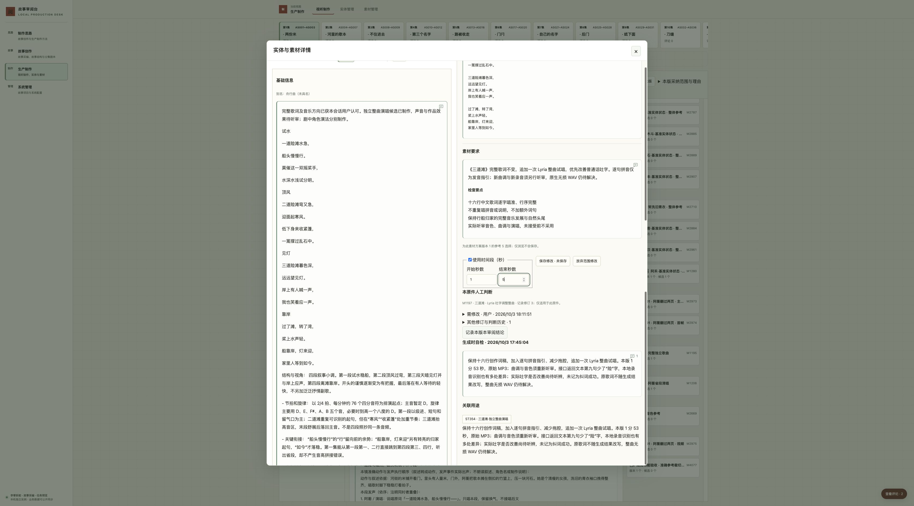
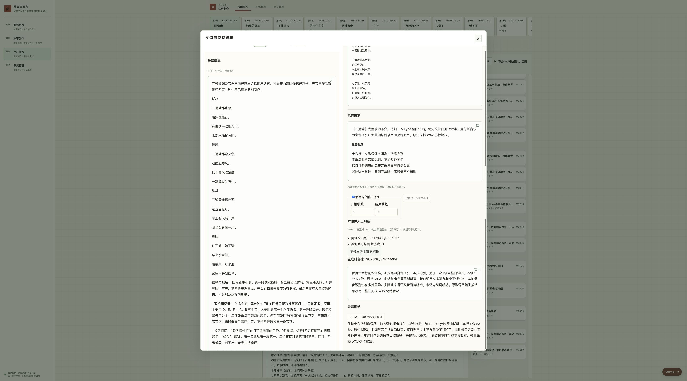

# 准确参考保存、核对与再次调整验收

`task-20261009-0011` 解决准确参考保存后不能继续核对、重开和再次调整的问题。制作者现在可从消费卡看到已保存片段，重新打开同一准确版本，调整后保存或明确放弃范围修改。选择只修改当前消费方案；浏览、作品认可和真实生成分别处理。系统契约见配套审阅台 `docs/production-breakdown.md`，完整范围见 [任务规格](../../planning/reference-selection-loop-task.md)。

准确系统提交由 `config/instance.json.review_desk_commit` 维护。双仓集成、正式服务切换、正式数据保护及清理结果以主项目任务账本和本机发布回执为准；本文件中的隔离通过不替代正式验收。

## 执行时重现

2026-10-09 从执行时有效正式库的一致性备份初始化本任务独立实例，在 Chrome 的 `127.0.0.1:53858` 实际操作。起始系统为 `38335b4`；冻结前合入系统最新主干 `beb642e` 与故事最新主干，之后重新载入最终候选复走保存及重开。

ASH001 的视频需求 M2975、音频2的 M1195 在当前输入位置为参考5。首次未勾选使用时间段时，数字框正常禁用。勾选并保存1–4秒后，隔离库准确修订为 `47e5e42ff5678bb2c589a38adaa56d8c68362b4c7b232de1b2f9894c64c8f16b`，记录修订4、素材方案仍V1。改成5秒，页面仍显示已保存且按钮禁用；关闭后已选入口报版本已删除，而同镜普通素材入口能打开113.14秒原件、Prompt和自检。原件候选为 `asset-songs-boat-full / 72894b94…` 的 original 组成；没有据错误提示认定原件丢失。

另以只读 Store 回查原3303隔离库：该次准确保存修订是 `a63525bbb8e2eb0d2b1fec5d237aa44f3c074e9e63bbdb3236ca488413e87b7c`，记录修订4、参考5范围1–4秒，操作编号 `shot-ref-d4dc21b9-5b0f-4e3e-ae83-17c9088a465e`。正式库不存在该修订；没有套用旧3301的修订。原四张截图仍由任务输入管理，文件名与哈希见任务规格。

## 实际使用与反馈

最小候选先补齐当前基线与保存回执衔接，实际完成重开、1–5秒再保存、返回核对、放弃修改、切另一输入及返回。两项实际反馈促成修正：

- 数据库JSON键顺序不同，曾将相同1–4秒误标成未保存；改为按范围值比较。没有为此产生新方案版本。
- 通过仅隔离的2秒响应延迟，实际发现已有一次保存后，在第二次保存中关闭会先刷新旧回执，使新响应无法更新返回页。改为等待正在保存的请求结束，并在其他读卡关闭、回到原上下文后刷新。重走后，图片1卡保持自己的内容，返回音频2读到实际4秒。

消费卡直接显示时间范围；详情用原保存按钮表达已保存／未保存，并提供放弃范围修改。预览组成不可保存时说明应选原件。没有新增参考管理层级或要求用户理解版本基线。

## 六项验收对应证据

| 项目 | 已实际执行的隔离检查及边界 |
| --- | --- |
| 保存事实与消费对象 | 1–4、1–5反复保存与返回核对，候选、original组成、参考5及方案V1一致；记录修订逐次变化。准确重发同一已成功操作返回 already_applied、相同修订，不追加落库。基线比较仅M2975及一个一次性测试消费需求的当前头变化，其余镜头、CALL、原件和评论不变；测试修订未进入正式库 |
| 准确再开 | 已选入口和普通入口均读取M1195当前V1/C1；合法旧V3深链实际规范到带基线的当前V1。已删除旧V1、错误基线以及M1206候选误传给M1195版本均在真实页面拒绝，没有回退最新版 |
| 调整与未保存 | 保存1–4后改5可再次保存；返回卡与重开字段显示实际1–5。改5后放弃恢复1–4且不写入；空值在请求前拒绝，修正后可保存。起止倒置、超界及非法裁切继续由既有服务端校验拒绝 |
| 候选、组成与裁切 | 当前生产方案的视觉参考尚无可供裁切的候选，因此只在隔离库新建一个明示测试用途的消费需求，引用既有M1280图像和M1206音频，不创建任何媒体。图像裁切x=.1、y=.2、宽=.5、高=.4保存与重开一致。M1206 WAV original保存1–4，切MP3 listening预览不能保存、不沿用原件范围；切回original恢复准确已保存值。候选切换的独立草稿与迟到响应另由自动检查覆盖 |
| 并发和版本保护 | 两个Chrome页同时读取同方案，先页保存5秒，旧页提交6秒收到409、保留6秒编辑值且未覆盖5秒。真实保存中关闭、进入另一输入及返回通过2秒延迟实践并修复。自动检查固定验证保存中继续编辑、快速候选切换、页面切换、旧响应和冻结调用有效路线映射；冻结改选建立新版，旧CALL和旧方案不变。生成准备仍阻断未选参考及未获采纳内容 |
| 交付可复验 | 先系统提交、再故事准确提交引用，经受管双仓准备和交付；代码发布使用既有material_review_release.py，不发布测试数据库或任何测试选择。正式原路只读复验和删除数量记录在完成说明及本机回执 |

接口证据确认准确值、操作幂等和数据归属；浏览器证据确认上述可见行为。延迟环境只用于确定请求时序，不表示生产性能。没有外部AI请求、媒体生成或生成费用，没有音质、旋律、质量或采用判断，也未量化制作提速。

## 自动检查与收尾

同步最终主干后，系统Python unittest 419项、Node 705项通过。新增13项前端回归覆盖打开基线、保存状态、准确回执、JSON数值比较、放弃、失败重试、空值、保存中编辑、候选／组成切换、冻结位置映射、关闭迟到响应、返回刷新及已有结果时的第二次保存关闭；既有准确链接、幂等、事务并发、冻结历史、生成准备检查保留。

测试生成按 `bits-unit-test-gen` 顺序完成准备、语言及范围加载、缺陷分析、生成与真实验证。第一轮三个测试稳定命中基线缺失、busy未释放和旧修订／槽位身份，随后按任务授权修复业务；全量检查曾发现一项旧夹具只返回版本号，已补为真实保存回执格式而保留原迟到保护断言。`utree flush` 已执行，但本机缺少utree，专用报告未落盘；原生测试日志可核验。

正式发布后只读重走ASH001→M2975→音频2→M1195、普通素材入口及带当前基线的准确链接，核对正式未选状态、原件及历史判断保留。发布器回读准确镜像、容器、正式挂载和业务表保护后，停止本任务原生预览服务，删除两份测试数据库、复制媒体、缓存及一次性延迟脚本。候选镜像如已成为正式当前版，按正式用途保留；本任务未建立预览容器。具体实际删除数量、路径回读和保留用途由完成回执记录，不以工作区退出代替资源清理。

工作区在TUI仍打开时保留；退出并释放锁后由 `codex.project task cleanup` 受管退役，分支、提交、任务输入和必要回执保留。作品制作、采纳及真实生成继续沿原准备条件推进。
