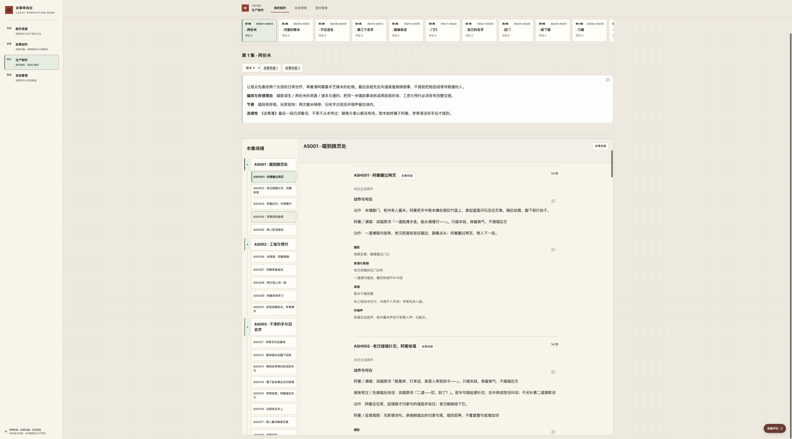
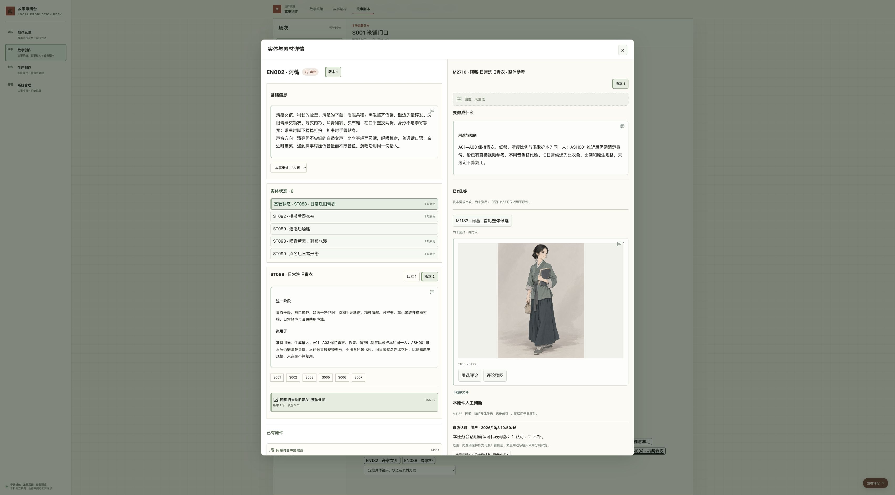

# task-20261010-0012：生产制作整体简化

本任务解决的是人在制作页反复拆读字段、穿过技术记录才能看到作品和原件的问题。候选已完成通用实现、本剧准确编排和隔离浏览器实操：整场按动作与对白连读，专业差异就近出现；人物设计旁直接比较已有原图及其判断；素材列表先提供已有结果。模型参数、重复 Prompt 和确定性检查由准备工作承担。作品、原件、设计认可、生成许可和镜头采用仍分别成立。

交付范围是双仓 Git 候选与隔离验证。正式服务没有应用本候选。执行者实际看过人物原图及页面；两份声音的文件、播放器和片段意见已验证，但未实际听审，没有真实视频成片，也未完成 Review 负责人独立复验。这些边界不能由自动化测试或历史母版认可代替。

## 同一输入下的前后变化

输入规范及早期假设的修正沿 [任务规格](../../../planning/production-simplification-task.md)、[输入清单](../../../planning/production-simplification-inputs/manifest.json) 及其核证文件。原八项媒体和追加人物视口的身份、哈希与源名映射保持；小样仅提供已经做过的阅读、图像和导航证据，本次另验产品候选。

| 真实工作 | 原先负担 | 候选行为与实际价值 |
| --- | --- | --- |
| AS001 五镜／ASH001 | 场摘要、镜头字段、动作、声音和完整 Prompt 重复，动作被卡片打断 | 连续读五镜，空间、轴线、光色在共同条件中交代；摄影、表演、剪接、未定原词留在发生处。摊本压石后开唱、唱完翻页、李寄第四镜入画可顺读核对 |
| EN002／M2710／M1133 | 人物说明、状态、需求及检查重复；已有图位于后续入口，生成参数先占据阅读面 | 人物与状态保留差异，当前用途旁先看完整原图和仅适用于该母版的已有判断，再读独有制作选择。原图可放大及圈选评论 |
| AS001 找素材 | 无结果方案和有原件混排，需求数容易被当成成果数 | 57 个规范素材身份明确分为 14 个有结果、43 个无结果；已有结果先出现。这个数字不代表 57 个成片，也不计重复引用为新素材 |
| 故事剧本进入制作 | 大量关联按钮与折叠打断剧本，首次进入实体依赖尚未加载的制作目录 | 当前故事场直接列 2 个视听场与 18 个实体；其余 113 个准确关联通过导航选择器到达。打开人物图、放大、返回后保留原剧本修订和阅读位置 |
| M1134 与 M1187 切换 | 卡内切换出现裸英文历史用途名；直接打开中文正常 | 两条入口均沿准确历史状态补齐中文标题；保留原件、判断和 ST089／ST093 历史版本。保留的左侧 ST088 仅是浏览上下文，不冒充 M1187 用途 |

本次修复的额外实测问题是：从尚未加载制作目录的新故事页面直接进入实体时，关联入口读取不存在的数组而失败。入口改为识别明确的对象类型，并保护尚未加载的目录；已用新的故事页面重新操作通过，补有相应回归。未发现原件串错，也未将中文名称修复描述为原件串错修复。

## 整合了什么，保留了什么

本剧在 `config/instance.json.production_reading` 保存 134 份准确修订编排。它们覆盖 AS001 场及五镜、AS012 场及六镜、人物与日常状态、M2710，以及实际输入和基础音色的具体用途。正文只从原块提取，保存原文哈希、Unicode 字符偏移、逐块处置理由及必要的相邻准确记录，没有第二套台词或新故事版本。

AS001 场目的中“最后由她先走向道具屋继续做事”属于后续场段，因此不提前放入这五镜；整集设计和原修订仍保留。目录式拆镜摘要由五镜完整正文承担。ASH001 的摊本压石、开唱、唱完翻页按同一次事件保留在动作正文，不再由目的、起止和声音各重印一遍；街道及量米底声持续全场，独立回话和声音事件分别保留。第三镜“下回补上”的应答原词仍待定，没有借整理展示补写台词。

EN002 的身份说明完整呈现，ST088 仅在该准确身份同时出现时省去逐字相同的第一段，保留干燥、袖口、鞋面、伤势、精神、持物及声线条件。日常可以拿小米袋，不等于开场已经取得工钱；镜头明确保留米袋不入开场。M1133 图中的书与小袋是形象比较依据，不直接复制成 ASH001 的动作。确切年龄、方言等未确认内容没有被宣布解决。

M2710 的重复身份描述由相邻人物与状态承接；用途限制及真实准确参考保留。尺寸、谱系、模型装配和总时长检查由准备工作承担。听审后选择对应乐句 2 至 8 秒属于人的真实决定，完整保留，不能以确定性时长校验替代。

M1134 的 103 条准确用途保留各自归属，17 组不同的创作取舍分别阅读；只有全文相同的用途说明合并显示，每条关系仍有准确入口与意见落点。声线身份不代表唱腔、完整歌曲或嗓哑表演通过。M1187 始终是另一准确原件。

AS012 六镜作为正常对照完整阅读：ASH081 先以干鞋站在幕旁，掀幕后退撞桶，水才漫过鞋面，裙脚变湿而袖口仍干；摄影、湿区、呼吸与声音连续性分别保留，不能被“同一人物”或相似词句合并。

系统只验证归属、哈希、完整块清单、区间和相邻条件，不能证明语义完整。134 份编排均通过真实 `production.record` 的完整投影重新校验；其中 M2710 的规范素材定义必须连同其准确投影读取，不能用底层单行载荷冒充页面全文。新修订、缺失相邻记录或不合契约的编排回到完整原文。通用行为覆盖共同入口，本任务没有对全剧每份历史文本重新创作或回填旧方法。

准备方法见 [制作阅读准备](../../production-reading.md)。原件、判断、独有专业内容直接可读；导航、版本选择与精确旧意见回查各自承担操作，不以新的“高级模式”藏起面向审阅的正文。

## 人工决定与系统约束

不存在统一的实体→状态→需求→用途逐层采纳流程，本次不把“取消该流程”计为收益。状态不是可独立采纳对象，用途没有必经采纳按钮。准确状态素材方案的单项认可与实体有效生成许可择一；普通内容认可不自动成为生成许可，实体身份自有需求不能借状态许可执行。

场／集认可可覆盖相应准确镜头设计，不覆盖素材方案。原件选择、原件评价、设计认可和生成许可继续保留各自范围、撤销与版本约束。本次用独立测试库验证两条许可路径、撤销、状态不可采纳，以及场镜覆盖不能放行素材；没有把测试动作写入正式认可，也没有新增付费调用。

## 浏览器与反馈实操

环境为本任务独立 SQLite 副本和复制的媒体，Chrome 访问 `http://127.0.0.1:53518/`。操作和截图来自候选实际页面。以下编号仅属于隔离实例；准确对象、修订、文件、原句、区间和正文见 [执行证据](execution.json)。

| 操作 | 实际结果 |
| --- | --- |
| AS001／ASH001 连读与意见 C283 | 对“不提前把她拍成等待救援的人。”圈选保存；未保存修改经刷新恢复本机草稿，再保存并定位回同一准确原句 |
| M1133 区域意见 C284 | 实际看图、圈选衣物和持物区域，保存、刷新、重开并恢复原文件上的归一化矩形区域；没有迁给当前需求 |
| M1134 时间意见 C282 | 保存原录音 0–1 秒意见，刷新后重开定位仍是 M1134 的文件与范围；验证时间锚点，不代表实际听审 |
| M1134→M1187→M1134 | 分别回读 14.50 秒、9.88 秒、14.50 秒的原件身份及各自人工判断；历史用途名可读，未切到当前状态修订 |
| 直接打开 M1187 与返回 | 准确链接显示其 9.88 秒原件和 10 月 3 日 11:39:06 判断；返回保留此前浏览上下文。历史 ST089／ST093 独立可达 |
| 来源原文 C285、故事结构 C286 | 在实际页面圈选、保存并定位准确原文；测试意见没有更改作品、译文或认可 |
| 未呈现区间 C287 | 用 API 在隔离库准备一条指向 AS001 后续场段句的回归意见，再在浏览器实际“定位原文”；直接显示原块并高亮原始 30–45 区间，没有绑定到相似新句 |
| 故事→人物→图像放大→返回 | 实际从首次加载的故事入口打开 EN002／M2710／M1133；退出后仍为原剧本场及准确修订，阅读容器 `scrollTop=1024` |
| AS012／ASH081 与素材寻找 | 实读六镜，核对干湿先后及不同嗓音；AS001 素材列表实际显示 57／14／43 的身份和结果口径 |

C282–C286 均由浏览器保存，C287 明确是 API 准备、浏览器定位的技术回归。它们是执行者测试意见，不是用户新认可；评论历史、草稿和原件判断不相互替代。关闭与重开事件沿革、跨版本和多候选的更多确定性边界由既有自动化回归覆盖，不冒充每项均重做过人工浏览器操作。

截图补证：[图像区域意见](image-region-feedback.jpg)、[未呈现原句回查](omitted-comment-original.jpg)、[M1187 直接入口](m1187-direct.jpg)、[ASH081 状态变化](ash081-transition.jpg)、[乐句听审选择](song-range-choice.jpg)、[原文意见](source-comment.jpg)、[结构意见](structure-comment.jpg)、[素材寻找](as001-materials.jpg)。[AS012 阅读文本](as012-reading.txt) 和 [素材列表文本](as001-materials.txt) 是同次浏览器正文读取，不是模型对音视频的感知结论。

## 准确输入与回归结果

| 对象 | 准确修订 | 文件或历史用途身份 |
| --- | --- | --- |
| AS001 | `91b490a1a6f6b6a8448acbd939cc7b8e64ebf77e350ca85ef660392b2cd1f9ce` | 五镜当前设计；动作仍依各准确方案 |
| AS012 | `d69356304bfa98a6d49fca4c406d9eb05c476d6b5e0a67c8caa98a8436c15b98` | 六镜，ASH081 干湿变化 |
| M1133 | `e0e3e576207967838b531d30c69e5aa2841d44b7312818bc107c8f06d1ee7145` | 2016×2688 原图，SHA-256 `6f9cb6a1cabddd8ce34630709e0993ef66c69a66429a330f7cf943107b6c890f` |
| M1134 | `e522f05e989232e8323608cc74addd94b5e542c15c2d69692109c5fdd3e78ecb` | SHA-256 `a7d678681c2e490de0a7dc8aca163131f68e196ceda703dc9c9282418c589272` |
| M1187 | `d1ffb26facaa914964afdca0794ec2c4e492131a85305ed80382729a7e933450` | SHA-256 `1c03d8d5efa4320e75086932bd28489ec714c8eaaa87bbe84daf57c6aafb1c16` |
| 历史 ST089 | `706bb1752683582d1c3fceed7eaea4deb3f0629974aa4144a50014dd91b09985` | 连唱后嗓哑 |
| 历史 ST093 | `072cd6891e031c2bc588646f02606eecbb26c9209a43aaeb53cd267186d2ed07` | 嗓音劳累、鞋被水漫 |

在 desk 任务工作区执行 `python3 -m unittest discover -s tests -v`：502 项通过，66.412 秒。执行 `node --test tests/*.test.cjs`：874 项通过，0 失败，597.698 毫秒。结果摘要与原日志哈希见 [测试结果](test-results.txt)。最终编排理由和两条歌曲选段说明调整后，重新校验 134 份准确投影并在浏览器回读歌曲说明；通用程序未再改变，不重复整套测试。

回归覆盖编排失效回退、新修订、Unicode 区间、原件历史与中文名称、首次故事入口、准确引用、冻结包、评论定位与生命周期、许可和素材边界。导出包不附加展示编排；旧调用和冻结方法没有被整理展示重写。

开始基线为故事 main `afd5ac0c4f1209085bac9cab0f2136399494a780`、desk main `e2b5b97103c7d2860e0d370f4eee691d9b6a4532`；阶段保存和最终候选前分别核对本地 main、origin/main 与远端。系统候选准确提交以本提交的 `config/instance.json.review_desk_commit` 为准；双仓最终 Git 集成与推送回执由主项目任务账本保存，不能用本报告预言未来回执。

正式只读核查：容器 `8f4db084a608209c6d9a39ff404d38c3e757da60422cb99e9476dfe39cfa45cb`、镜像 `sha256:36b2166cceb56a21218217f51461bf9a2afdf2b07ee98e902433d3d0c0b839d5`、运行配置 SHA-256 `a11045f1b942fcdee12bc24852d8428d9b0d5665fa42064166eb1e4aa31fed85` 保持，正式 desk 为 `ac735586575f3a0bdd319ae95d23acd188285117`。正式库与隔离库的 9,467 个对象头、种类和版本一致，六个隔离测试意见 ID 在正式库均不存在。这证明本任务核对的对象与测试意见边界，不把它扩大为整个共享环境从未发生其他写入的结论。

## 清理、复走和未验事项

已正常停止唯一任务预览进程，关闭任务浏览器页；回查端口 53518 无监听、无相关存活服务进程、无容器挂载本任务工作区。删除 `.runtime/production-simplification` 下 1,075 个文件、8 个目录，共 1,777,868,484 字节，包含两份隔离数据库、读取缓存、复制媒体、导出副本、一次性编排脚本和过程日志；删除任务专属 `/tmp` 测试日志 21 个、721,832 字节。路径和日志已回读不存在。两工作区没有 Python 缓存可删；本任务未创建容器或镜像，删除数均为 0。正式容器、镜像与数据保留。

必要评论样本、准确锚点、截图、测试摘要及环境证据已收敛到本目录，输入原件沿任务受管媒体保存。两个任务 worktree 仍由当前 TUI 持有，不强删；退出释放锁后由受管 `codex.project task cleanup` 退役，责任为任务启动器及后续清理执行者。分支、提交、任务账本和必要验收证据持续保留，不把旧库或预览服务留作后续开发基线。

复走使用准确双仓提交，按 [隔离工作区流程](../../generation-workspaces.md) 的 `scripts/generation_review.py ... init` 从有效正式数据建立新的独立实例，使用本次 `production_reading` 与既有 `scene_reading`，在任务独立端口启动。先核对本表准确修订与原件哈希，再依次走 AS001、EN002／M2710／M1133、AS001 素材、M1134／M1187 和 AS012。测试评论可依 `execution.json` 的准确对象、修订和锚点在新隔离库复建；不导入正式库，不要求复用已删除的旧预览目录。

下一步由 Review 负责人独立复验候选阅读和具体取舍；声音效果须实际听审，两份旧录音不能证明开场演唱通过；有真实视频后再看镜头表达。部署与正式业务写入需新的明确授权。本次更新了既有 `KNOWLEDGE.md`、`STATE.md` 和制作阅读准备入口，未把测试意见、资源数量或临时端口写成长期业务知识。
