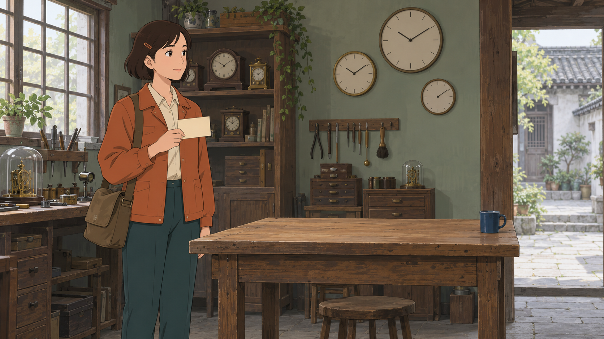

# Seedance 2.0／2.5 视频生成手册

先决定这支镜头需要保住什么，再选择模型、生成方式和参考输入，最后编写 Prompt（提交给生成模型的文字指令）。本手册用于方案设计、提交前检查和结果返修；五类离线走查用于检查方案；另附原创图像、五次真实视频调用、完整 Prompt 与返回原件，便于对照预期和实际结果。

<!-- section:use -->
## 从一个镜头的目标开始

动笔前用一句话说清：谁在什么空间完成什么变化，观众必须看懂什么，下一镜从哪里接。随后列出不能改变的角色身份、完整状态、空间关系、定稿对白或歌词，以及可以调整的景别、机位和动作节奏。必须精确保留的字幕、价格或标志，应优先交给可确定排版的后期流程；生成模型负责画面不等于它适合承担所有交付环节。

本项目默认通过 pippit-tool-cli 使用 Seedance 2.0 Fast、720p；确需较长单镜或经核实的 2.5 功能时，选择 Seedance 2.5、720p。既定 16:9 视听方向、剧本依据和素材接受范围继续有效。切换模型不能替代缺失输入，也不能自动获得更好的风格、人物或对白。

把下面五件事分别记录，避免把计划写成成果。

| 判断 | 它回答什么 | 能作为依据的内容 |
| --- | --- | --- |
| 模型／渠道能力 | 此入口接受什么参数和素材 | 当前模型配置、官方接口说明、明确适用版本的资料 |
| 创作目标 | 这镜必须表达什么 | 锁定的剧本、人物完整状态、已确认的制作要求 |
| 方案估计 | 准备如何实现，哪里可能失败 | 参考分工、时间安排、Prompt、替代方案和停止条件 |
| 真实调用结果 | 实际提交和返回了什么 | 请求回执、实际输入顺序及哈希、模型标识、原件探测、完整回看与听辨 |
| 实际效果与选择 | 原件实际表现如何，本次选哪份输入 | 准确评论与回应，以及版本、候选、组成和范围的选择记录 |

阅读顺序是：先看“型号与渠道”，用“生成方式”选路径，按“参考组织”和“Prompt”准备输入，再从五个走查例子中选择相近任务，最后执行“提交、验收与停止”。这些例子用于检查方案是否自洽，不是成功率证据。

<!-- section:models -->
## 型号与渠道：先核实实际入口

以下 CLI 参数于 2026-10-08 通过 pippit-tool-cli 1.0.38 的 model list、model describe 和 generate-video --help 核对。表中“配置提供”不等于当前账号有调用权限、额度充足或每种组合都已实测。本文另列原创 Demo 的真实调用结果，仅支持相应型号、输入和参数下的观察。正式提交前重新读取模型配置和额度，保存当次回执。

| 项目 | Seedance 2.0 Fast | Seedance 2.0 标准版 | Seedance 2.5 |
| --- | --- | --- | --- |
| pippit-tool-cli 模型键 | `seedance2.0_fast_vision` | `seedance2.0_vision` | `Seedance_2.5` |
| 配置给出的生成时长 | 4—15 秒，整数秒 | 4—15 秒，整数秒 | 4—30 秒，整数秒；编辑另有模式规则 |
| 配置提供的分辨率 | 480p、720p | 480p、720p、1080p、4k | 480p、720p、1080p |
| 图片／视频／音频数量上限 | 9／3／3 | 9／3／3 | 30／10／10；素材合计最多 50 |
| 准备参考视频的名义时长预算 | 单段至少 2 秒，全部视频合计不超过 15 秒 | 同左 | 单段至少 2 秒，全部视频合计不超过 30 秒 |
| 准备参考音频的名义时长预算 | 单段 2—15 秒，全部音频合计不超过 15 秒 | 同左 | 单段 2—30 秒，全部音频合计不超过 30 秒 |
| 本项目用途 | 默认选型；短镜头、清楚的角色与动作任务 | 只有明确需要此型号能力并获相应任务授权时考虑 | 较长单镜，或需用经本渠道核实的编辑、延长等模式 |

配置中的参考视频容差为 2.0 单段／合计 15.5 秒、2.5 单段／合计 30.2 秒；音频合计分别有 15.2 秒、30.2 秒容差。它们用于服务校验，不能据此把内容预算写成“可稳定多生成半秒”。输出实际时长由原件探测，不能从请求数字推断。

这三个配置都列出 adaptive（随输入确定比例）、16:9、21:9、9:16、4:3、3:4、1:1；但生成模式可能进一步收窄可选项。当前 2.5 的编辑、延长和首尾帧模式只列 adaptive。需要固定 16:9 时，先准备同为 16:9 的相应输入，再检查实际输出；不要给这些模式硬塞 `--ratio 16:9`。2.5 首尾帧模式还明确排除了独立音频参考。

不要把素材数量上限理解为质量推荐值。30 张图并不意味着应当塞满 30 张，也不意味着 30 个角色能稳定完成对白。配置还会检查格式、字节数、像素、长宽比、帧率和时长；例如图像大小上限为 30 MiB，不能只检查文件名后缀。普通兼容 PNG／JPEG 是常用准备格式；遇到特殊采样 JPEG 无法识别，应解码后重新编码并核验派生文件，而不是改扩展名。

### 同一名称不等于同一接口

火山方舟使用独立的模型 ID 和参数契约。例如官方资料列出的 2.0、2.0 Fast、2.5 ID 分别为 `doubao-seedance-2-0-260128`、`doubao-seedance-2-0-fast-260128`、`doubao-seedance-2-5-260628`；这些字符串不能直接替换 pippit-tool-cli 的模型键。[官方 Seedance 2.5 说明](https://docs.volcengine.com/docs/ark/seedance-2-5?lang=zh)

官方 2.5 资料说明纯音频输入、显式首尾帧角色、编辑／延长参数，以及 MOV 输出；当前 pippit-tool-cli help 未提供 MOV 输出格式开关，也未提供独立的输出帧率或生成声音开关。手册不能编造这些 CLI 参数。需要这些功能时，应在新任务的授权范围内核对具体入口，而不是把网页或另一个渠道的能力直接写入当前命令。[官方视频任务接口](https://docs.volcengine.com/docs/ark/create-video-generation-task-api?lang=zh)

官方编辑示例对参考视频另有 4—30 秒要求，当前 CLI 素材配置的通用下限为 2 秒。这是渠道／模式差异：通用素材校验通过，并不能证明编辑服务一定接受该输入。2.0 配置有首帧、尾帧、延长结果等能力标记，但未像 2.5 一样返回完整的 creation_modes（生成模式约束）列表；不能把 2.5 的组合规则反推给 2.0。

只读核对可使用以下命令；它们不提交生成。

```bash
pippit-tool-cli --version
pippit-tool-cli model list
pippit-tool-cli model describe seedance2.0_fast_vision
pippit-tool-cli model describe seedance2.0_vision
pippit-tool-cli model describe Seedance_2.5
pippit-tool-cli generate-video --help
```

<!-- section:modes -->
## 按保留目标选择生成方式

“参考”表示让模型借鉴某种信息；“编辑”表示尽量保住现有视频并修改指定内容；“延长”表示接续已有视频的时间。这三种意图必须在模式参数、输入角色和 Prompt 中一致。写“参考视频 1”并不能替代“严格编辑视频 1”，也不会自动变成延长任务。

| 目标与已有输入 | 优先方案 | 输入要承担的职责 | 何时改选 |
| --- | --- | --- | --- |
| 尚无必须保留的人物和构图，探索一个画面事件 | 文本生成 | 文字给出主体、空间、事件、风格和声音 | 一旦需要固定身份或跨镜一致，先准备准确图像参考 |
| 已有人物、场景或道具母版，需要它们参与新动作 | 多模态参考生成 | 分开绑定身份、完整状态、环境、动作、声音 | 相互矛盾的参考先整理；动作关系不清时增加关键画面或拆镜 |
| 起始构图必须贴住已选定的准确画面 | 首帧方式，或在已核实的首尾帧入口准备端点 | 首帧约束起点；文字描述离开起点后的连续动作 | 仅上传图片当普通参考，不等于设置了首帧角色；单首帧入口需另查 |
| 起点和终点都已设计，主要问题是如何到达 | 首尾帧方式 | 同比例的首帧、尾帧，合理的空间和动作过渡 | 两端位置／服装／光线互相不可能时，先修正设计；不能靠加时强行连通 |
| 希望保留原视频的动作／机位，但换人物、场景或画风 | 视频参考生成；需尽量锁住原内容时比较编辑模式 | 说明只借鉴哪些运动与节奏，不借鉴哪些外观 | 如果需要像素不变或完全相同的切点，用确定的剪辑／合成流程 |
| 已有可用视频，只需一个局部内容变化 | 编辑 | 明确被编辑的视频、唯一主要改动及必须保留的内容 | 同时换人、换景、改轨迹、换声音过载时，分阶段并重新验收 |
| 已有镜头要向前或向后接续 | 延长 | 指定方向、衔接端的完整状态、待新增事件及声音延续 | 原末尾已模糊、变脸或停顿时，先修好原段；累积漂移时回到干净参考重建 |
| 要跨越两个视频，或把多段素材组织成新叙事 | 2.5 资料中的衔接／混剪方案，按当前渠道验证 | 区分首段、尾段、素材用途、输出时长和衔接事件 | 它会重新生成内容，不是无损拼接；只需拼接时直接剪辑 |
| 节拍／旋律是主要依据 | 核实音频参考方式，画面随声音设计 | 说明保留旋律、节奏还是音色，不能含混地“参考全部” | 要保留原音轨每个采样点时，保留母版并后期对齐；不能依赖重新生成保持字节一致 |

在当前 pippit-tool-cli 中，普通参考明确使用 `task_type=reference`。`generate_type=1` 是首尾帧入口，按首帧、尾帧顺序传两张图片；help 只明确 MiniMax/Wan 可以只传首图，不能据此认为 Seedance 单图已经是固定首帧。2.5 的此模式还要求 adaptive 且禁止独立音频。2026-10-09 以 CLI 1.0.38 重新读取的 2.5 配置与这些限制一致；2.0 Fast 仍未给出完整模式组合，继续待具体核实。固定首帧同时保留多图身份和独立音色的组合没有充分依据时，必须保留待准备状态，或明确改选允许重解释起点的普通参考路线，不把文字承诺当成接口保证。

起始画面与整个镜头的视觉依据分开审查。手部近景随后抬到脸、背身转面、从人群后走出、开门显露房间，都可能需要额外的完整身份或空间图。该图只约束后来显露的内容，不能为了交代身份而把脸提前塞入起始图。音色只给声音身份；起始图的间接母版只有明确选为直接输入才会上传，不能假设模型已经看过。若起始图已清楚涵盖全部需要的主体、朝向与活动空间，保留一图路线；选到实际原件后发现裁切或遮挡不足，再修订具体输入，不给每镜机械添加全体人物表。

方案表达计划职责，不宣称原件已经选定。准确候选、文件组成和必要裁切／时间范围要在选择后单独登记，准备包再携带同一渠道、模式、角色和参数。计划契约通过只说明组合有依据；未选齐原件或真实输入不一致时仍不可准备，也没有身份稳定性、动作、口型或音质的实际通过结论。

2.5 文档的分镜板、多张关键图、简易白模和精细白模都是参考组织方法，不是额外的模型型号。白模是用简单几何或未上材质的三维画面表达空间、轨迹和机位；它不自动补足缺失的肢体运动。没有四肢动作时应在文字中补足关键姿态，或先把必要关节动画做清楚。

分镜板适合交代先后和大体构图，不承诺输出逐像素复现每一格。多张关键图按顺序提供，并明确各图处于故事的哪个阶段；普通参考图序列也不等于接口的首尾帧约束。用于运动参考的辅助箭头、坐标轴和白模颜色可能被画进成片，提交前应清理无用标记，并声明保留轨迹、替换可见外观。

<!-- section:load -->
## 安排时长、动作和拆镜

选 2.5 的 30 秒上限，只解决输入契约允许更长时段的问题。它不能保证一次完成更多角色、更多动作、更多对白和更多风格变化。估算时先按自然语速读出台词或唱完歌词，再给动作接触、视线反应和镜头转换留出时间。总时长填在参数里；Prompt 的时间段用于表达顺序与节奏，不是帧级调度器。

用“起点—变化—落点”检查动作。例如开门镜头应交代手先接触哪一侧把手、门向哪边转、人物是否通过门，以及最后停在哪里。只写“打开门后走进去又回头跑走”会把几个因果步骤挤在一起。反过来，为一次简单转头罗列几十个微动作，也可能互相牵制。

| 出现的情况 | 先做的调整 | 为什么 |
| --- | --- | --- |
| 多个人同时交接物品、遮挡或交叉移动 | 减少同一时刻的动作，先完成一次交接再反应；必要时拆镜 | 减少身份、手部接触、道具归属同时变化的负担 |
| 单镜内跨地点、跨时段又换服装 | 按叙事转折拆成独立镜头，写清两镜状态变化 | 空间和时间变化不能只靠“然后”一笔带过 |
| 台词自然读完已接近时长上限 | 减少镜头动作或按停顿拆镜；保留定稿台词 | 不让模型靠抢读、漏句或变词完成时长 |
| 内容很少却请求很长 | 缩短时长，或安排有意义的静默动作与结尾保持 | 避免模型自行添加对白、重复内容或无意义动作 |
| 长镜头必须连续，拆镜会损失表达 | 优先简化次要动作和切换，再考虑 2.5 较长时段 | 把预算留给真正必须连续的内容 |
| 首尾差异太大且中间没有合理路径 | 增加过渡关键画面，或重新设计端点 | 时长增加不能修复互相矛盾的几何、身份或道具状态 |

资料中给出的少量角色、清楚的中短参考、较短编辑段落等经验，是起步建议，不是质量保证或新的硬上限。人物多时优先保留可辨认的单人参考、空间布局和准确对应，减少无关人群；不能靠把多个人拼在一张图里假装只用了一个角色。

<!-- section:references -->
## 组织参考：一份输入先说明一种职责

参考清单先于 Prompt。每项记录“准确原件是谁、此次约束什么、明确不约束什么”。同一文件可以承担多个职责，但须说明这些职责是否兼容。不要让一张衣着错误的近脸图同时覆盖人物完整状态，也不要让用于动作的实拍视频悄悄决定动画画风。

| 参考职责 | 应保留的信息 | 常见冲突与处理 |
| --- | --- | --- |
| 角色身份 | 脸型、发型、身形比例等少量稳定特征 | 特写用于面容，完整状态图用于全身；多角度均明确绑定同一个人 |
| 完整状态 | 此刻同时存在的服装、伤势、持物、湿干等 | 以准确完整状态为依据；局部细节只能补充，不能悄悄覆盖其他部分 |
| 场景与道具 | 门窗方位、尺度、通行关系、道具形态与归属 | 先核对空间是否能完成动作；不同光照、方向或材质须决定取舍 |
| 风格 | 二维／三维、轮廓、用色、材质、光影和背景笔触 | 统一参考风格；不要同时要求扁平手绘、写实皮肤与复杂三维材质 |
| 构图与端点 | 人物位置、景别、视线、起止姿势 | 将“风格参考”与“必须贴住的首尾帧”分开登记 |
| 动作与镜头 | 运动方向、接触顺序、相机轨迹、切点关系 | 明确只取动作／机位；避免文字要求与视频运动相反 |
| 音色与表演 | 声音高低、厚薄、气声、颗粒、语速和情绪 | 选能听清、与本镜表演接近的单一说话人片段；不要夹带另一人对白 |
| 音乐与声音 | 旋律、节拍、乐器、环境或某个动作音 | 分别说明哪些必须保留、哪些可以重生成；避免背景乐盖住音色参考 |

多参考按人物首次出场组织分组；同一人物组内把最关键的面容和完整状态说明靠前，场景、道具随后。这样兼顾“尽早建立身份”和“按出场顺序建立对应”。它是减少歧义的组织建议，不是声称上传顺序对所有模型都有同一种权重。

提交时使用入口真正显示的编号：例如图 1、图 2、音频 1。素材资产 ID、文件名、图片里写的人名，都不能自动变成模型识别的附件编号。增加、删除或重排输入后，必须重新核对全文每一次引用，包括视频和音频编号。名称保持唯一：一人不要同时叫“邮差”“女孩”“穿蓝衣的人”而没有绑定说明。

主体身份不稳定时，优先提供清楚的面容图与单人完整状态图，明确它们是同一人；避免让一张多视图拼图被误读为几个同时在场的人。组合构图可用于说明站位，但不能替代各人的身份和状态依据。不要为了凑输入上限去掉必要角色，或不作记录地用相似角色代替。

参考图也需要验收。把单人图、多视图和组合图并排检查：正背面的衣裤颜色是否一致，持物手和伤痕是否换边，胡须、配饰和道具结构是否被拼图步骤改掉。发现矛盾时，先指定准确状态并修正输入；不能等视频选中了其中一种状态后，再把全部差异归为模型漂移。只有上半身的图也不能充当已经确认全身服装的依据。

### 接入本项目的准确参考

1. 读取当前 `production/source-lock.json` 及实际 INPUT_LOCK（输入锁），确认准确剧本、集场镜和既有作品事实。旧导出或旧方案不能自动代表当前输入。
2. 阅读本手册，形成模型／模式、动作负载、声音安排与失败处理，再核对镜头方案和完整状态。
3. 对每个直接参考明确素材、版本、候选、组成及真实文件；对关键画面等间接参考保留来源路径和影响范围。
4. 核对准确整体状态和图像母版；局部图、声音或动作参考只能补足已说明的职责。干净母版仍是身份与风格锚点，生成结果作为图像唯一参考最多连续两代的规则继续适用。
5. 需要裁切、缩放、转码或音频选段时，保留原件，登记源哈希、转换参数、起止时间和派生文件哈希。不得把派生文件覆盖成旧原件。
6. 依实际输入顺序编写 Prompt 并逐项复核。没有原件、原件损坏、状态归属错误或引用超过渠道限制时，不输出“已就绪”。
7. 已锁定或已提交的方案发生变化时建立新版本；参考选择、真实调用输入和镜头最终采用分别记录，不回写伪造历史。

高清不等于信息更有用。脸太小、过强锐化、压缩块、文字覆盖和混合风格可能抵消像素优势。遇到细密纹理放大，可在保留母版的前提下尝试与输出尺度相称的干净派生参考；必须回看，不能把降低尺寸当作通用画质提升。

<!-- section:prompt -->
## Prompt 的组织方法

先写整体目标，再绑定输入，之后按时间或镜头顺序描述事件，最后说明声音和必要约束。2.0 遇到复杂动作时，补清关键肢体与接触过程；2.5 已有可靠运动参考时，不必把每一步重复写成相互矛盾的命令。二者都需要明确角色与因果，没有“2.5 只能短写”或“2.0 越长越好”的规律。

| 部分 | 写什么 | 如何改变预期结果 |
| --- | --- | --- |
| 整体目标 | 场景、主要事件、视觉媒介和情绪 | 限定模型应该组织成怎样的一段内容 |
| 输入绑定 | 编号、人物／道具名称、所取信息和排除的信息 | 避免身份、风格、运动或声音互相串用 |
| 初始空间 | 左右前后、距离、持物手、视线和关键遮挡 | 让第一动作有可实现的起点 |
| 动作先后 | 谁先做什么，接触后发生什么，最后停在哪 | 减少物体瞬移、动作缺环和时间倒置 |
| 镜头 | 景别、机位、运动方向及是否切镜 | 控制观众能否看见关键动作，不只堆“电影感” |
| 时间 | 连续的事件窗口、对白留时和结尾保持 | 表达节奏；实际时点仍需验收 |
| 声音 | 说话人、原句、语气、音色参考、音乐与音效 | 避免错人开口、自动改词、缺失或多余配乐 |
| 必要约束 | 数量、身份、状态、无新增内容等真正关键要求 | 告诉模型哪些偏差最不可接受；约束不是保证 |

“镜头跟拍”可展开成“相机在人物左前方，与人物同速缓慢后退，保持腰部以上景别”。“焦点转移”可展开成“先让前景信封清晰，待手停稳后焦点转向后方人物的脸”。当术语不能准确表达意图时，写可见的变化，比叠加术语有效。

先保证事件先后清楚，再按对白、音乐或接缝需要补充连续、不重叠的时间窗口。2.0 方法资料明确提示，强制精确秒数的响应不稳定，普通动作可优先写自然顺序。下文秒数用于离线分配表演预算，不是所有版本都应照搬的控制语法；实际提交可改为动作顺序，保留关键对白和落点。复杂切镜写“镜头一／镜头二”并各给起点与落点；单镜明确“一镜到底”，不要又要求互相不兼容的俯拍、远景、面部特写同时成立。对白只在一个位置完整出现，表演指令放在该句前后，不把同一句台词拆成反复引用的小段。

以下是可修改模板。方括号为待填写内容；提交前应替换完毕，并把附件占位号换成实际编号。括号、冒号或分段是帮助阅读的文字约定，不是专用 API 语法。

```text
目标：[谁]在[场景与时段]完成[一个主要变化]。[二维／三维／写实等明确风格]。
参考分工：图 1 是[角色]的[准确完整状态]；图 2 只约束[场景／道具]；
视频 1 只参考[动作／运镜]，不参考[与目标冲突的外观]；音频 1 只约束[说话人音色／旋律]。
初始空间：[角色位置、朝向、持物手、接触对象、相机位置]。
0—[a] 秒：[第一动作及可见结果]；相机[景别与运动]。
[a]—[b] 秒：[接续动作和因果]；[说话人]以[语气、速度]说：“[定稿原句]”。
[b]—[总时长] 秒：[动作落点、面部反应与留给剪辑的保持]。
声音：[允许的环境／动作声音及对应时机]；[音乐是否需要及其职责]；[其余人物是否沉默]。
约束：[角色数量、身份、完整状态和物体归属等关键不变量]；[必要的无新增文字／无额外对白等]。
```

不要把请求参数全塞进 Prompt。时长、比例、分辨率、模型与模式应在实际入口中设置，文字仅作一致说明。也不要把试验日志、素材库 ID、工具报错、额度说明或“为了通过检查”写给生成模型。

<!-- section:sound -->
## 对白、音色、音乐与音效

对白先以定稿文本、说话人和时间窗口为准，再选择对应音色片段。声音状态可以随表演变化，但不能因此失去角色身份。例如“音色低而轻，句尾有气声，克制地急促发问”比“好听、有磁性、情绪激烈”更可检查。音色描述应来自实际参考，不按脸的年龄或性别外观臆测声音。

多个说话人按出场顺序绑定各自音频编号，每句标注准确说话人和其他人的反应。画外对白明确“只闻其声，不在画面增加人物”；不说话的人保持自然闭口或听者反应。不要用含多个说话人、配乐很响的混合片段充当单人音色母版。

文字、字幕和发音是三件事。要求人物念某句话，不等于要求画面显示这句话；写“无字幕”也不能保证没有字幕。遇到多音字、生僻字发音错误，可以在新提交稿中试用同音提示或正确发音参考，但定稿原文、歌词和正式字幕必须保留正确文字，不能为绕过发音问题改写权威文本。

翻译／替换对白需要列出所有说话人、全部待替换台词、目标语言及对应时间，检查背景人声是否也在范围内。仅写“把所有台词变成英语”容易留下原语句、漏译或换错声音。口型与说话时段要一并回看，不能以识别文本看似正确判定完成。

音乐先选职责：是固定旋律、节拍参考、情绪配乐，还是必须保留的最终音轨。2.0 的历史案例采用含正确音频的黑屏视频来强化时间参考；这会占用视频输入预算，也不保证原音轨逐点保真。2.5 支持音频参考的范围更大，但“能够只给音频”仍不等于“输出原样复制音频”。若音乐必须逐拍固定，保留准确母版，并将生成声音与母版的对齐、混音安排写入方案。

固定音乐的方案至少保留三份可区分的文件：原音乐、模型返回的有声视频、完成对齐和混音后的成片。逐句比较开唱、停顿、重拍和句尾，再检查对应口型；不要只比较波形轮廓。若成片重新使用了原音乐，应明确这是后期合成的结果，不能据此宣称模型生成音轨与参考完全一致。语音参考同样可能夹带第二个说话人或背景音乐，需先听清再选择。

本项目继续使用原生有声视听流程：独立准备角色音色和歌曲旋律基准，镜头中的对白、演唱、动物声、环境声和动作声随画面生成。手册没有授权重建逐句台词库或批量新增独立音轨。片段未听辨或歌曲版权／版本不清时，记录实际未验项与影响；确实无法确定输入或合法用途时保持未就绪。没有逐项认可记录不构成阻断。

要求无背景音乐时，同时列出允许的对白、脚步、环境与动作声，避免“全部静音”损失必要声音。若剧情不需要水声、空灵回声、欢呼或合唱，清理参考和措辞中无意引入这些声音的线索；剧情真的需要这些声音时，应明确来源、位置和强弱，不能为消除噪音而删掉剧情要求。

<!-- section:visual-repair -->
## 高频视觉问题：先找错在哪一层

以下处理是基于资料案例归纳的修订路径，不是通用成功率或固定配方。每轮只改变与根因相关的少量因素，记录新方案与旧方案的差异，再按同一检查点比较原件。

| 现象 | 优先排查 | 可验证的修订 | 必须保留的限制 |
| --- | --- | --- | --- |
| 人脸、发型或身形漂移 | 脸太小、多视图被当成多人、不同状态混用 | 绑定同一人的近脸与完整状态；统一少量稳定特征；回到干净母版 | 不能承诺特写图消除所有跨帧漂移 |
| 多角色串脸、错人行动或多出人物 | 名称与编号不一致，输入顺序和出场顺序冲突 | 按出场分组并重核每个编号；限定在场人数；一次只安排清楚的交接 | 超过输入上限或方案过载时必须重排／拆镜 |
| 二维变三维、颜色和材质改变 | 混用实拍与绘画参考；仅写“保持风格” | 明确媒介、轮廓、配色、光影；说明运动视频不约束风格 | 2.0 与 2.5 的审美不完全相同，换版本需重新比较 |
| 眼睛发光、表情过度或加特效 | “目光燃烧”等比喻被视觉化 | 改写为眉眼、呼吸和嘴角的可见动作，说明正常眼睛和现场光源 | 不能把所有夸张情绪都归因于某个词 |
| 错字、重复字符、数字不连续 | 把生成模型当排版器；参考含错误文字 | 先删去不必要画内文字；必要时用正确文字参考或逐字描述；最终字卡后期制作 | 正确参考也不保证字形、数量和时序完全准确 |
| 无意字幕、文字贴纸或标志 | 输入本来有文字；对白被反复引用；切镜过多 | 清理获准编辑的自有输入；每句只出现一次；减少切镜；加必要约束并逐帧查 | “无字幕／无水印”不能替代验收，也不能取消渠道依法或依规附加的标识 |
| 细密条纹、指纹状纹理、过锐噪点 | 参考纹理过密、反复生成、尺度不匹配 | 保留原件，制作干净且尺度相称的派生参考；减少细节要求；返回母版 | 放大、超分和高质量档位不保证修复既有纹理 |
| 手脚穿插、物体接触方向错误 | 起点不可能，关键接触步骤缺失，多个动作争抢时间 | 画清关键接触或简洁分镜，逐步描述接触关系；必要时拆动作 | 反复增加“正确／自然／不穿模”不等于给出可行的动作 |
| 分镜箭头、白模颜色或辅助线进入成片 | 参考职责未分开，辅助图形过醒目 | 整理干净运动参考；明确替换可见白模，保留轨迹与机位 | 文字禁止也可能无效，必要时更换输入 |

水印先辨来源：原素材自带标识、模型无意生成的标志、服务端附加的生成标识不是同一种问题。只在有权编辑的材料上处理无关标识；不要把去掉来源或权利标记写成通用制作步骤。

<!-- section:continuity -->
## 衔接、延长、编辑与时间缺陷

两镜衔接先核对人物身份和完整状态，再核对朝向、持物手、视线、运动方向、光源和声音。一个近似姿势不是完整连续性：如果前镜道具在右手，后镜出现在左手，即使剪切很顺也应返修。

### 延长的最小工作流

1. 确认原段确实可用，定位作为衔接依据的准确末端／前端；记录原件、帧率、时长和裁切范围。
2. 选择本渠道支持的延长模式。Prompt 开头写清“向后延长视频 1”或“向前延长视频 1”，再说明新增部分的目标。
3. 描述边界状态和下一动作，给动作留合理时间；需要音色、身份或风格锚点时，添加准确母版并说明职责。
4. 区分“输入片段长度”“请求新增长度”“返回视频长度”。接口如何返回原段与新增段，以当前契约和实际文件为准，不在时间线上直接假定相加。
5. 在原速和逐帧视图下检查接缝前后：动作是否重复或跳过、人物是否换脸、背景是否闪变、响度／底噪是否突变、台词或音乐是否被截断。
6. 若仅边界有少数重复／无效帧，可在保留原件与剪辑记录的前提下选择合适切点。不要把案例中的某个固定删帧数套给所有帧率和所有片段。
7. 若连续延长使脸、纹理或画面越来越差，停止把新结果不断喂回；回到干净母版和可用的短段，重建下一镜或采用独立镜头衔接。

研究案例中有包含原片前缀、分段拼接或多轮延长的长视频。成片总长不能证明单次可生成同样时长；核对能力时必须拆开原输入、每次新增部分与最终合成。

### 编辑中的“保持不变”有实际边界

2.5 的编辑路径要求自适应比例，时长随输入和模式处理，可能发生帧数或时长变化。资料把个别案例的差异概述为约三分之一秒；本次核对其中一对原件的视频流，实际是 24 fps 下从 168 帧变为 161 帧，相差约 0.292 秒。资料还讨论了帧数为 8n+1 的准备办法，这是该路径下的处理经验，不是所有渠道、所有帧率都必须满足的普遍公式。先用实际编码、帧率和返回文件核对，再决定补帧或重剪，不能把缺失帧冒充“原样保留”。

把编辑模式换成参考生成，有时能获得更灵活的比例或时长，但保留原片动作、构图和声音的约束也会变弱。只有允许重新解释原片时才这样改选。如果只是横竖版适配，先考虑确定的裁切或补边是否已经满足需求。

局部变化优先一次一项。例如先让帽子沿指定轨迹移动，再在下一步更换材质；每一步都保存并验收新版本。分阶段不是无限递归加工，前一步已经破坏身份或时序时，应回到它的准确上游修正。

### 闪烁与卡顿

区分生成内容真的跳变、重复帧、曝光闪烁、播放器加载停顿和转码问题。先本地完整播放原文件，检查帧时间戳与问题帧，再决定改 Prompt、参考或后期。资料提到过历史版本的特定闪烁缺陷和宽画幅缓解案例，不能据此宣布当前模型普遍已修复，也不能随意把本项目 16:9 改成 21:9。

插帧可能缓解运动不均，但也可能制造变形或重影；降噪、锐化、补帧和重新编码都应保留原件并作为独立派生步骤验收。停止追求单镜连续时，要说明改为切镜会损失什么表达，而不是只以“模型不行”结束判断。

比较处理前后时，把视频帧数、实际帧率、视频流时长和音轨时长分开记录。删帧后导出也可能改变帧率；“删六帧”在不同时间基下并非同一时长。编辑器的“时:分:秒:帧”也不是十进制秒。光流或帧间差分可以定位可疑跳变，但正常切镜、遮挡与前景运动也会产生峰值；指标下降、帧率变高或一张对比图都不能独立证明全片更流畅。录制编辑器逐帧操作的 GIF 会保留停帧，本身也可能带调色板抖动，不能把这些现象直接归因于源视频。

<!-- section:audio-repair -->
## 高频声音问题与返修顺序

声音检查必须读取实际音轨。有音轨不等于有声音：先区分无音轨、全零静音和实际有声。识别出的文字只能帮助定位漏词或疑似错读；波形能定位静音、峰值和截断；二者都不能单独证明音色相似、情绪合适、没有噪声或音乐自然。

| 问题 | 先检查什么 | 下一轮或后期处理 | 验收重点 |
| --- | --- | --- | --- |
| 台词漏字、抢读、重复或自动加话 | 原句是否只写一次，时间是否足够，听者是否也被要求开口 | 调整时间和动作负载；逐人逐句绑定；只修改提交稿中必要的发音提示 | 原句、说话人、停顿、口型和完整句尾 |
| 多音字／生僻字读错 | 定稿文字、正确读音、参考发音是否清楚 | 新提交稿试同音提示或正确语音参考，保留定稿原文；必要时另行安排获准修音 | 实际读音，不能只看转写或字幕 |
| 音色偏离、外观先验压过声音参考 | 参考是否单人、是否被音乐遮盖，表演与本镜是否相差太远 | 明确参考音频的说话人职责和真实声学特征，换更贴近本镜表演的准确片段 | 身份感和状态表演分别比较，不凭“更年轻／更低”一个词判定 |
| 不要配乐却生成背景音乐 | 参考是否含配乐，文字是否暗示舞台、MV 或情绪音乐 | 明确允许的人声／环境／动作声与禁止的配乐；必要时重新生成 | 去配乐后必要对白与音效是否也被伤害 |
| 水波、空灵声、回声或杂音过多 | 输入与措辞是否带出无意声音，还是本来就有剧情水声 | 清理无意线索；明确声源和距离；可评估降噪或分离，但须回听 | 不能把合法环境声误删，不能引入金属声或失真 |
| 结尾咔哒、爆音、句尾截断 | 原件最后一段、音轨结束点、剪切位置 | 留出尾部余量；对无需保留的尾响做短淡出，或调整切点 | 不吞掉最后音节，不用突然静音掩盖缺句 |
| 延长后响度或音色突变 | 接缝两侧的人声、底噪和音乐；是否跨版本生成 | 优先修正引用与声音要求，再做合理响度／交叉淡化 | 淡化不能遮住角色换声或旋律错位 |
| 歌曲节拍、歌词或旋律改写 | 参考是音色还是准确旋律，段长和歌词窗口是否匹配 | 用准确短参考和歌词重新组织；需严格保留母版时后期对齐 | 逐句实唱、重拍位置、呼吸、画面动作和结尾落点 |

不同音色、语言或混音不能共用“已听审”结论。素材母版认可不代表生成片中的声音已通过，机器声学分析也不代替用户对作品声音的认可。

返修后重新听完整音轨，包括原先没有问题的段落。去掉配乐可能同时削弱环境声；翻译后的主对白即使正确，也可能残留原语种短词或多出叹词、旁白。发音检查先听实际音节，再对照定稿文字，避免转写工具根据语义自动纠正后掩盖错读。无法确定的细节保留为待核对项，不把资料中的“优化后”直接写成验收通过。

<!-- section:checks -->
## 提交、验收与停止条件

### 提交前：每一项都能指向具体依据

1. 明确该镜的唯一主要目标、不可变内容、完成时长及允许的替代方案；自然读完或唱完全部文字。
2. 确认实际渠道、模型键、模式、比例、时长、分辨率及账号条件；按模式核对全部参考数量、总时长、像素、格式和真实文件。
3. 核对准确剧本、完整状态、直接与间接参考、既有意见范围和输入锁；新状态不能靠拼凑旧局部参考假装完整。
4. 检查参考分工与输入顺序，逐个匹配 Prompt 编号；排除无关文字、不同角色音色、错误衣着、辅助线和未经许可的素材。
5. 检查空间与接触是否可实现，动作因果是否完整，时间是否过载；明确对白、音乐、环境与动作声各自职责。
6. 设定本轮要验证的假设、允许的尝试次数／费用上限和失败后下一步。需要新增付费调用时，以当次授权为准。
7. 保存可复查的准确请求与输入清单。超时或结果未知时，先查询任务是否已生效，不能盲目重复提交。

### 返回后：先看主目标，再看技术文件

首先完整观看并听辨原件，确认观众能否理解预期事件、人物是否还是原来的人、剧情状态和对白是否正确。再在关键接触、切点、文字和声音异常处逐帧或分段检查。探测实际编码、尺寸、帧率、时长与音轨，不把请求 720p 当作已经得到 720p。

| 检查层 | 通过需要什么 | 未通过先修什么 |
| --- | --- | --- |
| 内容与身份 | 目标事件、角色数量、身份、完整状态、道具归属正确 | 先修输入、绑定、动作与方案，不用锐化和混音掩盖 |
| 空间与时间 | 运动方向、接触、镜头先后、衔接边界成立 | 修初始空间和关键动作；必要时拆镜或重建端点 |
| 视觉质量 | 风格统一，无影响阅读的错字、伪影、穿模、闪烁或卡顿 | 针对性改参考和负载；保留原件后再评估局部后期 |
| 声音 | 原句和说话人准确，发音、音色、情绪、环境和音乐合适 | 先修内容与引用，再修响度、噪声和接缝 |
| 文件与交付 | 实际规格合约，原件可完整解码，准确回执与依赖可追溯 | 修导出／转码／缺失文件，不把技术修复写成创作通过 |
| 意见与准确选择 | 对准确候选看听后评论，本次输入绑定准确原件 | 保留实际未验项；技术检查不推断用户态度 |

同一错误重复出现、修改没有可解释的变量、参考开始累积漂移、单次任务明显过载、关键输入缺失、真实费用或授权触及上限时，停止新增调用。保存已得到的原件、回执和失败判断，改方案、拆镜、补参考或请求确需的新决策。不能无限“抽卡”，也不能把选择成本转成删除失败记录。

本项目生成与发布继续沿 `production/generation-workspaces.md`：在任务工作区操作，保留准确原件与回执，成果随 Git 集成后再按受控流程增量发布。禁止用任务快照覆盖正式活库。手册更新不自动改写既有方案、调用、评论和采用记录。

<!-- section:case-action -->
## 离线走查一：单角色完成一个动作

需求：虚构邮差森宁走进避雨廊，把一封信放在桌上，观众必须看清信从手到桌的接触。预计 8 秒，一镜到底，16:9，原生环境与动作声，无对白。

选择：2.0 Fast、720p、普通参考生成。身份与一项主要动作清楚，时长在默认模型范围内，没有仅为“新版本”切换 2.5 的理由。若后续改为 18 秒连续表演才重新评估 2.5；不要简单把同一段文字拉长。以下文件是待制作参考的职责设计，未声称已有这些原件或已生成视频。

| 输入 | 分工 | 提交前检查 |
| --- | --- | --- |
| 图 1 | 森宁的干净完整状态：蓝外套、灰挎包，右手持信 | 身份与全身状态同时清楚，无另一套衣服 |
| 图 2 | 避雨廊和桌子的空间 | 门、桌、人物通路可实现，桌面无现成信封 |
| 图 3 | 素色信封外观 | 不含需要精确保留的文字，不另增第二封信 |

```text
8 秒，二维动画，简洁轮廓、平涂蓝灰色、柔和阴天光，一镜到底。
图 1 是唯一人物森宁的身份和完整状态，图 2 只约束避雨廊与木桌空间，图 3 只约束信封外观。
起点：森宁在画面左后方廊口，灰挎包在左胯，右手捏住一封信；木桌位于画面右前方。
0—3 秒：相机在木桌左侧保持中景，森宁向桌边走两步，身体始终完整可辨。
3—6 秒：森宁右手将信平放到桌面，先让信封接触桌面，再松开手指，手从信封上方收回。
6—8 秒：森宁看一眼桌上的信，轻轻呼气，停在桌边；信留在原处，为下一镜留出静止落点。
声音：廊外细雨低声持续，脚步两下，信封触桌一声轻响；森宁不说话，无背景音乐。
约束：只有森宁一个人和一封信；外套、挎包和持物手不变；不出现字幕、字卡或额外人物。
```

检查点：右手持信—接触桌面—松手的顺序完整；信封不穿过桌面、不提前出现第二封；相机能看见关键接触，衣着和挎包不变。失败后先修接触起点和构图，必要时增加获准制作的接触关键画面；如果仍穿插，拆成“到桌边”和“放信”两个镜头，并分别登记方案。离线结果：时间、输入数量和动作目标自洽；实际物理与身份质量待真实生成验收。

<!-- section:case-dialogue -->
## 离线走查二：两人对白与声音对应

需求：森宁把修好的怀表交给修表师禾川。两人各说一句，声音不串人，交接完成后有反应。预计 12 秒。此例选择默认的 2.0 Fast、720p、参考生成：时长与输入数量在配置范围内，清楚的轮流对白也没有必须换用 2.5 的前提。若自然表演确需超过 15 秒且不宜切镜，再考虑 2.5 较长时段；不能预判换版本就会改善声音对应。

输入按出场分组：图 1 是森宁完整状态，图 2 是禾川完整状态，图 3 是修表铺及桌面布局，图 4 是怀表。音频 1 为森宁已听辨的 4 秒干净声线，音频 2 为禾川的 4 秒干净声线；它们只提供声音身份，内容不替代下面的对白。两段合计 8 秒，在 2.0 和 2.5 的名义预算内。若实际参考里混入第三人或配乐，先重新选段。

```text
12 秒，温暖的二维手绘动画，修表铺内，两人一镜到底的中近景对话。
图 1 是森宁，位于画面左侧；图 2 是禾川，位于右侧；图 3 只约束空间，图 4 只约束唯一一只怀表。
森宁的声音只参考音频 1，禾川的声音只参考音频 2；不要复述参考音频原话。
起点：森宁右手托着闭合的怀表，禾川双手放在桌边；桌面中间留出交接空间。
0—4 秒：相机固定。森宁看向禾川，语气轻快但不抢读，说：“表修好了，走得很准。”同时把托表的手缓慢伸到桌面中央；禾川安静听着。
4—8 秒：禾川左手掌心向上接住怀表，接稳后森宁才收回手。禾川低声、温和地说：“谢谢，明早我就带上。”森宁闭口微笑。
8—12 秒：禾川看向手中的怀表，轻轻点头；森宁放松肩膀，两人保持各自位置。
声音：允许低声的钟表滴答、衣袖摩擦和清楚对白，无背景音乐；两句不重叠，不添加旁白。
约束：只出现森宁和禾川；怀表只完成一次交接，不凭空复制；两人外貌、服装和声音分别保持；不生成字幕或台词文字。
```

检查点：两句话完整且各只说一次，声线与说话人对应；非说话者不跟着张嘴；交接时两只手和表的归属清楚。失败修订顺序：先查音频／图像编号，再简化交接与对白重叠；仍错配时把接表动作放在一句话后的静默段，必要时拆成正反打。不能靠改用另一个人的音色让错误“听起来顺”。离线结果：可核对输入和对白窗口，尚无口型、音色或人物保持的实际通过结论。

<!-- section:case-extension -->
## 离线走查三：接续镜头或延长

需求：已有一段虚构、已认可的 16:9 山路镜头，森宁由左向右行走，末尾右脚落地，手里没有东西；要再走到路牌前停下。目标新增约 6 秒，不改变人物、画风和运动方向。此例假设已有 8 秒原片，真实执行必须替换成准确原件与回执。

选择：当前 2.5 的延长模式，比例 adaptive，保留源片 16:9。视频 1 是准确原片，图 1 是人物完整状态母版，图 2 是目标路牌及位置设计。先确认当前渠道的 duration 参数表示新增内容还是返回长度；本例的“6 秒”是创作目标，不能不经核实直接当作最终命令。2.0 有延长能力标记，但本轮没有其完整模式组合核验，不把此例直接转换成 2.0 可执行命令。

```text
向后延长视频 1，新增内容的表演目标约 6 秒。
延续视频 1 的二维平涂画风、阴天光、相机侧向跟拍和人物由左向右的运动方向。
图 1 只补充森宁的准确身份与完整状态；图 2 约束接下来出现的路牌外观与道路右侧位置，不改变前段已有地形。
衔接起点保持视频 1 末尾的右脚落地、左脚将要迈出、双手自然摆动与挎包位置，不重演刚结束的那一步。
新增 0—3 秒：森宁继续向右走两步，相机同速侧跟；路牌从画面右侧逐渐进入。
新增 3—5 秒：森宁在路牌左侧减速停下，抬眼看路牌，相机随之缓慢停住。
新增 5—6 秒：保持人物和路牌关系，衣角轻动，为剪辑留出自然落点。
声音：接续原片低声风声和脚步的空间感，停步后只留风声；不增对白或配乐。
约束：不增加人物、随身道具、字幕或转场特效，不改变衣着、行走方向和背景光线。
```

检查点：先探测返回时长与帧率，再对齐源片末端；逐帧看是否多走一步、重复落脚、跳过动作，完整回听风声和脚步接缝。若只是接缝重复少数帧，找到实际可用切点并记录；若脸与纹理衰减，停止继续延长，改用干净母版生成独立“路牌前停下”镜头，通过可解释的切镜连接。离线结果：明确了边界状态、方向与停止条件；没有把历史案例的固定删帧数当成本例已验证方案。

<!-- section:case-style -->
## 离线走查四：保持画风并借用运动

需求：一段需要保持 18 秒空间连续性的二维纸片风格门廊镜头，相机缓慢绕过前景立柱，露出森宁。可用运动参考是灰色三维白模；成片不能出现灰模材质、坐标轴或写实皮肤。

选择：2.5、720p、参考生成，理由是这次已明确需要超过 15 秒的单镜连续表达；视频 1 是 18 秒白模，只承担空间遮挡和相机轨迹，图 1 为人物干净风格母版，图 2 为门廊同风格母版。若改用 2.0 Fast，须先重新设计为至多 15 秒的镜头并缩短参考，或按叙事需要拆镜，不能原样提交 18 秒输入。若必须保住原片的每个像素，参考生成不合适，应改选确定的合成流程。

```text
18 秒，二维纸片动画，边缘清楚、纯色面、少量柔和投影，不使用写实皮肤或三维塑料材质。
图 1 是森宁的身份、完整状态和人物画风；图 2 是门廊的配色、线条和背景画风。
视频 1 仅作为相机轨迹、立柱遮挡顺序和人物站位参考，所有可见灰模、坐标轴与辅助标记均不属于目标画面。
起点：森宁站在门廊右后方，前景立柱遮住他的半边身体，双手自然垂下。
0—12 秒：相机沿视频 1 的路线从左向右缓慢移动，逐渐绕过前景立柱，保持中景；森宁不换位置，只轻轻转头看向镜头。
12—18 秒：相机停在完整看见森宁的位置，森宁露出轻微笑意，保持同一二维轮廓、身体比例和服装色块。
声音：轻微风声与衣料摩擦，无对白，无背景音乐。
约束：保持图 1、图 2 的简洁程度，不加纸张污渍、颗粒噪点、过锐纹理、字幕或额外道具。
```

检查点：绕柱的遮挡关系与方向成立；被揭示的脸和身体没有换风格；背景和人物不是两种媒介；没有辅助线泄漏。若画面变三维，先检查参考中是否把灰模写成外观依据，再重写职责；仍失控则准备更接近目标风格的运动参考或简化为小幅平移。若只是纹理过重，回到干净母版并减少纹理要求，不连续拿带噪结果修图。离线结果：风格锚点和运动锚点分工明确，实际风格保持尚待原片比较。

<!-- section:case-song -->
## 离线走查五：歌曲片段与原生声音

需求：森宁在静止的门廊中轻唱四句原创歌词：“雨停以后寄出信，沿着山路等回音；纸上藏着新消息，灯下有人读姓名。”旋律设计为连续 20 秒，旋律和音色已有经过认可的虚构参考，不允许额外配器盖住歌声。此例是方法演示，不属于本项目已有歌曲或镜头方案。

选择：2.5、720p、参考生成，因为要保留这段超过 15 秒的连续演唱，输出和音频参考都超出 2.0 Fast 的名义时长预算。图 1 是人物完整状态，图 2 是门廊环境；音频 1 是准确的 20 秒清唱短片段，同时明确承担森宁音色与旋律依据。此方式不使用首尾帧模式，因为当前 2.5 的该模式排除音频。若改为 2.0 Fast，需要按乐句重新切分输出与准确音频参考，并检查拆分是否损害呼吸和旋律连续性；若未来改成只有音频、没有视觉参考的输入，须按具体渠道重新核实，不能把 2.5 的纯音频能力外推给 2.0。

```text
20 秒，柔和二维手绘动画，一镜到底的胸部以上中近景。图 1 约束森宁的身份和完整状态，图 2 约束门廊与阴天光。
音频 1 同时提供森宁的清唱音色与这四句歌词的旋律、停顿和呼吸节奏；不要增加伴奏，不引入其他说话人。
0—1 秒：森宁站定，轻轻吸气，眼神看向廊外，相机保持稳定。
1—5 秒：森宁以轻而清楚的声音唱：“雨停以后寄出信”，嘴部动作随实唱自然变化，肩膀只有轻微呼吸起伏。
5—9 秒：短暂换气后接着唱：“沿着山路等回音”，保持同一声线。
9—13 秒：按参考的乐句继续唱：“纸上藏着新消息”，目光落向廊外的小路。
13—17 秒：唱：“灯下有人读姓名”，尾字自然收住，表情轻轻放松。
17—20 秒：森宁闭口，目光停在廊外，留出参考旋律已有的完整尾音、呼吸和安静落点。
声音：以音频 1 的清唱旋律和声音为目标，只允许很轻的廊外环境底声；无额外配器、打击乐、和声、旁白或额外歌词。
约束：不改变歌词、不重复句子、不新增人物、字幕或歌词字卡；人物外貌、衣着和画风保持一致。
```

检查点：四句歌词实唱完整、尾字没有吞掉，旋律与母版逐句比较，重拍与口型／呼吸关系合理，尾部没有爆音。失败后先判断歌词和时间预算，再修音色／旋律参考；不要同时增加动作、镜头和歌曲变化。若要求最终原音轨完全一致，保留准确母版，另行设计后期对齐并验收口型，不能宣称重新生成实现了音轨复制。离线结果：声音职责、模式限制与验收目标可逐项检查；音色、旋律保持和听感没有真实生成通过结论。

<!-- section: demo-inputs -->
## 原创 Demo：先看真实输入

以下是 2026-10-08 经实际生成入口制作的独立教学材料。人物森宁、禾川和修表铺均为原创虚构，不属于《李寄斩蛇》的已采纳角色或镜头。示例不含资料 A、B、C 的原件、画面或链接。五个视频均保留服务返回原件；出现的缺陷和生成标识也保留，便于对照 Prompt 判断模型实际做了什么。

两张图片由内置图像生成工具制作，实际均为 1672 × 941 像素，未放大。双人图从单人干净母版作一次参考生成；并没有因为图片请求了更高规格就把实际尺寸记成 4K。图像生成指令及原件摘要随示例目录保存。




读每个 Demo 时，先看“为什么选、输入约束什么”，再读实际提交的完整 Prompt，最后播放原件并对照检查点。参数表记录提交标识与探测到的输出，不推断服务内部的模型版本。离线走查与真实调用分开；单次结果不能形成成功率，也不自动成为本故事的采用记录。

<!-- section: demo-action-current -->
## Demo：单角色放信

主目标是让观众看清“持信—接触桌面—松手”。使用默认 2.0 Fast，8 秒，只安排一个主要动作；不需要 2.5 的长时段。图 1 同时提供原创人物的完整状态、空间和画风，正文把每项职责写清。

| 实际提交／输出 | 本次记录 |
| --- | --- |
| 渠道与标识 | pippit-tool-cli 1.0.38；`seedance2.0_fast_vision`；reference |
| 提交参数 | 720p；8 秒；比例 `16:9` |
| 输入与顺序 | image：workshop-master.png |
| 返回原件 | 1280 × 720；视频轨 8.042 秒；含音轨，不能据此判定听感合格 |

实际提交的完整 Prompt：

```text
以@图片1为人物身份、完整服装、修表铺空间和二维手绘画风参考。只出现森宁一人：短深棕发、铜色小发夹、赭橙外套、乳白衬衫、深青长裤、棕色邮包。保持桌子和右后角蓝杯位置。8秒，一个连续镜头，平视中景，摄影机固定。起始森宁右手持一封米色信封于胸前，随后看向桌面，将右手缓慢伸向桌面中央偏左；信封下边先接触木桌，再平放，手指松开并抬离，最后右手回到身体一侧，目光停在桌上。信封始终只有一封，放下后留在桌面；蓝杯始终不动。动作顺序清楚，接触前后连贯，不插入其他动作或切镜。保持参考的干净平涂色块、线条粗细和人物比例；皮肤和衣料不过度增加纹理。声音只有细小衣料摩擦、信封触桌的纸张轻响和极轻室内底噪；不安排对白、旁白或背景音乐。不要主动添加字幕、文字标牌或装饰标识。
```

[单角色放信：服务返回的视频原件](../content/production-approach-assets/action-current.mp4)

检查与返修：逐帧看信封下边接触、平放、手指松开和手撤回；信封不可复制、穿桌，蓝杯不能滑动。听辨纸张与衣料声，确认没有多余音乐。接触不清时先缩小动作幅度或补准确接触画面；连续修订仍失败就拆成两镜。

当前观察：时序检查显示单封信从手中到桌面，随后手撤回，事件顺序成立；3.75 秒的原尺寸帧中可见手与信封在桌面接触。原件已在浏览器完整播放到结尾。实际音轨的模型辅助听辨识别到纸张动作声、鸟声，未识别到对白或配乐；鸟声属于需要另查是否符合场景的额外声音。这些观察不等于每帧接触细节、声源合理性和混音质量均已通过。

<!-- section: demo-dialogue -->
## Demo：两人轮流对白

主目标是两个人轮流说出指定句子。使用 2.0 Fast、12 秒，主动取消道具交接，减轻同时处理双人对应、动作和对白的负担。图 1 只锚定森宁；图 2 提供禾川身份及双人站位、场景。没有提交音频参考，声线由本次生成创建，因此不能据此证明指定音色保持。

| 实际提交／输出 | 本次记录 |
| --- | --- |
| 渠道与标识 | pippit-tool-cli 1.0.38；`seedance2.0_fast_vision`；reference |
| 提交参数 | 720p；12 秒；比例 `16:9` |
| 输入与顺序 | image：workshop-master.png, dialogue-master.png |
| 返回原件 | 1280 × 720；视频轨 12.042 秒；含音轨，不能据此判定听感合格 |

实际提交的完整 Prompt：

```text
12秒，16:9，原生有声的二维手绘动画，一个固定平视中景，不切镜。参考分工：@图片1只约束森宁的脸、短棕发、铜发夹、橙色外套、乳白衬衫、深青裤和棕色邮包；@图片2约束禾川的脸、黑色短发、灰蓝围裙与浅灰衬衫，以及两人的左右站位和修表铺空间。图1虽然只有森宁，成片仍应同时出现图2中的两个人。森宁始终在左，禾川始终在右，两人隔木桌相对；信封只在森宁右手，右后角蓝杯不动。
森宁先抬眼看向禾川，以年轻成年女性清楚温和的普通话说：“这封信是给你的。”她说话时禾川闭口看着她。留一次自然短停顿。随后禾川轻轻点头，以成年男性中低声区、平静自然的普通话回答：“谢谢，我现在就看。”他说话时森宁闭口聆听。最后两人轻微微笑，保持站位，森宁仍拿着信封；本镜不交接信件。
两句台词分别由指定人物说出，不抢话、不同时动嘴、不交换声线、不复读、不增加旁白。声音是近距离自然对白、轻微衣料声及很轻的室内底噪，不配背景音乐。保持清楚而不过度夸张的口型、微表情和呼吸。整体画风、平涂色块与线条粗细延续参考，脸部不增加颗粒、皱纹或写实纹理。不要主动添加字幕、文本或装饰标识。
```

[两人轮流对白：服务返回的视频原件](../content/production-approach-assets/dialogue.mp4)

检查与返修：结合声音和嘴部动作检查两句原文、说话顺序、谁在开口、是否重叠；再查固定人物、信封和站位。串人时先拆开说话时间窗、取消无关动作；若必须匹配既有角色声音，重新准备准确、干净的单人音色参考后再生成。

当前观察：时序帧中两人分别留在左、右，信封保持在森宁手中；两人的嘴部在不同阶段变化。实际音轨的模型辅助听辨识别到两句目标对白，也报告了额外的轻哼或笑声，需与“不添加其他人声”的要求逐一比较。两句文字被识别出来，不等于声线与口型同步已经通过。

<!-- section: demo-extension -->
## Demo：延长时保持片尾状态

主目标是从放信后的完整状态继续。使用 2.5 的 extend 模式，图 1 重新锚定身份与风格，视频 1 指定衔接端状态。原图仍拿着信，而原片已放下信，Prompt 明确排除这一状态冲突。本次提交 duration=6，返回的是约 6 秒新增段；需与原视频拼接后另验接缝，不能把参数当作拼接成片总长。

| 实际提交／输出 | 本次记录 |
| --- | --- |
| 渠道与标识 | pippit-tool-cli 1.0.38；`Seedance_2.5`；extend |
| 提交参数 | 720p；6 秒；比例 `adaptive` |
| 输入与顺序 | image：workshop-master.png；video：action-current.mp4 |
| 返回原件 | 1280 × 720；视频轨 6.000 秒；含音轨，不能据此判定听感合格 |

实际提交的完整 Prompt：

```text
在@视频1结尾之后向后延长6秒。@视频1是时间连续性的依据：森宁已经放下唯一一封米色信，信封留在木桌中央偏左，她的右手已回到身侧；右后角蓝杯不动。@图片1只用于重新锚定森宁的脸、短棕发、铜发夹、橙色外套、乳白衬衫、深青裤、棕色邮包，以及干净二维手绘画风；不要因为图中仍手持信封而把信封重新放回手上。
新增片段紧接原片末帧开始，固定平视机位，景别、光线和空间方向不变。森宁先保持片尾姿势一个短停顿，然后视线从桌上的信封缓慢移向右侧门口，轻轻点头，最后安静站定。只做这个视线与点头动作，信封始终留在桌上，杯子始终留在原位，不新增人物，不再重复放信，不切镜，不改变人物比例、服装或线条粗细。
声音承接原片的轻微室内底声，只加极轻的衣料摩擦；没有对白、旁白或新增背景音乐，不突然起响，不主动添加字幕或文字。
```

[延长时保持片尾状态：服务返回的视频原件](../content/production-approach-assets/extension.mp4)

检查与返修：并排核对原片末帧和新增段首帧，检查信封、持物手、脸、景别、亮度、底噪与响度。新增段里信封应一直留在桌上。若有跳变，先修输入端点和状态绑定，再决定裁去停顿、调整接缝或重建；不要连续延长带缺陷的尾部。

当前观察：时序帧中信封保持在桌上，人物由看桌面转向门口；原片 8 秒与新增段 0 秒的原尺寸画面里，信封、蓝杯和人物位置大体相接。原片与新增段都带有生成标识，文字约束没有消除它。两个文件均能完整播放；新增段的模型辅助听辨报告风声及难以确定来源的低频环境声，不能据此认定与前段声音无缝。端点相似也不足以判定连续接缝通过。

<!-- section: demo-style -->
## Demo：长镜头中的画风保持

主目标是在 18 秒的小幅运动中保持二维线条、人物比例与遮挡关系。长度超出当前 2.0 Fast 的 15 秒上限，选择 2.5。图 1 锚定外观，视频 1 只借用本次原创动作片的画风，不借用放信动作。本例没有灰模运动参考，不验证离线走查中的灰模职责分离。

| 实际提交／输出 | 本次记录 |
| --- | --- |
| 渠道与标识 | pippit-tool-cli 1.0.38；`Seedance_2.5`；reference |
| 提交参数 | 720p；18 秒；比例 `16:9` |
| 输入与顺序 | image：workshop-master.png；video：action-current.mp4 |
| 返回原件 | 1280 × 720；视频轨 18.042 秒；含音轨，不能据此判定听感合格 |

实际提交的完整 Prompt：

```text
18秒，一个连续的二维手绘动画镜头。@图片1是森宁的准确身份、服装和修表铺空间参考：短深棕发、铜色小发夹、赭橙外套、乳白衬衫、深青长裤、棕色邮包。@视频1只参考平涂色块、线条粗细、低纹理和人物比例，不借用它的放信动作，不延长该片。新镜头开始时唯一一封米色信已平放在木桌中央偏左，森宁两手自然放在身侧，右后角蓝杯不动。
相机从平视中景开始，在18秒内沿很小的弧线缓慢向右移动，始终对准森宁上半身；人物只自然呼吸，目光平静地看着桌上的信封。约8至11秒，一根靠近镜头的细木立柱从画面左侧滑过，只短暂遮住森宁的一小部分肩膀，随后完整露出相同人物和服装；脸不被完全遮住。场景透视随相机连续变化，角色不转成三维模型，背景与人物保持同一种干净二维手绘画风，不增加纸纹、颗粒、写实皮肤或金属高光。不要新增人物、道具或动作，不切镜，不放大手部动作。
声音只有极轻的室内底声和细微衣料声，没有对白、旁白或背景音乐；不要主动添加字幕、文字标牌或装饰标识。
```

[长镜头中的画风保持：服务返回的视频原件](../content/production-approach-assets/style.mp4)

检查与返修：检查运动是否真的发生、立柱是否出现并短暂遮挡肩膀、揭露后的身份是否一致，以及线条、背景纹理是否漂移。漏做遮挡时，先用准确构图或更明确的运动参考降低空间歧义；不因画风稳定就把整个目标判为通过。

当前观察：时序检查及 8 秒附近的原尺寸帧显示，人物、橙色外套和二维画风大体延续，但前景柱明显比“细柱”更粗，移动中曾遮住人物面部，超出了只遮少量肩膀的要求。因此该项镜头约束未通过。下一版先去掉不必要的遮挡，把运动简化为小幅侧移；若遮挡本身是叙事重点，先准备准确的空间／运动参考再生成。模型辅助听辨报告轻微摩擦、滴答等声音，不能单凭这些描述证明声音来源和连续运动细节合格。

<!-- section: demo-song -->
## Demo：原创歌词与原生清唱

主目标是四句原创歌词被同一人完整唱出，并保留收尾空间。20 秒超过当前 2.0 Fast 上限，使用 2.5。只提交图 1；没有旋律或音色母版。模型为本次生成创作旋律与声线，这与离线走查中“保持给定旋律”的任务不同。

| 实际提交／输出 | 本次记录 |
| --- | --- |
| 渠道与标识 | pippit-tool-cli 1.0.38；`Seedance_2.5`；reference |
| 提交参数 | 720p；20 秒；比例 `16:9` |
| 输入与顺序 | image：workshop-master.png |
| 返回原件 | 1280 × 720；视频轨 20.042 秒；含音轨，不能据此判定听感合格 |

实际提交的完整 Prompt：

```text
20秒原创中文清唱片段，一个固定平视的胸部以上中近景。@图片1只提供森宁的准确身份、短棕发、铜色小发夹、橙色外套、乳白衬衫和干净二维手绘画风；修表铺背景略虚，信封和手放在画面下方，不需要重复放信动作。森宁独自面对镜头，肩膀只有自然呼吸起伏，不增加其他人物，不切镜。
为以下四句原创歌词创作一段简单、舒缓、自然连贯的旋律，由同一位年轻成年女声轻声清唱，音域适中，吐字清楚，不要读成旁白。0至1秒安静吸气；1至5秒唱“雨停以后寄出信”；5至9秒唱“沿着山路等回音”；9至13秒唱“纸上藏着新消息”；13至18秒唱“灯下有人读姓名”，最后一个字自然收住；18至20秒留出安静尾声。四句只唱一遍，不改词、不漏词、不添加哼唱或额外歌词，嘴部动作跟随实际歌唱，换气自然。
只有一条清唱人声和极轻的室内底声，没有任何乐器伴奏、鼓点、合唱、和声、旁白、环境水声或夸张回响。保持人物比例、脸和线条稳定，不主动添加字幕、歌词文字或标识。本片没有音频参考，旋律和音色由本次生成创作。
```

[原创歌词与原生清唱：服务返回的视频原件](../content/production-approach-assets/song.mp4)

检查与返修：实际听辨四句歌词、唱与念的区别、额外伴奏／和声、尾字与尾部截断，并对照嘴部和呼吸。漏词先减少歌词或增加可用时长；有无关配乐先修允许声源；若必须保留指定旋律与音色，另做有准确音频母版的版本，不能把本例当作那项能力的成功证明。

当前观察：浏览器可以完整播放到结尾，时序帧中可见嘴部变化。实际音轨的模型辅助听辨识别到单一女声清唱和四句歌词，未识别到伴奏；但末句开头的“灯下”仍有音节歧义，不能因上下文通顺就自动纠正转写。保留该项及口型同步、自然度检查，不把此次输出判为逐字演唱全部通过。

<!-- section:evidence -->
## 依据、限制与后续维护

方法来自指定的 2.0 常见问题资料、2.5 常见问题资料和 2.5 多模态使用资料，结合当前 CLI 配置核对，按镜头决策重新组织。原案例包含不同版本、输入、时长、画幅和处理流程，并非同条件对照实验；某个示例改善不能推导为通用成功率，也不能证明全部变化由一个提示词造成。

研究采用原图检查、原视频时序观察、关键位置的原尺寸帧复核，以及实际音轨的模型辅助听辨。视觉概览存在采样和显示精度限制；声音理解也出现过把静音说成有声、细音节和尾部异响判断不一致的问题。静音误报已用原始采样排除；未能稳定复核的发音、细微噪声、音色相似度和口型同步，不作为已验证的修复效果。因此，本文对这些问题提供可试的修订方法与检查条件，不承诺来源示例或文字约束已经解决它们。

判断缺陷前，先对照本镜目标。设计好的切镜、变装、夸张变形和定格不应自动算作漂移或卡顿；原素材已有的字幕、标识和配乐也要与生成新增内容分开。模型描述和转写只帮助定位，遗漏片段、错误时间标签或不确定文字必须回查原件。多角色都曾出现在画面中，不等于每人的身份、声线和台词对应都已通过。

资料中的“严格保持”“精准对齐”等说法在本手册中作为创作目标理解，不作为保证。参考顺序优先级、帧数对齐、宽画幅缓解、降低参考尺寸、黑屏声音参考等均有适用条件；需要在准确版本、渠道和本镜原件上再次检查。历史缺陷被报告修复，不代表相似表象在当前环境只有一个原因。

本手册中的五类离线走查只验证需求、选型、参考分工、时间安排、完整指令和返修条件能否自洽。原创 Demo 另有实际输入、调用和输出，不能把一个结果外推为实测成功率，也不能代替用户认可项目声音、素材或镜头。准确研究入口、文档修订、原件与案例对应保留在任务本机私有记录，公开正文不携带受限制链接或媒体。

本手册与“制作思路 → 视频生成手册”使用同一份正文。页面用于完整阅读方法、模板和例子，具体镜头的方案、准确输入和采用仍在原有制作流程中管理。

后续每次编写或修改视频方案与 Prompt，都先读本手册和本次有效的项目规则、输入锁及准确参考。能力变化时更新对应表述和核验日期，保留可复查依据；不将未经检查的新猜测写成能力。具体输入、生成回执和结果留在该次任务，不在这里累积各镜执行日志。
