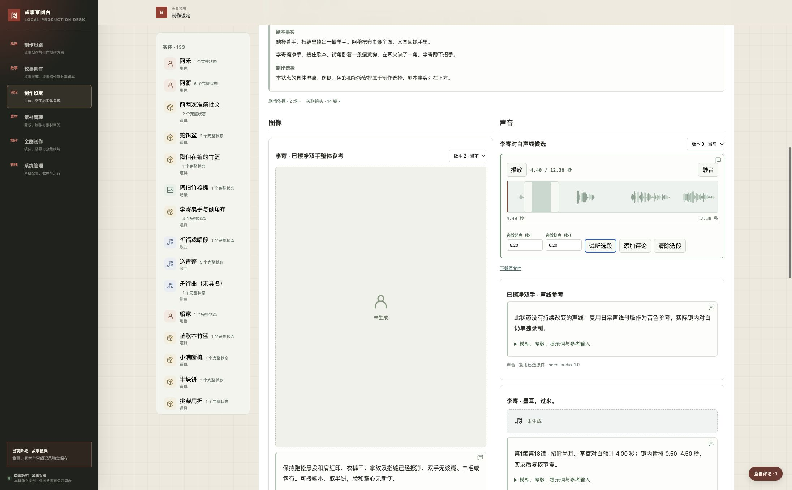

# 制作准备阶段验证

本轮实现实体生成方案、采纳／取消和统一评论界面，任务系统提交为 `496a186ae4b392b88dfacb7c6314675629cb7f07`，实际运行于 39103。第一集所需 33 个实体的全部 77 个完整状态、165 项素材方案已可阅读和评论；这次没有调用生成模型，没有新增真实作品采纳。整体任务仍待两轮创作审阅、完整素材与有声动态分镜。

## 页面与交互

| 验证 | 实际结果 |
| --- | --- |
| 实体审阅 | 在 39124 隔离实例实际采纳李寄，按钮变为取消采纳，再取消；基础信息和素材方案可切换原版本。新提示词意见绑定准确 REQUIREMENT 修订，采纳历史保留 |
| 音频 | 李寄擦净手状态只显示原件 4.40–12.38 秒；真实 WAV 解码为波形。键盘、数字精调 5.20–6.20 秒、试听、提交及定位通过；鼠标拖选 7.23–9.00 秒、手柄调整和新增评论标记立即出现通过 |
| 状态与版本 | 刷新后仍在声音所属状态；旧图像评论在版本 2 的 2016×2688 原件恢复原区域，没有转移到新版本 |
| 布局 | 图像和声音分区；真实录音没有封面，图像占位与缺音频条对应具体需求。实际 390 像素 iframe 页面滚动宽也是 390，无横向溢出 |
| 共用评论回归 | Chrome 共用圈选 17 项通过，覆盖资料、结构、制作思路、Unicode 和草稿；剧本 42 项通过，覆盖版本、集场、评论、刷新、历史定位与草稿隔离 |
| 真实任务入口 | 39103 实际打开新版李寄，未采纳状态、波形和选段精调可用，无控制台错误；仅阅读与播放器操作，未新增技术评论或决策 |
| 恢复页面 | 39128 从完整库空恢复后实际打开，WAV 播放开始于 4.417 秒、时长 12.38 秒、readyState 4，最终在 12.38 秒暂停；波形正常。这不等于实际听辨 |

[浏览器记录](evidence/generation-preparation-browser.json)包含具体操作与回归条目；[窄屏证据](evidence/generation-preparation-narrow.png)使用真实 iframe 宽度，不将无效的 viewport 设置当作验证。



## 自动验证与真实数据

| 范围 | 结果 |
| --- | --- |
| 通用系统 Python | 76 项通过，覆盖不可变修订、采纳／取消、候选独立、过期与并发拒绝、循环引用、准确输入包、已执行调用在取消后完成登记、文字／媒体锚点及恢复 |
| 前端 Node | 26 项通过，覆盖导航、实体／状态／素材历史、异步切换、刷新保持状态、参数数字格式与准确评论文本 |
| 故事工具 | 71 项通过；新方案工具另外以真实批次预演、原子应用、零变化复跑、文件与历史校验验证 |
| 数据覆盖 | 33 个实体、77 个完整状态、165 个方案；94 图像、71 音频，其中 151 拟生成、14 复用。37 条对白／演唱均带准确剧本来源、镜头和暂排时间；第 18 镜“墨耳，过来”对应擦净手后的状态 |
| 变更与保护 | 应用 1,443 项增量修订：33 实体、77 状态、41 场次检查、33 镜头、1,253 需求和 6 素材。事实／来源不变；原有 3,621 项修订、实际调用和旧决策保持，14 个文件校验不变 |
| 一致性 | 全剧 618 次场内使用与第一集 206 次镜内使用，共 824 次完整状态及转换检查通过；相同输入再次预演为零变化 |
| 输入就绪 | 第一集 320 项镜头用途及 110 项状态素材需求共 430 项必要输入未明确采用。未来母版可作为方案依赖，但未采用原件时不能输出可执行生成包 |

测试命令从相应工作区执行：

```bash
# 独立通用系统工作区
NO_PROXY=127.0.0.1,localhost no_proxy=127.0.0.1,localhost \
PYTHONPATH=. python3 -m unittest discover -s tests -v
node --test tests/*.test.cjs

# 故事任务工作区
PYTHONPATH=.runtime/review-desk-worktree \
REVIEW_DESK_SYSTEM_PATH=.runtime/review-desk-worktree \
NO_PROXY=127.0.0.1,localhost no_proxy=127.0.0.1,localhost \
python3 -m unittest discover -s tests -v
```

共用圈选夹具中，评论图标增加后原先按 `children[1]` 选正文的测试定位失效，已改为实际正文块选择；真实圈选功能和 Unicode 引用通过。音频精调被播放刷新覆盖、提交后评论标记未立即更新、基础和状态分别换版后混合历史内容可能启用采纳三个问题已修复并在浏览器复验。测试意见只留在技术副本。

## 部署与恢复

任务容器 `snakeslayingrecord-production-task-0003` 继续挂载 `.runtime/production/review-instance`，仅监听 `127.0.0.1:39103`，设置 `unless-stopped`。新镜像内 36 个文件与固定系统提交相同。更新采用构建镜像、停止旧容器、完整备份、原子增量应用、启动并回读的顺序；没有用技术副本替换真实数据库。

| 恢复范围 | 结果及本机位置 |
| --- | --- |
| 真实任务完整库 | `.runtime/production/generation-delivery/task-restored`；2,351 对象、5,064 修订、266 评论、295 评论事件，8 张表逐项一致，70 个清单文件通过，3 个代表实体聚合一致 |
| 真实生产重放 | 同目录 `replayed`；2,228 生产对象、4,932 准确修订、14 个文件，所有修订和对象头一致，基础故事 264 条评论保留 |
| 技术副本完整库 | 同目录 `technical-restored`；8 张表与原技术副本一致，70 文件通过，3 条新文字／时间评论锚点有效，李寄采纳及取消历史保留 |
| 部署前恢复路径 | 同目录 `before` 为停止服务后的完整备份；旧容器 `snakeslayingrecord-production-task-0003-before-generation` 已停止保留，不能与新版同时访问同一实例 |

[运行与增量证据](evidence/generation-preparation-runtime.json)、[最终界面修复部署](evidence/generation-preparation-fix-runtime.json)、[恢复证据](evidence/generation-preparation-recovery.json)、[生产重放](replay.json)保存准确数量与校验。`config/`、`content/` 与数据库导出共同组成实例，恢复需保留这些项目跟踪文件。不要用部署前快照覆盖后续用户新增评论；任何回退先停写、核对增量并保留现状。

## 未验证和下一步

现有媒体仍为两张李寄图像和五份 WAV，没有新增生成。图像实际尺寸仍不满足原生 4K；声音没有完成实际听辨。首轮代表基准、全部素材、逐镜可执行包、完整有声动态分镜及工程、第二轮用户审阅均未完成；不宣称已打开工程或通过作品恢复。

本轮未重新验证此前受浏览器本地文件权限限制的文件上传，也未在真实浏览器人为触发波形解码失败；时间轴有代码回退，但不写作现场验收通过。字幕、播放器计时和接口检查不能替代实际听审。此前一材多用、状态并存、采用／审阅独立及关联迁移证据保留于 [完整状态检查](evidence/complete-state-migration.json)、[状态素材验证](evidence/state-media-workspace.json)和[候选关联](evidence/baseline-associations.json)，不把旧结果冒称本轮重做。

自动验证及批次校验汇总见 [校验记录](evidence/generation-preparation-validation.json)。39123—39128 临时服务已停止，39103 保持运行，技术数据库保留。

正式数据库、导出、3000 服务及两个仓库主线未由本轮写入；没有集成、推送或标记任务完成。任务阶段与用户作品接受继续独立记录。
