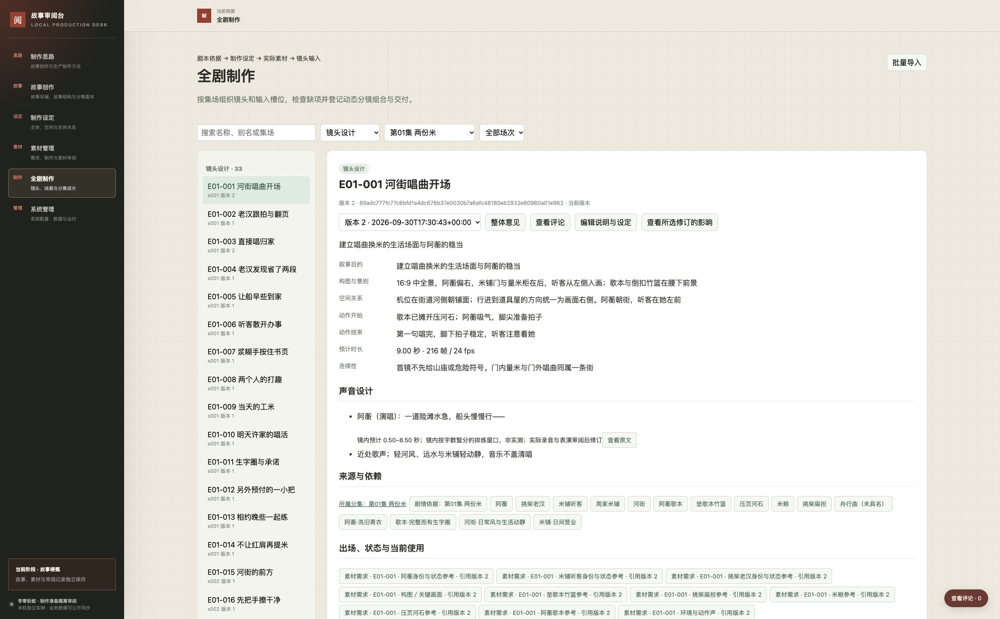

# 制作准备阶段验证

核验日期：2026-10-01。本记录覆盖当前任务工作区的系统、真实抽取数据与首批候选；不表示任务完成、首轮基准获认可或第一集已可进入镜头生成。系统精确提交记录在 `config/instance.json`，正式服务继续运行原版本。

## 自动检查与实际数据

通用系统最新测试 52 项通过，故事工具此前测试 64 项通过，无跳过。系统测试涵盖批量事务和并发、源修订及引用、别名冲突、状态并存、一材多用、审阅与采用分离、显式换版、变更与命名复核、媒体范围、I2I 深度、文件校验及导出恢复；HTTP 用例实际上传 WAV，读取 Range，创建时间评论，并验证旧 expected_version 返回 409。夹具文件不计作真实媒体。

从故事工作区执行故事测试：

```bash
PYTHONPATH=.runtime/review-desk-worktree \
REVIEW_DESK_SYSTEM_PATH=.runtime/review-desk-worktree \
NO_PROXY=127.0.0.1,localhost \
python3 -m unittest discover -s tests -v
```

从独立系统工作区运行 `python3 -m unittest discover -s tests -v`。初次故事测试因缺少系统模块路径失败；补全上述环境后通过。仅设置 PYTHONPATH 曾跳过一个相邻系统集成用例，显式设置 REVIEW_DESK_SYSTEM_PATH 后已实际执行。最新本机日志为 `.runtime/production/story-tests.log`、`.runtime/production/system-tests.log`。

真实数据经通用业务操作导入、校验并恢复：133 个实体、86 个状态、42 场完整检查；第一集 33 镜、320 个必要槽位，其他 40 场 782 个需求。正文与歌词定位使用 V4 的精确分集、场与正文块，第一集 64 个正文块全部覆盖，37 个对白／演唱单元保留原文。镜头时长 227 秒仍是待视听回看验证的设计值。

`node --check` 检查生产页面脚本通过。独立镜像 `story-review-desk:task-20260929-0003-production` 构建成功，镜像内 ffprobe 对真实演唱原件回读为 PCM 16-bit、48 kHz、双声道、17.053417 秒。镜像已在 39103 隔离入口运行；没有启动或重建正式 3000 服务，正式部署与合并候选验证仍在后续集成阶段执行。

## 跨会话审阅服务

2026-10-01 用户反馈页面打不开，检查发现原临时服务退出、39103 连接被拒绝。改由 Docker 后台容器 `snakeslayingrecord-production-task-0003` 挂载原实例，绑定 `127.0.0.1:39103` 并配置 `unless-stopped`，没有重新导入或覆盖数据。容器内 29 个系统文件与固定系统提交逐文件 SHA-256 一致；实际重启前后 `/api/production` 均返回 200、1,417 个对象，完整响应摘要相同。机器结果见 [service-restored.json](evidence/service-restored.json)，日常运行命令见 [README.md](README.md)。

Chrome 旧标签页刷新出现 CDP 超时，同一浏览器的新标签页实际打开成功，并依次点击制作设定、素材管理、全剧制作；核对 133 个实体、6 个素材对象、33 个第一集镜头及第一镜详情。音频已加载 17.053417 秒、`readyState=4`、无错误；图像原件接口返回 200。该检查只证明服务和页面恢复，不增加视听审阅结论。恢复后的页面见 [截图](evidence/service-restored.jpg)。

## Chrome 实际操作

### 剧本依据与按范围检查

2026-10-01 按用户确认，将 `INPUT_LOCK` 从制作设定的筛选与目录移出。全剧制作顶部只显示“剧本依据：版本四 · 已确认 · 17 集”，没有确认说明入口；原对象、精确引用和历史保留。无指定记录时默认第一集 33 镜，打开第一镜只检查该镜 13 项；本集与本场检查由用户主动触发，每页最多显示 20 项，旧正式输入链接兼容进入全剧制作。

Chrome 在 `.runtime/production/recovered-instance-03` 及更新后的 39103 完成 14 项回读，见 [script-basis-browser.json](evidence/script-basis-browser.json)：顶部无交互控件；第一集 320 项和第二场 182 项检查、分页、切换范围清理；第二集精确链接；制作设定 219 条与实体分类数量；实际制作记录中的简洁剧本依据。全剧各集视图不触发全量缺项检查。更新后导航曾遇到 `Page.navigate` 与 `Emulation.setFocusEmulationEnabled` 超时，未更换浏览器；标签清单随后显示加载完成，复用同一 Chrome 验证标签读取真实 DOM 并保存[当前页面截图](evidence/script-basis.jpg)。

系统 52 项自动测试、JavaScript 语法及 Git 空白检查通过。首次 HTTP 测试被系统代理转发并返回 502，设置本次测试进程的本机 `NO_PROXY` 后全部通过，没有为此修改系统网络配置。39103 当前镜像与系统提交 `aa1b48b441b3acf4dfaea23295d087968e45e9e0` 的 29 个文件逐一一致；更新前后 1,466 个生产对象响应及全部业务表摘要相同，含 266 条评论和 7 条实际制作记录的原引用。证据见 [script-basis-runtime.json](evidence/script-basis-runtime.json)。本轮只有展示层变化，没有数据迁移，沿用已有恢复结果；不据此扩大作品验收范围。

### 实体状态命名

2026-10-01 根据用户要求，将页面“剧情状态”改称“实体状态”，全剧状态标题统一采用所属实体完整名称。本轮更新 49 个标题；其余 37 个已符合命名要求。逐项比较确认只有 `title` 变化，133 个实体、86 个状态与原归属保持不变，1,368 个未改名既有记录、原 1,528 个生产修订和 266 条实例评论均保留。先查询实际依赖影响，再登记 49 个只针对确切旧／新状态的技术命名复核，原镜头与素材引用不换版；没有把它们标为用户接受或素材审阅通过。

通用系统 52 项测试通过，新增用例验证：没有明确复核时仍提示上游变化；仅改名复核适用于旧引用且不改写输入；后来再有内容变化时重新待复核；混入正文变更或错误目标的命名复核被拒绝。JavaScript 语法与 Git 空白检查通过。故事工具在真实恢复实例先预演、再执行，当前实例通过同一业务操作原子提交；不是用初始清单覆盖现有库。

Chrome 在隔离实例验证新分类、四个米袋状态筛选、版本 2 新名称、版本 1 历史旧名称及“所属实体：阿蘅米袋”跳转；更新后的 39103 实际搜索“阿蘅米袋”，显示 1 个道具实体与 4 个完整命名的实体状态。证据见 [state-naming.json](evidence/state-naming.json)与[页面截图](evidence/state-naming.jpg)。新建验证标签两次遇到 CDP 超时；复用同一 Chrome 中有效的验证标签后实际打开成功，未切换浏览器。

最新 `replay.json` 包含 1,466 个对象、1,626 个修订及原 14 个文件组成，已在空实例 `.runtime/production/recovered-instance-03` 恢复，全部记录头、修订 ID 与文件校验一致。新命名复核属于真实技术决定，恢复时保留；既有 264 条正式故事评论由基础导出恢复。本轮未重新执行完整库导出恢复，先前完整库证据仍只覆盖下述旧快照。

### 制作设定平铺筛选

2026-10-01 按用户要求实际查看九头案素材管理的分组选项及数量角标，仅参考交互。制作设定的记录类型、内容分类改为平铺按钮，使用本项目现有对象数据。Chrome 在干净恢复实例 39106 完成 17 项操作检查，机器记录见 [settings-filters.json](evidence/settings-filters.json)：

- 实体为 133 个，分类为角色 51、场景 16、道具 62、歌曲 4；剧情状态共 86 个，角色状态 34 个。组合筛选结果与列表一致，数量不重复累计历史版本。
- 再次点选取消该组筛选、零数量选项保留、清除全部、别名搜索及无结果均正常；键盘 Enter 选择后焦点保留。
- 390×844 窄屏下全部 10 个选项完整换行，筛选内容宽度与容器均为 364 像素，没有筛选区横向溢出；见[窄屏截图](evidence/settings-filters-narrow.jpg)。
- 回归素材管理图像 1 个对象／音频 5 个对象，全剧制作第一集 33 镜／两场分别 14 与 19 镜；原有筛选正常。筛选后重新展开评论，未提交草稿仍保留；随后 Esc 取消，没有提交测试评论。

本次 `node --check review_desk/static/production.js`、`git diff --check` 和通用系统 50 项测试通过。故事工具未改动，本次不重复运行其 64 项测试。39103 更新后在 Chrome 再次核对可见选项、实体分类数量与页面，见[当前页面截图](evidence/settings-filters.jpg)；更新前后 1,417 个生产对象的接口响应摘要相同，29 个运行文件与系统提交逐文件一致，见[运行验证](evidence/settings-filters-runtime.json)。本次仅更新隔离候选服务，不改正式 3000。

### 制作完整路径与既有页面

39103 使用真实制作准备数据，39104 使用恢复后的一次性操作实例。测试评论只写入隔离库；正式库、既有用户评论和正式浏览器草稿不变。

| 路径 | 实际结果 |
| --- | --- |
| 制作设定 | 读取实体／状态、准确剧情来源、出场与镜头反查；实体增加新修订后仍能看到采用旧版本的当前使用 |
| 素材管理 | 读取原件和实际调用，比较李寄图像版本 1／2，切换精确版本后评论数分别显示 |
| 图像区域评论 | 真实鼠标拖选区域并保存，绑定图像版本 2；切到版本 1 不显示该意见 |
| 音频时间评论 | 实际播放器播放，计时推进，时长与原件一致；保存 0.6–3.2 秒意见并以 ⌘+Enter 提交，“定位原圈选”回到 0.6 秒 |
| 审阅不等于采用 | 在 39104 对真实阿蘅演唱原件记录“技术通过”，没有自动创建采用 |
| 一材多用 | 同一演唱精确版本分别选择 0.5–8.5 秒、8.5–17 秒给 E01-001／003；各自缺项变化，原件不复制、不改写 |
| 显式换版和裁切 | E01-007 测试采用李寄图版本 1 及 0.1／0.1／0.8／0.8 裁切，再显式换到版本 2；保留旧采用历史，仍提示像素不足和未验证原生 4K |
| 上游变化 | 阿蘅增加测试修订后，镜头列出准确旧／新版本以及需求、采用两种待复核位置；分别保存“保留”只解除匹配项，其他位置仍待复核，素材不自动换版 |
| 全剧制作 | 按第一集、场次及镜头类型筛选，显示 33 镜；目的、构图、空间、动作、声音与来源可读；必要输入不足时下载就绪输入包禁用 |
| 精确来源 | 点击歌词来源只显示对应分集修订和正文块原文，未切换到不相关新稿 |
| 既有页面 | 故事采编正文、结构第十稿及第八稿 5 条历史评论、V4 分集场次、制作思路双 Tab 正常读取 |
| 剧本与草稿 | 真实鼠标选中“阿蘅：还得养。”，创建未提交测试草稿；离开到制作思路再返回，正文和草稿保留；输入框内 Esc 取消测试草稿，未提交意见 |



浏览器文件上传未完成：扩展要求开启本地文件 URL 访问；原错误为 `To enable file upload ... enable Allow access to file URLs`。按工具文档告知用户后，系统文件窗口替代入口也返回 `cgWindowNotFound`。没有擅自修改权限，没有把 HTTP 上传通过写成浏览器上传通过。解除限制后仍须补验文件选择、上传、原件预览及登记结果。

播放器实际推进不代表模型已听见音频。当前模型没有直接音频听辨能力；五份候选的声线、表演、歌词发音与演唱一致性仍未通过实际听审。

## 两种隔离恢复

命名更新前的生产修订重放以当前故事 `export/manifest.json` 的准确摘要为基础，恢复 1,417 个生产对象、1,528 个生产修订和 14 个文件组成，修订 ID／记录头／SHA 全部一致，原有 264 条评论保留，实例为 `.runtime/production/recovered-instance-02`。包含命名更新的最新恢复见上节；重放不带入隔离测试评论，也不复写首次入库时间。

完整数据库导出后另在空实例恢复，逐项比较对象、修订、依赖、评论和事件，均一致：1,540 个对象、1,660 个修订、7,347 条依赖、266 条评论、295 条事件；文件清单包含 70 个文件。266 条评论中 264 条来自原故事导出，另 2 条是 39103 本次图像／声音锚点测试意见；未写入正式库。完整恢复实例为 `.runtime/production/bundle-restored-02`，机器结果见 `.runtime/production/bundle-restore-result.json`。

之前从同样原件与修订恢复的 39104 实例已在 Chrome 播放真实演唱文件，`readyState=4`、无播放错误且计时推进。当前新增的 33 条后续场景声音需求修订不改动媒体。该实例之后的技术审阅、采用和上游修改仅用于上述测试，不加入 `replay.json`。

## 尚未证明的范围

原生 4K 图像未达标；首轮代表性基准未齐，用户尚未接受具体母版与声音；第一集 320 个必要槽位尚无正式采用。没有完整逐镜生成输入目录包、有声动态分镜或可编辑工程，所以没有宣称工程打开、整集观看和听辨、工程及动态分镜恢复通过。第二轮作品审阅、正式阶段更新、双仓合并候选验证和任务完成确认均未发生。

自动验证证明数据约束和恢复路径，不能代替视听审阅，也不能外推最终镜头生成模型、斩蛇动作或夜景质量。
