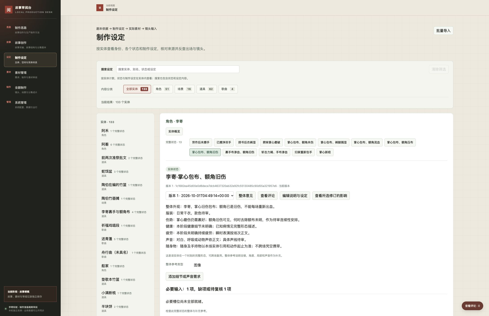

# 制作准备阶段验证

核验日期：2026-10-01。当前系统提交为 `66578a5a84da0e3ea1cbd6dd25d20674878d1d59`，只运行在任务隔离入口 39103。完整状态的数据、页面与恢复已验证；具体制作基准、第一集全部素材和有声动态分镜尚未验收，本记录不表示任务完成或已可开始正式镜头生成。

## 数据范围与迁移结果

剧本依据仍为用户确认的版本四，整版修订 `7287b25a34d4b0db242ec5688f33349fa6d449874a3c6acb30033e2260cd2686`，17 集、42 场、1,114 个正文块。重新逐场核对后，133 个实体具备 267 个完整状态；实际呈现／发声涉及 618 次场内实体使用，第一集另有 206 次镜内使用，共 824 次检查没有缺失状态、错误归属或缺少转换依据。两名仅被提及对象保留事实状态，不产生媒体义务；其余状态共登记 265 项整体参考。

完整状态合并同一时刻的全部相关特征。米袋从空袋到不同装米量，歌本从旧纸放在本上到合入、受损及修补均按剧情区分；门闸开后再关复用原状态。李寄掌心包布与额角旧伤合在同一状态，身体与服装未知细节明确待审。普通动作和素材换版不增加状态数。逐镜动作、起止与转换依据见 [第一集设计](episode01/shots.md)。

第一集仍为两场、33 镜、37 个对白／演唱单元，覆盖该集 64 个正文块，设计时长 227 秒。320 项镜头用途另引用 41 项共用整体参考，合计检查 361 项必要输入，目前全部未采用。其他 40 场登记 786 项有效需求，4 项原不应要求实物呈现的需求以撤回修订保留理由；没有生产后续集媒体。

迁移原子提交 1,723 条新记录或修订：6 个实体修订、267 个完整状态、1,375 个需求、42 个集场检查、33 个镜头设计。原有 1,758 个数据库修订逐条保留且内容不变，86 个旧局部状态、实际素材、调用、审阅和采用头保持原引用。来源、266 条评论、295 条评论事件、配置及配置事件一致。相同数据重新预演为零变化，读取依赖或版本发生冲突时整批拒绝，不覆盖运行数据库。机器证据见 [迁移对应与影响](evidence/complete-state-migration.json)和[运行核对](evidence/complete-state-runtime.json)。

## 自动检查

通用系统 58 项 Python 测试、5 项前端导航测试、故事工具 70 项测试通过，无跳过。最后两处状态文字修正后，6 项真实剧本状态测试再次通过。检查覆盖完整状态字段与归属、转换顺序和准确来源、缺项阻止输入包、整体与细节不能互相替代、一材多用、通过但未采用、显式换版、上游待复核、读取依赖并发保护、旧格式历史及媒体范围。旧图像区域和时间评论测试继续通过；技术夹具不作为作品素材。

故事工作区：

```bash
PYTHONPATH=.runtime/review-desk-worktree \
REVIEW_DESK_SYSTEM_PATH=.runtime/review-desk-worktree \
NO_PROXY=127.0.0.1,localhost no_proxy=127.0.0.1,localhost \
python3 -m unittest discover -s tests -v
```

独立系统工作区：

```bash
NO_PROXY=127.0.0.1,localhost no_proxy=127.0.0.1,localhost \
PYTHONPATH=. python3 -m unittest discover -s tests -v
node --test tests/production_navigation.test.cjs
node --check review_desk/static/production.js
git diff --check
```

Docker 镜像内 30 个运行文件与固定系统提交逐文件 SHA-256 一致，三个页面及制作 API 返回 200。容器 `snakeslayingrecord-production-task-0003` 使用 `unless-stopped`，绑定 `127.0.0.1:39103`，挂载原任务实例；正式 3000、正式库、正式导出和两个仓库主线未改变。原容器停用并保留，不可与新容器同时操作同一实例。启动说明见 [README](README.md)。

## Chrome 实际操作

本轮使用已连接 Chrome。39106 为可写操作测试实例，技术关联、补充需求与说明修订只存在该实例；未提交测试评论，测试草稿已取消。39107 用于完整库恢复回读，39103 用于实际交付页面检查。没有刷新或编辑用户原有的评论草稿标签页。具体记录见 [浏览器证据](evidence/complete-state-browser.json)。

| 使用路径 | 验证内容 |
| --- | --- |
| 实体内浏览 | 平铺 133 个实体，角色 51、场景 16、道具 62、歌曲 4；状态不与实体并列，旧局部状态不计入完整状态数 |
| 完整形态 | 李寄同时包含掌心与额角情况；船家、阿禾均有状态；墨耳普通动作不拆出多个状态；状态按剧情来源顺序浏览 |
| 整体与补充 | 新增可选掌心特写后仍保留必需整体参考；整体缺项时下载按钮禁用 |
| 一材多用 | 对实际图像候选登记两个状态的整体／细节覆盖，创建素材新修订；原版本、原件和实际调用引用保持可读，没有自动采用 |
| 状态修订 | 修改测试船家服装说明后生成新修订，旧需求保留旧引用，提示缺少新整体参考及需求待复核 |
| 镜头承接 | E01-017 显示擦手前后完整状态及准确转换正文；检查 6 次实体使用、8 个状态、17 项必要输入，缺项时禁止下载 |
| 既有页面 | 采编正文、结构第十稿、版本四两场正文、版本三既有评论、制作思路双页签可读 |
| 草稿 | 完整状态的未提交评论在切换分类后仍保留；重新打开面板核对文字，再以 Esc 取消，未提交到库 |



此前已在独立操作实例实际验证图像区域评论、音频 0.6–3.2 秒评论与定位、精确来源、审阅不自动采用、同一录音两个时间范围、图像版本显式替换与裁切、旧结构评论和剧本草稿。对应旧阶段证据保留在 [实体层级检查](evidence/entity-hierarchy-browser.json)、[输入导航检查](evidence/script-basis-browser.json)及既有截图；本轮不将此前播放行为当作新的听审。

## 导出与空实例恢复

当前真实制作记录重放包含 2,006 个生产对象、3,349 个生产修订和 14 个媒体／回执文件组成。`.runtime/production/recovered-complete-states-final` 从基础故事导出恢复后，经共用业务操作重放，全部修订 ID、记录头及文件校验一致，基础故事 264 条评论保留。重放不重写首次入库时间。

另从当前任务实例完整导出，在 `.runtime/production/bundle-complete-states-final` 空库恢复：2,129 个总对象、3,481 个总修订、266 条评论、295 条评论事件，清单含 70 个文件。对象、修订、依赖、来源、评论、事件和配置逐项一致；所有当前生产载荷通过业务验证。266 条评论包括此前两条任务隔离实例的图像／声音技术锚点意见。Chrome 回读恢复后的完整状态与原件入口，不能把接口恢复通过代替页面回读。准确结果见 [恢复证据](evidence/complete-state-recovery.json)。

## 尚未证明的范围

两张图像仍为 2016×2688，未达到原生 4K；五份录音的声线、表演、发音和演唱一致性仍需实际听辨。播放器计时推进或字幕核查不能替代听审。完整状态与素材兼容关系需要逐份核对后显式登记，迁移对应表不是自动采用结论。

浏览器文件上传仍受扩展本地文件 URL 权限限制；此前原错误为 `To enable file upload ... enable Allow access to file URLs`，系统文件窗口替代报 `cgWindowNotFound`。未修改权限，HTTP 上传通过不计作浏览器上传验收。

首轮基准尚未获用户接受；第一集没有完整可执行输入目录包、有声动态分镜或可编辑工程，因此没有工程打开、整集观看听辨或动态分镜恢复结论。第二轮作品审阅、正式阶段更新、双仓合并候选验证及任务完成确认均未发生。数据和页面验证不能外推最终镜头模型、斩蛇动作或夜景质量。
