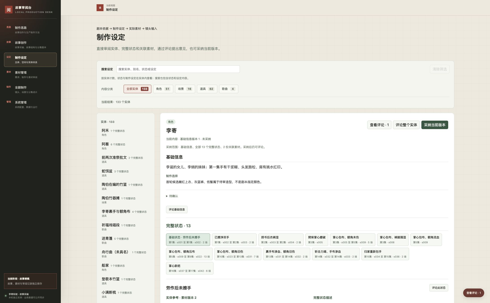

# 制作准备阶段验证

核验日期：2026-10-01。当前系统为 `6bca5a8b89600a1f5d40187d85cbc0978607b985`，部署于任务入口 39103。本轮修正实体管理的工作方式：直接审阅当前内容，通过评论推进修订，可选采纳当前版本，没有送审步骤。具体制作基准、全套素材与有声动态分镜尚未验收，任务仍在执行中。

## 实体直接审阅

实体基础信息常驻，下方选择完整状态；关联素材和完整描述并列展示。状态选项不再出现“整实体送审”。此前 133 个旧记录保留历史引用和恢复，不再参与正常浏览，新内容也不需要初始化。当前 133 个实体、267 个完整状态和实际候选无需改写即可直接读取。

采纳记录绑定当时基础信息、全部完整状态和关联素材的准确版本。采纳后仍能添加意见；新内容显示未采纳，历史采纳和历史评论继续可读。只关联实体、尚未核对完整状态的图像或声音标为实体参考，不把可审阅等同于状态素材齐备。

本次没有生成新媒体，也没有采纳真实作品。39103 的 8 张数据库表在部署前后逐项校验一致：45 份来源、266 条评论、295 条评论事件、2,262 个对象、3,614 个修订、17,717 个依赖、2 项配置及 16 条配置事件。

## 自动与页面验证

| 验证 | 结果及范围 |
| --- | --- |
| 通用系统 | 66 项 Python 测试通过。覆盖无需中间记录直接读取、关联候选、采纳后评论、完整范围并发拒绝、原子回滚、新版本不继承、历史意见和两种恢复路径 |
| 故事工具 | 71 项测试通过，无跳过。旧初始化脚本及其用例退役，真实生产重放改用空实例的历史校验操作 |
| 前端逻辑 | 16 项 Node 测试通过，覆盖旧地址归位、状态层级、评论聚合、历史与当前焦点切换、异步导航 |
| 浏览器共用评论 | Chrome 中圈选回归 17 项、快捷键回归 76 项通过，涉及采编、结构、剧本、制作思路及草稿 |
| 浏览器实体流程 | 39113 实际完成未采纳时评论、采纳、采纳后状态／声音时间段评论、内容修订后直接可见、历史图像和状态意见定位、旧采纳读取 |
| 恢复与实际页面 | 39116 打开恢复后的制作设定、素材管理、全剧制作，WAV 原件元数据可读；39103 另行回读当前实体页面 |

实体流程使用 `.runtime/production/direct-review-test`：三条新技术评论、一条技术采纳及两项内容修订只在该副本中。声音意见定位到 1.20 秒，原件时长 12.38 秒、播放器 readyState 为 4；恢复副本的演唱原件时长 17.053417 秒。这里只验证媒体展示、文件与锚点，没有据此声称实际听辨或接受声音质量。用户原有标签页和草稿未刷新或编辑。

命令从相应工作区运行：

```bash
# 故事任务工作区
PYTHONPATH=.runtime/review-desk-worktree \
REVIEW_DESK_SYSTEM_PATH=.runtime/review-desk-worktree \
NO_PROXY=127.0.0.1,localhost no_proxy=127.0.0.1,localhost \
python3 -m unittest discover -s tests -v

# 独立系统工作区
NO_PROXY=127.0.0.1,localhost no_proxy=127.0.0.1,localhost \
PYTHONPATH=. python3 -m unittest discover -s tests -v
node --test tests/*.test.cjs
```

浏览器操作与自动结果见 [直接审阅证据](evidence/direct-entity-review-workspace.json)。



## 运行和恢复

任务容器 `snakeslayingrecord-production-task-0003` 继续挂载 `.runtime/production/review-instance`，绑定 `127.0.0.1:39103`，设置 `unless-stopped`。32 个系统文件的 SHA-256 与固定提交一致。原容器已停止并保留为 `snakeslayingrecord-production-task-0003-before-history-order`；不要同时启动两个容器访问同一数据库。原有两秒空闲连接超时保留。镜像、容器、数据前后对比见 [运行证据](evidence/direct-entity-review-runtime.json)。

恢复路径和结果：

| 数据范围 | 隔离恢复目录 | 结果 |
| --- | --- | --- |
| 真实生产修订重放 | `.runtime/production/recovered-direct-review-final` | 2,139 个生产对象、3,482 个准确修订、14 个文件组成；对象头及修订一致，基础故事 264 条评论保留 |
| 真实任务完整库 | `.runtime/production/bundle-direct-review-real` | 8 张表逐项一致，70 个清单文件校验通过；266 条评论和 295 条事件保留，没有真实采纳记录 |
| 技术副本完整库 | `.runtime/production/bundle-direct-review-technical` | 8 张表逐项一致；采纳后的新修订、269 条评论及旧采纳准确恢复 |
| 技术副本生产重放 | `.runtime/production/replayed-direct-review-technical` | 3,485 个生产修订与对象头一致；当前未采纳，过去采纳仍可按准确版本读取 |

完整库恢复校验原件及元数据，生产重放通过共用 `restore_records` 操作校验历史引用，只允许空的生产对象集合。普通导入仍检查当前状态／素材集合，恢复规则不开放给页面或 HTTP 的日常写入。详细数量见 [恢复证据](evidence/direct-entity-review-recovery.json)。

39113—39116 为本轮临时验证服务，完成后停止；39103 后台容器继续提供页面。正式数据库、导出、3000 服务和两个仓库主线没有由本轮写入，也没有执行集成或推送。

## 真实制作成果与未完成范围

制作依据为用户确认的版本四，整版修订 `7287b25a34d4b0db242ec5688f33349fa6d449874a3c6acb30033e2260cd2686`，17 集、42 场、1,114 个正文块。133 个实体有 267 个完整状态，场内实际使用 618 次、第一集镜内使用 206 次，共 824 次检查未发现状态缺失、错误归属或转换遗漏。两名仅被提及对象没有媒体义务，265 项整体参考另有明确需求。86 个旧局部状态和历史引用保留。此前迁移证据见 [完整状态检查](evidence/complete-state-migration.json)。

第一集仍为两场、33 镜、37 个对白／演唱单元，预计 227 秒；覆盖 64 个正文块。320 项镜头用途加 41 项共用整体参考，361 项必要输入均未采用。后续 40 场已有 786 项有效需求，4 项不适用旧需求已用撤回修订保留理由。

实际媒体仍为两张李寄候选图及五份 48 kHz WAV。图像原件为 2016×2688，未达到原生 4K；声音尚未完成实际听审。具体母版、声线与旋律均未获用户首轮接受，没有批量派生、完整动态分镜或可编辑工程，不能声称已播放成片、打开工程或完成作品恢复。

浏览器文件上传仍有既有本地文件权限限制，未以 HTTP 上传结果替代页面验收。前一阶段的 760／390 像素布局证据保留在 `evidence/entity-review-workspace.json`，本轮未重做窄屏测试。最终技术验收、两轮作品审阅、任务完成及本地集成分别记录，当前不能宣称第一集已具备正式镜头生成条件。
