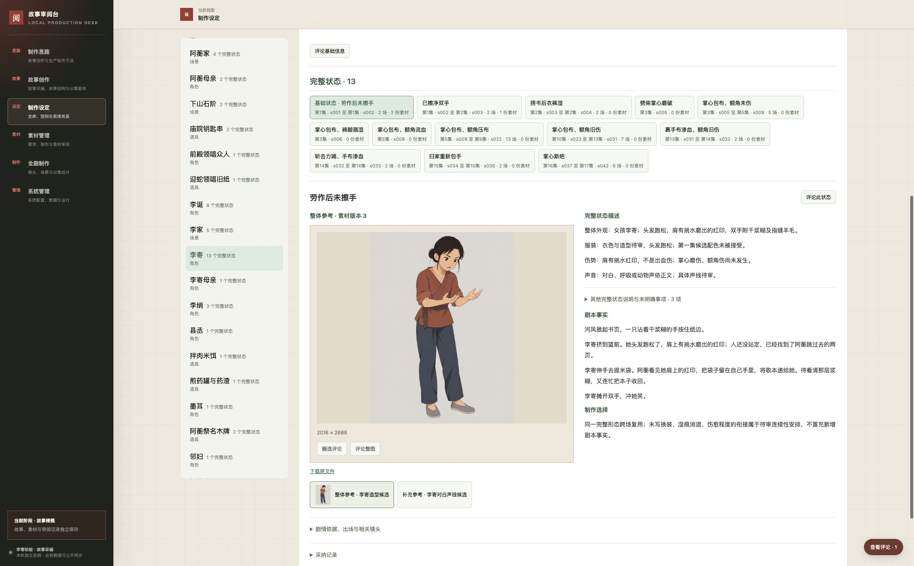

# 制作准备阶段验证

核验日期：2026-10-01。当前系统为 `dac4c46c6b21a0ca3692029de9ac52d166607e2c`，部署于任务入口 39103。本轮将全部 6 个现有素材条目明确关联到 5 个实体的 6 个完整状态，保存为 6 项新素材修订。系统代码未改动，沿用直接评论与可选采纳当前版本的工作方式。具体制作基准、全套素材与有声动态分镜尚未验收，任务仍在执行中。

## 实体直接审阅

实体基础信息常驻，下方选择完整状态；关联素材和完整描述并列展示。状态选项不再出现“整实体送审”。此前 133 个旧记录保留历史引用和恢复，不再参与正常浏览，新内容也不需要初始化。当前 133 个实体、267 个完整状态和实际候选无需改写即可直接读取。

采纳记录绑定当时基础信息、全部完整状态和关联素材的准确版本。采纳后仍能添加意见；新内容显示未采纳，历史采纳和历史评论继续可读。状态区及历史对比同时匹配状态身份和准确修订，显示按素材版本去重的份数。同一素材服务多个状态需逐项明确关联。仅关联实体、旧局部状态或旧状态版本的候选保留于“待关联状态的素材”折叠区，可继续预览评论，不计入各状态，也不自动配给基础状态。

本次没有生成新媒体，也没有采纳真实作品。39103 当前有 45 份来源、266 条评论、295 条评论事件、2,262 个对象、3,620 个修订、17,746 个依赖、2 项配置及 16 条配置事件。只更新 6 个素材的当前版本，增加关联说明和准确状态依赖；全部 3,614 项旧修订、其他对象的当前版本、文件组成、实际调用、质量记录、评论和配置逐项保持不变。

## 现有素材关联验证

先在 `.runtime/production/associate-existing/instance` 的隔离副本预演并通过 Chrome 操作 39119，再通过共用 HTTP 导入接口向 39103 提交同一批次。提交前核对读取依赖及原素材版本，没有用副本覆盖运行数据库。

| 验证 | 本批结果 |
| --- | --- |
| 全部素材归属 | 6 个当前素材条目都有明确实体和准确完整状态，共 8 项关联；没有候选因实体归属而自动适用于全部状态 |
| 李寄 | 基础状态显示图像和对白共 2 份，已擦净双手显示对白 1 份，湿衣状态无素材；两个对白范围分别为 0–4.40 秒、4.40–12.38 秒 |
| 阿蘅及歌曲 | 日常状态显示对白和演唱 2 份，嗓哑状态无素材；同一份演唱在舟行曲省段清唱状态作为整体声音候选显示 |
| 周掌柜、赵执事 | 各自在基准完整形态显示对白 1 份；其他状态显示 0 份 |
| 页面回读 | Chrome 在任务实例逐一切换上述 5 个实体及相关状态、素材；无控制台错误，没有操作采纳或新增评论 |
| 原件和历史 | 14 个原件／元数据文件 SHA-256 一致；旧素材、实际制作输入、质量缺口和历史评论不变 |
| 完整恢复 | 8 张数据库表逐项一致，70 个清单文件校验通过；5 个实体的审阅内容及关联与原实例相同 |
| 生产历史重放 | 空实例重建 2,139 个对象、3,488 个准确修订，当前版本一致，14 个文件校验通过 |

关联依据和范围见[可读清单](baseline-associations.md)，准确修订及验证记录见[本批证据](evidence/baseline-associations.json)。音频范围依据实际调用和字幕确定，尚未完成实际听辨；图像依然未达到原生 4K。本次只确认归属和页面展示，未把关联当成素材就绪。



## 已有系统与页面验证

以下是最近一次系统代码变更及先前实体审阅改造的结果。本批只修改数据和说明，没有重复运行这些完整测试；本批校验范围见上表。

| 验证 | 结果及范围 |
| --- | --- |
| 通用系统 | 68 项 Python 测试通过。包含状态换版不继承素材覆盖、同一素材中未关联的文件组成独立保留，以及采纳、并发、原子回滚、历史意见和恢复 |
| 故事工具 | 上一轮 71 项测试通过，无跳过；本轮未修改故事工具，未重复运行。制作思路及版本配置通过 JSON 解析与运行回读 |
| 前端逻辑 | 22 项 Node 测试通过，覆盖准确状态筛选、多素材／多状态、未关联与历史评论定位、时间段范围，以及既有导航 |
| 浏览器共用评论 | Chrome 中圈选回归 17 项通过，涉及采编、结构、制作思路及草稿；上一轮快捷键 76 项结果保留，本轮未重复 |
| 浏览器状态素材 | 39117 的前三个状态分别显示 2／1／0 份素材；未关联声音可评论且不进入状态区；两个播放器具有相同文件组成 ID 时，意见只定位正确播放器到 1.20 秒；历史图像圈选不污染当前图像 |
| 既有实体流程 | 上一轮 39113 完成未采纳时评论、采纳、采纳后继续评论、新内容直接可见和准确历史读取；本轮保持该契约 |
| 关联前任务页面 | 当时在 39103 逐一点击李寄全部 13 个状态，未关联候选仅在独立折叠区；本批显式关联后，当前展示结果以上表为准 |

此前 `.runtime/production/state-media-test` 从真实任务库隔离复制，在其中登记两项技术素材关联、两个未关联技术候选及一条时间段评论。它们仅用于验证页面，未导入任务实例，不代表素材适配或用户采纳。

上一轮实体流程使用 `.runtime/production/direct-review-test`：三条新技术评论、一条技术采纳及两项内容修订只在该副本中。声音意见定位到 1.20 秒，原件时长 12.38 秒、播放器 readyState 为 4；恢复副本的演唱原件时长 17.053417 秒。这里只验证媒体展示、文件与锚点，没有据此声称实际听辨或接受声音质量。用户原有标签页和草稿未刷新或编辑。

命令从相应工作区运行：

```bash
# 故事任务工作区
PYTHONPATH=.runtime/review-desk-worktree \
REVIEW_DESK_SYSTEM_PATH=.runtime/review-desk-worktree \
NO_PROXY=127.0.0.1,localhost no_proxy=127.0.0.1,localhost \
python3 -m unittest discover -s tests -v

# 独立系统工作区
NO_PROXY=127.0.0.1,localhost no_proxy=127.0.0.1,localhost \
PYTHONPATH=. python3 -m unittest discover -s tests -v
node --test tests/*.test.cjs
```

此前页面机制与自动结果见 [状态素材证据](evidence/state-media-workspace.json)；直接审阅及采纳流程见 [实体审阅证据](evidence/direct-entity-review-workspace.json)。历史截图中的[未关联候选区](evidence/state-media-unassigned.jpg)保留为机制验证，当前 6 个候选的归属以上述本批证据为准。

## 运行和恢复

任务容器 `snakeslayingrecord-production-task-0003` 继续挂载 `.runtime/production/review-instance`，绑定 `127.0.0.1:39103`，设置 `unless-stopped`。32 个系统文件的 SHA-256 与固定提交一致。原容器已停止并保留为 `snakeslayingrecord-production-task-0003-before-state-media`；不要同时启动两个容器访问同一数据库。原有两秒空闲连接超时保留。镜像、容器、数据前后对比见 [运行证据](evidence/state-media-runtime.json)。

最新恢复路径和结果：

| 数据范围 | 隔离恢复目录 | 结果 |
| --- | --- | --- |
| 真实生产修订重放 | `.runtime/production/associate-existing/recovered` | 2,139 个生产对象、3,488 个准确修订、14 个文件组成；对象头及修订一致，基础故事 264 条评论保留 |
| 真实任务完整库 | `.runtime/production/associate-existing/restored-bundle` | 8 张表逐项一致，70 个清单文件校验通过；266 条评论和 295 条事件保留，没有真实采纳记录 |
| 技术副本完整库 | `.runtime/production/bundle-direct-review-technical` | 8 张表逐项一致；采纳后的新修订、269 条评论及旧采纳准确恢复 |
| 技术副本生产重放 | `.runtime/production/replayed-direct-review-technical` | 3,485 个生产修订与对象头一致；当前未采纳，过去采纳仍可按准确版本读取 |

完整库恢复校验原件及元数据，生产重放通过共用 `restore_records` 操作校验历史引用，只允许空的生产对象集合。普通导入仍检查当前状态／素材集合，恢复规则不开放给页面或 HTTP 的日常写入。当前数量见[关联与恢复证据](evidence/baseline-associations.json)；技术副本历史采纳的恢复结果见[既有恢复证据](evidence/direct-entity-review-recovery.json)。

39113—39118 为此前临时服务，39119 为本批隔离预演；验证后均停止，39103 后台容器继续提供页面。正式数据库、导出、3000 服务和两个仓库主线没有由本轮写入，也没有执行集成或推送。

## 真实制作成果与未完成范围

制作依据为用户确认的版本四，整版修订 `7287b25a34d4b0db242ec5688f33349fa6d449874a3c6acb30033e2260cd2686`，17 集、42 场、1,114 个正文块。133 个实体有 267 个完整状态，场内实际使用 618 次、第一集镜内使用 206 次，共 824 次检查未发现状态缺失、错误归属或转换遗漏。两名仅被提及对象没有媒体义务，265 项整体参考另有明确需求。86 个旧局部状态和历史引用保留。此前迁移证据见 [完整状态检查](evidence/complete-state-migration.json)。

第一集仍为两场、33 镜、37 个对白／演唱单元，预计 227 秒；覆盖 64 个正文块。320 项镜头用途加 41 项共用整体参考，361 项必要输入均未采用。后续 40 场已有 786 项有效需求，4 项不适用旧需求已用撤回修订保留理由。

实际媒体仍为两张李寄候选图及五份 48 kHz WAV。图像原件为 2016×2688，未达到原生 4K；声音尚未完成实际听审。具体母版、声线与旋律均未获用户首轮接受，没有批量派生、完整动态分镜或可编辑工程，不能声称已播放成片、打开工程或完成作品恢复。

浏览器文件上传仍有既有本地文件权限限制，未以 HTTP 上传结果替代页面验收。前一阶段的 760／390 像素布局证据保留在 `evidence/entity-review-workspace.json`，本轮未重做窄屏测试。最终技术验收、两轮作品审阅、任务完成及本地集成分别记录，当前不能宣称第一集已具备正式镜头生成条件。
