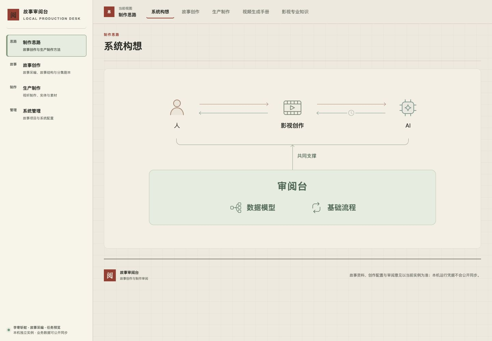

# task-20261010-0023 · 系统构想：共同基础支撑人与 AI 协作

原问题是愿景协作块关系不清，随后整页收敛为一张图。用户已认可两层叙事，本轮解决上层过于抢眼、整体僵硬及与系统 UI 风格不协调，并按最新要求将模块改名为“系统构想”。这些明确反馈取代最初四块布局、三方并列及五阶段链的展示要求。

页面以浅绿色共同基础突出“审阅台”，内部并列数据模型和基础流程；一个向上连接及覆盖整个上层的括线表示共同支撑，不把两个基础分别绑定人和 AI。上层用低饱和人物、AI 与电影图标和双向细线保留共创关系，时间符号融入返回路径。页面直接复用其他子页的阅读区暖纸色，实读计算值同为rgb(244,239,228)，仅基础层保留浅绿；字体与留白沿系统风格；原生文字和矢量图标在窄屏保持可读字号。图表达协作构想，不宣称影视作品已完成或所有能力已实现。

## 实际页面验证

macOS Chrome，本任务独立实例53207，实际检查1440×1000、760×900及390×844。中间屏宽发现侧栏挤压后，已改为按内容容器宽度响应；复查所有节点完整落在图内。手机图形完整，页面scrollWidth为390，上层文字14px、基础项16px。两层同时可见，无折叠、目录、外部重复标题或额外解释段。

[手机完整页面](isolated-narrow.png)

页签与页面标题均为系统构想；默认、显式vision、刷新和四个旧锚点practice／review-desk／methods／delivery进入同一张图，保留既有链接。实际切换故事创作、生产制作、视频生成手册、影视专业知识，点击structure／candidate-production／demo-inputs／staging，原目录和代表正文正常；左右方向键切换及返回系统构想通过。

## 同源与兼容

文字和关系元数据唯一维护在production/system-vision.md，派生首项保持vision技术标识；其他四子页内容逐项不变。通用审阅台提供supported-collaboration静态图形，实例不能注入SVG、HTML或任意路径。缺失／重复角色或基础、未知图标、空关系说明、额外标记均拒绝，修正后恢复；旧协作与循环契约保留。

同源检查通过，方法交付／历史恢复3项、方法HTTP10项、前端格式／导航／阅读上下文47项通过。新Review资源、方法和绑定追加第6版；标准导出、作者交付的相对入口实际读回，新空实例恢复后重取同一完整包。旧执行重导出仍为第5版原文，同源重投影和登记包重复应用幂等，旧expected_version拒绝覆盖新版本。新登记只含本工作类型3个对象的连续18条定义，不带测试执行、其他方法或业务数据。

## 正式交付与保留

双仓吸收执行时最新main，保留审批退出等其他任务成果；审阅台准确候选由config/instance.json固定，主仓和系统的最终候选、受管集成与远端回读以任务账本为准。正式服务仍为本机3000，沿既有准确冻结包、发布锁与停止写入窗口，只追加本任务方法增量并切换服务，不用旧库回灌。

本轮隔离图不能单独证明正式生效。正式镜像、源码／挂载、方法与业务保全、Chrome复验及实际资源清理数量保存在主项目`.runtime/task-20261010-0023/v6/`和任务结果回执；旧发布历史按原回执和Git追溯。发布失败则保留准确候选与恢复条件，不声称完成。

用户“不自动结项”持续有效，不调用_complete，不代签负责人独立Review。正式可用后停止本轮预览并清理测试库、导出、一次性脚本和无效构建副本；保留最小回执、准确恢复配置和正式current／previous／base。模型草图与真实调用回执暂用于当前设计比较和追溯，待本轮人工反馈结束由任务执行者收敛。未结项和会话占用期间保留受管worktree，解除后沿受管流程退役。本轮未新增付费生成或VPS发布。
