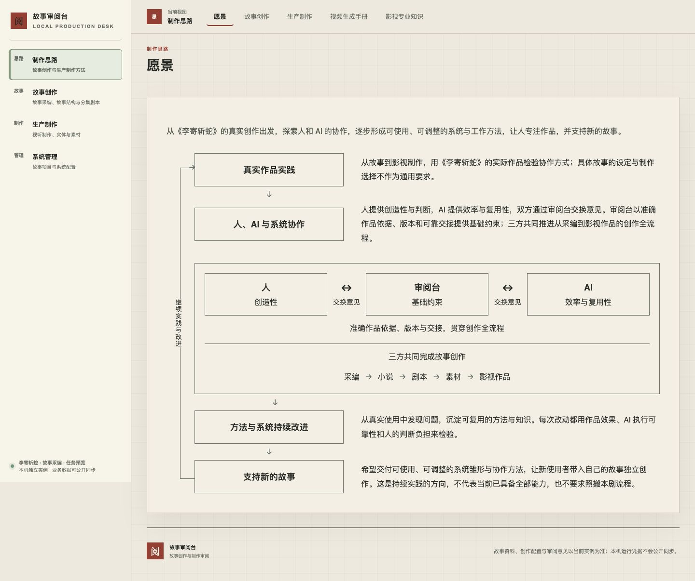

# task-20261010-0023 · 愿景协作块展开三方分工与完整作品链

原问题：第二块只有外部节点和一段分工说明，读者不能从图中直接看见三方如何协作及其共同创作范围。现在直接显示“人／创造性 ↔ 审阅台／基础约束 ↔ AI／效率与复用性”，双向连线标注交换意见；准确作品依据、版本与交接约束贯穿“采编 → 小说 → 剧本 → 素材 → 影视作品”。读者无需打开或悬停即可理解分工、交换及共同范围。全链是愿景，不证明已有成片或所有能力已实现。

## 版本与实际页面

系统候选为 desk `9d3d767a2538b9aab6375425a6fa7d8b57cc5d58`，故事准确引用在 `config/instance.json`；故事候选与逐仓集成、推送身份以本任务账本为准。开发吸收执行时双仓main/upstream，未沿用0022的旧系统基线。

macOS Chrome，本任务新建标签页；完整正式数据的一致性副本，隔离入口 `http://127.0.0.1:50963/`，桌面1440×1000，窄屏390×844。四块、图左文右和继续实践回连保留，协作关系用该行全宽，窄屏按角色交换、贯穿约束、共同作品链纵向阅读，没有缩小文字或横向溢出（scrollWidth=innerWidth=390）。其他三块原含义未改变。

[窄屏全文](isolated-narrow.jpg)

默认入口在实际加载完成后显示愿景；显式vision与刷新相同。无tab旧链的practice、review-desk、methods、delivery均进入对应内容；只有一个愿景大标题，无内部目录或空占位。实际切换四个其他子页，原目录恢复，点击structure、candidate-production、demo-inputs、staging，各代表章首位于顶栏下方约90px。视频手册两张原输入图、专业知识调度SVG实际可见。键盘左右切页可用，回愿景后目录隐藏。

在完整隔离数据中全局搜索M2673，读到“挑柴老汉 · 已有原件身份复用方案”；查影视专业知识的场面调度、刷新，再返回生产制作，URL、M2673搜索框、1项结果及全局范围一致。没有提交评论、判断或创作变更。

## 同源、拒错与方法恢复

唯一正文是 `production/system-vision.md`，角色、连接、流程元数据也在该源稿。`sync_system_vision.py --check`通过，其他四子页内容保持。系统按明确结构展示，不硬编码本剧文案；无diagram的合法旧循环继续显示。

隔离副本实测5类非法输入：失效连接端点、重复角色id、错误流程类型、空约束和额外角色字段，全部明确拒绝；恢复正确内容后重新读取完整关系。现有HTTP文档9项、前端格式／导航／方法返回20项、方法交付3项、发布守卫18项通过，JavaScript语法及两仓diff检查通过。API／自动检查补充页面实读，不代替它。

Review来源、方法和绑定只追加第4版，共3条修订；标准导出正文、适配和愿景按源目录实际读取，愿景包含完整图示元数据且字节一致。在新空实例恢复该包并重新导出，仍取得同一完整愿景。第3版旧执行再次导出与原导出逐字节相同。

重复同一来源同步不追加；旧expected_version提交不同内容被拒绝，读取最新版本可正常继续。在最新正式数据副本应用准确配置包新增3条，重复应用新增0条；迁移前后逐表检查无关作品、评论、原件及准确历史保持，数据库结构未变。完整检查回执在本任务本机 `.runtime/vision-collaboration/`。

## 正式发布、独立复验与资源处置

正式入口为 `http://127.0.0.1:3000/?workspace=production.approach&tab=vision`。发布沿受管desk→primary交付和推送，准确冻结包、既有发布锁和停止写入窗口；消费逐仓Git回执，增量追加方法，不回灌任务库。准确运行镜像、挂载、源码、逐表保全、正式Chrome桌面／窄屏及四个对照子页结果，归任务账本的正式发布和执行验收结果与主项目 `.runtime/task-20261010-0023/` 回执；本文候选实读不能单独证明正式生效。

本次用户明确“不自动结项”：不调用_complete，不把执行者验收等同负责人独立Review，不关闭其他历史残留。完成正式发布复验后清理本任务已失效的预览服务、测试库、复制原件、导出及构建副本；准确删除范围、数量、回读与保留用途记入同一本机回执。正式current/previous/base、正式release配置和最小恢复证据按用途保留。任务尚未结项且TUI占用的双仓worktree保留，待用户结项并退出释放锁后，由本任务执行者沿受管cleanup退役。
