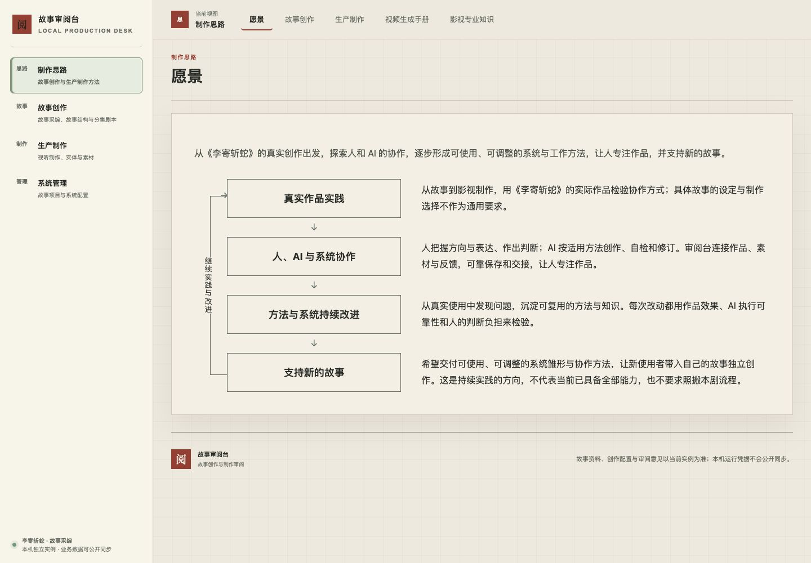

# task-20261010-0022 · 愿景页验收

原问题：愿景与协作页面重复标题、长章节与阅读目录，读者需通读后才能概括愿景。现改为“愿景”，一句总述、四块线框节点与右侧逐行短说明，回连表达继续实践与改进。窄屏逐块排列；全部正文直接展开，保留本剧实践、人／AI／系统分工、持续检验、系统与方法双重交付，以及新故事和目标边界。

## 实际版本与环境

- 正式入口：`http://127.0.0.1:3000/?workspace=production.approach&tab=vision`。
- 页面与方法发布源：primary `e42fddc6a0c0eee7a9d2ee2be7aa17f6b4d2df54`；desk `b372e236d1ddbce3de083133ac82882cd24b93c0`。后续主仓提交仅收敛本验收、当前说明和证据，不改变运行正文、布局或方法。
- 正式镜像：`sha256:e3f114f1405b33d8d1b052d717883d1a98fe5b960e610afb68d975e30d7b0446`；实际 app `e7b68e72ad27f8ee30f08e35600106f84ef38d96fdaf19ddf1b3d49bf0656f09`，健康状态 healthy。
- `material_review_release.py` 沿准确冻结包执行；双仓回执均 applied／pushed。正式源码与实例挂载逐字节匹配，3000／64401运行核验通过；准确JSON回执归主项目 `.runtime/task-20261010-0022/`，正式配置归 `.runtime/service-releases/task-20261010-0022-e42fddc6a0c0-b372e236d1dd/`。

## Chrome 实读

使用本任务新建标签页，无接管其他任务页面或草稿。桌面1440×1000与窄屏390×844。

1. 默认无参数首页显示“愿景”；显式vision、刷新显示相同正文与图示。只有一个大标题，内部目录隐藏且没有占位，全站导航和顶部五项保留。刷新首次3秒读取等待不足，随后页面完成加载并实读通过，未将加载中误判为完成。
2. 桌面完整四行图左文右，向下关系与左侧“继续实践与改进”回连可见，说明直接展开。窄屏逐块标题／正文／箭头排列，读到第四块和回连末端；页面scrollWidth与innerWidth同为390，正文未裁切。左右方向键切换愿景和故事创作，目录恢复，再返回愿景隐藏目录。
3. 实际切换故事创作、生产制作、视频生成手册、影视专业知识：原目录及代表章节可读。分别点击 `structure`、`candidate-production`、`demo-inputs`、`staging`，桌面章首约90px，避开顶栏；手册两张原图与专业SVG实际可见。返回愿景，图文排列和目录控制恢复。
4. 无tab旧链 `#approach-vision-review-desk` 仍进入愿景对应块，不产生目录。其余愿景锚点practice／methods／delivery仍对应同源四块。

[窄屏全文截图](formal-narrow.jpg) · [其他页图文与目录](formal-filmcraft.jpg)

## 同源、历史与检查

- 唯一正文 `production/system-vision.md`，布局说明以同源元数据派生；`sync_system_vision.py --check` 通过，所有其他子页内容保持字节含义不变。正文可见字符数由1306降为343（含标题、标点，排除空行及隐藏布局说明），约精简74%。四块仍回答实践起点、分工、改进依据和交付方向。
- 只追加 `creative-system-review-texts` 资源、Review方法与绑定第3版，共3条修订；第1／2版定义和旧执行保持。正式只读资源逐字节匹配源稿、完整SKILL和项目适配；实际第3版prepare／标准导出保留内部相对入口及附属正文，在新空实例恢复后当前绑定和正文一致。旧执行导出及恢复回归通过，不静默升级旧执行。
- 方法切点逐表比较无关数据完全相同。272条评论、301条评论事件、150974条素材正文、真实调用、原件、作品和所有不可变历史保全；只有3条方法修订、2条准确依赖及可重建读取代号变化，已有媒体启用记录未更新。
- 检查：desk文档／HTTP 9项，前端格式、导航及方法返回20项；主仓同源／方法／历史恢复3项，发布器18项，全部通过。两仓diff检查通过。源码和接口结果只补充上述真实页面实读。

## 清理与边界

停止1个本任务Python预览服务，回查56950端口关闭。删除独立预览库／原件副本和发布构建／四份临时数据库快照等1192个文件，删除2份任务测试日志；合计1194个文件、2974429535字节，准确路径回读均不存在。额外删除重复隔离窄屏截图1份，保留3份正式页面证据。临时容器0、待删临时镜像0；新建镜像已成为正式current，按正式用途保留。未清理其他任务、全局缓存或共享镜像。

必要JSON回执保留在主项目本机目录，供准确追溯；正式release配置、current镜像、原件和方法连续历史保留。两仓worktree仍由本TUI及清理锁占用，退出释放后由本任务执行者沿受管cleanup整组退役，不能强删。正式服务无任务worktree挂载依赖。

执行者验收通过，负责人独立Review及使用者作品认可仍分别判断；本次无VPS发布、付费生成或作品改写，无核心未解决项。后续可沿正式页面直接复验，退出会话后完成受管worktree退役。
